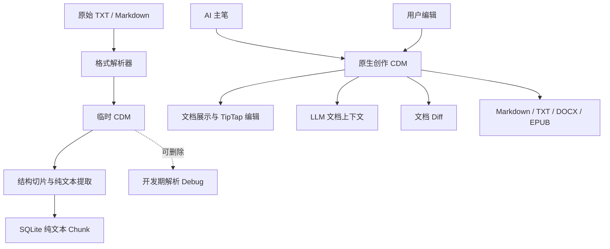

# CleoDoc Document Model（CDM）设计

> v0.1 基线：最小 CDM Core 与非正式 `draft-1` Schema 已实现；正式 v1 Schema 保持未决

本文定义 CleoDoc 内部统一文档格式的基础方向。CDM 同时适用于导入资料的临时结构化解析、AI 生成内容和用户编写内容，并作为文档展示、编辑、切片、版本比较与格式导出的共同上游。

本文只记录已经确认的原则。完整标签白名单、属性白名单、`<comment>` 与 `<reference>` 的最终嵌套方式等尚未确认的内容，不在当前版本中提前定案。

## 1. 定位

CDM（CleoDoc Document Model）不是某一种外部文件格式的简单转写，也不是只服务于 RAG 的解析结果。它是 CleoDoc 内部所有文档共享的语义文档协议。

CDM 应覆盖以下文档来源和使用场景：

- TXT、Markdown 以及未来其他导入资料的临时解析结果。
- AI 主笔创建的正文、草稿、大纲、设定和研究内容。
- 用户在 CleoDoc 中创建或修改的文档。
- 未来 GUI 编辑器和阅读器使用的文档模型。
- 发送给 LLM 的原生正文和文档内容。
- 结构切片、Diff 和导出流程的输入。

不同来源的权威语义仍然不同：导入资料保留原始文件作为最高权威来源，临时 CDM 可以在 Chunk 入库后删除，不属于长期检索或引用链路；AI 或用户在 CleoDoc 内创建的原生文档，则以 CDM 内容作为文档事实源。

## 2. 核心格式选择

CDM 使用以 HTML 文档语义为基础的 XML 格式：

1. 使用严格 XML 语法，文档必须结构完整且能够通过 Schema 校验，不依赖浏览器对错误 HTML 的自动修复。
2. 复用 HTML 中与文字内容和文档结构相关的标准标签。
3. 不纳入页面布局、表单交互、脚本执行等与 CleoDoc 文档语义无关的标签。
4. HTML 标准能力足够时直接采用原生标签和属性；只有 HTML 语义不足时才增加 CleoDoc 扩展。
5. CDM 是版本化协议。每个版本必须明确支持的标签、属性、嵌套规则和规范化规则。

CDM 不是完整 HTML 页面，也不是任意 XML。它是一个由 CleoDoc Schema 约束的 HTML 语义子集及其扩展。

## 3. HTML 文档语义

CDM 将吸收 HTML 中与文本和文档结构相关的标签。已经确认需要覆盖的基础能力包括：

- 标题：`<h1>`、`<h2>` 以及其他标题级别。
- 段落：`<p>`。
- 强调：`<strong>`、`<em>`。
- 列表：`<ul>`、`<ol>`、`<li>`。
- 链接：`<a>`。
- 引文：`<blockquote>`。
- 行内代码与预格式文本：`<code>`、`<pre>`。
- 表格：`<table>`、`<tr>`、`<td>` 以及后续纳入的必要表格标签。

以上列表不是 CDM v1 的最终完整白名单。其他与文本语义有关的 HTML 标签是否纳入，需要在制定正式 Schema 时逐项确认。

下列类型不属于 CDM 的基础文档语义：

- 纯布局标签，例如 `<div>`。
- 表单和交互控件，例如 `<input>`。
- 可执行内容，例如 `<script>`。
- 其他只服务于网页应用布局、交互或运行时行为的标签。

CDM 实现必须采用显式白名单，不能因为某个标签能够被 HTML 解析器识别，就自动接受并保存到文档中。

## 4. 书籍、文章与文件粒度

### 4.1 逻辑结构与物理存储分离

作品的语义层级不能由文件夹和文件路径代替。卷名、卷号、章节顺序、导出结构和卷级内容属于作品本身；文件夹只负责物理整理，可能被移动、重命名或在导出时消失。

CDM 的书籍结构采用：

```text
book
└─ volume（可选）
   └─ chapter
      └─ 内容 Node
```

- `<book>`：一部完整的书籍作品。
- `<volume>`：一本书内部可选的卷，不表示书籍本身，也不用于表示系列中的某一本书。
- `<chapter>`：书籍中的章节。
- `<article>`：沿用 HTML 标准，表示论文、新闻文章、专业文章等可以独立成立的作品。

普通单卷书籍不创建没有实际语义的 `<volume>`，章节可以直接属于 `<book>`。多卷书籍才使用 `<volume>` 分组。

### 4.2 书籍结构文档

书籍类作品使用 `book.cdm.xml`（文件名暂定）保存 Book、Volume 和 Chapter 的逻辑层级及顺序。章节正文不内联到该结构文件，而是通过 `<chapter-ref>` 引用独立章节文档。

单卷书籍示例：

```xml
<document id="7k3m9qx2vc" version="1">
  <book id="b4r8t2w6yz">
    <h1 id="c5s9v3x7z0">书名</h1>
    <chapter-ref id="d6t0w4y8a1" document="chapter_001"/>
    <chapter-ref id="e7v1x5z9b2" document="chapter_002"/>
  </book>
</document>
```

多卷书籍示例：

```xml
<document id="7k3m9qx2vc" version="1">
  <book id="b4r8t2w6yz">
    <h1 id="c5s9v3x7z0">书名</h1>

    <volume id="d6t0w4y8a1" number="1">
      <h2 id="e7v1x5z9b2">第一卷：雨夜</h2>
      <chapter-ref id="f8w2y6a0c3" document="chapter_001"/>
      <chapter-ref id="g9x3z7b1d4" document="chapter_002"/>
    </volume>

    <volume id="h0y4a8c2e5" number="2">
      <h2 id="j1z5b9d3f6">第二卷：深海</h2>
      <chapter-ref id="k2a6c0e4g7" document="chapter_010"/>
    </volume>
  </book>
</document>
```

`<chapter-ref>` 是可寻址结构 Node，必须拥有 ID；`document` 指向项目内公开的章节文档引用，不能是数据库内部 ID。其最终属性名和引用格式随正式 Schema 确认。

### 4.3 章节文件

书籍正文默认每个 Chapter 保存为一个独立 CDM 文件：

```xml
<document id="7k3m9qx2vc" version="1">
  <chapter id="b4r8t2w6yz" number="1">
    <h1 id="c5s9v3x7z0">第一章 雨夜</h1>
    <p id="d6t0w4y8a1">雨从凌晨开始下。</p>
    <p id="e7v1x5z9b2">林默站在旧车站外。</p>
  </chapter>
</document>
```

默认项目结构可以是：

```text
manuscript/
├─ book.cdm.xml
├─ volume-01/
│  ├─ chapter-001.cdm.xml
│  └─ chapter-002.cdm.xml
└─ volume-02/
   └─ chapter-010.cdm.xml
```

Volume 文件夹只是可选的物理映射，`book.cdm.xml` 中的 `<volume>` 和 `<chapter-ref>` 才是作品结构事实。章节身份由 CDM Node 和文档引用确定，不依赖文件名或目录位置。

按 Chapter 保存有利于局部编辑、Git Diff、恢复、审批、RAG 增量索引和并发隔离。CDM 不默认按 Volume 保存全部正文，也不进一步拆成每段一个文件；段落及其他内容单元通过 Node ID 管理。

### 4.4 暂不确定的作品标签

以下标签只保留为未来研究方向，不进入 CDM v1 标签白名单、Schema、TipTap 映射或解析实现：

- `<story>`：短篇故事或独立文学作品的语义尚未确定。
- `<screenplay>`：影视脚本、舞台剧本或其他脚本的共同模型尚未确定。
- `<series>`：系列作品与 Book 之间的关系尚未确定。

脚本作品不能复用 HTML `<script>`，因为 `<script>` 表示可执行内容并被 CDM 明确禁止。等 CleoDoc 真正进入相应写作场景后，再依据真实结构确定扩展标签。

## 5. 节点属性

CDM 使用标签属性承载节点标识、文本样式和其他与节点有关的信息。例如：

```xml
<p id="7k3m9qx2vc" style="color: blue">Triton 是一个 GPU 编译器。</p>
```

### 5.1 Node 与 Mark

CDM 标签分为两类：

- **Node（可寻址节点）**：表示文档结构或独立语义，可以被单独读取、插入、删除、移动、修改、引用和比较。
- **Mark（格式标记）**：只改变所属文字的表现或基础强调方式，随所在 Node 的内容一起修改，不是独立文档对象。

`<p>` 是最常用的正文 Node，但不是唯一的基本单位。标题、段落、列表项、引用、表格及其单元格等都是独立 Node，例如 `<h1>`、`<p>`、`<li>`、`<blockquote>`、`<table>`、`<tr>` 和 `<td>`。

`<strong>`、`<mark>`、`<i>` 等样式类标签属于 Mark，不要求 `id`。具体哪些标签属于 Mark，必须在 CDM 标签白名单中逐项声明，不能在运行时根据标签外观猜测。

除 Schema 明确声明为 Mark 的样式类标签外，其他 CDM 标签都必须拥有 `id`。文本本身是 XML 文本节点，不适用标签 ID 规则。

```xml
<article id="7k3m9qx2vc">
  <h1 id="b4r8t2w6yz">第一章</h1>
  <p id="c5s9v3x7z0">
    Triton 是一个 <strong>GPU 编译器</strong>。
  </p>
  <ul id="d6t0w4y8a1">
    <li id="e7v1x5z9b2">第一个列表项</li>
  </ul>
</article>
```

### 5.2 ID 的职责

这里：

- `id` 为 Node 提供可查找的稳定标识，可用于读取、编辑、引用、Diff、结构切片和编辑器映射；导入资料的长期 Chunk 回溯不保存临时 CDM Node ID。
- `style` 表达基本文本样式。
- HTML 原生属性能够准确表达需求时，CDM 优先沿用其名称和语义。
- HTML 原生属性不够时，CDM 可以定义自己的扩展属性。

CDM 不会无条件接受所有 HTML 属性。事件处理、任意网页行为和可能破坏文档安全或展示一致性的属性不在允许范围内。`style` 支持哪些基本文字样式，仍需在正式 Schema 中继续确定。

### 5.3 ID 格式与唯一性范围

Node ID 使用 10 位小写 Crockford Base32 随机字符串：

```text
字符集：0123456789abcdefghjkmnpqrstvwxyz
长度：10
示例：7k3m9qx2vc
```

该字符集排除了容易混淆的 `i`、`l`、`o` 和 `u`。10 位 Base32 提供 `32^10 = 2^50`，约 `1.126 × 10^15` 种取值。Node ID 不编码创建时间、节点类型、文档位置、内容哈希或数据库内部信息，也不使用自增序列；它是短小、稳定、不透明的公开文档标识。

唯一性按以下范围理解：

- 当前 CDM 文档内的 Node ID 必须严格唯一，Schema 校验和写入流程必须拒绝重复 ID。
- 不同 CDM 文档可以出现相同 Node ID；跨文档定位使用公开的 Document ID 与 Node ID 组合。
- CleoDoc 不维护历史 ID 台账，也不扫描全部历史版本。历史版本间意外复用依靠 50 位随机空间降低到工程上可接受的概率。
- 历史 Diff 看到相同的 Document ID 与 Node ID 时，将其视为同一个逻辑节点；这是一项建立在随机 ID 生成规则上的工程约定，不是数学上的绝对无碰撞保证。

### 5.4 ID 生成与重复检查

ID 由 CleoDoc 使用 Node.js `node:crypto` 的加密随机数生成，不得使用 `Math.random()`、时间戳、截断 UUID、内容哈希或数据库自增编号。生成流程为：

1. 解析当前 CDM，收集全部已有 Node ID；如果文档本身存在重复 ID，停止修改并报告格式错误。
2. 读取 10 个加密随机字节。每个字节通过 `byte & 31` 均匀映射到 Crockford Base32 字符集，组成 10 位候选 ID。
3. 检查候选 ID 是否已存在于当前文档；如有重复，重新生成。
4. 候选 ID 一旦通过检查，立即加入本次操作的内存 ID 集合，确保批量新增的节点之间也不会重复。
5. 补齐全部新 Node 的 ID 后，重新执行 CDM Schema、ID 唯一性和 Document Revision 校验。
6. 校验通过后原子写入文档；校验或写入失败时不保留任何额外的 ID 状态。

单次分配连续 10 次都无法得到可用 ID 时，操作失败并返回稳定的 ID 生成错误，不得写入不完整文档。正常随机源下几乎不会到达这一错误路径。

该方案不需要维护文档计数器或 ID 分配状态。程序在原子写入前崩溃时，候选 ID 随内存一起丢弃；原子写入完成后，ID 已成为 CDM 事实源的一部分，下次读取时自然参与重复检查。

### 5.5 ID 生命周期

- ID 是节点身份，不是节点位置，也不是 SQLite Row ID。
- 移动、修改内容或修改样式时保留原 ID。
- 复制 Node 时生成新 ID，不能复制原 ID。
- 新 Node 的 ID 由 CleoDoc 生成。LLM 提交新节点时可以省略 ID，由 CleoDoc 在写入前补齐。
- LLM 不得指定或修改已有 Node 的 ID，也不负责生成 ID。
- 删除 Node 会删除当前文档中的 ID；CleoDoc 不主动复用该 ID，但也不为已删除 ID 保存墓碑或自增状态。
- 从外部导入 CDM 时必须验证当前文档内的 ID；发生冲突时，由 CleoDoc 重新分配相关 Node ID，并同步更新该导入内容内部的引用。

### 5.6 节点级编辑

CDM 不使用视觉行号作为文档坐标。页面宽度、字体、字号、缩放和渲染器都会改变视觉换行，同一段文字在不同展示环境中不存在稳定行号。

LLM 和 Core 通过 Node ID 定位操作目标。首版节点操作包括：

- 在目标 Node 前插入新 Node。
- 在目标 Node 后插入新 Node。
- 删除目标 Node。
- 替换目标 Node 的内容，同时保留原 ID。
- 将 Node 移动到另一目标 Node 之前。
- 将 Node 移动到另一目标 Node 之后。

首版内容修改以替换一个 Node 的完整内部 CDM 为基础，不提前引入字符偏移、模糊文本 Patch 或视觉行范围。首版移动只要求支持同一父节点下的前后移动；跨父节点移动必须同时处理目标容器的 CDM 嵌套约束，留到确有需求时再扩展。

新插入的 CDM 可以省略 Node ID，CleoDoc 补齐所有必需 ID 后再完成 Schema 校验。移动和内容替换保留已有 Node ID；删除会移除该 Node 及其后代。

每次节点变更必须携带模型最近读取到的文档 Revision。Revision 是文档协议中的公开并发令牌，不是数据库内部 ID；如果文档已经变化，CleoDoc 拒绝陈旧操作并要求重新读取。

## 6. CleoDoc 扩展语义

HTML 无法完整表达 CleoDoc 的文档业务语义，因此 CDM 允许增加自定义标签。

当前已经确认需要研究的两类扩展是：

- `<comment>`：表示备注或批注。
- `<reference>`：表示文字与 CleoDoc 资料来源或证据之间的关系。

`<reference>` 与 HTML 的 `<cite>` 不等价：

- `<cite>` 保留 HTML 中表示作品名称或引用作品标题的语义。
- `<reference>` 用于连接正式文档内容与 CleoDoc 管理的资料或文献。

### 6.1 Reference 的三种来源

当前确认三种引用场景：

1. **LLM Chunk 引用**：LLM 使用 RAG 返回的具体 Chunk 写作，`<reference>` 同时包含 `source` 和 `chunk_id`。
2. **LLM 文献引用**：LLM 只声明使用了某项文献，`<reference>` 只有 `source`，没有具体位置。
3. **用户文献引用**：用户为自己或 LLM 的文字手动添加文献，格式同样只有 `source`；用户不需要知道 `chunk_id`。

概念示例：

```xml
<reference
  id="7k3m9qx2vc"
  source="Triton Programming Guide"
  chunk_id="chk_8r2v5x9m"
>
  Triton 提供了一种接近 Python 的 GPU 内核开发方式。
</reference>
```

是否存在 `chunk_id` 直接区分引用目标，不增加额外的 `reference_type`：

```text
存在 chunk_id → Chunk 引用
不存在 chunk_id → 文献引用
```

在 Chunk 引用中，`chunk_id` 是稳定公开的 Chunk 引用，不能是 SQLite Row ID。数据库中的 Chunk 再通过 Source 关系及 `start_offset`、`end_offset` 定位原始 TXT/Markdown。`source` 的最终引用语义仍待确定：当前 RAG Tool 使用项目内唯一 title 选择资料且不暴露 Source UUID，Tool Result 到正式 CDM `<reference>` 的转换、资料改名后的显示与绑定方式必须在 Draft/引用校验实现前确认。正式引用不依赖导入阶段的临时 CDM、CDM Node ID 或原始文件绝对路径。

在文献引用中，`source` 表示文献名称或未来的公开文献条目。它只建立文献级联系，不承诺能够定位到某个原文范围。

引用由用户还是 LLM 创建，不由模型填写属性声明，而是由 CleoDoc 的文档变更记录判断。`source`、`chunk_id` 等模型输出仍是不可信输入；CleoDoc 必须检查 Source、Chunk、项目范围和归属关系。无法解析或相互不匹配的引用可以保留在正式文档中，但必须标记为无效，不能静默删除、替换或伪装为已验证引用。

数据库关系有效也不代表引用在语义上支持当前文字。语义检查由用户主动发起；未来 GUI 可以提供“引用修复”，让 LLM 根据当前文字和候选 Chunk 提出修复建议，再由用户确认或手动更正。

`<comment>` 是直接嵌入正文、附着到目标节点，还是集中存放在独立批注区域，目前尚未确认。`<reference>` 已确认属性语义，但究竟包围被支持的文字，还是作为文字后的独立节点，仍需在正式 Schema 中确定。

## 7. 与 LLM 的关系

CDM 内容可以直接发送给 LLM，不再转换成另一套 JSON AST。LLM 已经熟悉 HTML 标签及其常见语义，因此可以直接理解标题、段落、列表、强调、表格、链接等结构，CleoDoc 只需要补充自己的扩展规则。

“直接发送 CDM”表示模型接收到的文档内容继续使用 CDM 标签和属性，不表示每次调用都发送整部作品或完整资料库。CleoDoc 仍然根据当前任务和上下文预算选择需要的文档、节点或片段，并只发送被选中的 CDM 内容。

LLM 返回的 CDM 内容仍是不可信外部输入，必须经过 XML 解析、CDM Schema 校验和写入审批。不能因为模型熟悉 HTML，就跳过格式校验、项目作用域校验或文档写入规则。

## 8. 与 JavaScript、DOM 和 TipTap 的关系

CDM 选择 XML 和 HTML 语义，可以复用 JavaScript 生态中成熟的 DOM、XML 和 HTML 处理能力：

- Core 使用严格 XML 解析和校验能力读取 CDM。
- Electron Renderer 可以把 CDM 映射为可展示和编辑的 DOM。
- 标签、属性和节点 ID 可以通过标准 DOM 查询与遍历能力处理。
- HTML 标准标签映射到 TipTap 已有的 Node 和 Mark。
- CleoDoc 自定义标签映射到 TipTap Custom Extension。

TipTap 是 CDM 的 Editor/View Model 适配器，不是 CDM Schema 的所有者。CleoDoc Core 不能依赖 TipTap 或浏览器 DOM，TipTap 也不能静默删除 CDM 中已经受支持的标签、属性或扩展语义。

未来接入 TipTap 时必须验证以下往返过程：

```text
CDM → TipTap Node/Mark → 用户编辑 → CDM
```

往返后必须保留受支持的文档结构、节点 ID、属性和 CleoDoc 扩展。

## 9. 在系统中的位置



对导入资料而言，CDM 只在解析与切片之间传递结构。Chunk 入库后只保存纯文本及独立来源字段，不保存 CDM 标签、Node ID 或片段；长期引用通过 Source、Chunk 和原文字节范围回溯，不经过临时 CDM。完整规则见[资料解析与切片设计](./DOCUMENT_PARSING_AND_CHUNKING_DESIGN.md)。

对 AI 和用户创作的原生文档而言，CDM 仍是展示、编辑、版本比较和导出的事实源，展示层与编辑器不能建立另一套无法往返的文档模型。

## 10. 当前示例

下面的示例只展示已经确认的基本方向，不代表最终 CDM 外壳或扩展标签结构：

```xml
<document id="7k3m9qx2vc" version="1">
  <h1 id="b4r8t2w6yz">Triton 调研</h1>

  <p id="c5s9v3x7z0" style="color: blue">
    Triton 是一个 <strong>GPU 编译器</strong>。
  </p>

  <blockquote id="d6t0w4y8a1">
    <p id="e7v1x5z9b2">这里是一段引用内容。</p>
  </blockquote>

  <comment id="f8w2y6a0c3">这里需要补充 Triton 与 CUDA 的关系。</comment>
  <reference id="g9x3z7b1d4" source="Triton Programming Guide"/>
</document>
```

示例中的 `<document>`、`version`、`<comment>`、`<reference>` 和 `source` 只是用于说明总体方向，其最终名称、位置、属性和嵌套规则仍待继续讨论。

## 11. 已确认与待继续讨论

### 11.1 已确认

- CDM 是 CleoDoc 所有内部文档统一使用的格式。
- CDM 使用严格 XML 语法。
- CDM 复用 HTML 中与文字和文档结构相关的标签。
- 页面布局、表单交互和脚本执行标签不纳入 CDM。
- CDM 标签分为可寻址 Node 与格式 Mark；`<p>`、`<h1>`、`<li>` 等都可以作为基本文档单位。
- 除 Schema 明确声明的样式类 Mark 外，其他标签都必须拥有 `id`。
- Node ID 由 CleoDoc 使用加密随机数生成，为 10 位小写 Crockford Base32 字符串；当前文档内强制唯一，不编码时间、类型、位置或数据库信息。
- Node 修改和移动时保留 ID，复制时生成新 ID；删除后不维护墓碑或计数状态，历史版本间依靠 50 位随机空间避免意外复用。
- CDM 不使用视觉行号作为读取或编辑坐标，LLM 通过 Node ID 操作文档。
- 首版支持节点前后插入、删除、完整内容替换和同父节点前后移动。
- 节点写入以文档 Revision 进行陈旧写入检查。
- CDM 支持受控的基本文本样式。
- 导入资料解析固定丢弃纯展示样式；该限制不删除原生创作文档使用样式 Mark 的能力。
- HTML 原生标签和属性足够时优先直接采用。
- HTML 语义不足时允许增加 CleoDoc 扩展。
- 书籍使用 `<book>`、可选 `<volume>`、`<chapter>` 和 `<chapter-ref>` 表达逻辑结构；独立论文、新闻和专业文章使用 HTML `<article>`。
- 书籍正文默认每个 Chapter 一个 CDM 文件，`book.cdm.xml` 保存逻辑层级和章节顺序；Volume 文件夹只是可选物理映射。
- `<story>`、`<screenplay>` 和 `<series>` 暂不进入 CDM v1，等出现真实写作场景后再确定。
- `<comment>` 和 `<reference>` 是当前明确提出的扩展方向；`<reference>` 通过是否存在 `chunk_id` 区分 Chunk 引用与文献引用。
- 导入资料的临时 CDM 可以在 Chunk 入库后删除；Chunk 只保存纯文本和独立来源字段，引用回溯不依赖临时 CDM 或其 Node ID。
- CDM 内容直接作为 LLM 可见的文档协议，不转换成 JSON AST。
- HTML 标签映射到 TipTap Node/Mark，CDM 扩展映射到 TipTap Custom Extension。

### 11.2 待继续讨论

- CDM 根元素、文档元数据和正式版本字段。
- CDM v1 的完整标签白名单与嵌套规则。
- 每种标签允许的 HTML 原生属性和 CleoDoc 扩展属性。
- `style` 的安全属性白名单和规范化方式。
- `<comment>` 的正文关系、锚点、重叠和生命周期。
- `<reference>` 是包围被支持文字还是作为独立引用节点，以及无效引用在 CDM/数据库之间的状态投影方式。
- `<reference source>` 的稳定身份、显示名称、资料重命名语义，以及 RAG Tool 的 `title + chunkId` 如何转换为正式引用。
- CDM 文档与外部原始文件、资源和图片的关联方式。
- `book.cdm.xml` 的最终文件名、`<chapter-ref>` 属性和公开文档引用格式。
- 发送局部 CDM 给 LLM 时的片段外壳和定位信息。
- CDM 文件扩展名、MIME 类型和确定性序列化规则。
- CDM 与当前 Markdown 项目文档的过渡方式。

### 11.3 当前实现边界

`packages/cdm` 已实现不依赖 Project、Database、RAG、Agent、Electron、DOM 或 TipTap 的最小 CDM Core：

- 使用严格 XML 解析器读取单根 XML，拒绝结构错误、DOCTYPE、自定义实体入口、XML 注释和处理指令；文档批注只能使用 CDM `<comment>`。
- 提供 CDM 树类型、解析、确定性基础序列化、树遍历、按 Node ID 查找和等同于 XML `textContent` 的文字提取。
- 提供 10 位小写 Crockford Base32 Node ID 的格式校验、加密随机生成、当前文档内碰撞重试和缺失 ID 批量补齐。
- 提供显式标签/属性白名单、Node/Mark、父子关系、必需属性、ID 格式和文档内唯一性校验。
- 校验与 ID 补齐只返回新的内存文档树，不负责文件路径、Revision、原子写入、Tool 审批或数据库操作。

当前内置 Schema 名为 `draft-1`，只用于支持已经确认的结构和后续 TXT/Markdown 解析开发，不能被称为正式 CDM v1。它暂时采用示例中的 `<document version="1">` 外壳，并纳入当前已确认的书籍、文章、标题、段落、列表、引用、代码、表格和基础 Mark；正式根元素、完整标签表和嵌套规则确认后允许不兼容调整。

`draft-1` 暂不接受 `style`。这是因为安全样式属性和值的白名单仍未确认，并不表示 CDM 放弃样式能力。`<comment>` 和 `<reference>` 当前只实现已经确认的最小属性约束；其最终锚点和嵌套语义仍属于待讨论范围。

当前 `draft-1` 将 `<strong>`、`<em>`、`<mark>` 和 `<i>` 作为无需 ID 的样式 Mark；`<a>` 与 `<code>` 具有独立语义，作为需要 ID 的 Node。导入解析固定展平纯样式 Mark，但保留链接和代码 Node。临时 CDM 仍使用随机 Node ID；“相同输入产生相同规范化解析结果”明确忽略这些临时 ID，只比较结构、文字、警告、顺序和原文字节范围，Chunk 不能依赖临时 ID。
