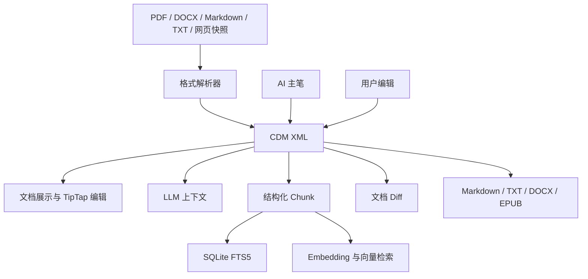

# CleoDoc Document Model（CDM）设计

状态：基础方向已确认，详细 Schema 待继续讨论

更新日期：2026-08-08

本文定义 CleoDoc 内部统一文档格式的基础方向。CDM 同时适用于导入资料、AI 生成内容和用户编写内容，并作为后续文档展示、编辑、检索、切块、版本比较与格式导出的共同上游。

本文只记录已经确认的原则。完整标签白名单、属性白名单、`<comment>` 与 `<reference>` 的最终结构、原文定位方式等尚未确认的内容，不在当前版本中提前定案。

## 1. 定位

CDM（CleoDoc Document Model）不是某一种外部文件格式的简单转写，也不是只服务于 RAG 的解析结果。它是 CleoDoc 内部所有文档共享的语义文档协议。

CDM 应覆盖以下文档来源和使用场景：

- PDF、DOCX、Markdown、TXT、网页快照等导入资料的解析结果。
- AI 主笔创建的正文、草稿、大纲、设定和研究内容。
- 用户在 CleoDoc 中创建或修改的文档。
- 未来 GUI 编辑器和阅读器使用的文档模型。
- 发送给 LLM 的正文、资料和检索证据。
- Chunk、FTS、Embedding、Diff 和导出流程的输入。

不同来源的权威语义仍然不同：导入资料保留原始文件作为最高权威来源，CDM 是可以从原件重新生成的内部表达；AI 或用户在 CleoDoc 内创建的原生文档，则以 CDM 内容作为文档事实源。

## 2. 核心格式选择

CDM 使用以 HTML 文档语义为基础的 XML 格式：

1. 使用严格 XML 语法，文档必须结构完整且能够通过 Schema 校验，不依赖浏览器对错误 HTML 的自动修复。
2. 复用 HTML 中与文字内容和文档结构相关的标准标签。
3. 不纳入页面布局、表单交互、脚本执行等与 CleoDoc 文档语义无关的标签。
4. HTML 标准能力足够时直接采用原生标签和属性；只有 HTML 语义不足时才增加 CleoDoc 扩展。
5. CDM 是版本化协议。每个版本必须明确支持的标签、属性、嵌套规则和规范化规则。

CDM 不是完整 HTML 页面，也不是任意 XML。它是一个由 CleoDoc Schema 约束的 HTML 语义子集及其扩展。

## 3. HTML 文档语义

CDM 将吸收 HTML 中与文本和文档结构相关的标签。已经确认需要覆盖的基础能力包括：

- 标题：`<h1>`、`<h2>` 以及其他标题级别。
- 段落：`<p>`。
- 强调：`<strong>`、`<em>`。
- 列表：`<ul>`、`<ol>`、`<li>`。
- 链接：`<a>`。
- 引文：`<blockquote>`。
- 行内代码与预格式文本：`<code>`、`<pre>`。
- 表格：`<table>`、`<tr>`、`<td>` 以及后续纳入的必要表格标签。

以上列表不是 CDM v1 的最终完整白名单。其他与文本语义有关的 HTML 标签是否纳入，需要在制定正式 Schema 时逐项确认。

下列类型不属于 CDM 的基础文档语义：

- 纯布局标签，例如 `<div>`。
- 表单和交互控件，例如 `<input>`。
- 可执行内容，例如 `<script>`。
- 其他只服务于网页应用布局、交互或运行时行为的标签。

CDM 实现必须采用显式白名单，不能因为某个标签能够被 HTML 解析器识别，就自动接受并保存到文档中。

## 4. 节点属性

CDM 使用标签属性承载节点标识、文本样式和其他与节点有关的信息。例如：

```xml
<p id="node_91Lm" style="color: blue">Triton 是一个 GPU 编译器。</p>
```

### 4.1 Node 与 Mark

CDM 标签分为两类：

- **Node（可寻址节点）**：表示文档结构或独立语义，可以被单独读取、插入、删除、移动、修改、引用和比较。
- **Mark（格式标记）**：只改变所属文字的表现或基础强调方式，随所在 Node 的内容一起修改，不是独立文档对象。

`<p>` 是最常用的正文 Node，但不是唯一的基本单位。标题、段落、列表项、引用、表格及其单元格等都是独立 Node，例如 `<h1>`、`<p>`、`<li>`、`<blockquote>`、`<table>`、`<tr>` 和 `<td>`。

`<strong>`、`<mark>`、`<i>` 等样式类标签属于 Mark，不要求 `id`。具体哪些标签属于 Mark，必须在 CDM 标签白名单中逐项声明，不能在运行时根据标签外观猜测。

除 Schema 明确声明为 Mark 的样式类标签外，其他 CDM 标签都必须拥有 `id`。文本本身是 XML 文本节点，不适用标签 ID 规则。

```xml
<article id="article_A1">
  <h1 id="heading_B1">第一章</h1>
  <p id="p_91Lm">
    Triton 是一个 <strong>GPU 编译器</strong>。
  </p>
  <ul id="list_C1">
    <li id="item_D1">第一个列表项</li>
  </ul>
</article>
```

### 4.2 ID 的职责

这里：

- `id` 为 Node 提供可查找的稳定标识，可用于读取、编辑、引用、Diff、Chunk 来源和编辑器映射。
- `style` 表达基本文本样式。
- HTML 原生属性能够准确表达需求时，CDM 优先沿用其名称和语义。
- HTML 原生属性不够时，CDM 可以定义自己的扩展属性。

CDM 不会无条件接受所有 HTML 属性。事件处理、任意网页行为和可能破坏文档安全或展示一致性的属性不在允许范围内。`style` 支持哪些基本文字样式，仍需在正式 Schema 中继续确定。

### 4.3 ID 生命周期

- ID 在一份 CDM 文档内唯一，不是 SQLite Row ID。
- ID 是节点身份，不是节点位置；移动、修改内容或修改样式后保持不变。
- 新 Node 的 ID 由 CleoDoc 生成。LLM 提交新节点时可以省略 ID，由 CleoDoc 在写入前补齐。
- LLM 不得修改已有 Node 的 ID，也不负责生成 ID。
- Node 删除后，其 ID 不在同一文档内复用。
- ID 应保持紧凑，避免在发送大量 CDM 节点时产生不必要的 Token 开销；最终字符格式和长度仍需在 Schema 中确定。

### 4.4 节点级编辑

CDM 不使用视觉行号作为文档坐标。页面宽度、字体、字号、缩放和渲染器都会改变视觉换行，同一段文字在不同展示环境中不存在稳定行号。

LLM 和 Core 通过 Node ID 定位操作目标。首版节点操作包括：

- 在目标 Node 前插入新 Node。
- 在目标 Node 后插入新 Node。
- 删除目标 Node。
- 替换目标 Node 的内容，同时保留原 ID。
- 将 Node 移动到另一目标 Node 之前。
- 将 Node 移动到另一目标 Node 之后。

首版内容修改以替换一个 Node 的完整内部 CDM 为基础，不提前引入字符偏移、模糊文本 Patch 或视觉行范围。首版移动只要求支持同一父节点下的前后移动；跨父节点移动必须同时处理目标容器的 CDM 嵌套约束，留到确有需求时再扩展。

新插入的 CDM 可以省略 Node ID，CleoDoc 补齐所有必需 ID 后再完成 Schema 校验。移动和内容替换保留已有 Node ID；删除会移除该 Node 及其后代。

每次节点变更必须携带模型最近读取到的文档 Revision。Revision 是文档协议中的公开并发令牌，不是数据库内部 ID；如果文档已经变化，CleoDoc 拒绝陈旧操作并要求重新读取。

## 5. CleoDoc 扩展语义

HTML 无法完整表达 CleoDoc 的文档业务语义，因此 CDM 允许增加自定义标签。

当前已经确认需要研究的两类扩展是：

- `<comment>`：表示备注或批注。
- `<reference>`：表示文字与 CleoDoc 资料来源或证据之间的关系。

`<reference>` 与 HTML 的 `<cite>` 不等价：

- `<cite>` 保留 HTML 中表示作品名称或引用作品标题的语义。
- `<reference>` 用于连接 CleoDoc 管理的资料、证据及其具体来源位置。

`<comment>` 是直接嵌入正文、附着到目标节点，还是集中存放在独立批注区域，目前尚未确认。`<reference>` 是包围被支持的文字，还是作为独立引用节点，目前也尚未确认。这些问题将在后续设计中单独确定。

## 6. 与 LLM 的关系

CDM 内容可以直接发送给 LLM，不再转换成另一套 JSON AST。LLM 已经熟悉 HTML 标签及其常见语义，因此可以直接理解标题、段落、列表、强调、表格、链接等结构，CleoDoc 只需要补充自己的扩展规则。

“直接发送 CDM”表示模型接收到的文档内容继续使用 CDM 标签和属性，不表示每次调用都发送整部作品或完整资料库。CleoDoc 仍然根据当前任务和上下文预算选择需要的文档、节点或片段，并只发送被选中的 CDM 内容。

LLM 返回的 CDM 内容仍是不可信外部输入，必须经过 XML 解析、CDM Schema 校验和写入审批。不能因为模型熟悉 HTML，就跳过格式校验、项目作用域校验或文档写入规则。

## 7. 与 JavaScript、DOM 和 TipTap 的关系

CDM 选择 XML 和 HTML 语义，可以复用 JavaScript 生态中成熟的 DOM、XML 和 HTML 处理能力：

- Core 使用严格 XML 解析和校验能力读取 CDM。
- Electron Renderer 可以把 CDM 映射为可展示和编辑的 DOM。
- 标签、属性和节点 ID 可以通过标准 DOM 查询与遍历能力处理。
- HTML 标准标签映射到 TipTap 已有的 Node 和 Mark。
- CleoDoc 自定义标签映射到 TipTap Custom Extension。

TipTap 是 CDM 的 Editor/View Model 适配器，不是 CDM Schema 的所有者。CleoDoc Core 不能依赖 TipTap 或浏览器 DOM，TipTap 也不能静默删除 CDM 中已经受支持的标签、属性或扩展语义。

未来接入 TipTap 时必须验证以下往返过程：

```text
CDM → TipTap Node/Mark → 用户编辑 → CDM
```

往返后必须保留受支持的文档结构、节点 ID、属性和 CleoDoc 扩展。

## 8. 在系统中的位置



Chunk、FTS 和 Embedding 都是从 CDM 生成的可重建投影，不反向成为文档事实源。展示层和编辑器也必须消费 CDM，不能建立另一套独立、无法往返的文档模型。

## 9. 当前示例

下面的示例只展示已经确认的基本方向，不代表最终 CDM 外壳或扩展标签结构：

```xml
<document id="document_A1" version="1">
  <h1 id="node_title">Triton 调研</h1>

  <p id="node_91Lm" style="color: blue">
    Triton 是一个 <strong>GPU 编译器</strong>。
  </p>

  <blockquote id="node_quote">
    <p id="node_quote_p1">这里是一段引用内容。</p>
  </blockquote>

  <comment id="comment_C1">这里需要补充 Triton 与 CUDA 的关系。</comment>
  <reference id="reference_D1" source="material_triton_doc"/>
</document>
```

示例中的 `<document>`、`version`、`<comment>`、`<reference>` 和 `source` 只是用于说明总体方向，其最终名称、位置、属性和嵌套规则仍待继续讨论。

## 10. 已确认与待继续讨论

### 10.1 已确认

- CDM 是 CleoDoc 所有内部文档统一使用的格式。
- CDM 使用严格 XML 语法。
- CDM 复用 HTML 中与文字和文档结构相关的标签。
- 页面布局、表单交互和脚本执行标签不纳入 CDM。
- CDM 标签分为可寻址 Node 与格式 Mark；`<p>`、`<h1>`、`<li>` 等都可以作为基本文档单位。
- 除 Schema 明确声明的样式类 Mark 外，其他标签都必须拥有 `id`。
- Node ID 由 CleoDoc 生成，在同一文档内唯一；修改和移动保留 ID，删除后不复用。
- CDM 不使用视觉行号作为读取或编辑坐标，LLM 通过 Node ID 操作文档。
- 首版支持节点前后插入、删除、完整内容替换和同父节点前后移动。
- 节点写入以文档 Revision 进行陈旧写入检查。
- CDM 支持受控的基本文本样式。
- HTML 原生标签和属性足够时优先直接采用。
- HTML 语义不足时允许增加 CleoDoc 扩展。
- `<comment>` 和 `<reference>` 是当前明确提出的扩展方向。
- CDM 内容直接作为 LLM 可见的文档协议，不转换成 JSON AST。
- HTML 标签映射到 TipTap Node/Mark，CDM 扩展映射到 TipTap Custom Extension。

### 10.2 待继续讨论

- CDM 根元素、文档元数据和正式版本字段。
- CDM v1 的完整标签白名单与嵌套规则。
- 每种标签允许的 HTML 原生属性和 CleoDoc 扩展属性。
- `style` 的安全属性白名单和规范化方式。
- 节点 ID 的最终字符格式、长度和标签前缀规则。
- `<comment>` 的正文关系、锚点、重叠和生命周期。
- `<reference>` 的来源标识、原文范围和展示方式。
- PDF、DOCX 等导入资料的页码、坐标和解析警告如何表达。
- CDM 文档与外部原始文件、资源和图片的关联方式。
- 发送局部 CDM 给 LLM 时的片段外壳和定位信息。
- CDM 文件扩展名、MIME 类型和确定性序列化规则。
- CDM 与当前 Markdown 项目文档的过渡方式。
