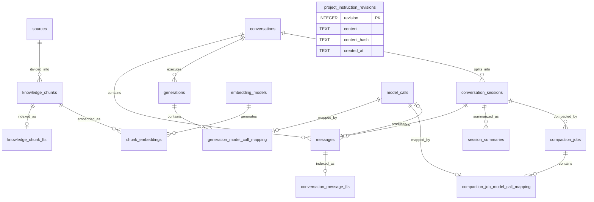

# CleoDoc 数据库设计与当前实现

> 状态：v0.1 Schema v9 当前基线
> 更新日期：2026-08-09
> Schema 来源：`packages/database/src/current-schema.ts`
> 相关文档：[技术架构](./TECHNICAL_ARCHITECTURE.md) · [会话压缩设计](./SESSION_COMPACTION_DESIGN.md) · [开发计划](./DEVELOPMENT_PLAN.md)

## 1. 文档目的与边界

本文记录 CleoDoc 当前已经实现并可在项目 `project.sqlite` 中观察到的数据库结构，用于后续数据库设计评审、Schema 演进和实现验收。

本文严格区分：

- **当前实现**：完整 Schema v9 基线直接创建的表、索引、Trigger、视图和 Repository 行为，以及唯一保留的 v8→v9 前向迁移。
- **尚未实现范围**：技术架构中规划但尚未落地的混合 RAG、ContextManifest、知识图、版本和 ChangeSet 数据结构。

当前数据库主要是“CLI 会话运行数据库”，已经覆盖会话、模型生成、资料元数据投影、Session 压缩和历史回查；它还不是完整的作品知识数据库。

## 2. 数据所有权与可恢复性

```text
作品正文、资料正文、资料元数据
└─ Markdown / JSON / 原始文件是事实源
   └─ sources 是可重建 SQLite 投影

Conversation、Message、Generation、Session、压缩任务
└─ project.sqlite 是当前唯一完整事实源

conversation_message_fts 及影子表
└─ messages 的可重建全文检索投影

knowledge_chunks、knowledge_chunk_fts 及影子表
└─ materials 与 sources/metadata 的可重建资料检索投影
```

| 数据类别 | 当前载体 | 可否从项目文件重建 |
|---|---|---|
| 正文与资料 | Markdown、JSON、原始资料文件 | 是 |
| 资料元数据投影 | `sources` | 是 |
| 资料 Chunk 与全文索引 | `knowledge_chunks`、`knowledge_chunk_fts*` | 是，可从资料文件重建 |
| 完整聊天历史 | `conversations`、`messages` | 否 |
| 项目指令及恢复历史 | `project_instruction_revisions` | 否 |
| 模型调用和保存审计 | `generations`、`model_calls` 及业务映射表 | 否 |
| Session 与压缩运行状态 | `conversation_sessions`、`session_summaries`、`compaction_jobs` | 不能完整重建 |
| 历史消息全文索引 | `conversation_message_fts*` | 是，可从 `messages` 重建 |

因此不能把整个 `project.sqlite` 都视为可随时删除的缓存。只有明确标记为投影或索引的部分可以重建。

## 3. 当前关系模型



逻辑上还有以下关联，但当前 Schema 没有外键：

- `conversation_sessions.inherited_summary_id → session_summaries.id`
- `compaction_jobs.previous_summary_id → session_summaries.id`
- `compaction_jobs.summary_id → session_summaries.id`
- 摘要及压缩任务的 `first_message_id/last_message_id → messages.id`
- `messages.tool_call_id` 与 Assistant 消息 `tool_calls_json` 中的 Tool Call ID
- Generation 与 Assistant Message 通过映射到同一个最终 ModelCall 间接关联；Generation 和 Message 的重复正文仍待后续单独处理

## 4. 连接、事务与 Schema 基线

每个作品使用独立的 `.cleo/project.sqlite`。当前 `ProjectDatabase` 使用 Node.js 内置 `node:sqlite` 的单个 `DatabaseSync` 连接。

启动配置：

```sql
PRAGMA foreign_keys = ON;
PRAGMA journal_mode = WAL;
PRAGMA synchronous = FULL;
PRAGMA busy_timeout = 5000;
```

当前行为：

- 同一个 `ProjectDatabase` 实例内通过 Promise FIFO 队列串行写入。
- 多语句业务更新使用 `BEGIN IMMEDIATE`、`COMMIT` 和失败回滚。
- 当前数据库基线是 Schema v9，版本标记保存在 `schema_migrations`，没有使用 `PRAGMA user_version`。
- 全新空数据库在一个 `BEGIN IMMEDIATE` 事务中直接执行完整 v9 基线，不重放旧 DDL。
- 完整 v8 数据库执行一次 v8→v9 前向迁移，直接增加 Source 索引状态和语言列表、`knowledge_chunks`、资料 FTS、Chunk 内容 Hash、Embedding 模型与向量表。
- 只包含 v1–v7、缺少版本标记但已有业务对象、或版本高于当前程序的数据库都会被拒绝；打开过程不自动删除它们。
- 当前代码不恢复 v1–v8 完整历史升级链、旧摘要 Schema、旧 Message/FTS 重建或项目指令文件快照转换逻辑。
- 关闭数据库前等待写队列并执行 `wal_checkpoint(TRUNCATE)`。
- `quickCheck()` 已实现，但项目打开时尚未自动调用。
- `backup()` 当前执行完整 checkpoint 后复制主数据库文件，尚未使用 SQLite Backup API 或 `VACUUM INTO`。
- FIFO 只约束当前进程和当前实例；多个进程同时打开同一项目时仍依赖 SQLite 文件锁和 `busy_timeout`。

## 5. Schema 演进策略

- v9 是当前早期开发阶段的数据库基线，v1–v7 转换路径不恢复。
- 新项目只在 `schema_migrations` 写入一条 v9 记录；完整 v8 项目迁移后保留 v8、v9 两条记录。
- 下一次结构变化必须使用更高且不复用的版本号。正式发布前可以再次压平开发期历史；正式发布后必须保留面向用户数据的前向升级路径。
- 任何不受支持的数据库都只报告错误，不把完整基线覆盖到已有表上，也不自动删除数据库。

## 6. 表与字段字典

### 6.1 类型约定

- 业务 ID 使用 `TEXT`，由应用层生成 UUID；早期已升级到 v8 的数据库可能仍保留 `legacy-<conversation-id>` Session，新代码不再创建该类 ID。`messages.message_rowid` 是仅供 SQLite/FTS 使用的稳定整数存储主键。
- 时间使用 ISO 8601 UTC 字符串并保存在 `TEXT`。
- 布尔值使用 `INTEGER` 的 `0/1`。
- 枚举使用 `TEXT + CHECK`。
- 结构化数据序列化为 JSON 后保存为 `TEXT`。
- 每项目一个数据库，因此 `project_id` 主要用于归属校验，不引用数据库内的项目表。

### 6.2 `schema_migrations`

记录数据库已经达到的 Schema 版本。新数据库只记录 v9；受支持的 v8 项目升级后保留 v8、v9 两条历史行。

| 字段 | 类型 | 约束 | 说明 |
|---|---|---|---|
| `version` | INTEGER | 主键 | Schema 版本号 |
| `applied_at` | TEXT | NOT NULL | 该版本写入时间 |

### 6.3 `conversations`

用户可见的长期对话。一条 Conversation 可以包含多个内部 Session。

| 字段 | 类型 | 约束 | 说明 |
|---|---|---|---|
| `id` | TEXT | 主键 | Conversation UUID |
| `project_id` | TEXT | NOT NULL | 所属项目 ID，来自项目清单 |
| `provider_id` | TEXT | NOT NULL | 创建 Conversation 时选择的 Provider |
| `model` | TEXT | NOT NULL | 创建 Conversation 时选择的模型 ID |
| `title` | TEXT | 可空 | 用户可见的对话标题 |
| `created_at` | TEXT | NOT NULL | Conversation 创建时间 |
| `updated_at` | TEXT | NOT NULL | 最近增加消息的时间，用于历史列表排序 |

当前 Provider 和模型记录在 Conversation 级别，不允许静默切换。


### 6.4 `messages`

完整会话消息表，是 Conversation 历史的权威事实源。

| 字段 | 类型 | 约束 | 说明 |
|---|---|---|---|
| `message_rowid` | INTEGER | 主键 | SQLite/FTS 内部稳定整数标识，不作为业务 ID 暴露 |
| `id` | TEXT | NOT NULL、UNIQUE | Message UUID，业务层公开标识 |
| `conversation_id` | TEXT | NOT NULL、外键 | 所属 Conversation；删除 Conversation 时级联删除 |
| `sequence` | INTEGER | NOT NULL | 消息在整个 Conversation 内的递增顺序 |
| `role` | TEXT | NOT NULL、CHECK | `system`、`user`、`assistant` 或 `tool` |
| `content` | TEXT | NOT NULL | 消息正文；Tool Result 也保存在此字段 |
| `reasoning_content` | TEXT | 可空 | Provider 返回并允许暴露的 Assistant Reasoning；与最终正文分开保存 |
| `name` | TEXT | 可空 | Tool 消息对应的工具名称等附加信息 |
| `tool_call_id` | TEXT | 可空 | Tool Result 对应的模型 Tool Call ID；不是数据库外键 |
| `created_at` | TEXT | NOT NULL | 消息创建时间 |
| `tool_calls_json` | TEXT | 可空 | Assistant 消息发起的 Tool Call 列表 JSON |
| `session_id` | TEXT | NOT NULL、外键 | 所属内部 Session；删除 Session 时级联删除消息 |
| `model_call_id` | TEXT | 可空、外键、UNIQUE | 直接产生该 Assistant Message 的 ModelCall；User/System/Tool Message 为空 |

约束：

```text
UNIQUE(conversation_id, sequence)
```

所有 Message 都必须属于一个 Session；创建 Conversation 不再产生无 Session 的 System Message，系统提示词由 `conversation_sessions.system_prompt_snapshot` 保存。Message 完成后一次性插入，Repository 不提供修改方法，数据库 `messages_immutable_update` Trigger 也会拒绝任何 UPDATE。纠正历史只能追加新 Message。

### 6.5 `generations`

记录一次主笔 LLM 调用的生命周期、输出、用量和保存状态。

| 字段 | 类型 | 约束 | 说明 |
|---|---|---|---|
| `id` | TEXT | 主键 | Generation UUID |
| `conversation_id` | TEXT | NOT NULL、外键 | 所属 Conversation；删除 Conversation 时级联删除 |
| `provider_id` | TEXT | NOT NULL | 本次调用实际使用的 Provider |
| `model` | TEXT | NOT NULL | 本次调用实际使用的模型 |
| `status` | TEXT | NOT NULL、CHECK | `running`、`completed`、`cancelled` 或 `failed` |
| `content` | TEXT | NOT NULL、默认 `''` | 本次调用已经收集到的模型输出 |
| `usage_json` | TEXT | 可空 | 输入、输出、Reasoning 和总 Token 用量 JSON |
| `error_code` | TEXT | 可空 | 调用失败时的稳定应用错误码 |
| `saved_document_path` | TEXT | 可空 | 用户将本次结果保存到的项目文档路径 |
| `saved_content_hash` | TEXT | 可空 | 保存时的文档内容哈希 |
| `created_at` | TEXT | NOT NULL | Generation 开始时间 |
| `completed_at` | TEXT | 可空 | 完成、失败或取消时间；运行中为空 |

当前 `generations` 表示用户可感知的生成任务，`messages` 表示进入对话上下文的消息。完成的 Generation 正文通常还会写入 Assistant Message，正文重复问题仍存在；`generation_model_call_mapping` 和 `messages.model_call_id` 提供可审计的间接来源关联。

### 6.6 `sources`

资料元数据的 SQLite 投影。资料正文和 `sources/metadata/*.json` 是可移植事实源。

| 字段 | 类型 | 约束 | 说明 |
|---|---|---|---|
| `id` | TEXT | 主键 | KnowledgeSource UUID |
| `project_id` | TEXT | NOT NULL | 所属项目 ID |
| `source_type` | TEXT | NOT NULL、CHECK | 当前只允许 `material` |
| `origin` | TEXT | NOT NULL、CHECK | `file` 或 `paste` |
| `format` | TEXT | NOT NULL、CHECK | 当前只允许 `text` 或 `markdown` |
| `title` | TEXT | NOT NULL | 用户可见的资料标题 |
| `source_label` | TEXT | 可空 | 书名、访谈对象、网站等来源说明 |
| `original_file_name` | TEXT | 可空 | 导入前的原始文件名 |
| `tags_json` | TEXT | NOT NULL | 标签字符串数组 JSON |
| `languages_json` | TEXT | NOT NULL、默认 `["zh"]` | 检测出的有序语言列表 JSON；当前允许 `zh`、`en`，第一项是主语言 |
| `relative_path` | TEXT | NOT NULL、UNIQUE | 资料正文在项目中的相对路径 |
| `content_hash` | TEXT | NOT NULL、UNIQUE | SHA-256 内容哈希，用于去重和变化检测 |
| `size` | INTEGER | NOT NULL、非负 | 资料正文 UTF-8 字节数 |
| `parser_version` | TEXT | 可空 | 当前 Chunk 集合使用的解析器版本；尚未索引时为空 |
| `chunker_version` | TEXT | 可空 | 当前 Chunk 集合使用的切片器版本 |
| `chunking_config_json` | TEXT | 可空 | 当前 Chunk 集合使用的模型 ID、revision、Token 上限和切分比例；用于发现配置变化 |
| `index_status` | TEXT | NOT NULL、CHECK | `pending`、`ready`、`stale` 或 `failed` |
| `index_error_code` | TEXT | 可空 | 最近一次索引失败的稳定错误码 |
| `indexed_at` | TEXT | 可空 | 当前 Chunk 集合完成切换的时间 |
| `created_at` | TEXT | NOT NULL | 资料首次加入时间 |
| `updated_at` | TEXT | NOT NULL | 资料内容或元数据最近更新时间 |

`MaterialService` 打开项目时会从文件事实源校准该表，因此它可以重建。

### 6.6.1 `knowledge_chunks`

资料的纯文本检索投影。业务代码不更新单行 Chunk，而是在短事务中替换同一 Source 的完整集合。

| 字段 | 类型 | 约束 | 说明 |
|---|---|---|---|
| `chunk_rowid` | INTEGER | 主键 | SQLite、FTS 和未来向量关联使用的内部整数，不对用户或 LLM 暴露 |
| `chunk_id` | TEXT | NOT NULL、UNIQUE | 公开、不透明的 Chunk UUID；重建时内容和范围未变化则保留 |
| `source_id` | TEXT | NOT NULL、外键 | 关联 `sources.id`；删除 Source 时级联删除 |
| `ordinal` | INTEGER | NOT NULL、非负 | 同一 Source 内从零开始的顺序；与 `source_id` 联合唯一 |
| `content` | TEXT | NOT NULL、非空 | 不含 CDM、XML 或 Markdown 标记的纯文本 |
| `content_hash` | TEXT | NOT NULL | 当前 Chunk 纯文本的 SHA-256，用于判断已有向量是否过期；不同于 `sources.content_hash` |
| `start_offset` | INTEGER | NOT NULL、非负 | 项目内 UTF-8 资料副本的起始字节，左闭 |
| `end_offset` | INTEGER | NOT NULL、`> start_offset` | 项目内 UTF-8 资料副本的结束字节，右开 |
| `chunker_version` | TEXT | NOT NULL | 生成当前 Chunk 的切片器版本 |
| `created_at` | TEXT | NOT NULL | Chunk ID 首次创建时间；原样复用 ID 时保持不变 |

Repository 写入前校验连续 ordinal、非空正文、范围合法、`end_offset <= sources.size` 和 Source Hash 未变化。解析与切片在事务外完成；当前实现以短事务替换 Source 的 Chunk 集合。Embedding 阶段必须改为增量切换：内容和定位未变化的 Chunk 保留原有 `chunk_rowid`，避免删除仍然有效的向量；新增、变化和删除的 Chunk 才同步更新 FTS 与 Embedding。

### 6.6.2 `knowledge_chunk_fts`

资料 Chunk 的 External Content FTS5 虚拟表，仅索引 `knowledge_chunks.content`，以 `chunk_rowid` 关联，不重复保存业务正文。使用 trigram tokenizer；新增、删除和正文更新由三个 Trigger 同步维护。三字及以上查询使用参数化的 FTS phrase，少于三字的中文短词降级为受项目和 Source 状态过滤的 `instr(content, query)` 精确包含查询。

FTS 查询只返回 `index_status='ready'` 且属于当前项目的 Source。`stale`、`pending` 和 `failed` Source 即使保留旧 Chunk，也不会被检索结果采用。`index rebuild` 从资料事实源重做解析和切片，并执行 FTS rebuild；FTS 不能反向恢复 Chunk 或资料。

### 6.7 `conversation_sessions`

Conversation 内部的上下文分段。用户通常不直接感知 Session。

| 字段 | 类型 | 约束 | 说明 |
|---|---|---|---|
| `id` | TEXT | 主键 | Session UUID；迁移旧对话时可能为 legacy ID |
| `conversation_id` | TEXT | NOT NULL、外键 | 所属 Conversation；删除 Conversation 时级联删除 |
| `ordinal` | INTEGER | NOT NULL、`> 0` | Session 在 Conversation 内的顺序，从 1 开始 |
| `status` | TEXT | NOT NULL、CHECK | `active`、`compacting` 或 `closed` |
| `trigger` | TEXT | NOT NULL、CHECK | 创建当前 Session 的原因，见下文 |
| `system_prompt_snapshot` | TEXT | NOT NULL | 当前 Session 使用的 CleoDoc System Prompt 快照 |
| `inherited_summary_id` | TEXT | 可空 | 新 Session 继承的累计摘要 ID；当前没有外键 |
| `estimated_input_tokens` | INTEGER | NOT NULL、默认 0 | 最近一次本地估算的上下文输入 Token |
| `actual_input_tokens` | INTEGER | 可空 | Provider 最近报告的实际输入 Token |
| `compaction_required` | INTEGER | NOT NULL、0/1 | 是否需要在继续提交前执行压缩 |
| `started_at` | TEXT | NOT NULL | Session 创建时间 |
| `closed_at` | TEXT | 可空 | 压缩成功并关闭 Session 的时间 |

`trigger` 表示“是什么事件创建了当前 Session”，不是“当前 Session 之后会因什么原因被压缩”：

| 值 | 说明 |
|---|---|
| `conversation_started` | 创建 Conversation 时产生的第一个 Session |
| `automatic` | 上一个 Session 达到预算阈值并自动压缩成功后创建 |
| `manual` | 用户手动执行压缩成功后创建 |

约束：

```text
UNIQUE(conversation_id, ordinal)
```

部分唯一索引 `conversation_sessions_one_active` 保证每个 Conversation 最多存在一个 `active` 或 `compacting` Session。

### 6.8 `session_summaries`

保存通过最低完整性校验、最终被采用的累计 Markdown 会话摘要。

| 字段 | 类型 | 约束 | 说明 |
|---|---|---|---|
| `id` | TEXT | 主键 | Summary UUID |
| `conversation_id` | TEXT | NOT NULL、外键 | 所属 Conversation |
| `source_session_id` | TEXT | NOT NULL、外键 | 被压缩的来源 Session |
| `summary` | TEXT | NOT NULL | 实际注入下一个 Session 的 Markdown 累计摘要；只保存一份正文 |
| `first_message_id` | TEXT | NOT NULL | 摘要覆盖的第一条消息 ID；当前不是外键 |
| `last_message_id` | TEXT | NOT NULL | 摘要覆盖的最后一条消息 ID；当前不是外键 |
| `message_count` | INTEGER | NOT NULL、非负 | 摘要覆盖的消息数量 |
| `prompt_version` | TEXT | NOT NULL | 压缩 Prompt 版本；新摘要使用 `session-compaction-v7` |
| `provider_id` | TEXT | NOT NULL | 生成摘要使用的 Provider |
| `model` | TEXT | NOT NULL | 生成摘要使用的模型 |
| `usage_json` | TEXT | 可空 | 当前 CompactionJob 内普通、分段及归并调用的累计 Token 用量 |
| `created_at` | TEXT | NOT NULL | 摘要完成时间 |

索引：

- `session_summaries_conversation_created(conversation_id, created_at DESC)`：读取 Conversation 最新摘要。
- `session_summaries_source_session(source_session_id)`：读取某个已关闭 Session 的摘要。

摘要的首尾 Message ID、数量、Prompt 版本、Provider 和模型来自 CompactionJob 冻结快照，不信任模型输出。`compaction_jobs.summary_id` 和 `conversation_sessions.inherited_summary_id` 继续以逻辑 ID 引用该表。

### 6.9 `compaction_jobs`

记录一次上下文压缩任务的执行状态和审计信息。

| 字段 | 类型 | 约束 | 说明 |
|---|---|---|---|
| `id` | TEXT | 主键 | CompactionJob UUID |
| `conversation_id` | TEXT | NOT NULL、外键 | 所属 Conversation |
| `source_session_id` | TEXT | NOT NULL、外键 | 被压缩的 Session |
| `previous_summary_id` | TEXT | 可空 | 输入任务的上一份累计摘要 ID；当前不是外键 |
| `status` | TEXT | NOT NULL、CHECK | `pending`、`running`、`validating`、`completed`、`failed` 或 `cancelled` |
| `trigger` | TEXT | NOT NULL | 压缩触发原因；当前没有 CHECK |
| `provider_id` | TEXT | NOT NULL | 本次压缩使用的 Provider |
| `model` | TEXT | NOT NULL | 本次压缩使用的模型 |
| `prompt_version` | TEXT | NOT NULL | 压缩 Prompt 版本 |
| `first_message_id` | TEXT | NOT NULL | 输入快照的第一条消息 ID；当前不是外键 |
| `last_message_id` | TEXT | NOT NULL | 输入快照的最后一条消息 ID；当前不是外键 |
| `message_count` | INTEGER | NOT NULL | 输入快照包含的消息数量 |
| `attempt_count` | INTEGER | NOT NULL、默认 0 | 实际发起的 Provider 调用次数，包括普通、分段和归并调用 |
| `orchestration_config_json` | TEXT | NOT NULL | 压缩算法和编排配置 JSON，不重复保存逐次模型请求参数 |
| `usage_json` | TEXT | 可空 | 所有压缩调用累计 Token 用量 |
| `summary_id` | TEXT | 可空 | 成功产生的 Summary ID；当前不是外键 |
| `error_code` | TEXT | 可空 | 失败、取消或中断时的稳定错误码 |
| `created_at` | TEXT | NOT NULL | 压缩任务创建时间 |
| `completed_at` | TEXT | 可空 | 成功、失败或取消时间 |

进程中断后，未完成任务会被标记为 `failed/COMPACTION_INTERRUPTED`，来源 Session 恢复为 `active` 并重新要求压缩。

### 6.10 `conversation_message_fts`

FTS5 虚拟表，用于搜索压缩前的历史消息。

| 字段 | FTS 属性 | 说明 |
|---|---|---|
| `content` | 全文索引、External Content | 使用 trigram tokenizer；原文按 FTS rowid=`messages.message_rowid` 从 `searchable_conversation_messages` 视图读取 |

所有 User/Assistant `content` 写入时都会进入 FTS；Reasoning、System Prompt、项目指令和 Tool Result 不进入索引。Conversation、Session、角色和 Message UUID 不在 FTS 重复保存，查询时通过 `message_rowid` 关联 `messages`，并强制限制当前 Conversation 与已关闭 Session。

### 6.11 `project_instruction_revisions`

项目级指令的权威事实源。每次修改保存完整内容并追加新 Revision，不更新或删除历史。

| 字段 | 类型 | 约束 | 说明 |
|---|---|---|---|
| `revision` | INTEGER | 主键、AUTOINCREMENT | 项目内单调递增版本号；最大值是当前版本 |
| `content` | TEXT | NOT NULL | 该 Revision 的完整项目指令；空字符串表示显式清空 |
| `content_hash` | TEXT | NOT NULL | 完整 UTF-8 内容的 SHA-256；恢复旧内容时允许重复 |
| `created_at` | TEXT | NOT NULL | Revision 创建时间 |

表为空表示尚未设置项目指令，对外使用 Revision 0 表达该状态。每项目独立数据库，因此不保存 `project_id`，也不设置可变的当前版本指针。

### 6.12 `model_calls`

通用模型调用审计表。每一行对应一次真实发往 Provider 的 API 请求；一个 Generation 或 CompactionJob 可以关联多次调用。

| 字段 | 类型 | 约束 | 说明 |
|---|---|---|---|
| `id` | TEXT | 主键 | ModelCall UUID |
| `provider_id` | TEXT | NOT NULL | 实际调用的 Provider |
| `model` | TEXT | NOT NULL | 实际调用的模型 ID |
| `request_options_json` | TEXT | NOT NULL | 脱敏后的请求选项；不包含消息、Prompt、正文、资料或密钥 |
| `status` | TEXT | NOT NULL、CHECK | `running`、`completed`、`cancelled` 或 `failed` |
| `finish_reason` | TEXT | 可空 | Provider 返回的结束原因，例如 `stop`、`tool_calls` 或 `length` |
| `error_code` | TEXT | 可空 | 失败或取消时的稳定应用错误码 |
| `prompt_tokens` | INTEGER | 可空、非负 | Provider 报告的输入 Token 数 |
| `completion_tokens` | INTEGER | 可空、非负 | Provider 报告的输出 Token 数 |
| `reasoning_tokens` | INTEGER | 可空、非负 | Provider 单独报告的 Reasoning Token 数 |
| `total_tokens` | INTEGER | 可空、非负 | Provider 报告的总 Token 数 |
| `created_at` | TEXT | NOT NULL | 调用创建时间 |
| `completed_at` | TEXT | 可空 | 调用完成、失败或取消时间；运行中为空 |

`request_options_json` 在适用时记录 Thinking、Reasoning Effort、Temperature、最大输出 Token、Response Format 和 Tool 配置。`model_calls` 不保存输出 `content`、`reasoning_content`、完整请求消息或任何密钥，也不包含 Generation、CompactionJob、Conversation、Session、轮次或压缩阶段等业务字段。

### 6.13 `generation_model_call_mapping`

表示一个 Generation 在普通调用或 Tool Loop 中使用的全部 ModelCall，并保存业务内顺序。

| 字段 | 类型 | 约束 | 说明 |
|---|---|---|---|
| `generation_id` | TEXT | NOT NULL、外键 | 关联 `generations.id`；删除 Generation 时级联删除 |
| `model_call_id` | TEXT | NOT NULL、外键、UNIQUE | 关联 `model_calls.id`；删除 ModelCall 时级联删除 |
| `ordinal` | INTEGER | NOT NULL、`> 0` | 本次 Generation 内的调用顺序，从 1 开始 |

约束：

```text
PRIMARY KEY(generation_id, model_call_id)
UNIQUE(generation_id, ordinal)
```

### 6.14 `compaction_job_model_call_mapping`

表示一个 CompactionJob 执行过的全部 ModelCall，并保存全局顺序和编排阶段。

| 字段 | 类型 | 约束 | 说明 |
|---|---|---|---|
| `compaction_job_id` | TEXT | NOT NULL、外键 | 关联 `compaction_jobs.id`；删除 Job 时级联删除 |
| `model_call_id` | TEXT | NOT NULL、外键、UNIQUE | 关联 `model_calls.id`；删除 ModelCall 时级联删除 |
| `ordinal` | INTEGER | NOT NULL、`> 0` | 本次 CompactionJob 内的调用顺序，从 1 开始 |
| `phase` | TEXT | NOT NULL、CHECK | `primary`、`segment` 或 `reduce` |
| `segment_index` | INTEGER | 可空、非负 | 分段调用的零基序号；其他阶段为空 |

约束：

```text
PRIMARY KEY(compaction_job_id, model_call_id)
UNIQUE(compaction_job_id, ordinal)
```

该表不记录“哪一次调用直接产生最终摘要”。最终采用的摘要继续由 `compaction_jobs.summary_id` 指向 `session_summaries.id`，摘要通过所属 CompactionJob 间接关联全部模型调用。

## 7. FTS5 内部影子表

以下表由 SQLite 自动创建和维护，不属于 CleoDoc 领域模型，不得由业务代码单独修改或删除。

### 7.1 External Content 模式

当前两张 External Content FTS 都不创建 `*_content`：历史消息正文只保存在 `messages.content`，资料 Chunk 正文只保存在 `knowledge_chunks.content`。`conversation_message_fts_*` 和 `knowledge_chunk_fts_*` 分别保留同构的倒排索引、文档长度和配置影子表；下列字段说明同时适用于两组表。

### 7.2 `conversation_message_fts_data`

| 字段 | 类型 | 说明 |
|---|---|---|
| `id` | INTEGER | FTS 内部数据块 ID |
| `block` | BLOB | 编码和压缩后的倒排索引数据 |

### 7.3 `conversation_message_fts_idx`

| 字段 | 类型 | 说明 |
|---|---|---|
| `segid` | 无声明类型 | 索引 Segment ID，复合主键第一部分 |
| `term` | 无声明类型 | 词项或词项前缀，复合主键第二部分 |
| `pgno` | 无声明类型 | 对应索引数据页位置 |

### 7.4 `conversation_message_fts_docsize`

| 字段 | 类型 | 说明 |
|---|---|---|
| `id` | INTEGER | 对应 FTS rowid |
| `sz` | BLOB | 各索引列的 Token 数量编码，供 BM25 使用 |

### 7.5 `conversation_message_fts_config`

| 字段 | 类型 | 说明 |
|---|---|---|
| `k` | 无声明类型 | 配置项名称，主键 |
| `v` | 无声明类型 | 配置项值 |

## 8. 自定义索引

| 索引 | 字段 | 当前用途 |
|---|---|---|
| `messages_session_sequence` | `session_id, sequence` | 按 Session 顺序读取消息 |
| `messages_conversation_rowid` | `conversation_id, message_rowid` | Conversation 作用域过滤与 FTS 整数关联 |
| `generations_conversation_created` | `conversation_id, created_at DESC` | 查询 Conversation 的生成记录 |
| `generations_status_created` | `status, created_at DESC` | 查询指定状态的最近 Generation |
| `sources_project_updated` | `project_id, updated_at DESC` | 按更新时间列出项目资料 |
| `sources_project_content_hash` | `project_id, content_hash` | 按项目和内容哈希查询资料 |
| `knowledge_chunks_source_rowid` | `source_id, chunk_rowid` | 按 Source 删除、列出 Chunk 并关联 FTS |
| `chunk_embeddings_chunk_rowid` | `chunk_rowid` | 删除、检查或重建某个 Chunk 的全部模型向量 |
| `conversation_sessions_one_active` | `conversation_id`，部分唯一索引 | 保证每个 Conversation 最多一个 active/compacting Session |

SQLite 还会为主键和 UNIQUE 约束创建自动索引。当前基线不创建与 `UNIQUE(conversation_id, sequence)` 重复的 `messages_conversation_sequence` 普通索引。

## 9. FTS 同步 Trigger

### 9.1 `conversation_message_fts_insert`

在 `messages` 插入 User 或 Assistant 消息后，以 `message_rowid` 和 `content` 同步加入 FTS。

### 9.2 `conversation_message_fts_delete`

在 `messages` 删除 User 或 Assistant 消息后，使用 External Content FTS delete 命令和旧正文删除对应词项。

### 9.3 `messages_immutable_update`

任何 Message UPDATE 都通过 `RAISE(ABORT, ...)` 拒绝。没有 FTS UPDATE Trigger；修改历史必须追加新 Message。

### 9.4 资料 Chunk FTS Trigger

- `knowledge_chunk_fts_insert`：Chunk 插入后索引正文。
- `knowledge_chunk_fts_delete`：Chunk 删除或 Source 级联删除时移除旧词项。
- `knowledge_chunk_fts_update`：正文更新时先删除旧词项再插入新词项；当前 Repository 仍采用整组替换，不依赖逐行更新。

## 10. Repository 行为

### 10.1 Conversation 与 Message

- 创建 Conversation 后创建初始 active Session；Core System Prompt 保存于该 Session 的 `system_prompt_snapshot`，不创建初始 System Message。
- 增加消息时，在 `BEGIN IMMEDIATE` 事务内计算 `MAX(sequence) + 1`。
- `UNIQUE(conversation_id, sequence)` 提供最终并发保护。
- Tool Call 和 Tool Result 与普通消息共用同一消息序列。

### 10.2 Generation

- 请求开始时写入 `running` Generation。
- 请求结束后保存状态、完整输出、Token 用量和错误码。
- 成功结果可以同时加入 Assistant Message。
- `/save` 或 `save-last` 通过 Generation 保存文档路径和内容哈希。

### 10.3 Session 压缩

- 开始压缩时，旧 Session 从 `active` 原子切换到 `compacting`，并创建 CompactionJob。
- 压缩失败时 Job 进入 `failed/cancelled`，旧 Session 恢复为 `active`。
- 压缩成功时在同一事务中：保存 Summary、关闭旧 Session、创建新 Session、完成 Job。
- 新 Session 的 `inherited_summary_id` 指向刚生成的累计摘要。
- 运行时按 active Session 的 `inherited_summary_id` 主键读取摘要，不使用 `created_at` 推测应继承哪一行；摘要缺失或 Conversation 归属不匹配时返回数据库一致性错误。

### 10.4 历史回查

- `searchClosedHistory` 使用 FTS5、`snippet()` 和 `bm25()`，但只向 Tool Result 返回 Message ID、角色、时间和命中片段。
- FTS 通过 `message_rowid` 关联 `messages`；查询强制限制当前 `conversation_id` 和已关闭 Session。
- `readClosedMessage` 只按搜索得到的 Message ID 返回当前 Conversation 中一条已关闭的 User/Assistant 消息；不按 Session 批量读取，也不返回 Reasoning。

### 10.5 项目指令

- 当前内容始终读取最大 Revision；表为空时对外表达为 Revision 0。
- `set`、`append`、精确文本替换和恢复均先校验 `expected_revision`，再在短事务中追加完整快照。
- 恢复旧版本通过复制旧内容创建新 Revision，不删除或更新历史行。
- ContextBuilder 在每次 Agent 模型调用前读取最新 Revision；项目指令 Tool 获批后，下一轮 Tool Loop 立即使用新内容。

### 10.6 资料索引

- `MaterialRepository` 从资料元数据事实源同步 Source；相同内容 Hash 的元数据更新保留索引状态，内容 Hash 变化时清除索引版本并标记 `stale`。
- `KnowledgeChunkRepository.replaceForSource` 在事务内再次校验 Source Hash 与范围，并增量同步 Chunk；完全相同的正文和范围保留 Row ID、Chunk ID 与有效向量，局部变化复用位置对应行但通过新 `content_hash` 使旧向量失效，删除项由外键级联清理。
- 切片配置、Parser 或 Chunker 版本与当前运行配置不一致时，`ready` Source 转为 `stale`，搜索只读取 `ready`。
- Source 删除通过外键级联删除 Chunk，Chunk DELETE Trigger 同步清理 FTS。
- `MaterialIndexer` 在数据库事务外解析和切片；批量重建失败时保留资料事实源，将 Source 标记为 `failed` 并记录稳定错误码。
- `ChunkEmbeddingRepository.listPending` 只选择当前项目中 `ready`、主语言匹配且指定模型向量缺失或 Hash 不匹配的 Chunk。候选快照包含 Source Hash、Chunk Hash 和切片配置，但 Worker 输入只包含公开 Chunk ID 与正文。
- `ChunkEmbeddingRepository.writeBatch` 在短事务中重新校验项目、Source 主语言、索引状态、Source/Chunk Hash 和切片配置；过期结果直接计为丢弃。有效结果登记最小模型身份、校验同模型向量维度，以 Float32 Little-Endian BLOB 批量 Upsert。Embedding 失败不会修改 Source 状态或 FTS。

## 11. 当前设计评审结论

### 11.1 Generation 与 Message 正文仍重复

完成的 Generation 正文通常也会写入 Assistant Message。当前 Schema 通过 Generation→ModelCall 映射和 Message→ModelCall 外键建立可审计的间接来源，但两张业务表仍分别保存正文。在明确任务生命周期、失败恢复和持久数据处理方案前，不删除任一字段。

### 11.2 数据库健康检查与备份能力仍有缺口

通用手动备份仍采用 checkpoint 后复制主数据库文件，尚未切换到 SQLite Backup API 或 `VACUUM INTO`。项目打开时也尚未自动执行 `quick_check`。聊天历史、项目指令和运行审计不能从作品文件重建，因此这些缺口不能按普通索引缓存处理。

### 11.3 部分逻辑引用没有外键

摘要继承、压缩前序摘要、成功摘要以及首尾消息边界只保存文本 ID。应用事务维持当前一致性，但数据库不能独立阻止悬空引用。增加外键前必须设计删除语义和现有持久数据的处理方式，不能直接修改现有表。

### 11.4 查询辅助索引仍需基准验证

`messages_conversation_rowid`、SessionSummary 查询索引和现有唯一索引已经覆盖当前主要路径；`compaction_jobs` 尚无按 Conversation、Session、状态和时间的组合索引。是否增加索引应由真实查询计划和项目规模基准决定。

## 12. RAG 数据库范围

Schema v9 已实现资料 Source 索引状态、语言列表、纯文本 Chunk、Chunk 内容 Hash、External Content FTS，以及 Embedding 模型和向量存储表。以下能力仍未进入当前 Schema：

- 正文 FTS、Embedding 任务/索引代次；本地精确向量检索已经实现，混合召回尚未实现。
- RetrievalRun、ContextManifest 及证据项。
- 实体、别名、事实、证据、关系、事件、人物状态和叙事线。
- AgentJob、ChangeSet、候选事实和审批。
- Git Revision、命名版本和 Diff 缓存。
- 个人资料库及项目显式链接快照。

CDM 语义见 [CDM 设计](./CDM_DOCUMENT_FORMAT_DESIGN.md)，TXT/Markdown 解析、切片和原文定位见[资料解析与切片设计](./DOCUMENT_PARSING_AND_CHUNKING_DESIGN.md)，FTS、Embedding 和混合检索见[本地 RAG 设计](./LOCAL_RAG_INGESTION_DESIGN.md)。后续新增任务、检索或审计表时仍必须提升 Schema 版本并核对删除语义。

### 12.1 复用并扩展现有 `sources`（已实现）

当前 Schema 已有 `sources` 表，字段和现状见 [6.6 `sources`](#66-sources)。RAG 不创建平行的 `knowledge_sources`；公开的 `source` 就是现有 `sources.id`，`sources.content_hash` 继续保存项目内规范化 UTF-8 资料副本的 SHA-256，`sources.size` 继续保存该副本的字节长度。

当前完整 Schema v9 包含：

| 字段 | 类型 | 约束 | 说明 |
|---|---|---|---|
| `parser_version` | TEXT | 可空 | 最近一次成功生成当前 Chunk 集合的解析器版本；尚未索引时为空。 |
| `chunker_version` | TEXT | 可空 | 最近一次成功生成当前 Chunk 集合的切片器版本。 |
| `chunking_config_json` | TEXT | 可空 | 实际模型 ID、revision、Token 上限和切分比例 JSON；任一项变化时索引转为 `stale`。 |
| `index_status` | TEXT | NOT NULL | `pending`、`ready`、`stale`、`failed` 四种受控状态。 |
| `index_error_code` | TEXT | 可空 | 最近一次失败的稳定错误码。 |
| `indexed_at` | TEXT | 可空 | 当前 Chunk 集合完成切换的时间。 |

`languages_json TEXT NOT NULL DEFAULT '["zh"]'` 保存 Source 的有序语言列表。新导入资料根据 CDM 正文块检测语言；从 v8 迁移的既有 Source 默认为 `["zh"]`，不自动重做解析或切片。

当前实现的 `format` 已限制为 `text`、`markdown`。外部文件可以是 UTF-8、GB2312、GBK 或 GB18030，但导入边界会统一转换为 UTF-8 项目副本；输入编码只作为本次导入诊断结果返回，不改变 Source 的长期内容语义，因此 v0.1 不新增 `media_type` 或 `encoding` 字段。

`sources.content_hash` 是判断原始资料文件是否变化的依据，不重复写入每个 Chunk。资料变更与索引更新必须避免“新 Source Hash 配旧 Chunk”：检测到变化后先将 `index_status` 标记为 `stale`；新解析和全部 Chunk 成功前，旧 Chunk 不能被认为拥有精确有效的位置。Source Hash、Chunk 集合与 FTS 的最终切换顺序必须由同一摄取服务协调。

Schema v9 已在 `knowledge_chunks` 包含 `content_hash`。它只校验单个 Chunk 的规范化纯文本，用来与 `chunk_embeddings.content_hash` 直接比较；它与 Source 文件 Hash 的作用不同。

### 12.2 `knowledge_chunks`（已实现）

保存可由原始资料重建的纯文本检索投影。Chunk 不保存 CDM、Markdown、临时 CDM Node ID 或标题路径。

| 字段 | 类型 | 约束 | 说明 |
|---|---|---|---|
| `chunk_rowid` | INTEGER | PRIMARY KEY | 仅供 SQLite、FTS 和向量关联使用的内部整数，不对 LLM、CDM 或用户公开。 |
| `chunk_id` | TEXT | NOT NULL UNIQUE | 公开、稳定、不透明的 Chunk 标识；用于 RAG Tool Result 和 `<reference chunk_id="...">`。 |
| `source_id` | TEXT | NOT NULL, FOREIGN KEY | 关联现有 `sources.id`。Chunk 引用中的 `source` 必须与该字段一致。 |
| `ordinal` | INTEGER | NOT NULL | Chunk 在同一 Source 中从零开始的稳定顺序。 |
| `content` | TEXT | NOT NULL | 去除 CDM/XML 标签和 Markdown 格式后的规范化纯文本；不得拼入标题路径、来源 ID 或内部元数据。 |
| `content_hash` | TEXT | NOT NULL | 当前 Chunk 纯文本的 SHA-256；无需读取正文即可判断向量是否过期。 |
| `start_offset` | INTEGER | NOT NULL | 项目内 UTF-8 资料副本字节范围起点，使用左闭右开区间。 |
| `end_offset` | INTEGER | NOT NULL | 项目内 UTF-8 资料副本字节范围终点，使用左闭右开区间。 |
| `chunker_version` | TEXT | NOT NULL | 生成该 Chunk 的切片算法版本。 |
| `created_at` | TEXT | NOT NULL | Chunk 创建时间。 |

约束与索引要求：

- `UNIQUE(source_id, ordinal)`。
- `start_offset >= 0`。
- `end_offset > start_offset`。
- `end_offset <= sources.size` 由写入服务在同一流程中校验。
- 一个 Chunk 只能对应原始资料中的一个连续范围；当前不增加 Locator JSON 或一对多范围表。
- 删除 Source 时级联删除活动 Chunk、FTS 和 Embedding；正式文档中已经存在的 `<reference>` 保留并显示为无效引用。
- `chunk_id` 当前视为稳定标识。资料更新和重新切片时如何继承 ID 暂缓设计，不能在尚未确认前静默复用旧 ID 指向不同内容。

当前 SQL 轮廓为：

```sql
CREATE TABLE knowledge_chunks (
  chunk_rowid     INTEGER PRIMARY KEY,
  chunk_id        TEXT NOT NULL UNIQUE,
  source_id       TEXT NOT NULL REFERENCES sources(id) ON DELETE CASCADE,
  ordinal         INTEGER NOT NULL CHECK (ordinal >= 0),
  content         TEXT NOT NULL,
  content_hash    TEXT NOT NULL,
  start_offset    INTEGER NOT NULL CHECK (start_offset >= 0),
  end_offset      INTEGER NOT NULL CHECK (end_offset > start_offset),
  chunker_version TEXT NOT NULL,
  created_at      TEXT NOT NULL,
  UNIQUE (source_id, ordinal)
);
```

Schema v9 的 Chunk Repository 使用增量同步：先按“内容 Hash + 原文范围”匹配未变化 Chunk，再以相同 ordinal 匹配局部变化项。未变化项保留 `chunk_rowid`、`chunk_id` 和有效向量；局部变化项保留可匹配的 Row ID 并更新 `content_hash`，使旧向量因 Hash 不一致而失效；删除项通过外键级联删除向量。ordinal 调整使用事务内的临时顺序值，避免唯一约束冲突。

### 12.3 `knowledge_chunk_fts`（已实现）

FTS5 使用 External Content 模式索引 `knowledge_chunks.content`：

```sql
CREATE VIRTUAL TABLE knowledge_chunk_fts USING fts5(
  content,
  content = 'knowledge_chunks',
  content_rowid = 'chunk_rowid',
  tokenize = 'trigram'
);
```

这里的 External Content 表示 FTS 通过 `chunk_rowid` 读取同一个 SQLite 数据库中的纯文本 Chunk，不表示正文保存在文件系统。FTS 的内部影子表是可重建索引，不是新的业务表。Chunk 与 FTS 的增删改必须由同一个 Repository 短事务维护。

当前完整 Schema v9 同时包含 Chunk、FTS、Source 语言列表、Chunk Hash、Embedding 模型和向量表。后续任务顺序只在 [DEVELOPMENT_PLAN.md](./DEVELOPMENT_PLAN.md) 维护。

### 12.4 `embedding_models`（已实现）

只登记某个向量属于哪个模型版本，不复制推理框架已经封装的运行参数：

```sql
CREATE TABLE embedding_models (
  embedding_model_id TEXT PRIMARY KEY,
  model_name         TEXT NOT NULL,
  revision           TEXT NOT NULL,
  created_at         TEXT NOT NULL,
  UNIQUE (model_name, revision)
);
```

| 字段 | 类型 | 约束 | 说明 |
|---|---|---|---|
| `embedding_model_id` | TEXT | PRIMARY KEY | CleoDoc 内部模型标识；同一模型 Revision 复用同一标识。 |
| `model_name` | TEXT | NOT NULL | 推理框架识别的模型名称。 |
| `revision` | TEXT | NOT NULL | 模型版本或推理框架提供的 Revision。 |
| `created_at` | TEXT | NOT NULL | 首次登记时间。 |

不保存 `model_hash`、维度、距离算法、归一化方式、推理设备、批次、线程、模型路径或推理运行参数。向量维度可以由 `length(embedding) / 4` 或 `vec_length(embedding)` 得到；距离算法属于检索配置，不属于模型记录。

### 12.5 `chunk_embeddings`（已实现表结构）

一个 Chunk 可以同时保留多个模型生成的向量：

```sql
CREATE TABLE chunk_embeddings (
  embedding_model_id TEXT NOT NULL,
  chunk_rowid        INTEGER NOT NULL,
  content_hash       TEXT NOT NULL,
  embedding          BLOB NOT NULL
    CHECK (length(embedding) > 0 AND length(embedding) % 4 = 0),
  created_at         TEXT NOT NULL,
  PRIMARY KEY (embedding_model_id, chunk_rowid),
  FOREIGN KEY (embedding_model_id)
    REFERENCES embedding_models(embedding_model_id) ON DELETE CASCADE,
  FOREIGN KEY (chunk_rowid)
    REFERENCES knowledge_chunks(chunk_rowid) ON DELETE CASCADE
);

CREATE INDEX chunk_embeddings_chunk_rowid
  ON chunk_embeddings(chunk_rowid);
```

| 字段 | 类型 | 约束 | 说明 |
|---|---|---|---|
| `embedding_model_id` | TEXT | NOT NULL、外键 | 生成该向量的模型。 |
| `chunk_rowid` | INTEGER | NOT NULL、外键 | 对应 Chunk 的数据库内部整数 ID。 |
| `content_hash` | TEXT | NOT NULL | 生成向量时使用的 Chunk 内容校验值。 |
| `embedding` | BLOB | NOT NULL、非空、长度为 4 的倍数 | 无头部的 IEEE 754 Float32 Little-Endian 连续向量。 |
| `created_at` | TEXT | NOT NULL | 向量生成并写入的时间。 |

当 `chunk_embeddings.content_hash <> knowledge_chunks.content_hash` 时，该向量已经过期，不能参与检索。删除 Chunk 或模型时级联删除相应向量。SQLite BLOB 是可变长度字段，不需要预设维度；同一 `embedding_model_id` 下维度一致由 Embedding Repository 在写入和查询边界校验。

### 12.6 sqlite-vec 的数据库职责（已实现）

v0.1 加载固定版本的 `sqlite-vec`，但不创建固定维度的 `vec0` 虚拟表。`chunk_embeddings` 仍是 CleoDoc 管理的普通可重建表：

- `vec_f32(?)` 校验写入和查询参数是否为有效 Float32 BLOB。
- `vec_length()` 在需要时检查向量维度。
- `vec_distance_cosine()` 在 SQLite 内对过滤后的候选执行精确余弦距离计算。
- Query Embedding 不写入数据库，只作为同格式的 BLOB 参数传入查询。
- `distance` 越小表示越相似；检索配置负责选择距离函数和 Top-K，不向模型表写入 `distance_metric`。

固定存储协议为 IEEE 754 Float32、Little-Endian、连续元素、无文件头和维度头，每个元素 4 字节。主流目标平台可将 `Float32Array` 的有效内存范围映射为 `Uint8Array` 后绑定；实现仍须在边界确认字节序，并在非 Little-Endian 平台显式转换。写入不经过 JSON 数组。

向量查询通过 `sources → knowledge_chunks → chunk_embeddings` 过滤当前项目、Source 状态、活动模型和匹配的 Chunk Hash，再按 `vec_distance_cosine(embedding, vec_f32(?))` 排序。`sqlite-vec` 只是 `VectorIndex` SQLite Adapter 的实现细节；未来改用 `vec0` 或 ANN 时不得改变领域类型、Chunk 身份或上层 RAG 编排。

当前实现锁定 NPM 包 `sqlite-vec` 0.1.9。项目数据库以允许受控加载的方式打开，但初始化立即禁用扩展加载；只有 `SqliteVectorIndex` 首次使用时短暂启用并加载随应用发行的扩展，`finally` 中重新禁用。扩展缺失、版本不匹配或加载失败统一返回 `VECTOR_INDEX_UNAVAILABLE`，不会修改 Source、Chunk、FTS 或 Embedding 表。

## 13. 待确认的数据库语义

1. Generation 与 Message 的正文是否长期共存，以及如何迁移已有任务状态、保存审计和失败记录。
2. Conversation、Message、Session、项目指令和模型调用审计需要怎样的备份、恢复及数据保留等级。
3. 当前逻辑 ID 引用是否需要数据库外键，以及 Conversation/Session 删除时的级联或限制语义。
4. 同一 Project 内跨 Conversation 历史查询的 Tool、授权范围、结果权威和索引策略。
