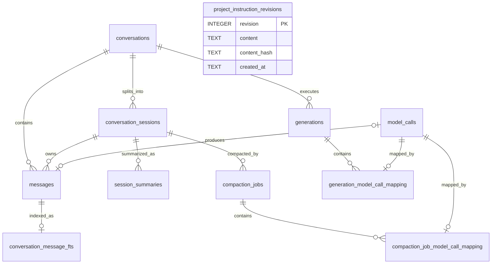

# CleoDoc 数据库设计与当前实现

> 状态：v0.1 migration v8 当前 Schema 基线
> 更新日期：2026-08-02
> Schema 来源：`packages/database/src/migrations.ts`
> 相关文档：[技术架构](./TECHNICAL_ARCHITECTURE.md) · [会话压缩设计](./SESSION_COMPACTION_DESIGN.md) · [开发计划](./DEVELOPMENT_PLAN.md)

## 1. 文档目的与边界

本文记录 CleoDoc 当前已经实现并可在项目 `project.sqlite` 中观察到的数据库结构，用于后续数据库设计评审、migration 设计和实现验收。

本文严格区分：

- **当前实现**：migration v1–v8 已经创建的表、索引、Trigger、视图和 Repository 行为。
- **尚未实现范围**：技术架构中规划但尚未落地的文档 Chunk、Embedding、RAG、ContextManifest、知识图、版本和 ChangeSet 数据结构。

当前数据库主要是“CLI 会话运行数据库”，已经覆盖会话、模型生成、资料元数据投影、Session 压缩和历史回查；它还不是完整的作品知识数据库。

## 2. 数据所有权与可恢复性

```text
作品正文、资料正文、资料元数据
└─ Markdown / JSON / 原始文件是事实源
   └─ sources 是可重建 SQLite 投影

Conversation、Message、Generation、Session、压缩任务
└─ project.sqlite 是当前唯一完整事实源

conversation_message_fts 及影子表
└─ messages 的可重建全文检索投影
```

| 数据类别 | 当前载体 | 可否从项目文件重建 |
|---|---|---|
| 正文与资料 | Markdown、JSON、原始资料文件 | 是 |
| 资料元数据投影 | `sources` | 是 |
| 完整聊天历史 | `conversations`、`messages` | 否 |
| 项目指令及恢复历史 | `project_instruction_revisions` | 否 |
| 模型调用和保存审计 | `generations`、`model_calls` 及业务映射表 | 否 |
| Session 与压缩运行状态 | `conversation_sessions`、`session_summaries`、`compaction_jobs` | 不能完整重建 |
| 历史消息全文索引 | `conversation_message_fts*` | 是，可从 `messages` 重建 |

因此不能把整个 `project.sqlite` 都视为可随时删除的缓存。只有明确标记为投影或索引的部分可以重建。

## 3. 当前关系模型



逻辑上还有以下关联，但当前 Schema 没有外键：

- `conversation_sessions.inherited_summary_id → session_summaries.id`
- `compaction_jobs.previous_summary_id → session_summaries.id`
- `compaction_jobs.summary_id → session_summaries.id`
- 摘要及压缩任务的 `first_message_id/last_message_id → messages.id`
- `messages.tool_call_id` 与 Assistant 消息 `tool_calls_json` 中的 Tool Call ID
- Generation 与 Assistant Message 通过映射到同一个最终 ModelCall 间接关联；Generation 和 Message 的重复正文仍待后续单独处理

## 4. 连接、事务与迁移

每个作品使用独立的 `.cleo/project.sqlite`。当前 `ProjectDatabase` 使用 Node.js 内置 `node:sqlite` 的单个 `DatabaseSync` 连接。

启动配置：

```sql
PRAGMA foreign_keys = ON;
PRAGMA journal_mode = WAL;
PRAGMA synchronous = FULL;
PRAGMA busy_timeout = 5000;
```

当前行为：

- 同一个 `ProjectDatabase` 实例内通过 Promise FIFO 队列串行写入。
- 多语句业务更新使用 `BEGIN IMMEDIATE`、`COMMIT` 和失败回滚。
- 每个 migration 在独立的 `BEGIN IMMEDIATE` 事务中执行。
- migration 版本保存在 `schema_migrations`，当前没有使用 `PRAGMA user_version`。
- 已有项目存在待执行 migration 时，先执行 WAL 完整 checkpoint，并在 `.cleo/backups/` 创建 `pre-migration-v<版本>-<时间>.sqlite`；全新空数据库不创建无意义备份。
- migration v5 除 SQL DDL 外还使用同一事务内的确定性 TypeScript 转换函数，将旧结构化摘要渲染为 Markdown；转换不调用 LLM。
- migration v6 重建 `messages`，保留旧隐式 rowid 为稳定 `message_rowid`，增加 Reasoning/ModelCall 字段，并从 Message 完整重建 External Content FTS；迁移不调用 LLM。
- migration v7 新增追加式 `project_instruction_revisions`，项目指令运行时以该表为唯一事实源。
- migration v8 删除 `conversation_sessions` 中四个文件快照遗留字段，不迁移或读取作品项目中的 `AGENTS.md`。
- 关闭数据库前等待写队列并执行 `wal_checkpoint(TRUNCATE)`。
- `quickCheck()` 已实现，但项目打开时尚未自动调用。
- `backup()` 当前执行完整 checkpoint 后复制主数据库文件，尚未使用 SQLite Backup API 或 `VACUUM INTO`。
- FIFO 只约束当前进程和当前实例；多个进程同时打开同一项目时仍依赖 SQLite 文件锁和 `busy_timeout`。

## 5. Schema 演进

| Migration | 当前内容 |
|---|---|
| v1 | `conversations`、`messages`、`generations` 及基础索引 |
| v2 | 为 `messages` 增加 `tool_calls_json` |
| v3 | 增加资料元数据投影 `sources` |
| v4 | 增加 Session、压缩摘要、压缩任务、`messages.session_id` 和会话历史 FTS5 |
| v5 | 将 `session_summaries` 迁移为单一 Markdown `summary`，确定性转换旧摘要并增加查询索引 |
| v6 | 增加 ModelCall 审计与业务映射；重建不可变 `messages`；增加 Reasoning；压缩配置改名；历史 FTS 改为 External Content |
| v7 | 增加数据库原生项目指令 Revision 链并停用 Session 文件快照运行路径 |
| v8 | 删除 Session 的项目指令文件路径、快照、哈希和加载时间字段；移除遗留文件导入与合并路径 |

## 6. 表与字段字典

### 6.1 类型约定

- 业务 ID 使用 `TEXT`，由应用层生成 UUID；legacy Session 可使用 `legacy-<conversation-id>`。`messages.message_rowid` 是仅供 SQLite/FTS 使用的稳定整数存储主键。
- 时间使用 ISO 8601 UTC 字符串并保存在 `TEXT`。
- 布尔值使用 `INTEGER` 的 `0/1`。
- 枚举使用 `TEXT + CHECK`。
- 结构化数据序列化为 JSON 后保存为 `TEXT`。
- 每项目一个数据库，因此 `project_id` 主要用于归属校验，不引用数据库内的项目表。

### 6.2 `schema_migrations`

记录已经成功提交的 migration。

| 字段 | 类型 | 约束 | 说明 |
|---|---|---|---|
| `version` | INTEGER | 主键 | Migration 版本号 |
| `applied_at` | TEXT | NOT NULL | Migration 成功提交时间 |

### 6.3 `conversations`

用户可见的长期对话。一条 Conversation 可以包含多个内部 Session。

| 字段 | 类型 | 约束 | 说明 |
|---|---|---|---|
| `id` | TEXT | 主键 | Conversation UUID |
| `project_id` | TEXT | NOT NULL | 所属项目 ID，来自项目清单 |
| `provider_id` | TEXT | NOT NULL | 创建 Conversation 时选择的 Provider |
| `model` | TEXT | NOT NULL | 创建 Conversation 时选择的模型 ID |
| `title` | TEXT | 可空 | 用户可见的对话标题 |
| `created_at` | TEXT | NOT NULL | Conversation 创建时间 |
| `updated_at` | TEXT | NOT NULL | 最近增加消息的时间，用于历史列表排序 |

当前 Provider 和模型记录在 Conversation 级别，不允许静默切换。

### 6.4 `messages`

完整会话消息表，是 Conversation 历史的权威事实源。

| 字段 | 类型 | 约束 | 说明 |
|---|---|---|---|
| `message_rowid` | INTEGER | 主键 | SQLite/FTS 内部稳定整数标识，不作为业务 ID 暴露 |
| `id` | TEXT | NOT NULL、UNIQUE | Message UUID，业务层公开标识 |
| `conversation_id` | TEXT | NOT NULL、外键 | 所属 Conversation；删除 Conversation 时级联删除 |
| `sequence` | INTEGER | NOT NULL | 消息在整个 Conversation 内的递增顺序 |
| `role` | TEXT | NOT NULL、CHECK | `system`、`user`、`assistant` 或 `tool` |
| `content` | TEXT | NOT NULL | 消息正文；Tool Result 也保存在此字段 |
| `reasoning_content` | TEXT | 可空 | Provider 返回并允许暴露的 Assistant Reasoning；与最终正文分开保存 |
| `name` | TEXT | 可空 | Tool 消息对应的工具名称等附加信息 |
| `tool_call_id` | TEXT | 可空 | Tool Result 对应的模型 Tool Call ID；不是数据库外键 |
| `created_at` | TEXT | NOT NULL | 消息创建时间 |
| `tool_calls_json` | TEXT | 可空 | Assistant 消息发起的 Tool Call 列表 JSON |
| `session_id` | TEXT | 可空、外键 | 所属内部 Session；删除 Session 时级联删除消息 |
| `model_call_id` | TEXT | 可空、外键、UNIQUE | 直接产生该 Assistant Message 的 ModelCall；User/System/Tool Message 为空 |

约束：

```text
UNIQUE(conversation_id, sequence)
```

`session_id` 在 Schema 中保持可空以兼容 migration；当前正常聊天流程应为消息指定 Session。Message 完成后一次性插入，Repository 不提供修改方法，数据库 `messages_immutable_update` Trigger 也会拒绝任何 UPDATE。纠正历史只能追加新 Message。

### 6.5 `generations`

记录一次主笔 LLM 调用的生命周期、输出、用量和保存状态。

| 字段 | 类型 | 约束 | 说明 |
|---|---|---|---|
| `id` | TEXT | 主键 | Generation UUID |
| `conversation_id` | TEXT | NOT NULL、外键 | 所属 Conversation；删除 Conversation 时级联删除 |
| `provider_id` | TEXT | NOT NULL | 本次调用实际使用的 Provider |
| `model` | TEXT | NOT NULL | 本次调用实际使用的模型 |
| `status` | TEXT | NOT NULL、CHECK | `running`、`completed`、`cancelled` 或 `failed` |
| `content` | TEXT | NOT NULL、默认 `''` | 本次调用已经收集到的模型输出 |
| `usage_json` | TEXT | 可空 | 输入、输出、Reasoning 和总 Token 用量 JSON |
| `error_code` | TEXT | 可空 | 调用失败时的稳定应用错误码 |
| `saved_document_path` | TEXT | 可空 | 用户将本次结果保存到的项目文档路径 |
| `saved_content_hash` | TEXT | 可空 | 保存时的文档内容哈希 |
| `created_at` | TEXT | NOT NULL | Generation 开始时间 |
| `completed_at` | TEXT | 可空 | 完成、失败或取消时间；运行中为空 |

当前 `generations` 表示用户可感知的生成任务，`messages` 表示进入对话上下文的消息。完成的 Generation 正文通常还会写入 Assistant Message，正文重复问题仍存在；migration v6 已通过 `generation_model_call_mapping` 和 `messages.model_call_id` 建立可审计的间接来源关联。

### 6.6 `sources`

资料元数据的 SQLite 投影。资料正文和 `sources/metadata/*.json` 是可移植事实源。

| 字段 | 类型 | 约束 | 说明 |
|---|---|---|---|
| `id` | TEXT | 主键 | KnowledgeSource UUID |
| `project_id` | TEXT | NOT NULL | 所属项目 ID |
| `source_type` | TEXT | NOT NULL、CHECK | 当前只允许 `material` |
| `origin` | TEXT | NOT NULL、CHECK | `file` 或 `paste` |
| `format` | TEXT | NOT NULL、CHECK | 当前只允许 `text` 或 `markdown` |
| `title` | TEXT | NOT NULL | 用户可见的资料标题 |
| `source_label` | TEXT | 可空 | 书名、访谈对象、网站等来源说明 |
| `original_file_name` | TEXT | 可空 | 导入前的原始文件名 |
| `tags_json` | TEXT | NOT NULL | 标签字符串数组 JSON |
| `relative_path` | TEXT | NOT NULL、UNIQUE | 资料正文在项目中的相对路径 |
| `content_hash` | TEXT | NOT NULL、UNIQUE | SHA-256 内容哈希，用于去重和变化检测 |
| `size` | INTEGER | NOT NULL、非负 | 资料正文 UTF-8 字节数 |
| `created_at` | TEXT | NOT NULL | 资料首次加入时间 |
| `updated_at` | TEXT | NOT NULL | 资料内容或元数据最近更新时间 |

`MaterialService` 打开项目时会从文件事实源校准该表，因此它可以重建。

### 6.7 `conversation_sessions`

Conversation 内部的上下文分段。用户通常不直接感知 Session。

| 字段 | 类型 | 约束 | 说明 |
|---|---|---|---|
| `id` | TEXT | 主键 | Session UUID；迁移旧对话时可能为 legacy ID |
| `conversation_id` | TEXT | NOT NULL、外键 | 所属 Conversation；删除 Conversation 时级联删除 |
| `ordinal` | INTEGER | NOT NULL、`> 0` | Session 在 Conversation 内的顺序，从 1 开始 |
| `status` | TEXT | NOT NULL、CHECK | `active`、`compacting` 或 `closed` |
| `trigger` | TEXT | NOT NULL、CHECK | 创建当前 Session 的原因，见下文 |
| `system_prompt_snapshot` | TEXT | NOT NULL | 当前 Session 使用的 CleoDoc System Prompt 快照 |
| `inherited_summary_id` | TEXT | 可空 | 新 Session 继承的累计摘要 ID；当前没有外键 |
| `estimated_input_tokens` | INTEGER | NOT NULL、默认 0 | 最近一次本地估算的上下文输入 Token |
| `actual_input_tokens` | INTEGER | 可空 | Provider 最近报告的实际输入 Token |
| `compaction_required` | INTEGER | NOT NULL、0/1 | 是否需要在继续提交前执行压缩 |
| `started_at` | TEXT | NOT NULL | Session 创建时间 |
| `closed_at` | TEXT | 可空 | 压缩成功并关闭 Session 的时间 |

`trigger` 表示“是什么事件创建了当前 Session”，不是“当前 Session 之后会因什么原因被压缩”：

| 值 | 说明 |
|---|---|
| `conversation_started` | 创建 Conversation 时产生的第一个 Session |
| `automatic` | 上一个 Session 达到预算阈值并自动压缩成功后创建 |
| `manual` | 用户手动执行压缩成功后创建 |

约束：

```text
UNIQUE(conversation_id, ordinal)
```

部分唯一索引 `conversation_sessions_one_active` 保证每个 Conversation 最多存在一个 `active` 或 `compacting` Session。

### 6.8 `session_summaries`

保存通过最低完整性校验、最终被采用的累计 Markdown 会话摘要。

| 字段 | 类型 | 约束 | 说明 |
|---|---|---|---|
| `id` | TEXT | 主键 | Summary UUID |
| `conversation_id` | TEXT | NOT NULL、外键 | 所属 Conversation |
| `source_session_id` | TEXT | NOT NULL、外键 | 被压缩的来源 Session |
| `summary` | TEXT | NOT NULL | 实际注入下一个 Session 的 Markdown 累计摘要；只保存一份正文 |
| `first_message_id` | TEXT | NOT NULL | 摘要覆盖的第一条消息 ID；当前不是外键 |
| `last_message_id` | TEXT | NOT NULL | 摘要覆盖的最后一条消息 ID；当前不是外键 |
| `message_count` | INTEGER | NOT NULL、非负 | 摘要覆盖的消息数量 |
| `prompt_version` | TEXT | NOT NULL | 压缩 Prompt 版本；新摘要使用 `session-compaction-v7` |
| `provider_id` | TEXT | NOT NULL | 生成摘要使用的 Provider |
| `model` | TEXT | NOT NULL | 生成摘要使用的模型 |
| `usage_json` | TEXT | 可空 | 当前 CompactionJob 内普通、分段及归并调用的累计 Token 用量 |
| `created_at` | TEXT | NOT NULL | 摘要完成时间 |

索引：

- `session_summaries_conversation_created(conversation_id, created_at DESC)`：读取 Conversation 最新摘要。
- `session_summaries_source_session(source_session_id)`：读取某个已关闭 Session 的摘要。

摘要的首尾 Message ID、数量、Prompt 版本、Provider 和模型来自 CompactionJob 冻结快照，不信任模型输出。`compaction_jobs.summary_id` 和 `conversation_sessions.inherited_summary_id` 继续以逻辑 ID 引用该表。

### 6.9 `compaction_jobs`

记录一次上下文压缩任务的执行状态和审计信息。

| 字段 | 类型 | 约束 | 说明 |
|---|---|---|---|
| `id` | TEXT | 主键 | CompactionJob UUID |
| `conversation_id` | TEXT | NOT NULL、外键 | 所属 Conversation |
| `source_session_id` | TEXT | NOT NULL、外键 | 被压缩的 Session |
| `previous_summary_id` | TEXT | 可空 | 输入任务的上一份累计摘要 ID；当前不是外键 |
| `status` | TEXT | NOT NULL、CHECK | `pending`、`running`、`validating`、`completed`、`failed` 或 `cancelled` |
| `trigger` | TEXT | NOT NULL | 压缩触发原因；当前没有 CHECK |
| `provider_id` | TEXT | NOT NULL | 本次压缩使用的 Provider |
| `model` | TEXT | NOT NULL | 本次压缩使用的模型 |
| `prompt_version` | TEXT | NOT NULL | 压缩 Prompt 版本 |
| `first_message_id` | TEXT | NOT NULL | 输入快照的第一条消息 ID；当前不是外键 |
| `last_message_id` | TEXT | NOT NULL | 输入快照的最后一条消息 ID；当前不是外键 |
| `message_count` | INTEGER | NOT NULL | 输入快照包含的消息数量 |
| `attempt_count` | INTEGER | NOT NULL、默认 0 | 实际发起的 Provider 调用次数，包括普通、分段和归并调用 |
| `orchestration_config_json` | TEXT | NOT NULL | 压缩算法和编排配置 JSON，不重复保存逐次模型请求参数 |
| `usage_json` | TEXT | 可空 | 所有压缩调用累计 Token 用量 |
| `summary_id` | TEXT | 可空 | 成功产生的 Summary ID；当前不是外键 |
| `error_code` | TEXT | 可空 | 失败、取消或中断时的稳定错误码 |
| `created_at` | TEXT | NOT NULL | 压缩任务创建时间 |
| `completed_at` | TEXT | 可空 | 成功、失败或取消时间 |

进程中断后，未完成任务会被标记为 `failed/COMPACTION_INTERRUPTED`，来源 Session 恢复为 `active` 并重新要求压缩。

### 6.10 `conversation_message_fts`

FTS5 虚拟表，用于搜索压缩前的历史消息。

| 字段 | FTS 属性 | 说明 |
|---|---|---|
| `content` | 全文索引、External Content | 使用 trigram tokenizer；原文按 FTS rowid=`messages.message_rowid` 从 `searchable_conversation_messages` 视图读取 |

所有 User/Assistant `content` 写入时都会进入 FTS；Reasoning、System Prompt、项目指令和 Tool Result 不进入索引。Conversation、Session、角色和 Message UUID 不在 FTS 重复保存，查询时通过 `message_rowid` 关联 `messages`，并强制限制当前 Conversation 与已关闭 Session。

### 6.11 `project_instruction_revisions`

项目级指令的权威事实源。每次修改保存完整内容并追加新 Revision，不更新或删除历史。

| 字段 | 类型 | 约束 | 说明 |
|---|---|---|---|
| `revision` | INTEGER | 主键、AUTOINCREMENT | 项目内单调递增版本号；最大值是当前版本 |
| `content` | TEXT | NOT NULL | 该 Revision 的完整项目指令；空字符串表示显式清空 |
| `content_hash` | TEXT | NOT NULL | 完整 UTF-8 内容的 SHA-256；恢复旧内容时允许重复 |
| `created_at` | TEXT | NOT NULL | Revision 创建时间 |

表为空表示尚未设置项目指令，对外使用 Revision 0 表达该状态。每项目独立数据库，因此不保存 `project_id`，也不设置可变的当前版本指针。

### 6.12 `model_calls`

通用模型调用审计表。每一行对应一次真实发往 Provider 的 API 请求；一个 Generation 或 CompactionJob 可以关联多次调用。

| 字段 | 类型 | 约束 | 说明 |
|---|---|---|---|
| `id` | TEXT | 主键 | ModelCall UUID |
| `provider_id` | TEXT | NOT NULL | 实际调用的 Provider |
| `model` | TEXT | NOT NULL | 实际调用的模型 ID |
| `request_options_json` | TEXT | NOT NULL | 脱敏后的请求选项；不包含消息、Prompt、正文、资料或密钥 |
| `status` | TEXT | NOT NULL、CHECK | `running`、`completed`、`cancelled` 或 `failed` |
| `finish_reason` | TEXT | 可空 | Provider 返回的结束原因，例如 `stop`、`tool_calls` 或 `length` |
| `error_code` | TEXT | 可空 | 失败或取消时的稳定应用错误码 |
| `prompt_tokens` | INTEGER | 可空、非负 | Provider 报告的输入 Token 数 |
| `completion_tokens` | INTEGER | 可空、非负 | Provider 报告的输出 Token 数 |
| `reasoning_tokens` | INTEGER | 可空、非负 | Provider 单独报告的 Reasoning Token 数 |
| `total_tokens` | INTEGER | 可空、非负 | Provider 报告的总 Token 数 |
| `created_at` | TEXT | NOT NULL | 调用创建时间 |
| `completed_at` | TEXT | 可空 | 调用完成、失败或取消时间；运行中为空 |

`request_options_json` 在适用时记录 Thinking、Reasoning Effort、Temperature、最大输出 Token、Response Format 和 Tool 配置。`model_calls` 不保存输出 `content`、`reasoning_content`、完整请求消息或任何密钥，也不包含 Generation、CompactionJob、Conversation、Session、轮次或压缩阶段等业务字段。

### 6.13 `generation_model_call_mapping`

表示一个 Generation 在普通调用或 Tool Loop 中使用的全部 ModelCall，并保存业务内顺序。

| 字段 | 类型 | 约束 | 说明 |
|---|---|---|---|
| `generation_id` | TEXT | NOT NULL、外键 | 关联 `generations.id`；删除 Generation 时级联删除 |
| `model_call_id` | TEXT | NOT NULL、外键、UNIQUE | 关联 `model_calls.id`；删除 ModelCall 时级联删除 |
| `ordinal` | INTEGER | NOT NULL、`> 0` | 本次 Generation 内的调用顺序，从 1 开始 |

约束：

```text
PRIMARY KEY(generation_id, model_call_id)
UNIQUE(generation_id, ordinal)
```

### 6.14 `compaction_job_model_call_mapping`

表示一个 CompactionJob 执行过的全部 ModelCall，并保存全局顺序和编排阶段。

| 字段 | 类型 | 约束 | 说明 |
|---|---|---|---|
| `compaction_job_id` | TEXT | NOT NULL、外键 | 关联 `compaction_jobs.id`；删除 Job 时级联删除 |
| `model_call_id` | TEXT | NOT NULL、外键、UNIQUE | 关联 `model_calls.id`；删除 ModelCall 时级联删除 |
| `ordinal` | INTEGER | NOT NULL、`> 0` | 本次 CompactionJob 内的调用顺序，从 1 开始 |
| `phase` | TEXT | NOT NULL、CHECK | `primary`、`segment`、`reduce` 或 `repair`；当前运行路径使用前三种，`repair` 为 Schema 兼容值 |
| `segment_index` | INTEGER | 可空、非负 | 分段调用的零基序号；其他阶段为空 |

约束：

```text
PRIMARY KEY(compaction_job_id, model_call_id)
UNIQUE(compaction_job_id, ordinal)
```

该表不记录“哪一次调用直接产生最终摘要”。最终采用的摘要继续由 `compaction_jobs.summary_id` 指向 `session_summaries.id`，摘要通过所属 CompactionJob 间接关联全部模型调用。

## 7. FTS5 内部影子表

以下表由 SQLite 自动创建和维护，不属于 CleoDoc 领域模型，不得由业务代码单独修改或删除。

### 7.1 External Content 模式

migration v6 后不再存在 `conversation_message_fts_content`。原始正文只保存在 `messages.content`；FTS 保留下面列出的倒排索引、文档长度和配置影子表。

### 7.2 `conversation_message_fts_data`

| 字段 | 类型 | 说明 |
|---|---|---|
| `id` | INTEGER | FTS 内部数据块 ID |
| `block` | BLOB | 编码和压缩后的倒排索引数据 |

### 7.3 `conversation_message_fts_idx`

| 字段 | 类型 | 说明 |
|---|---|---|
| `segid` | 无声明类型 | 索引 Segment ID，复合主键第一部分 |
| `term` | 无声明类型 | 词项或词项前缀，复合主键第二部分 |
| `pgno` | 无声明类型 | 对应索引数据页位置 |

### 7.4 `conversation_message_fts_docsize`

| 字段 | 类型 | 说明 |
|---|---|---|
| `id` | INTEGER | 对应 FTS rowid |
| `sz` | BLOB | 各索引列的 Token 数量编码，供 BM25 使用 |

### 7.5 `conversation_message_fts_config`

| 字段 | 类型 | 说明 |
|---|---|---|
| `k` | 无声明类型 | 配置项名称，主键 |
| `v` | 无声明类型 | 配置项值 |

## 8. 自定义索引

| 索引 | 字段 | 当前用途 |
|---|---|---|
| `messages_session_sequence` | `session_id, sequence` | 按 Session 顺序读取消息 |
| `messages_conversation_rowid` | `conversation_id, message_rowid` | Conversation 作用域过滤与 FTS 整数关联 |
| `generations_conversation_created` | `conversation_id, created_at DESC` | 查询 Conversation 的生成记录 |
| `generations_status_created` | `status, created_at DESC` | 查询指定状态的最近 Generation |
| `sources_project_updated` | `project_id, updated_at DESC` | 按更新时间列出项目资料 |
| `sources_project_content_hash` | `project_id, content_hash` | 按项目和内容哈希查询资料 |
| `conversation_sessions_one_active` | `conversation_id`，部分唯一索引 | 保证每个 Conversation 最多一个 active/compacting Session |

SQLite 还会为主键和 UNIQUE 约束创建自动索引。migration v6 已删除与 `UNIQUE(conversation_id, sequence)` 重复的 `messages_conversation_sequence` 普通索引。

## 9. FTS 同步 Trigger

### 9.1 `conversation_message_fts_insert`

在 `messages` 插入 User 或 Assistant 消息后，以 `message_rowid` 和 `content` 同步加入 FTS。

### 9.2 `conversation_message_fts_delete`

在 `messages` 删除 User 或 Assistant 消息后，使用 External Content FTS delete 命令和旧正文删除对应词项。

### 9.3 `messages_immutable_update`

任何 Message UPDATE 都通过 `RAISE(ABORT, ...)` 拒绝。没有 FTS UPDATE Trigger；修改历史必须追加新 Message。

## 10. Repository 行为

### 10.1 Conversation 与 Message

- 创建 Conversation 后按需创建初始 System Message。
- 增加消息时，在 `BEGIN IMMEDIATE` 事务内计算 `MAX(sequence) + 1`。
- `UNIQUE(conversation_id, sequence)` 提供最终并发保护。
- Tool Call 和 Tool Result 与普通消息共用同一消息序列。

### 10.2 Generation

- 请求开始时写入 `running` Generation。
- 请求结束后保存状态、完整输出、Token 用量和错误码。
- 成功结果可以同时加入 Assistant Message。
- `/save` 或 `save-last` 通过 Generation 保存文档路径和内容哈希。

### 10.3 Session 压缩

- 开始压缩时，旧 Session 从 `active` 原子切换到 `compacting`，并创建 CompactionJob。
- 压缩失败时 Job 进入 `failed/cancelled`，旧 Session 恢复为 `active`。
- 压缩成功时在同一事务中：保存 Summary、关闭旧 Session、创建新 Session、完成 Job。
- 新 Session 的 `inherited_summary_id` 指向刚生成的累计摘要。
- 运行时按 active Session 的 `inherited_summary_id` 主键读取摘要，不使用 `created_at` 推测应继承哪一行；摘要缺失或 Conversation 归属不匹配时返回数据库一致性错误。

### 10.4 历史回查

- `searchClosedHistory` 使用 FTS5 trigram、`snippet()` 和 `bm25()`。
- FTS 通过 `message_rowid` 关联 `messages`；查询强制限制当前 `conversation_id` 和已关闭 Session。
- `readClosedHistory` 通过 `messages` 返回指定已关闭 Session 的原始消息。

### 10.5 项目指令

- 当前内容始终读取最大 Revision；表为空时对外表达为 Revision 0。
- `set`、`append`、精确文本替换和恢复均先校验 `expected_revision`，再在短事务中追加完整快照。
- 恢复旧版本通过复制旧内容创建新 Revision，不删除或更新历史行。
- ContextBuilder 在每次 Agent 模型调用前读取最新 Revision；项目指令 Tool 获批后，下一轮 Tool Loop 立即使用新内容。

## 11. 当前设计评审结论

### 11.1 Generation 与 Message 正文仍重复

完成的 Generation 正文通常也会写入 Assistant Message。migration v6 已通过 Generation→ModelCall 映射和 Message→ModelCall 外键建立可审计的间接来源，但两张业务表仍分别保存正文。在明确任务生命周期、失败恢复和历史兼容迁移方案前，不删除任一字段。

### 11.2 数据库健康检查与备份能力仍有缺口

已有项目执行 migration 前会进行 WAL checkpoint 并创建本地备份，但通用手动备份仍采用 checkpoint 后复制主数据库文件，尚未切换到 SQLite Backup API 或 `VACUUM INTO`。项目打开时也尚未自动执行 `quick_check`。聊天历史、项目指令和运行审计不能从作品文件重建，因此这些缺口不能按普通索引缓存处理。

### 11.3 部分逻辑引用没有外键

摘要继承、压缩前序摘要、成功摘要以及首尾消息边界只保存文本 ID。应用事务维持当前一致性，但数据库不能独立阻止悬空引用。增加外键前必须设计删除语义和旧数据迁移，不能直接修改现有表。

### 11.4 查询辅助索引仍需基准验证

`messages_conversation_rowid`、SessionSummary 查询索引和现有唯一索引已经覆盖当前主要路径；`compaction_jobs` 尚无按 Conversation、Session、状态和时间的组合索引。是否增加索引应由真实查询计划和项目规模基准决定。

## 12. 尚未实现的数据库范围

以下结构尚未进入 migration，当前文档不预先固定最终 Schema：

- 统一文档、稳定块和 Chunk。
- 作品/资料 FTS、本地 Embedding、模型版本和索引代次。
- RetrievalRun、ContextManifest 及证据项。
- 实体、别名、事实、证据、关系、事件、人物状态和叙事线。
- AgentJob、ChangeSet、候选事实和审批。
- Git Revision、命名版本和 Diff 缓存。
- 个人资料库及项目显式链接快照。

这些能力的任务顺序只在 [DEVELOPMENT_PLAN.md](./DEVELOPMENT_PLAN.md) 维护。确定数据语义后，必须通过新的前向 migration 落地，不能要求用户删除项目数据库。

## 13. 待确认的数据库语义

1. Generation 与 Message 的正文是否长期共存，以及如何迁移已有任务状态、保存审计和失败记录。
2. Conversation、Message、Session、项目指令和模型调用审计需要怎样的备份、恢复及数据保留等级。
3. 当前逻辑 ID 引用是否需要数据库外键，以及 Conversation/Session 删除时的级联或限制语义。
4. 同一 Project 内跨 Conversation 历史查询的 Tool、授权范围、结果权威和索引策略。
