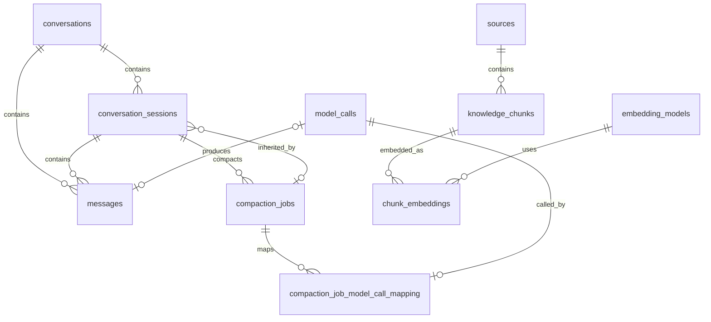

# CleoDoc 数据库设计

> 当前基线：完整 Schema v12
>
> 实现：`packages/database`，每个 Project 使用 `.cleo/project.sqlite`
> 会话算法见[会话压缩设计](./SESSION_COMPACTION_DESIGN.md)，检索算法见[本地 RAG 设计](./LOCAL_RAG_INGESTION_DESIGN.md)。

## 1. 数据库职责

SQLite 保存两类数据：

- **不可丢失的项目运行数据**：Conversation、Session、Message、CompactionJob 摘要、项目指令 Revision 和 ModelCall 审计。
- **可重建的知识投影**：Source 状态、Chunk、FTS 和 Embedding。

正文、资料原件和可移植 Source 元数据仍保存在项目文件中。数据库损坏不能导致原始作品或资料丢失；索引可以从事实源重建。

普通检索不持久化 Query、候选、排除项或 `RetrievalContext`。实际发给模型的检索结果保存在对应的版本化 Tool Result Message 中。

## 2. 连接与事务

- 使用 Node.js `node:sqlite`。
- 打开连接后启用 `foreign_keys`、WAL 和配置的 `busy_timeout`。
- 同一项目写入通过单写入队列串行化。
- Provider 调用、文档解析、Tokenize、Embedding 和 Diff 不在写事务中运行。
- 文件先安全写入事实源，再以短事务更新数据库投影。
- `sqlite-vec` 扩展只由 `SqliteVectorIndex` 在首次使用时短暂允许加载，完成后立即关闭扩展加载。

## 3. Schema 版本

- 新项目直接创建完整 v12，并在 `schema_migrations` 记录 v12。
- 完整 v8 项目按 v8→v9→v10→v11→v12 升级；完整 v9 项目按 v9→v10→v11→v12 升级；完整 v10 项目按 v10→v11→v12 升级；完整 v11 项目按 v11→v12 升级。
- v7 及更早、无可信版本但已有业务表、缺少完整基线结构或高于 v12 的数据库均拒绝打开，不自动修复或删除。
- v8→v9 增加资料索引、语言、Chunk、FTS 和 Embedding 结构，并删除当时已废弃的 Source 字段；v9→v10 增加资料 title 唯一索引。
- v9→v10 发现已有同名 title 时明确失败，不自动改名、合并或覆盖。
- v10→v11 移除 Conversation、Generation 和 CompactionJob 中重复的 Provider/模型身份，并将 `session_summaries` 合并进 `compaction_jobs.summary`；迁移保留消息、Session、摘要和 ModelCall 映射。
- v11→v12 删除重复保存聊天正文的 `generations` 和仅服务于该表的 `generation_model_call_mapping`；Message、ModelCall 和压缩调用映射保持不变。

这些升级是当前发行物必须支持的兼容路径，不再保留更早开发期迁移。

## 4. 关系概览

## 5. 字段字典

### 5.1 `schema_migrations`

| 字段 | 类型 | 约束 | 说明 |
| --- | --- | --- | --- |
| `version` | INTEGER | 主键 | 已应用的 Schema 版本 |
| `applied_at` | TEXT | 非空 | ISO 8601 应用时间 |

### 5.2 `conversations`

一个 Project 内一次用户可见的独立对话目标。

| 字段 | 类型 | 约束 | 说明 |
| --- | --- | --- | --- |
| `id` | TEXT | 主键 | Conversation UUID |
| `project_id` | TEXT | 非空 | 所属 Project；数据库仍显式保存以进行边界校验 |
| `title` | TEXT | 可空 | 用户可见标题 |
| `created_at` | TEXT | 非空 | 创建时间 |
| `updated_at` | TEXT | 非空 | 最近活动时间 |

索引逻辑由 Repository 按更新时间列出最近对话。

Conversation 只表示连续的用户对话，不绑定 Provider 或模型。用户切换当前 Provider、模型或参数后，可直接在任意已有 Conversation 中继续发送。

### 5.3 `conversation_sessions`

Conversation 内一次有限上下文。一个 Conversation 最多有一个 `active` 或 `compacting` Session。

| 字段 | 类型 | 约束 | 说明 |
| --- | --- | --- | --- |
| `id` | TEXT | 主键 | Session UUID |
| `conversation_id` | TEXT | 外键、非空 | 所属 Conversation，级联删除 |
| `ordinal` | INTEGER | 非空、正数 | Conversation 内从 1 开始的顺序，与 Conversation 联合唯一 |
| `status` | TEXT | 枚举 | `active`、`compacting`、`closed` |
| `trigger` | TEXT | 枚举 | `conversation_started`、`automatic`、`manual`；表示该 Session 如何创建 |
| `system_prompt_snapshot` | TEXT | 非空 | Session 创建时的 System Prompt 快照 |
| `inherited_compaction_job_id` | TEXT | 可空外键、删除置空 | 新 Session 继承的已完成 CompactionJob；其 `summary` 是累计摘要 |
| `estimated_input_tokens` | INTEGER | 非空、默认 0 | 最近一次本地估算 |
| `actual_input_tokens` | INTEGER | 可空 | Provider 最近报告的真实输入 Token |
| `compaction_required` | INTEGER | 0/1 | 是否要求压缩 |
| `started_at` | TEXT | 非空 | 开始时间 |
| `closed_at` | TEXT | 可空 | 关闭时间 |

Repository 在同一事务中完成 Job、来源 Session 与新 Session 的状态切换，并校验继承关系属于同一 Conversation。

### 5.4 `messages`

Conversation 的完整不可变消息日志。

| 字段 | 类型 | 约束 | 说明 |
| --- | --- | --- | --- |
| `message_rowid` | INTEGER | 主键 | SQLite/FTS 使用的稳定整数，不向 LLM 暴露 |
| `id` | TEXT | 唯一、非空 | 对外可引用的 Message UUID |
| `conversation_id` | TEXT | 外键、非空 | 所属 Conversation，级联删除 |
| `sequence` | INTEGER | 非空 | Conversation 内严格递增序号，与 Conversation 联合唯一 |
| `role` | TEXT | 枚举 | `system`、`user`、`assistant`、`tool` |
| `content` | TEXT | 非空 | 用户、Assistant 或 Tool 的最终内容 |
| `reasoning_content` | TEXT | 可空 | Provider 返回的 Reasoning；不进入 FTS、压缩或普通历史上下文 |
| `name` | TEXT | 可空 | Tool 消息名称 |
| `tool_call_id` | TEXT | 可空 | Provider Tool Call 关联标识 |
| `tool_calls_json` | TEXT | 可空 | Assistant Tool Call 列表 |
| `created_at` | TEXT | 非空 | 创建时间 |
| `session_id` | TEXT | 外键、非空 | 所属 Session，级联删除 |
| `model_call_id` | TEXT | 唯一、可空外键 | 直接产生该 Assistant Message 的 ModelCall |

`messages_immutable_update` Trigger 拒绝所有 UPDATE。需要更正时只能追加新 Message，不能改写历史。

Message 是聊天内容和 Tool 调用协议的唯一事实来源。Assistant 的 `tool_calls_json` 保存调用 ID、名称和参数，随后每条 `role = 'tool'` 的 Message 使用 `tool_call_id` 保存对应执行结果。Tool 定义、临时审批状态和 Provider 原始流数据不作为聊天消息持久化。

Desktop 当前对话视图首次打开时按 `sequence DESC` 在数据库层直接读取最近 20 条 `user`/`assistant` 可见消息，再恢复为正序展示。System、Tool 以及同时缺少 Content 和 Reasoning 的空 Assistant 消息不计入该窗口；查询前必须验证 Conversation 属于当前活动 Project。20 只是首次加载数量，不是界面列表上限；后续发送直接追加本轮落库的 User/Assistant 消息，不重新查询或截断当前列表。该读取不改变完整不可变消息日志的存储语义，用户可从该视图继续向同一 Conversation 写入消息。

### 5.5 `model_calls`

与业务无关的一次 Provider API 请求审计，不保存 Content 或 Reasoning。

| 字段 | 类型 | 约束 | 说明 |
| --- | --- | --- | --- |
| `id` | TEXT | 主键 | ModelCall UUID |
| `provider_id` | TEXT | 非空 | Provider |
| `model` | TEXT | 非空 | 模型 |
| `request_options_json` | TEXT | 非空 | Thinking、JSON Mode、最大输出等当次请求选项 |
| `status` | TEXT | 枚举 | `running`、`completed`、`cancelled`、`failed` |
| `finish_reason` | TEXT | 可空 | Provider 结束原因 |
| `error_code` | TEXT | 可空 | 统一错误码 |
| `prompt_tokens` | INTEGER | 可空、非负 | 输入 Token |
| `completion_tokens` | INTEGER | 可空、非负 | 输出 Token |
| `reasoning_tokens` | INTEGER | 可空、非负 | Reasoning Token |
| `total_tokens` | INTEGER | 可空、非负 | 总 Token |
| `created_at` | TEXT | 非空 | 请求创建时间 |
| `completed_at` | TEXT | 可空 | 请求结束时间 |

`model_calls` 不保存 `conversation_id` 或其他聊天业务字段。成功产生 Assistant Message 时，由 `messages.model_call_id` 单向引用对应调用；失败或取消且没有完整业务消息的 ModelCall 可以保持无业务关联。

### 5.6 `compaction_jobs`

一次可恢复的上下文压缩编排任务。

| 字段 | 类型 | 约束 | 说明 |
| --- | --- | --- | --- |
| `id` | TEXT | 主键 | Job UUID |
| `source_session_id` | TEXT | 外键、非空 | 来源 Session |
| `status` | TEXT | 枚举 | `pending`、`running`、`validating`、`completed`、`failed`、`cancelled` |
| `trigger` | TEXT | 非空 | 自动或手动等业务触发来源 |
| `prompt_version` | TEXT | 非空 | 冻结 Prompt 版本 |
| `first_message_id` | TEXT | 非空 | 冻结消息边界起点 |
| `last_message_id` | TEXT | 非空 | 冻结消息边界终点 |
| `orchestration_config_json` | TEXT | 非空 | 分段比例、预算和编排配置；不复制 ModelCall 请求选项 |
| `summary` | TEXT | 可空 | 成功采用的累计 Markdown 摘要；仅 `completed` 状态非空 |
| `error_code` | TEXT | 可空 | 最终错误码 |
| `created_at` | TEXT | 非空 | 创建时间 |
| `completed_at` | TEXT | 可空 | 结束时间 |

CompactionJob 不保存 Provider、模型或聚合用量；实际调用身份和参数保存在关联的 `model_calls` 中。失败 Job 不保存摘要，完成 Job 本身就是摘要身份。

### 5.7 `compaction_job_model_call_mapping`

| 字段 | 类型 | 约束 | 说明 |
| --- | --- | --- | --- |
| `compaction_job_id` | TEXT | 外键、联合主键 | 所属 Job，级联删除 |
| `model_call_id` | TEXT | 唯一外键、联合主键 | ModelCall，级联删除 |
| `ordinal` | INTEGER | 正数、与 Job 联合唯一 | Job 内调用顺序 |
| `phase` | TEXT | 枚举 | `primary`、`segment`、`reduce` |
| `segment_index` | INTEGER | 可空、非负 | Segment 阶段序号 |

### 5.8 `project_instruction_revisions`

项目指令的追加式事实源；当前内容为最大 Revision 行。

| 字段 | 类型 | 约束 | 说明 |
| --- | --- | --- | --- |
| `revision` | INTEGER | 自增主键 | 单项目内 Revision |
| `content` | TEXT | 非空 | 该版本完整项目指令 |
| `content_hash` | TEXT | 非空 | 内部去重和并发检查，不向 LLM 返回 |
| `created_at` | TEXT | 非空 | 创建时间 |

追加、整体替换或恢复旧内容都会插入新 Revision；不会修改旧行。作品项目中的 `AGENTS.md`/`agents.md` 不被读取、导入或合并。

### 5.9 `sources`

导入资料的当前数据库投影。一项目一数据库，因此 title 唯一索引等价于项目内唯一。

| 字段 | 类型 | 约束 | 说明 |
| --- | --- | --- | --- |
| `id` | TEXT | 主键 | 内部 Source UUID，不向 LLM 暴露 |
| `project_id` | TEXT | 非空 | 所属项目 |
| `source_type` | TEXT | 固定 `material` | 当前只索引资料 |
| `origin` | TEXT | `file` / `paste` | 来源方式 |
| `format` | TEXT | `text` / `markdown` | 保留的资料格式 |
| `title` | TEXT | 非空、唯一索引 | 用户可见资料名，也是 RAG Tool 选择资料的公开标识 |
| `original_file_name` | TEXT | 可空 | 文件导入时去除首尾空白后的原文件名 |
| `languages_json` | TEXT | 非空、默认 `["zh"]` | 有序语言列表；当前第一项为主语言 |
| `relative_path` | TEXT | 非空、唯一 | 项目内资料路径 |
| `content_hash` | TEXT | 非空、唯一 | 规范化 UTF-8 原件 SHA-256 |
| `size` | INTEGER | 非空、非负 | UTF-8 字节数 |
| `parser_version` | TEXT | 可空 | 当前解析器版本 |
| `chunker_version` | TEXT | 可空 | 当前切片器版本 |
| `chunking_config_json` | TEXT | 可空 | 影响 Chunk 的有效配置快照 |
| `index_status` | TEXT | 枚举 | `pending`、`ready`、`stale`、`failed` |
| `index_error_code` | TEXT | 可空 | 最近索引错误码 |
| `indexed_at` | TEXT | 可空 | 当前有效索引完成时间 |
| `created_at` | TEXT | 非空 | 创建时间 |
| `updated_at` | TEXT | 非空 | 最近元数据更新时间 |

资料重命名只修改 title 及事实元数据，不修改 `relative_path` 或原文件名。相同 Content Hash 拒绝重复导入。

### 5.10 `knowledge_chunks`

资料的纯文本 Chunk；不保存 CDM 标签或标题路径。

| 字段 | 类型 | 约束 | 说明 |
| --- | --- | --- | --- |
| `chunk_rowid` | INTEGER | 主键 | SQLite/FTS/向量内部行号 |
| `chunk_id` | TEXT | 非空、唯一 | 稳定公开 Chunk ID，可供 RAG Tool 二次读取 |
| `source_id` | TEXT | 外键、非空 | 所属 Source，级联删除 |
| `ordinal` | INTEGER | 非空、非负 | Source 内顺序，与 Source 联合唯一 |
| `content` | TEXT | 非空、非空字符串 | 纯文本内容 |
| `content_hash` | TEXT | 非空 | 当前 Chunk 内容 Hash |
| `start_offset` | INTEGER | 非空、非负 | 项目内 UTF-8 资料副本的起始字节偏移 |
| `end_offset` | INTEGER | 非空、大于起点 | 结束字节偏移，半开区间 |
| `chunker_version` | TEXT | 非空 | 生成算法版本 |
| `created_at` | TEXT | 非空 | 创建时间 |

`chunk_id` 当前视为稳定引用。资料更新并重新切片时如何继承旧 ID 仍待确定，不能静默让旧 ID 指向另一段内容。

### 5.11 `embedding_models`

| 字段 | 类型 | 约束 | 说明 |
| --- | --- | --- | --- |
| `embedding_model_rowid` | INTEGER | 主键 | 数据库内部模型行号 |
| `model_name` | TEXT | 非空 | 模型名称 |
| `revision` | TEXT | 非空 | 模型 Revision；与名称联合唯一 |
| `created_at` | TEXT | 非空 | 首次登记时间 |

推理后端、GPU、维度和距离度量不属于模型身份，不写入本表。

### 5.12 `chunk_embeddings`

| 字段 | 类型 | 约束 | 说明 |
| --- | --- | --- | --- |
| `embedding_model_rowid` | INTEGER | 外键、联合主键 | Embedding 模型，级联删除 |
| `chunk_rowid` | INTEGER | 外键、联合主键 | Chunk，级联删除 |
| `content_hash` | TEXT | 非空 | 生成向量时的 Chunk Hash，用于拒绝陈旧写回 |
| `embedding` | BLOB | 非空、长度为 4 的倍数 | 归一化 Float32 Little-Endian 向量；维度由 BLOB 长度决定 |
| `created_at` | TEXT | 非空 | 生成时间 |

同一 Chunk 可以保存不同模型的多套向量。查询向量必须经过相同 Normalize 与 Little-Endian 转换。

## 6. FTS5

### 6.1 Conversation 历史 FTS

`searchable_conversation_messages` View 只暴露 `user` 与 `assistant` 的 `message_rowid, content`。`conversation_message_fts` 使用 External Content 模式和 trigram Tokenizer：

- FTS 不复制持久化 Content，读取时回到 View/Message。
- Reasoning、System、Tool Result 不进入历史全文索引。
- Insert/Delete Trigger 与 Message 同步；Message 禁止 UPDATE，因此没有更新 Trigger。
- 查询先按当前 Conversation 过滤，再只返回已关闭 Session 的结果。

`conversation_message_fts_data`、`_idx`、`_docsize`、`_config` 是 SQLite 自动创建的影子表，不是 CleoDoc 业务表，不应手工读写或删除。

### 6.2 资料 FTS

`knowledge_chunk_fts` 以 `knowledge_chunks.content` 为 External Content，使用 trigram Tokenizer。Insert/Delete/Content Update Trigger 维护索引。Source 删除级联删除 Chunk，并触发 FTS 删除；索引损坏可执行重建。

## 7. 主要索引与约束

| 名称 | 字段/条件 | 目的 |
| --- | --- | --- |
| `sources_title_unique` | `sources.title` | 单项目资料名唯一 |
| `sources_project_updated` | `project_id, updated_at DESC` | 资料列表 |
| `sources_project_content_hash` | `project_id, content_hash` | 内容去重 |
| `knowledge_chunks_source_rowid` | `source_id, chunk_rowid` | Source 内顺序读取与删除 |
| `chunk_embeddings_chunk_rowid` | `chunk_rowid` | Chunk 向量清理与检查 |
| `conversation_sessions_one_active` | Conversation 且状态 active/compacting | 每个 Conversation 至多一个当前 Session |
| `messages_session_sequence` | `session_id, sequence` | 当前 Session 组装 |
| `messages_conversation_rowid` | `conversation_id, message_rowid` | Conversation FTS 回查 |

## 8. Repository 不变量

- Conversation 创建时同时创建 ordinal 1 的 active Session。
- Message Sequence 在 Conversation 内递增，写入后不可修改。
- Session 压缩提交使用单事务：保存 Summary、关闭来源 Session、创建继承 Summary 的新 Session、完成 Job。
- 启动恢复时未完成 CompactionJob 标记失败，来源 Session 恢复 active。
- 项目指令所有变更都追加 Revision；模型不接收内部 Revision 或 Hash。
- Chunk 集合在事务外生成，写入时校验 Source Hash、字节长度、范围和顺序。
- Embedding 写回校验模型、Chunk 存在性和 Content Hash；陈旧结果拒绝写入。
- 删除 Source 后不得留下可检索的 Chunk、FTS 或向量。

## 9. 待确认问题

1. v0.2 是否在项目打开时自动执行 `quickCheck()`，以及损坏后的备份、只读打开和重建 UX。
2. 摘要消息边界是否在正式发布后增加数据库外键；当前业务流程保证其完整性。
3. 资料更新重新切片时 Chunk ID 的继承与正式文档引用迁移。
4. v0.3 知识图、AgentJob、ChangeSet、Checkpoint、Git Revision 和 Diff 缓存的最终表结构。
5. 查询辅助索引是否需要调整，必须以真实项目 P50/P95 数据为依据。
