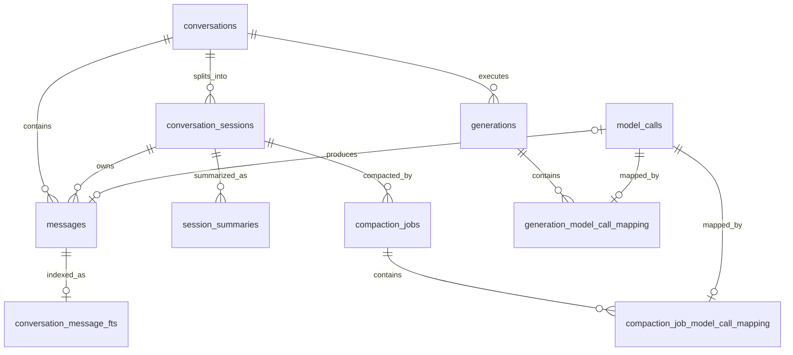
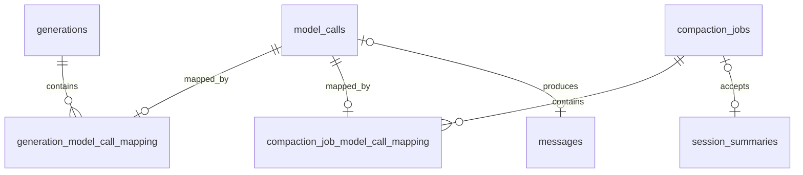

# CleoDoc 数据库设计与当前实现

> 状态：v0.1 migration v6 现状基线；第 15、17、18 章已实现，第 16 章为已确认但尚未实施的设计
> 审计日期：2026-08-02
> Schema 来源：`packages/database/src/migrations.ts`
> 相关文档：[技术架构](./TECHNICAL_ARCHITECTURE.md) · [会话压缩设计](./SESSION_COMPACTION_DESIGN.md) · [开发计划](./DEVELOPMENT_PLAN.md)

## 1. 文档目的与边界

本文记录 CleoDoc 当前已经实现并可在项目 `project.sqlite` 中观察到的数据库结构，用于后续数据库设计评审、migration 设计和实现验收。

本文严格区分：

- **当前实现**：migration v1–v6 已经创建的表、索引、Trigger 和 Repository 行为。
- **后续规划**：技术架构中规划但尚未实现的文档 Chunk、Embedding、RAG、ContextManifest、知识图、版本和 ChangeSet 数据结构。
- **实例审计**：2026-08-02 对 `TestNovel.cleo` 的一次只读检查，只用于验证 Schema 和一致性，不作为固定产品数据。

当前数据库主要是“CLI 会话运行数据库”，已经覆盖会话、模型生成、资料元数据投影、Session 压缩和历史回查；它还不是完整的作品知识数据库。

## 2. 数据所有权与可恢复性

```text
作品正文、资料正文、资料元数据
└─ Markdown / JSON / 原始文件是事实源
   └─ sources 是可重建 SQLite 投影

Conversation、Message、Generation、Session、压缩任务
└─ project.sqlite 是当前唯一完整事实源

conversation_message_fts 及影子表
└─ messages 的可重建全文检索投影
```

| 数据类别 | 当前载体 | 可否从项目文件重建 |
|---|---|---|
| 正文与资料 | Markdown、JSON、原始资料文件 | 是 |
| 资料元数据投影 | `sources` | 是 |
| 完整聊天历史 | `conversations`、`messages` | 否 |
| 模型调用和保存审计 | `generations`、`model_calls` 及业务映射表 | 否 |
| Session 与压缩运行状态 | `conversation_sessions`、`session_summaries`、`compaction_jobs` | 不能完整重建 |
| 历史消息全文索引 | `conversation_message_fts*` | 是，可从 `messages` 重建 |

因此不能把整个 `project.sqlite` 都视为可随时删除的缓存。只有明确标记为投影或索引的部分可以重建。

## 3. 当前关系模型



逻辑上还有以下关联，但当前 Schema 没有外键：

- `conversation_sessions.inherited_summary_id → session_summaries.id`
- `compaction_jobs.previous_summary_id → session_summaries.id`
- `compaction_jobs.summary_id → session_summaries.id`
- 摘要及压缩任务的 `first_message_id/last_message_id → messages.id`
- `messages.tool_call_id` 与 Assistant 消息 `tool_calls_json` 中的 Tool Call ID
- Generation 与 Assistant Message 通过映射到同一个最终 ModelCall 间接关联；Generation 和 Message 的重复正文仍待后续单独处理

## 4. 连接、事务与迁移

每个作品使用独立的 `.cleo/project.sqlite`。当前 `ProjectDatabase` 使用 Node.js 内置 `node:sqlite` 的单个 `DatabaseSync` 连接。

启动配置：

```sql
PRAGMA foreign_keys = ON;
PRAGMA journal_mode = WAL;
PRAGMA synchronous = FULL;
PRAGMA busy_timeout = 5000;
```

当前行为：

- 同一个 `ProjectDatabase` 实例内通过 Promise FIFO 队列串行写入。
- 多语句业务更新使用 `BEGIN IMMEDIATE`、`COMMIT` 和失败回滚。
- 每个 migration 在独立的 `BEGIN IMMEDIATE` 事务中执行。
- migration 版本保存在 `schema_migrations`，当前没有使用 `PRAGMA user_version`。
- 已有项目存在待执行 migration 时，先执行 WAL 完整 checkpoint，并在 `.cleo/backups/` 创建 `pre-migration-v<版本>-<时间>.sqlite`；全新空数据库不创建无意义备份。
- migration v5 除 SQL DDL 外还使用同一事务内的确定性 TypeScript 转换函数，将旧结构化摘要渲染为 Markdown；转换不调用 LLM。
- migration v6 重建 `messages`，保留旧隐式 rowid 为稳定 `message_rowid`，增加 Reasoning/ModelCall 字段，并从 Message 完整重建 External Content FTS；迁移不调用 LLM。
- 关闭数据库前等待写队列并执行 `wal_checkpoint(TRUNCATE)`。
- `quickCheck()` 已实现，但项目打开时尚未自动调用。
- `backup()` 当前执行完整 checkpoint 后复制主数据库文件，尚未使用 SQLite Backup API 或 `VACUUM INTO`。
- FIFO 只约束当前进程和当前实例；多个进程同时打开同一项目时仍依赖 SQLite 文件锁和 `busy_timeout`。

## 5. Schema 演进

| Migration | 当前内容 |
|---|---|
| v1 | `conversations`、`messages`、`generations` 及基础索引 |
| v2 | 为 `messages` 增加 `tool_calls_json` |
| v3 | 增加资料元数据投影 `sources` |
| v4 | 增加 Session、压缩摘要、压缩任务、`messages.session_id` 和会话历史 FTS5 |
| v5 | 将 `session_summaries` 迁移为单一 Markdown `summary`，确定性转换旧摘要并增加查询索引 |
| v6 | 增加 ModelCall 审计与业务映射；重建不可变 `messages`；增加 Reasoning；压缩配置改名；历史 FTS 改为 External Content |

## 6. 表与字段字典

### 6.1 类型约定

- 业务 ID 使用 `TEXT`，由应用层生成 UUID；legacy Session 可使用 `legacy-<conversation-id>`。`messages.message_rowid` 是仅供 SQLite/FTS 使用的稳定整数存储主键。
- 时间使用 ISO 8601 UTC 字符串并保存在 `TEXT`。
- 布尔值使用 `INTEGER` 的 `0/1`。
- 枚举使用 `TEXT + CHECK`。
- 结构化数据序列化为 JSON 后保存为 `TEXT`。
- 每项目一个数据库，因此 `project_id` 主要用于归属校验，不引用数据库内的项目表。

### 6.2 `schema_migrations`

记录已经成功提交的 migration。

| 字段 | 类型 | 约束 | 说明 |
|---|---|---|---|
| `version` | INTEGER | 主键 | Migration 版本号 |
| `applied_at` | TEXT | NOT NULL | Migration 成功提交时间 |

### 6.3 `conversations`

用户可见的长期对话。一条 Conversation 可以包含多个内部 Session。

| 字段 | 类型 | 约束 | 说明 |
|---|---|---|---|
| `id` | TEXT | 主键 | Conversation UUID |
| `project_id` | TEXT | NOT NULL | 所属项目 ID，来自项目清单 |
| `provider_id` | TEXT | NOT NULL | 创建 Conversation 时选择的 Provider |
| `model` | TEXT | NOT NULL | 创建 Conversation 时选择的模型 ID |
| `title` | TEXT | 可空 | 用户可见的对话标题 |
| `created_at` | TEXT | NOT NULL | Conversation 创建时间 |
| `updated_at` | TEXT | NOT NULL | 最近增加消息的时间，用于历史列表排序 |

当前 Provider 和模型记录在 Conversation 级别，不允许静默切换。

### 6.4 `messages`

完整会话消息表，是 Conversation 历史的权威事实源。

| 字段 | 类型 | 约束 | 说明 |
|---|---|---|---|
| `message_rowid` | INTEGER | 主键 | SQLite/FTS 内部稳定整数标识，不作为业务 ID 暴露 |
| `id` | TEXT | NOT NULL、UNIQUE | Message UUID，业务层公开标识 |
| `conversation_id` | TEXT | NOT NULL、外键 | 所属 Conversation；删除 Conversation 时级联删除 |
| `sequence` | INTEGER | NOT NULL | 消息在整个 Conversation 内的递增顺序 |
| `role` | TEXT | NOT NULL、CHECK | `system`、`user`、`assistant` 或 `tool` |
| `content` | TEXT | NOT NULL | 消息正文；Tool Result 也保存在此字段 |
| `reasoning_content` | TEXT | 可空 | Provider 返回并允许暴露的 Assistant Reasoning；与最终正文分开保存 |
| `name` | TEXT | 可空 | Tool 消息对应的工具名称等附加信息 |
| `tool_call_id` | TEXT | 可空 | Tool Result 对应的模型 Tool Call ID；不是数据库外键 |
| `created_at` | TEXT | NOT NULL | 消息创建时间 |
| `tool_calls_json` | TEXT | 可空 | Assistant 消息发起的 Tool Call 列表 JSON |
| `session_id` | TEXT | 可空、外键 | 所属内部 Session；删除 Session 时级联删除消息 |
| `model_call_id` | TEXT | 可空、外键、UNIQUE | 直接产生该 Assistant Message 的 ModelCall；User/System/Tool Message 为空 |

约束：

```text
UNIQUE(conversation_id, sequence)
```

`session_id` 在 Schema 中保持可空以兼容 migration；当前正常聊天流程应为消息指定 Session。Message 完成后一次性插入，Repository 不提供修改方法，数据库 `messages_immutable_update` Trigger 也会拒绝任何 UPDATE。纠正历史只能追加新 Message。

### 6.5 `generations`

记录一次主笔 LLM 调用的生命周期、输出、用量和保存状态。

| 字段 | 类型 | 约束 | 说明 |
|---|---|---|---|
| `id` | TEXT | 主键 | Generation UUID |
| `conversation_id` | TEXT | NOT NULL、外键 | 所属 Conversation；删除 Conversation 时级联删除 |
| `provider_id` | TEXT | NOT NULL | 本次调用实际使用的 Provider |
| `model` | TEXT | NOT NULL | 本次调用实际使用的模型 |
| `status` | TEXT | NOT NULL、CHECK | `running`、`completed`、`cancelled` 或 `failed` |
| `content` | TEXT | NOT NULL、默认 `''` | 本次调用已经收集到的模型输出 |
| `usage_json` | TEXT | 可空 | 输入、输出、Reasoning 和总 Token 用量 JSON |
| `error_code` | TEXT | 可空 | 调用失败时的稳定应用错误码 |
| `saved_document_path` | TEXT | 可空 | 用户将本次结果保存到的项目文档路径 |
| `saved_content_hash` | TEXT | 可空 | 保存时的文档内容哈希 |
| `created_at` | TEXT | NOT NULL | Generation 开始时间 |
| `completed_at` | TEXT | 可空 | 完成、失败或取消时间；运行中为空 |

当前 `generations` 表示用户可感知的生成任务，`messages` 表示进入对话上下文的消息。完成的 Generation 正文通常还会写入 Assistant Message，正文重复问题仍存在；migration v6 已通过 `generation_model_call_mapping` 和 `messages.model_call_id` 建立可审计的间接来源关联。

### 6.6 `sources`

资料元数据的 SQLite 投影。资料正文和 `sources/metadata/*.json` 是可移植事实源。

| 字段 | 类型 | 约束 | 说明 |
|---|---|---|---|
| `id` | TEXT | 主键 | KnowledgeSource UUID |
| `project_id` | TEXT | NOT NULL | 所属项目 ID |
| `source_type` | TEXT | NOT NULL、CHECK | 当前只允许 `material` |
| `origin` | TEXT | NOT NULL、CHECK | `file` 或 `paste` |
| `format` | TEXT | NOT NULL、CHECK | 当前只允许 `text` 或 `markdown` |
| `title` | TEXT | NOT NULL | 用户可见的资料标题 |
| `source_label` | TEXT | 可空 | 书名、访谈对象、网站等来源说明 |
| `original_file_name` | TEXT | 可空 | 导入前的原始文件名 |
| `tags_json` | TEXT | NOT NULL | 标签字符串数组 JSON |
| `relative_path` | TEXT | NOT NULL、UNIQUE | 资料正文在项目中的相对路径 |
| `content_hash` | TEXT | NOT NULL、UNIQUE | SHA-256 内容哈希，用于去重和变化检测 |
| `size` | INTEGER | NOT NULL、非负 | 资料正文 UTF-8 字节数 |
| `created_at` | TEXT | NOT NULL | 资料首次加入时间 |
| `updated_at` | TEXT | NOT NULL | 资料内容或元数据最近更新时间 |

`MaterialService` 打开项目时会从文件事实源校准该表，因此它可以重建。

### 6.7 `conversation_sessions`

Conversation 内部的上下文分段。用户通常不直接感知 Session。

| 字段 | 类型 | 约束 | 说明 |
|---|---|---|---|
| `id` | TEXT | 主键 | Session UUID；迁移旧对话时可能为 legacy ID |
| `conversation_id` | TEXT | NOT NULL、外键 | 所属 Conversation；删除 Conversation 时级联删除 |
| `ordinal` | INTEGER | NOT NULL、`> 0` | Session 在 Conversation 内的顺序，从 1 开始 |
| `status` | TEXT | NOT NULL、CHECK | `active`、`compacting` 或 `closed` |
| `trigger` | TEXT | NOT NULL、CHECK | 创建当前 Session 的原因，见下文 |
| `system_prompt_snapshot` | TEXT | NOT NULL | 当前 Session 使用的 CleoDoc System Prompt 快照 |
| `project_instructions_path` | TEXT | 可空 | 项目 `AGENTS.md` 或 `agents.md` 的路径 |
| `project_instructions_snapshot` | TEXT | 可空 | Session 启动时读取的项目指令完整快照 |
| `project_instructions_hash` | TEXT | 可空 | 项目指令快照内容哈希 |
| `project_instructions_loaded_at` | TEXT | NOT NULL | 项目指令读取时间 |
| `inherited_summary_id` | TEXT | 可空 | 新 Session 继承的累计摘要 ID；当前没有外键 |
| `estimated_input_tokens` | INTEGER | NOT NULL、默认 0 | 最近一次本地估算的上下文输入 Token |
| `actual_input_tokens` | INTEGER | 可空 | Provider 最近报告的实际输入 Token |
| `compaction_required` | INTEGER | NOT NULL、0/1 | 是否需要在继续提交前执行压缩 |
| `started_at` | TEXT | NOT NULL | Session 创建时间 |
| `closed_at` | TEXT | 可空 | 压缩成功并关闭 Session 的时间 |

`trigger` 表示“是什么事件创建了当前 Session”，不是“当前 Session 之后会因什么原因被压缩”：

| 值 | 说明 |
|---|---|
| `conversation_started` | 创建 Conversation 时产生的第一个 Session |
| `automatic` | 上一个 Session 达到预算阈值并自动压缩成功后创建 |
| `manual` | 用户手动执行压缩成功后创建 |

约束：

```text
UNIQUE(conversation_id, ordinal)
```

部分唯一索引 `conversation_sessions_one_active` 保证每个 Conversation 最多存在一个 `active` 或 `compacting` Session。

### 6.8 `session_summaries`

保存通过最低完整性校验、最终被采用的累计 Markdown 会话摘要。

| 字段 | 类型 | 约束 | 说明 |
|---|---|---|---|
| `id` | TEXT | 主键 | Summary UUID |
| `conversation_id` | TEXT | NOT NULL、外键 | 所属 Conversation |
| `source_session_id` | TEXT | NOT NULL、外键 | 被压缩的来源 Session |
| `summary` | TEXT | NOT NULL | 实际注入下一个 Session 的 Markdown 累计摘要；只保存一份正文 |
| `first_message_id` | TEXT | NOT NULL | 摘要覆盖的第一条消息 ID；当前不是外键 |
| `last_message_id` | TEXT | NOT NULL | 摘要覆盖的最后一条消息 ID；当前不是外键 |
| `message_count` | INTEGER | NOT NULL、非负 | 摘要覆盖的消息数量 |
| `prompt_version` | TEXT | NOT NULL | 压缩 Prompt 版本；新摘要使用 `session-compaction-v7` |
| `provider_id` | TEXT | NOT NULL | 生成摘要使用的 Provider |
| `model` | TEXT | NOT NULL | 生成摘要使用的模型 |
| `usage_json` | TEXT | 可空 | 当前 CompactionJob 内普通、分段及归并调用的累计 Token 用量 |
| `created_at` | TEXT | NOT NULL | 摘要完成时间 |

索引：

- `session_summaries_conversation_created(conversation_id, created_at DESC)`：读取 Conversation 最新摘要。
- `session_summaries_source_session(source_session_id)`：读取某个已关闭 Session 的摘要。

摘要的首尾 Message ID、数量、Prompt 版本、Provider 和模型来自 CompactionJob 冻结快照，不信任模型输出。`compaction_jobs.summary_id` 和 `conversation_sessions.inherited_summary_id` 继续以逻辑 ID 引用该表。

### 6.9 `compaction_jobs`

记录一次上下文压缩任务的执行状态和审计信息。

| 字段 | 类型 | 约束 | 说明 |
|---|---|---|---|
| `id` | TEXT | 主键 | CompactionJob UUID |
| `conversation_id` | TEXT | NOT NULL、外键 | 所属 Conversation |
| `source_session_id` | TEXT | NOT NULL、外键 | 被压缩的 Session |
| `previous_summary_id` | TEXT | 可空 | 输入任务的上一份累计摘要 ID；当前不是外键 |
| `status` | TEXT | NOT NULL、CHECK | `pending`、`running`、`validating`、`completed`、`failed` 或 `cancelled` |
| `trigger` | TEXT | NOT NULL | 压缩触发原因；当前没有 CHECK |
| `provider_id` | TEXT | NOT NULL | 本次压缩使用的 Provider |
| `model` | TEXT | NOT NULL | 本次压缩使用的模型 |
| `prompt_version` | TEXT | NOT NULL | 压缩 Prompt 版本 |
| `first_message_id` | TEXT | NOT NULL | 输入快照的第一条消息 ID；当前不是外键 |
| `last_message_id` | TEXT | NOT NULL | 输入快照的最后一条消息 ID；当前不是外键 |
| `message_count` | INTEGER | NOT NULL | 输入快照包含的消息数量 |
| `attempt_count` | INTEGER | NOT NULL、默认 0 | 实际发起的 Provider 调用次数，包括分段或修复调用 |
| `orchestration_config_json` | TEXT | NOT NULL | 压缩算法和编排配置 JSON，不重复保存逐次模型请求参数 |
| `usage_json` | TEXT | 可空 | 所有压缩调用累计 Token 用量 |
| `summary_id` | TEXT | 可空 | 成功产生的 Summary ID；当前不是外键 |
| `error_code` | TEXT | 可空 | 失败、取消或中断时的稳定错误码 |
| `created_at` | TEXT | NOT NULL | 压缩任务创建时间 |
| `completed_at` | TEXT | 可空 | 成功、失败或取消时间 |

进程中断后，未完成任务会被标记为 `failed/COMPACTION_INTERRUPTED`，来源 Session 恢复为 `active` 并重新要求压缩。

### 6.10 `conversation_message_fts`

FTS5 虚拟表，用于搜索压缩前的历史消息。

| 字段 | FTS 属性 | 说明 |
|---|---|---|
| `content` | 全文索引、External Content | 使用 trigram tokenizer；原文按 FTS rowid=`messages.message_rowid` 从 `searchable_conversation_messages` 视图读取 |

所有 User/Assistant `content` 写入时都会进入 FTS；Reasoning、System Prompt、项目指令和 Tool Result 不进入索引。Conversation、Session、角色和 Message UUID 不在 FTS 重复保存，查询时通过 `message_rowid` 关联 `messages`，并强制限制当前 Conversation 与已关闭 Session。

## 7. FTS5 内部影子表

以下表由 SQLite 自动创建和维护，不属于 CleoDoc 领域模型，不得由业务代码单独修改或删除。

### 7.1 External Content 模式

migration v6 后不再存在 `conversation_message_fts_content`。原始正文只保存在 `messages.content`；FTS 保留下面列出的倒排索引、文档长度和配置影子表。

### 7.2 `conversation_message_fts_data`

| 字段 | 类型 | 说明 |
|---|---|---|
| `id` | INTEGER | FTS 内部数据块 ID |
| `block` | BLOB | 编码和压缩后的倒排索引数据 |

### 7.3 `conversation_message_fts_idx`

| 字段 | 类型 | 说明 |
|---|---|---|
| `segid` | 无声明类型 | 索引 Segment ID，复合主键第一部分 |
| `term` | 无声明类型 | 词项或词项前缀，复合主键第二部分 |
| `pgno` | 无声明类型 | 对应索引数据页位置 |

### 7.4 `conversation_message_fts_docsize`

| 字段 | 类型 | 说明 |
|---|---|---|
| `id` | INTEGER | 对应 FTS rowid |
| `sz` | BLOB | 各索引列的 Token 数量编码，供 BM25 使用 |

### 7.5 `conversation_message_fts_config`

| 字段 | 类型 | 说明 |
|---|---|---|
| `k` | 无声明类型 | 配置项名称，主键 |
| `v` | 无声明类型 | 配置项值 |

## 8. 自定义索引

| 索引 | 字段 | 当前用途 |
|---|---|---|
| `messages_session_sequence` | `session_id, sequence` | 按 Session 顺序读取消息 |
| `messages_conversation_rowid` | `conversation_id, message_rowid` | Conversation 作用域过滤与 FTS 整数关联 |
| `generations_conversation_created` | `conversation_id, created_at DESC` | 查询 Conversation 的生成记录 |
| `generations_status_created` | `status, created_at DESC` | 查询指定状态的最近 Generation |
| `sources_project_updated` | `project_id, updated_at DESC` | 按更新时间列出项目资料 |
| `sources_project_content_hash` | `project_id, content_hash` | 按项目和内容哈希查询资料 |
| `conversation_sessions_one_active` | `conversation_id`，部分唯一索引 | 保证每个 Conversation 最多一个 active/compacting Session |

SQLite 还会为主键和 UNIQUE 约束创建自动索引。migration v6 已删除与 `UNIQUE(conversation_id, sequence)` 重复的 `messages_conversation_sequence` 普通索引。

## 9. FTS 同步 Trigger

### 9.1 `conversation_message_fts_insert`

在 `messages` 插入 User 或 Assistant 消息后，以 `message_rowid` 和 `content` 同步加入 FTS。

### 9.2 `conversation_message_fts_delete`

在 `messages` 删除 User 或 Assistant 消息后，使用 External Content FTS delete 命令和旧正文删除对应词项。

### 9.3 `messages_immutable_update`

任何 Message UPDATE 都通过 `RAISE(ABORT, ...)` 拒绝。没有 FTS UPDATE Trigger；修改历史必须追加新 Message。

## 10. Repository 行为

### 10.1 Conversation 与 Message

- 创建 Conversation 后按需创建初始 System Message。
- 增加消息时，在 `BEGIN IMMEDIATE` 事务内计算 `MAX(sequence) + 1`。
- `UNIQUE(conversation_id, sequence)` 提供最终并发保护。
- Tool Call 和 Tool Result 与普通消息共用同一消息序列。

### 10.2 Generation

- 请求开始时写入 `running` Generation。
- 请求结束后保存状态、完整输出、Token 用量和错误码。
- 成功结果可以同时加入 Assistant Message。
- `/save` 或 `save-last` 通过 Generation 保存文档路径和内容哈希。

### 10.3 Session 压缩

- 开始压缩时，旧 Session 从 `active` 原子切换到 `compacting`，并创建 CompactionJob。
- 压缩失败时 Job 进入 `failed/cancelled`，旧 Session 恢复为 `active`。
- 压缩成功时在同一事务中：保存 Summary、关闭旧 Session、创建新 Session、完成 Job。
- 新 Session 的 `inherited_summary_id` 指向刚生成的累计摘要。
- 运行时按 active Session 的 `inherited_summary_id` 主键读取摘要，不使用 `created_at` 推测应继承哪一行；摘要缺失或 Conversation 归属不匹配时返回数据库一致性错误。

### 10.4 历史回查

- `searchClosedHistory` 使用 FTS5 trigram、`snippet()` 和 `bm25()`。
- FTS 通过 `message_rowid` 关联 `messages`；查询强制限制当前 `conversation_id` 和已关闭 Session。
- `readClosedHistory` 通过 `messages` 返回指定已关闭 Session 的原始消息。

## 11. 实例一致性审计快照

2026-08-02 对 `TestNovel.cleo` 进行只读审计，未读取或记录消息正文。

健康检查：

- migration v1–v4 均已应用。
- `PRAGMA quick_check` 返回 `ok`。
- 外键违规为 0。
- `messages.session_id` 为空的记录为 0。
- FTS 遗失、孤立或重复 Message ID 均为 0。

当时的数据数量：

| 数据 | 数量 |
|---|---:|
| Conversation | 2 |
| Message | 259 |
| User/Assistant Message | 218 |
| FTS 记录 | 218 |
| Generation | 93 |
| Completed Generation | 86 |
| Failed Generation | 7 |
| Session | 2，均为 active |
| CompactionJob | 8，均失败 |
| SessionSummary | 0 |
| Source | 0 |

8 次压缩失败包括 7 次 `VALIDATION_ERROR` 和 1 次 `PROVIDER_CONTEXT_LIMIT`。失败后没有创建无效摘要，Session 保持 active，符合当前故障恢复设计。

## 12. 当前设计评审结论

### 12.1 中优先级：Generation 与 Message 正文仍重复

实例审计中 Completed Generation 普遍存在内容完全相同的 Assistant Message。migration v6 已通过 Generation→ModelCall 映射与 Message→ModelCall 外键建立来源关联，但两张业务表的正文重复仍待后续单独设计；当前不得直接删除任一事实源字段。

### 12.2 高优先级：数据库健康检查与备份 API 仍低于架构目标

migration v5 已落实已有项目的迁移前 checkpoint 与本地备份，但通用手动备份仍使用主数据库文件复制，尚未切换到 Backup API 或 `VACUUM INTO`，项目打开时也尚未自动执行 `quick_check`。聊天历史和运行审计不能从作品文件重建，因此剩余缺口不能按普通索引缓存处理。

### 12.3 中优先级：部分逻辑引用没有外键

摘要继承、压缩前序摘要、成功摘要以及消息边界只保存文本 ID。应用事务维持了当前一致性，但数据库不能阻止悬空引用。

### 12.4 已解决：压缩审计参数拆分

migration v6 将任务级算法参数保存到 `orchestration_config_json`，逐次 Temperature、Thinking、最大输出、Response Format 和 Tool 设置保存到 `model_calls.request_options_json`，避免任务编排与实际请求参数重复。

### 12.5 已解决：不可变 Message 与 External Content FTS

migration v6 已通过数据库 Trigger 拒绝 Message UPDATE，并把历史 FTS 改为以 `messages.content` 为唯一原文的 External Content 投影。INSERT、级联 DELETE、完整 rebuild 和中文 `snippet()` 已有回归测试。

### 12.6 低优先级：索引重复和查询索引不足

- migration v6 已删除重复的 `messages_conversation_sequence`，并增加 `messages_conversation_rowid`。
- `sources.content_hash` 已全局 UNIQUE，项目组合索引在单项目数据库中收益有限。
- migration v5 已为 `session_summaries` 增加 Conversation/时间与来源 Session 索引；`compaction_jobs` 尚无按 Conversation、Session、状态和时间的辅助索引。

## 13. 尚未实现的后续数据库范围

以下结构只存在于技术架构规划中，本轮数据库现状文档不为它们预先确定最终 Schema：

- 文档、稳定块和 Chunk。
- FTS 资料/正文检索与本地 Embedding。
- Embedding 模型版本和索引代次。
- RetrievalRun、ContextManifest 及证据项。
- 实体、别名、事实、证据、关系、事件、人物状态和叙事线。
- AgentJob、ChangeSet、候选事实和审批。
- Git revision、命名版本和 Diff 缓存。
- 个人资料库及项目显式链接快照。

这些部分将在当前表语义通过审核后另行设计，并通过新的前向 migration 落地。

## 14. 当前待确认的设计语义

进入下一阶段数据库设计前，需要确认：

1. ~~`messages` 是完整会话事实源，FTS 只是可重建索引。~~ 已由 migration v6 的 External Content FTS 落实。
2. Generation 与 Message 已通过 ModelCall 建立来源关联；两者正文是否继续共存仍待后续单独设计。
3. Conversation、Message、Session 和运行审计需要怎样的备份与恢复等级。
4. ~~v0.1 是否继续接受 FTS `_content` 的文本重复，后续再评估 external-content FTS5。~~ 已在第 18 章确认改为 external-content FTS5。
5. ~~是否将消息确立为数据库层不可变事件，还是允许受控修改并同步全文索引。~~ 已在第 18 章确认 Message 是数据库层不可变的追加式历史事件。

## 15. 已实现设计：Reasoning 与模型调用审计

> 实施状态：已由 migration v6、Provider Adapter、ChatService、CompactionService 和 CLI 落地。

### 15.1 设计目标与职责边界

migration v6 已将“业务结果”和“实际 LLM API 调用”分开建模：

- `messages` 保存进入会话历史的消息正文、Assistant Reasoning 和 Tool Call 信息。
- `generations` 继续表示一次用户可感知的主笔生成任务。一个 Generation 可以因为 Tool Loop 发起多次 LLM API 调用。
- `compaction_jobs` 继续表示一次会话压缩任务。分段、归并和修复都属于同一个 Job，但可以发起多次 LLM API 调用。
- `model_calls` 只审计一次真实的 LLM API 请求，不保存响应的 `content` 或 `reasoning_content`。
- 业务对象与 `model_calls` 的一对多关系通过映射表表达，不向通用的 `model_calls` 添加 Generation 或 Compaction 专用字段。



这里的 `compaction_jobs.summary_id` 仍指向该任务最终接受的 `session_summaries`。`session_summaries` 不直接关联 `model_calls`；需要审计时，先由 `compaction_jobs.summary_id` 找到所属任务，再通过 `compaction_job_model_call_mapping` 查询该任务执行过的调用。

当前不精确追踪“哪一次 ModelCall 直接产生了最终摘要”，因此不增加 `is_summary_source` 字段或表。系统只能还原某个压缩任务执行过哪些调用，不能据此断言最终摘要来自其中某一次调用。

### 15.2 `messages` 变更

migration v6 已新增以下字段：

| 字段 | 类型 | 约束 | 说明 |
|---|---|---|---|
| `reasoning_content` | TEXT | 可空 | Provider 返回并允许暴露的 Assistant Reasoning；未启用 Thinking、Provider 不返回或消息不是 Assistant 时为空 |
| `model_call_id` | TEXT | 可空、外键、UNIQUE | 直接产生该 Assistant Message 的一次 `model_calls.id`；User、System 和 Tool Result 消息为空 |

Reasoning 的数据规则：

- `reasoning_content` 与最终回答 `content` 分开保存，不拼接成一段文本。
- Assistant Tool Call 消息也可保存 `reasoning_content`。DeepSeek Tool Loop 的下一次请求必须按 Provider 协议带回该 Assistant 消息的完整 Reasoning。
- 普通历史对话是否重新发送 Reasoning 由 Provider Adapter 决定，不因为数据库保存了 Reasoning 就默认把它注入所有后续请求。
- Reasoning 不进入 `conversation_message_fts`，该索引仍只检索 User/Assistant 的 `content`。
- Reasoning 不进入会话压缩输入，也不写入 `session_summaries`。
- `/save` 等文档保存操作只保存最终 `content`，不把 Reasoning 写入作品文档。

`messages.model_call_id` 是一对一来源引用。失败调用、压缩调用或没有形成会话消息的调用可以不存在对应 Message。

### 15.3 `model_calls`

migration v6 已新增通用模型调用审计表。每一行对应一次实际发往 Provider 的 API 请求，包括 Tool Loop、压缩分段、归并和未来的格式修复请求。

| 字段 | 类型 | 约束 | 说明 |
|---|---|---|---|
| `id` | TEXT | 主键 | ModelCall UUID |
| `provider_id` | TEXT | NOT NULL | 实际调用的 Provider |
| `model` | TEXT | NOT NULL | 实际调用的模型 ID |
| `request_options_json` | TEXT | NOT NULL | 经过脱敏的实际请求选项，不包含 API Key、消息、Prompt、正文或资料原文 |
| `status` | TEXT | NOT NULL、CHECK | `running`、`completed`、`cancelled` 或 `failed` |
| `finish_reason` | TEXT | 可空 | Provider 返回的结束原因，例如 `stop`、`tool_calls` 或 `length` |
| `error_code` | TEXT | 可空 | 失败或取消时的稳定应用错误码 |
| `prompt_tokens` | INTEGER | 可空、非负 | Provider 报告的输入 Token 数 |
| `completion_tokens` | INTEGER | 可空、非负 | Provider 报告的输出 Token 数；具体口径保留 Provider 语义 |
| `reasoning_tokens` | INTEGER | 可空、非负 | Provider 单独报告时的 Reasoning Token 数 |
| `total_tokens` | INTEGER | 可空、非负 | Provider 报告的总 Token 数 |
| `created_at` | TEXT | NOT NULL | 调用记录创建时间 |
| `completed_at` | TEXT | 可空 | 调用完成、失败或取消时间；运行中为空 |

`request_options_json` 至少应在适用时记录：

- Thinking 模式是 `provider_default`、`enabled` 还是 `disabled`。
- `reasoning_effort`。
- 最大输出 Token、Temperature、Response Format。
- 是否启用 Tools，以及 Tool Schema 的版本或哈希。
- 影响 Provider 请求行为的其他非敏感选项。

`model_calls` 不保存 `content`、`reasoning_content`、完整请求消息、System Prompt、资料原文或密钥；原始内容继续由相应业务表或受控 Debug 日志负责。该表也不包含 `generation_id`、`compaction_job_id`、`conversation_id`、`session_id`、调用轮次或压缩阶段等业务字段。

### 15.4 `generation_model_call_mapping`

表示一个 Generation 在 Tool Loop 中使用的全部 ModelCall，并保留业务内顺序。

| 字段 | 类型 | 约束 | 说明 |
|---|---|---|---|
| `generation_id` | TEXT | NOT NULL、外键 | 关联 `generations.id` |
| `model_call_id` | TEXT | NOT NULL、外键、UNIQUE | 关联 `model_calls.id` |
| `ordinal` | INTEGER | NOT NULL、`> 0` | 本次 Generation 内的调用顺序，从 1 开始 |

约束：

```text
PRIMARY KEY(generation_id, model_call_id)
UNIQUE(generation_id, ordinal)
```

一个 Generation 可以映射多个 ModelCall；一条映射中的 ModelCall 在该映射表内只属于一个 Generation。

### 15.5 `compaction_job_model_call_mapping`

表示一个 CompactionJob 的所有分段、归并和修复调用。

| 字段 | 类型 | 约束 | 说明 |
|---|---|---|---|
| `compaction_job_id` | TEXT | NOT NULL、外键 | 关联 `compaction_jobs.id` |
| `model_call_id` | TEXT | NOT NULL、外键、UNIQUE | 关联 `model_calls.id` |
| `ordinal` | INTEGER | NOT NULL、`> 0` | 本次压缩任务内的全局调用顺序，从 1 开始 |
| `phase` | TEXT | NOT NULL、CHECK | `primary`、`segment`、`reduce` 或 `repair` |
| `segment_index` | INTEGER | 可空、非负 | 分段调用的序号；不适用时为空 |

约束：

```text
PRIMARY KEY(compaction_job_id, model_call_id)
UNIQUE(compaction_job_id, ordinal)
```

该表不增加 `is_summary_source`。`ordinal`、`phase` 和 `segment_index` 用于重建编排过程，不表示某次调用就是最终摘要的精确来源。

### 15.6 `compaction_jobs` 与 `session_summaries` 变更

已确认以下调整：

- 保留 `compaction_jobs.summary_id → session_summaries.id` 的现有关系方向。
- 不向 `session_summaries` 添加 `compaction_job_id`。
- 不向 `session_summaries` 添加 `model_call_id`；它只通过 CompactionJob 间接关联模型调用。
- 将 `compaction_jobs.parameters_json` 重命名为 `orchestration_config_json`。
- 删除 `session_summaries.parameters_json`。
- 按第 17 章将复杂结构化摘要改为由 LLM 返回的纯文本 `summary`，并由 CleoDoc 补充确定性元数据。

`orchestration_config_json` 只保存压缩算法和编排配置，例如上下文窗口、触发预算、摘要目标、分段目标、单次最大负载、算法版本、Schema 版本，以及采用单次压缩还是分段归并。Temperature、Thinking、Response Format、最大输出 Token 等实际模型请求参数只写入对应的 `model_calls.request_options_json`。

`session_summaries` 继续只保存成功完成并被采用的最终累计摘要。分段中间摘要当前只存在于任务执行内存中，不单独写入该表。因此当前关系仍是一个 CompactionJob 最多对应一个最终 SessionSummary。

### 15.7 `generations` 的暂定处理

- 本轮不向 `generations` 增加 `reasoning_content`。
- Generation 与 Assistant Message 的 `content` 重复问题留在后续单独设计，不在本次 migration 中改变两者的事实源地位。
- `generations` 的任务级状态和汇总用量是否继续保留，后续需与 `model_calls` 的逐调用用量一起评审；在明确迁移方案前不得直接删除现有字段。

### 15.8 Migration 与实施结果

1. migration v5 已按第 17 章先完成 `session_summaries` 的单一 Markdown 正文迁移。
2. migration v6 一次性重建 `messages`，同时增加 `message_rowid`、`reasoning_content` 和可空且唯一的 `model_call_id`，避免重复迁移聊天历史。
3. migration v6 新建 `model_calls` 及两个业务映射表，并把 `compaction_jobs.parameters_json` 迁移为 `orchestration_config_json`。
4. Provider 层为每次真实请求创建并结束 ModelCall；Generation 和 Compaction 服务分别写入自己的映射表。
5. Tool Loop 将每次 Assistant 响应的 `content`、`reasoning_content` 和 `tool_calls_json` 作为不同字段持久化。
6. 旧数据无法可靠还原逐次 API 调用，因此不伪造历史 `model_calls`；旧 Message 的 Reasoning 和 ModelCall 来源保持为空。

### 15.9 验收要求

- 普通流式回答可以分别持久化 Reasoning 和最终 Content。
- 未开启或未返回 Reasoning 时，`reasoning_content` 合法为空。
- DeepSeek Assistant 发起 Tool Call 后，下一次请求会带回该轮完整 `reasoning_content`，不会因协议缺失收到 HTTP 400。
- Tool Loop 中每一次真实 API 请求都有独立 ModelCall，并按顺序映射到同一个 Generation。
- 分段、归并和修复调用按顺序映射到同一个 CompactionJob。
- `model_calls` 中不存在模型输出正文、Reasoning、Prompt、资料原文或密钥。
- `conversation_message_fts` 和压缩摘要均不包含 Reasoning。
- `session_summaries` 没有直接的 ModelCall 外键，也不提供最终摘要来源调用的虚假精确性。
- 现有 migration v4 项目可以前向升级，聊天消息、摘要和压缩任务不丢失。

## 16. 已确认的下一版设计：数据库原生项目指令

### 16.1 设计结论

项目指令是项目级资源，不属于某个 Conversation 或 Session。CleoDoc 项目采用“一项目目录、一 SQLite 数据库”，因此一个项目只有一份逻辑上的项目指令，不需要项目指令主表、当前版本指针表或 `project_id` 字段。

项目指令不再使用项目根目录下的 `AGENTS.md` 或 `agents.md` 作为事实源。CLI、未来 GUI 和 Agent Tool 均从 SQLite 读取及写入。这里取消的是用户作品项目中的指令文件；CleoDoc 代码仓库自身供编码 Agent 使用的 `AGENTS.md` 不受影响。

为了支持误修改恢复，数据库以追加式完整快照保存项目指令版本。系统不记录某次更新采用了尾部追加、局部替换还是整体替换；所有修改最终都生成一份新的完整内容。

### 16.2 `project_instruction_revisions`

新增一张项目级追加式版本表：

| 字段 | 类型 | 约束 | 说明 |
|---|---|---|---|
| `revision` | INTEGER | 主键、AUTOINCREMENT | 单调递增版本号，同时作为该项目内的 Revision 标识 |
| `content` | TEXT | NOT NULL | 该 Revision 的完整项目指令；允许使用空字符串表示已清空 |
| `content_hash` | TEXT | NOT NULL | 完整内容的 SHA-256，用于校验和比较；不设 UNIQUE，恢复旧内容时允许哈希重复 |
| `created_at` | TEXT | NOT NULL | Revision 创建时间 |

建议 Schema：

```sql
CREATE TABLE project_instruction_revisions (
    revision INTEGER PRIMARY KEY AUTOINCREMENT,
    content TEXT NOT NULL,
    content_hash TEXT NOT NULL,
    created_at TEXT NOT NULL
);
```

当前生效指令始终是版本号最大的一行：

```sql
SELECT revision, content, content_hash, created_at
FROM project_instruction_revisions
ORDER BY revision DESC
LIMIT 1;
```

表为空表示项目尚未设置项目指令，上下文组装时不插入空的指令消息或区块。因为每个项目有独立数据库，该表不保存 `project_id`，也不需要额外的 `current_revision_id`。

### 16.3 更新、并发与恢复语义

所有更新采用相同事务流程：

1. 读取当前完整内容和 `revision`。
2. 按追加、精确文本替换或全量替换请求，在应用层生成新的完整内容。
3. 校验调用方提供的 `expected_revision` 等于数据库当前 Revision。
4. 计算新内容哈希并插入下一条 Revision。

如果 `expected_revision` 已经过期，写入必须失败并要求调用方重新读取，防止 LLM Tool 或 GUI 覆盖用户刚刚完成的修改。单写入队列、短事务和 Revision 唯一性提供最终并发保护。

恢复旧版本时不删除历史，也不把旧 Revision 重新标记为当前版本，而是把旧版本的完整内容复制成一个新的 Revision。例如恢复 Revision 1 后，历史为：

```text
Revision 1 → Revision 2 → Revision 3 → Revision 4（内容来自 Revision 1）
```

因此当前版本仍然可以统一通过最大 Revision 查询，历史不会被改写。

### 16.4 Agent Tool 与权限

提供以下项目级 Tool：

| Tool | 行为 |
|---|---|
| `read_project_instructions` | 返回当前完整内容、Revision、哈希和更新时间 |
| `append_project_instructions` | 在当前内容尾部追加文本并创建新 Revision |
| `replace_project_instruction_text` | 对指定旧文本进行受控替换并创建新 Revision |
| `set_project_instructions` | 使用完整新内容创建新 Revision，包括清空指令 |

三个写 Tool 都必须携带 `expected_revision`，参数经过 Schema 校验。项目指令会改变 Agent 的后续行为，属于高权限写操作；LLM 发起修改时必须先向用户展示变更 Diff，并经过明确批准后才写入数据库。读取操作不需要批准。

Tool 返回新的 Revision、内容哈希和更新时间。数据库不保存 Tool 使用了哪种编辑方式；Tool 名称只决定应用层如何计算新完整内容。

### 16.5 Session 与上下文组装

下一版从 `conversation_sessions` 删除以下 migration v4 字段：

- `project_instructions_path`
- `project_instructions_snapshot`
- `project_instructions_hash`
- `project_instructions_loaded_at`

不增加 Session 到项目指令版本的替代外键。任何需要注入项目指令的主笔或 Agent 模型调用，都在组装请求前读取数据库中的最新 Revision。Tool Loop 修改项目指令并获用户批准后，下一次模型调用即可使用新内容，不必等待上下文压缩或创建新 Session。

上下文顺序固定为：

```text
CleoDoc System Prompt
→ 数据库中的最新项目指令（存在时）
→ 累计 Session 压缩摘要
→ 当前 Session 消息
```

### 16.6 与 ModelCall 的当前边界

本阶段不建立 ModelCall、Generation、Message、ConversationSession 与具体项目指令 Revision 的关联，也不向 `model_calls` 添加项目指令字段。

因此，项目指令发生变化后，当前版本不能精确还原某次历史 ModelCall 使用的是哪一个 Revision。这是已经接受的产品边界。未来如果需要逐调用审计，可以新增独立映射表，不需要修改 `project_instruction_revisions` 的基础结构。

### 16.7 CLI 与未来 GUI

CLI 增加：

```text
/instructions
/instructions history
/instructions restore <revision>
```

- `/instructions` 展示当前完整项目指令、Revision 和更新时间。
- `/instructions history` 展示历史 Revision 列表。
- `/instructions restore` 展示恢复 Diff，用户确认后复制指定版本为新的当前 Revision。

未来 Electron GUI 提供独立的“项目指令”页面。页面每次从数据库读取当前 Revision；用户编辑提交时携带原始 `expected_revision`，成功后创建新 Revision。GUI 不直接读写项目根目录中的指令文件。

### 16.8 旧项目迁移

旧项目可能同时存在 Session 中的 `project_instructions_snapshot` 和项目根目录指令文件，而且两者可能不同。迁移不得静默决定哪一份是当前事实：

- 只有 Session 快照时，可以将当前活动 Session 的快照导入为初始 Revision。
- 文件与当前快照内容一致时，只导入一份初始 Revision。
- 文件与当前快照不同或存在多个互不相同的有效快照时，列出候选内容及哈希，让用户选择或合并后再建立初始 Revision。
- 迁移完成后，CleoDoc 不再自动读取项目 `AGENTS.md` 或 `agents.md`。
- 不自动删除或修改遗留指令文件；由用户确认数据库版本正确后自行归档或删除。

迁移应分阶段执行：先创建 Revision 表并完成应用层内容导入；确认项目已有数据库版本后，再通过后续前向 migration 重建 `conversation_sessions` 并删除旧字段。任何阶段失败都不得丢失原快照或文件内容。

### 16.9 验收要求

- 一个项目数据库只有一条项目指令版本链，当前内容始终由最大 Revision 确定。
- 查询、尾部追加、精确局部替换和全量替换均产生正确的完整新 Revision。
- 恢复旧版本通过新增 Revision 完成，不删除或改写历史。
- 过期 `expected_revision` 无法覆盖较新的用户或 Tool 修改。
- LLM Tool 修改必须经过用户批准，拒绝修改时当前 Revision 不变。
- 新的 Agent 请求按固定顺序注入数据库中的最新项目指令。
- 项目指令不再依赖文件路径，移动、删除或修改遗留 `AGENTS.md` 不会静默改变数据库中的项目指令。
- CLI 可以查看完整当前指令、历史列表并恢复旧版本；未来 GUI 与 CLI 读取同一 Application Service。
- 旧项目完成迁移后不丢失已有 Session、快照或指令文件内容。

## 17. 已实现设计：简化会话摘要

> 实施状态：已由 migration v5 和 `session-compaction-v7` 落地。

### 17.1 设计目标

migration v4 曾要求压缩模型返回包含 16 个必填顶层字段、多个嵌套数组及逐项消息引用的复杂 JSON。即使响应是合法 JSON，也可能因为缺少空数组、消息 ID 抄写错误、消息边界不匹配或额外字段而失败。当前业务代码没有充分消费这些分类字段，因此 migration v5 不再让 LLM 生成数据库记录或确定性元数据。

职责调整为：

- LLM 只生成一段可供新 Session 继续工作的 Markdown 会话摘要。
- CleoDoc 负责生成 ID、Conversation/Session 归属、消息边界、数量、Prompt 版本、Provider、模型、用量和时间。
- `session_summaries` 只保存成功完成并被采用的摘要；失败输出不写入该表。
- 显式 Debug 模式把模型流式响应的完整拼接结果写入本地 Debug 文件，以便定位失败；这不是数据库事实源。

### 17.2 LLM 输出与应用补充字段

LLM 输出不再是 JSON，只返回 Markdown `summary`。推荐使用“当前目标、已确认决定、当前成果、约束与注意事项、未解决问题、下一步、历史回查提示”等标题，但标题缺失只产生质量警告，不造成数据库校验失败。

最终领域对象由 CleoDoc 构造：

```ts
interface SessionSummary {
  id: string;
  conversationId: string;
  sourceSessionId: string;
  summary: string;
  firstMessageId: string;
  lastMessageId: string;
  messageCount: number;
  promptVersion: string;
  providerId: string;
  model: string;
  usage: ModelUsage | null;
  createdAt: string;
}
```

模型不得返回或复制这些确定性字段。特别是 `sourceSessionId`、首尾 Message ID 和 `messageCount` 必须取自 CompactionJob 已冻结的输入快照，不能相信模型输出。

### 17.3 `session_summaries` 目标 Schema

```sql
CREATE TABLE session_summaries (
    id TEXT PRIMARY KEY,
    conversation_id TEXT NOT NULL,
    source_session_id TEXT NOT NULL,
    summary TEXT NOT NULL,
    first_message_id TEXT NOT NULL,
    last_message_id TEXT NOT NULL,
    message_count INTEGER NOT NULL CHECK (message_count >= 0),
    prompt_version TEXT NOT NULL,
    provider_id TEXT NOT NULL,
    model TEXT NOT NULL,
    usage_json TEXT,
    created_at TEXT NOT NULL,
    FOREIGN KEY (conversation_id)
        REFERENCES conversations(id) ON DELETE CASCADE,
    FOREIGN KEY (source_session_id)
        REFERENCES conversation_sessions(id) ON DELETE CASCADE
);
```

相对 migration v4：

- 删除 `content_json`。
- 将 `handoff_text` 的职责收敛为 `summary`，不同时保存两个内容副本。
- 删除已经确认不再需要的 `parameters_json`。
- 删除 `validation_status`；该表只接收已经通过最低文本校验的成功摘要。
- 不增加 `model_call_id` 或 `compaction_job_id`。
- 继续由 `compaction_jobs.summary_id` 指向最终摘要。
- `usage_json` 是否在 ModelCall 逐调用用量落地后继续保留，仍待后续评审；本轮先保留兼容。

### 17.4 最低校验

写入 `session_summaries` 前只执行与安全和完整性直接相关的检查：

- 拼接后的 `summary.trim()` 非空。
- Provider 没有以 `finish_reason = length` 结束。
- 摘要不超过本地配置的安全长度。
- 内容能够作为 UTF-8 文本保存。
- 压缩调用没有返回 Tool Call。

Markdown 标题是否完整属于质量诊断，不是阻断性 Schema 校验。摘要不是作品 Canon，不能因为格式整齐就获得更高权威。

### 17.5 迁移策略

迁移通过新建目标表、转换数据、校验行数和原子替换完成：

1. 对兼容桥已经写入的 `session-compaction-v7` 行，直接保留 `handoff_text` 中的原始 Markdown，不增加标题或重新渲染。
2. 对更早的结构化摘要使用旧版 `content_json` Schema 解析。
3. 将旧版 `conversationObjective`、决定、成果、约束、问题、任务和 `handoffBrief` 按固定 Markdown 模板确定性渲染为 `summary`。
4. 保留原有 ID、Conversation/Session、消息边界、Prompt 版本、Provider、模型、用量和创建时间。
5. 如果历史行无法解析，迁移不得丢弃该行；将原 `handoff_text` 作为兼容摘要；如果兼容文本为空则保留原 `content_json`。
6. 校验新旧行数和外键后，在同一 migration 事务中替换旧表。

执行 migration 前先在 `.cleo/backups/` 创建 checkpoint 后的数据库副本。旧摘要转换不调用 LLM，不改变原始消息，也不伪造逐项引用关系。

### 17.6 Debug 可观测性

Debug 模式必须在每次压缩、分段、归并和重试调用的响应流结束后、执行最低校验之前记录：

- Provider 原始响应块。
- 按 `text-delta` 顺序拼接的完整 `summary`。
- 输出字符数、结束原因和 Token 用量。
- 最低校验失败的具体阶段和错误码。

完整拼接结果可能包含私人对话，只写入项目 `.cleo/logs/` 下的本次进程 UTF-8 Debug 文件，不写终端、不写 `session_summaries`，并继续沿用 Debug 日志的敏感信息警告和 Git 排除规则。

### 17.7 验收要求

- 任意数量和边界的流式 `text-delta` 都能拼接出与 Provider 完整 Content 一致的 `summary`。
- Debug 文件可直接看到真正进入校验的完整拼接结果，无需人工从 SSE 块还原。
- LLM 不再生成 Session ID、Message ID、消息数量或复杂 JSON 分类字段。
- 普通 Markdown 摘要即使缺少推荐标题也可以完成 Session 切换。
- 空响应、截断响应、超长响应和 Tool Call 会阻止创建新 Session，并保留旧 Session 和用户草稿。
- 成功摘要只保存一份正文，不再在 `content_json` 与 `handoff_text` 中重复。
- 旧版复杂摘要能够前向迁移，历史消息和 CompactionJob 关联不丢失。

## 18. 已实现设计：不可变 Message 与 External Content FTS5

> 实施状态：已由 migration v6、Repository 和历史查询 Tool 落地。

### 18.1 设计结论

- `messages` 是完整会话历史的唯一内容事实源。Message 一旦成功写入便不可修改；纠正或补充通过追加新 Message 表达，不覆盖旧记录。
- 为 `messages` 增加稳定的整数存储主键 `message_rowid`。现有 UUID `id` 继续作为业务层 Message ID，并改为 `NOT NULL UNIQUE`。
- `conversation_message_fts` 改为 FTS5 external-content 虚拟表，只维护 `content` 的全文倒排索引，不再独立保存 `message_id`、`session_id`、`conversation_id`、`role` 和原始 `content` 副本。
- FTS 以 `message_rowid` 作为稳定 rowid，查询原文、角色及归属信息时关联回 `messages`。
- Reasoning、System Message 和 Tool Result 不进入历史全文索引；当前只索引 `user` 与 `assistant` 的 `content`。
- 普通历史查询必须限定一个明确的 Conversation。跨 Conversation 查询属于独立、显式的能力，具体 Tool、授权和产品交互仍待后续设计。

### 18.2 `messages` 目标主键与不可变语义

目标表在保留现有业务字段的基础上调整主键：

| 字段 | 类型 | 约束 | 说明 |
|---|---|---|---|
| `message_rowid` | INTEGER | PRIMARY KEY | SQLite 内部稳定整数标识；供 FTS rowid 和高效关联使用，不暴露为业务 Message ID |
| `id` | TEXT | NOT NULL、UNIQUE | Message UUID；继续用于 Tool、领域对象、日志和跨表逻辑引用 |
| `conversation_id` | TEXT | NOT NULL、外键 | 所属 Conversation；也是默认历史检索的强制作用域 |
| `session_id` | TEXT | 可空、外键 | 所属 Session；正常新消息必须具有 Session，保留可空只用于兼容迁移 |
| `sequence` | INTEGER | NOT NULL | Message 在整个 Conversation 内的不可变顺序 |
| `content` | TEXT | NOT NULL | 唯一的消息正文事实源 |

`message_rowid` 使用 SQLite `INTEGER PRIMARY KEY`，不依赖可能在数据库重建操作中变化的隐式 rowid。无需把该内部标识编码进 UUID，也不要求业务接口接受它。

Message 采用完成后一次性落库：流式 `content`、`reasoning_content` 和 Tool Call 数据先在运行时拼接，形成完整 Message 后统一插入。数据库和 Repository 均不提供历史 Message 更新能力。建议增加数据库级 `BEFORE UPDATE` Trigger，使用 `RAISE(ABORT, ...)` 阻止绕过 Repository 的修改。

删除不是“修改历史”的手段。只有删除所属 Conversation、Session、项目数据或执行未来明确设计的数据保留操作时，才允许硬删除 Message；相应 FTS 索引必须在同一事务中清理。

### 18.3 可搜索消息外部内容视图

External Content FTS 的内容源使用过滤视图，而不是直接扫描全部 `messages`：

```sql
CREATE VIEW searchable_conversation_messages AS
SELECT message_rowid, content
FROM messages
WHERE role IN ('user', 'assistant');
```

使用视图有两个目的：

1. FTS `rebuild` 时只重建 User/Assistant 正文，不会把 System Message 或 Tool Result 意外加入索引。
2. FTS 只需要读取稳定整数 ID 和正文；Conversation、Session、角色及时间等元数据继续由 `messages` 统一提供。

### 18.4 `conversation_message_fts` 目标结构

```sql
CREATE VIRTUAL TABLE conversation_message_fts USING fts5(
    content,
    content = 'searchable_conversation_messages',
    content_rowid = 'message_rowid',
    tokenize = 'trigram'
);
```

目标 FTS 只有一个逻辑列：

| 字段 | FTS 属性 | 说明 |
|---|---|---|
| `content` | 全文索引、External Content | 倒排索引的输入文本；原文按 `message_rowid` 从外部内容视图读取 |

External Content 模式消除当前 `conversation_message_fts_content` 对 Message 原文和元数据的第二份存储，但不会也不能消除 FTS 必需的倒排索引、词项、文档长度和配置影子表。`snippet()`、`highlight()` 和 BM25 需要的原文由外部内容视图读取。

不采用 contentless FTS：当前历史 Tool 需要生成命中片段，contentless 模式无法满足原文读取和 `snippet()` 需求。

### 18.5 索引同步与重建

由于 Message 不可修改，FTS 同步只有两条正常路径：

- 插入 User/Assistant Message 后，以 `message_rowid` 和 `content` 写入 FTS。
- 硬删除 User/Assistant Message 时，使用 External Content FTS 的 delete 命令及旧正文删除对应词项。

不创建用于业务更新的 FTS UPDATE Trigger。数据库级 Message 不可变 Trigger 应直接拒绝 UPDATE，而不是尝试同步修改后的正文。

FTS 是可重建投影。索引损坏、Tokenizer 版本变化或迁移校验失败时，可根据 `searchable_conversation_messages` 执行完整 `rebuild`；重建不改变 `messages`，也不生成新的 Message。

### 18.6 Conversation 查询边界与索引

`conversation_id` 不再存入 `conversation_message_fts`。将其保留为 `UNINDEXED` 列不会建立等值检索索引，只会继续复制元数据；将 UUID 作为 trigram 全文列还会污染文本索引。因此 Conversation 隔离通过 `messages` 关联和应用接口共同保证。

普通历史全文查询的目标形式为：

```sql
SELECT
    m.id,
    m.session_id,
    m.role,
    m.sequence,
    m.created_at,
    snippet(conversation_message_fts, 0, '[', ']', '…', 24) AS excerpt,
    bm25(conversation_message_fts) AS rank
FROM conversation_message_fts AS f
JOIN messages AS m
  ON m.message_rowid = f.rowid
JOIN conversation_sessions AS s
  ON s.id = m.session_id
WHERE conversation_message_fts MATCH :query
  AND m.conversation_id = :conversation_id
  AND s.status = 'closed';
```

为关联和作用域过滤增加普通 B-tree 索引：

```sql
CREATE INDEX messages_conversation_rowid
ON messages(conversation_id, message_rowid);
```

该索引用于加速 `messages` 的 Conversation 过滤和整数关联，不宣称对 FTS5 的全文 MATCH 本身进行分区。若未来基准测试证明全项目 FTS 候选过多，应单独设计可测量的检索分区方案，不能通过恢复重复的 `UNINDEXED conversation_id` 冒充分区索引。

Repository/Application Service 必须区分两类入口：

- 默认历史查询：调用方必须传入且只能查询一个 `conversation_id`。
- 跨 Conversation 查询：必须调用独立的显式接口，并明确允许查询的 Conversation 集合；当前具体 Tool、触发条件、权限和结果权威规则仍待后续评审。

不得提供一个通过省略 `conversation_id` 就自动搜索整个项目历史的默认接口。每项目独立数据库已经隔离 Project，但不能替代 Conversation 级的默认隔离。

### 18.7 已实施的前向 Migration

该变更不能通过简单 `ALTER TABLE` 把现有 TEXT 主键变为 `INTEGER PRIMARY KEY`，需要采用建新表、复制、校验和原子替换：

1. migration 前执行 WAL checkpoint 并创建项目数据库备份。
2. 创建具有 `message_rowid INTEGER PRIMARY KEY` 和 `id TEXT NOT NULL UNIQUE` 的新 Message 表，保留全部现有字段、外键和唯一约束。
3. 按确定性顺序复制旧 Message；为每行生成稳定整数 `message_rowid`，保持 UUID、Conversation、Session、Sequence、Content、Reasoning 和 Tool 数据不变。
4. 校验新旧 Message 行数、UUID 集合、内容哈希、Conversation/Session 归属和外键。
5. 重建引用 `messages` 的索引与 Trigger，并原子替换旧表。
6. 创建 `searchable_conversation_messages` 视图和新的 External Content FTS 表。
7. 从过滤视图完整重建 FTS，并校验每条 User/Assistant Message 恰好有一条索引记录，其他角色没有索引记录。
8. 更新 Repository 查询，以 `m.message_rowid = f.rowid` 关联，并将 `snippet()` 的内容列序号从当前 `4` 改为 `0`。
9. 完成 `foreign_key_check`、`quick_check`、固定中文检索样例和跨 Conversation 隔离测试后提交 migration。

Migration 不调用 LLM，不修改 Message 正文，不要求用户删除数据库。任何校验失败都必须回滚并保留迁移前备份。

### 18.8 验收要求

- `messages.content` 是数据库中唯一可直接读取的 Message 正文，不再存在 FTS `_content` 正文副本。
- 所有现有 Message UUID、顺序、正文、Reasoning、Tool 信息和 Session 归属在迁移后保持不变。
- 对任何历史 Message 执行 UPDATE 都会被数据库拒绝；纠正通过新 Message 表达。
- User/Assistant Message 可被搜索，System、Tool 和 Reasoning 不可被该 FTS 命中。
- `snippet()` 和 BM25 在 External Content 模式下保持现有行为。
- 删除 Conversation 或 Session 后，不留下对应 FTS 孤立词项。
- 执行 FTS `rebuild` 后，结果与迁移完成时一致。
- 默认历史查询不返回其他 Conversation 的内容；跨 Conversation 查询不能通过省略作用域隐式触发。
- migration 失败不会损坏或丢失原始聊天历史。
