# CleoDoc 开发计划

> 状态：实施中；v0.1 步骤 1–6d、7.1–7.5 已完成，正在实施本地 Embedding
> 日期：2026-08-09
> 产品需求：[PRD.md](./PRD.md)  
> 技术架构：[TECHNICAL_ARCHITECTURE.md](./TECHNICAL_ARCHITECTURE.md)

## 1. 版本策略

CleoDoc 分为两个连续版本交付：

| 版本 | 目标 | 交互形态 |
|---|---|---|
| v0.1 | 验证 LLM 文档创作、资料管理和本地 RAG 三个核心能力 | CLI |
| v0.2 | 在已验证 Core 上实现完整桌面产品、版本管理和创作工作流 | Electron + React |

v0.1 的核心闭环是：

```text
用户与 LLM 沟通
→ LLM 查询本地资料或正文
→ LLM 生成文档内容
→ 用户将结果保存到项目
→ 后续对话继续使用已保存内容
```

在 v0.1 CLI 通过验收前，不开始 Electron Renderer、React 工作室或 TipTap 编辑器开发。

### 当前实施进度

| 步骤 | 状态 | 已交付 |
| --- | --- | --- |
| 1. 工程与 CLI 骨架 | 已完成 | npm workspaces、TypeScript、CLI、CI、Lint、Format、Vitest |
| 1.5 软件 YAML 配置 | 已完成 | 发行默认配置、操作系统用户配置、逐项回退警告、独立 `state.yaml`、Provider/模型能力与运行参数注入 |
| 2. 项目文件与 SQLite | 已完成 | 项目清单、安全文件写入、SQLite WAL、完整 Schema v9 基线、唯一的 v8→v9 前向迁移、版本校验、写入队列和健康检查 |
| 3. LLM Provider | 已完成 | OpenAI-compatible、Ollama、流式输出、取消、错误分类、`--debug` UTF-8 文件日志、原始请求/响应、Context/协议诊断和 Fake Provider 测试 |
| 4. 生成内容保存 | 已完成 | 对话记录、显式保存、覆盖确认、文档命令和 CLI 端到端测试 |
| 5. 资料管理 | 已完成 | 粘贴/TXT/Markdown 导入、文件与元数据事实源、SQLite 投影、哈希去重、资料 CRUD |
| 5.5 会话上下文管理 | 已完成 | Session 压缩、数据库项目指令注入、历史回查 Tool、分层压缩和可编辑草稿提交门 |
| 5.6 Reasoning 流式体验与调用审计 | 已完成 | Reasoning 实时展示与持久化、DeepSeek Tool Loop 回传、逐次 ModelCall 审计、Session 必填的不可变 Message 和 External Content 历史 FTS |
| 5.7 数据库原生项目指令 | 已完成 | 追加式版本、乐观并发、恢复、受控 Tool、CLI 查看及无文件快照的 Session Schema |
| 5.8 统一 Tool 契约 | 已完成 | 独立 Tool Class、Schema 推导类型、整数版本、Catalog 按需加载、退出前授权、两阶段历史精读和自有压缩投影 |
| 9a. LLM 本地文档 Tool | 已完成 | 项目文档列出/分段读取/确认写入、版本化 Tool 消息持久化、8 轮上限、路径隔离和 CLI 审批 |
| 6a. CDM 最小 Core | 已完成 | 严格 XML、`draft-1` Schema、Node/Mark 校验、10 位 Node ID、基础序列化和树遍历 |
| 6b. TXT/Markdown 资料解析 | 已完成 | UTF-8/GB 系导入、UTF-8 规范化、TXT 逐行成段、临时 CDM、样式展平、CommonMark + GFM 表格、解析警告、Node 原文字节范围及资料导入连接 |
| 8. 混合 RAG | 已完成 | Exact/FTS/Vector、项目/类型/Revision 过滤、RRF、范围去重、来源与字符预算、内存 RetrievalContext、CLI Explain 和固定语料回归 |
| 6c. 资料结构切片预览 | 已完成 | 可配置 Baseline 切片、标题边界、长块自然拆分、短块向上合并、纯文本 ChunkDraft、原文字节范围及单文件 JSON 检查产物 |
| 6d. Chunk 入库与资料 FTS | 已完成 | `knowledge_chunks`、External Content FTS5、索引状态、原子替换、删除级联、重建、中文短词回退及 CLI 状态/检索命令 |
| v0.2-3a. Draft 写入与文本统计 | 未开始 | 设计已确认；等待 Core Tool、统计器、工作 Draft Revision 与 GUI 状态卡片实现 |
| 7. 本地 Embedding 与向量检索 | 已完成 | GGUF、Tokenizer 切片、增量向量、Worker、安全写回、sqlite-vec 精确检索、CLI 诊断恢复、固定语料测试及 CPU/GPU 基准 |
| 9b. LLM 本地 RAG Tool | 已完成 | 资料列表、语言感知混合检索、相邻 Chunk 精读、项目隔离、Catalog 接入、Tool Loop 和压缩投影 |
| 10. CLI 发布 | 进行中 | 快速失败恢复测试和 Windows/macOS/Linux 原生 CLI 打包已完成；待完成手工垂直闭环与最终发布验收 |

## 2. 开发原则

- Core 使用纯 Node.js 和 TypeScript，不依赖 Electron、React、DOM 或浏览器存储。
- CLI 和未来 Electron 共用相同的 Application Service，不为 GUI 重写核心逻辑。
- CDM、领域 JSON 和导入的原始资料是目标项目事实源；当前 CLI 已有 Markdown/TXT 在过渡方案实施前保持不变。SQLite 是知识、检索和运行状态中心。
- v0.1 只实现验证闭环必需的格式、Provider 和检索能力。
- 每个阶段必须满足验收门，不能用未完成的 UI 掩盖核心能力问题。
- 开发与 CI 使用不高于 Electron 内置 Node 的最低兼容基线。

## 3. 代码结构

```text
apps/
├─ cli/                 # v0.1 交互入口
└─ desktop/             # v0.2 Electron 应用

packages/
├─ contracts/           # 公共类型、Zod Schema 和错误码
├─ application/         # 面向 CLI/GUI 的用例服务
├─ project/             # 项目格式、路径和文件读写
├─ database/            # node:sqlite、当前 Schema 基线和 Repository
├─ model-providers/     # OpenAI-compatible、Ollama 等
├─ knowledge/           # 文档、资料和 Chunk
├─ rag/                 # 检索、融合和 RetrievalContext
├─ agent/               # LLM Tool Loop；v0.2 扩展为持久化 AgentJob
├─ versioning/          # v0.2 Git 版本管理
├─ diff/                # v0.2 文档语义 Diff
└─ testing/             # Fixture、RAG 基准和测试工具
```

## 4. v0.1 CLI MVP

### 步骤 1：工程与 CLI 骨架

工作内容：

- 建立 npm workspaces 和 TypeScript 工程。
- 配置 lint、format、Vitest 和跨平台 CI。
- 建立 `apps/cli` 与公共 contracts。
- 实现 CLI 参数解析、错误输出和退出码。
- 建立项目创建、打开和状态检查。

首批命令：

```text
cleo init <directory>
cleo open <directory>
cleo status
cleo config
```

验收：

- 能在任意本地目录创建和重新打开项目。
- 项目可以复制到另一个路径继续使用。
- CLI 错误具有稳定错误码和可理解提示。
- Windows、macOS 和 Linux CI 均通过类型检查和单元测试。

### 步骤 2：项目文件与 SQLite

工作内容：

- 定义 `cleo.project.json`。
- 建立 `manuscript/`、`materials/` 和 `.cleo/`。
- 使用 `node:sqlite` 创建每项目独立数据库。
- 实现当前 Schema 基线、版本兼容判定、唯一写入队列、WAL、备份和 `quick_check`。
- 建立 `ProjectService` 和 `DocumentService`。

项目结构：

```text
MyNovel.cleo/
├─ cleo.project.json
├─ manuscript/
├─ materials/
└─ .cleo/
   ├─ project.sqlite
   ├─ blobs/
   └─ models/
```

验收：

- Markdown 文档可以创建、读取、更新和删除。
- 所有路径限制在项目目录内。
- SQLite 异常不影响已保存的 Markdown。
- 可重建表删除后能够从文件恢复。

### 步骤 3：LLM Provider

工作内容：

- 定义 `ModelProvider`、能力声明和统一错误模型。
- 实现 OpenAI-compatible Provider。
- 实现 Ollama Provider。
- 支持流式输出、取消、结构化 Tool Call 和 Token 用量。
- API Key 从环境变量或当前进程输入读取，不明文持久化。

命令：

```text
cleo provider list
cleo provider test <provider>
cleo chat
```

验收：

- 可以选择并验证 Provider。
- 可以进行多轮流式对话。
- 用户可以取消生成。
- 鉴权、限流、超时和上下文超限具有独立错误类型。
- Provider 故障不会触发静默切换。

### 步骤 4：生成内容保存

工作内容：

- 保存当前对话和最后一次模型响应。
- 支持创建新文档和确认后覆盖已有文档。
- 保存后返回文档 ID、项目相对路径和内容哈希。
- 允许显式读取项目文档加入下一次对话。

命令：

```text
cleo document list
cleo document show <document-id>
cleo document create <path>
cleo document save-last <path>
```

交互命令：

```text
/resume <index-number>
/history
/new
/save manuscript/chapter-001.md
/read manuscript/chapter-001.md
/documents
```

进入聊天时展示最近 5 条记录；`/history` 在交互终端中使用上下键选择、Enter 恢复、`q` 返回聊天。

验收门 A：

- 用户能够与 LLM 多轮沟通。
- 任意一次完整响应可以保存为 Markdown。
- 保存内容可以重新读取并进入后续对话。
- LLM 和 CLI 均不能写出项目目录。

### 步骤 5：资料管理

状态：已完成。资料正文统一为 UTF-8 后保存于 `materials/<id>.txt|md`，元数据保存于 `sources/metadata/<id>.json`，SQLite `sources` 表作为可重建投影。文件导入支持 UTF-8、GB2312、GBK 和 GB18030，单份资料不超过 10 MiB。

工作内容：

- 建立 `MaterialService`。
- 支持粘贴文本、TXT 和 Markdown。
- 保存标题、来源、标签、路径、时间和内容哈希。
- 支持添加、查看、列表、重命名和删除。
- 使用内容哈希检测重复导入。

命令：

```text
cleo material add <file>
cleo material add --stdin
cleo material list
cleo material show <material-id>
cleo material rename <material-id> <title>
cleo material remove <material-id>
```

验收门 B：

- 用户可以完成资料 CRUD。
- 重复导入不会生成重复资料。
- 删除资料后不再进入当前检索。
- 原始文件、资料元数据和 SQLite 投影保持一致。

### 步骤 5.5：会话上下文管理

详细设计：[SESSION_COMPACTION_DESIGN.md](./SESSION_COMPACTION_DESIGN.md)

实施状态：已完成当前范围。当前完整 Schema v9 包含已确定的单一 Markdown `summary`、数据库项目指令 Revision、不可变 Message 和历史 FTS，不再保留旧 Conversation、旧摘要或文件快照的迁移路径。CLI 已提供自动/手动压缩、上下文预算查看、Session 审计和失败重试。历史回查结果进入 Tool Loop；资料检索 `RetrievalContext` 已在步骤 8 以内存值落地，与 ModelCall 的证据审计方案留到步骤 9。

工作内容：

- 在用户可见 Conversation 内建立有边界的内部 Session。
- 在完整 Agent 回合结束后，根据 Token 预算触发独立 LLM 压缩调用。
- 新 Session 按 Core System Prompt、数据库最新项目指令、累计摘要、当前消息的顺序组装上下文。
- 压缩期间允许用户编辑草稿，但 Enter 和发送按钮不能提交；草稿不清空、不排队、不自动发送。
- 建立压缩前历史消息的搜索和精确读取 Tool。
- 将 Tool Result 投影为名称、版本、状态、更新时间、数量和读取范围等白名单元数据，不把文档正文、历史片段、项目指令内容、内部 Hash/Revision 或未知 Tool 原文发送给压缩模型。
- 超大 Session 按完整用户回合分段，以最终 Segment Payload 执行 80% 软装箱和安全输入硬校验；单个超长回合只在安全消息/正文边界降级拆分，Tool Call 与对应结果始终保持原子性。
- 保存摘要引用、模型参数、用量和可恢复 CompactionJob；项目指令独立按 Revision 保存。

验收：

- 达到阈值后不再向主笔发送已关闭 Session 的全部原文。
- 正常压缩只使用一次独立 LLM 调用，并输出通过最低完整性校验的 Markdown 累计摘要。
- 压缩期间用户草稿保持可编辑，完成后必须再次主动提交。
- 新 Session 的上下文顺序稳定为 Core System Prompt、数据库最新项目指令、累计摘要和当前消息，并且可以审计。
- Agent 能按需找回压缩前的具体消息，且不能跨 Conversation 或项目查询。
- Tool Result 原文不会进入压缩 Payload，已知 Tool 只发送完成交接所需的结构化元数据。
- 超大 Session 的每个 Segment 在发送前均通过最终 Payload 硬预算检查；完整用户回合优先保持不拆分，超长正文切分不丢字符，超限 Tool 原子单元不发送。
- 压缩失败、取消或进程退出不会丢失消息和草稿。

### 步骤 5.6：Reasoning 流式体验与模型调用审计

数据库设计：[Message](./DATABASE_DESIGN.md#64-messages)、[ModelCall](./DATABASE_DESIGN.md#612-model_calls)、[Generation 映射](./DATABASE_DESIGN.md#613-generation_model_call_mapping)及[CompactionJob 映射](./DATABASE_DESIGN.md#614-compaction_job_model_call_mapping)

实施状态：已完成。当前完整 Schema v9 包含 Message 整数主键、必填 Session、Reasoning/ModelCall 字段、不可变约束、业务映射表、压缩编排配置和 External Content 历史 FTS；Provider、Agent 与 CLI 已完成 Reasoning 流式解析、展示、持久化和 Tool Loop 回传。压缩 ModelCall 阶段只保留实际使用的 `primary`、`segment` 和 `reduce`。

工作内容：

- 扩展 Provider 流事件，增加独立的 `reasoning-delta`，不得把 Reasoning 拼入最终 `content`。
- OpenAI-compatible Provider 在流式响应中持续解析 `delta.reasoning_content`；Provider 未返回时保持为空。
- CLI 收到第一个 Reasoning 片段后立即显示明确的“思考中”区域；进入 `content` 阶段后切换为“回答”，避免用户把模型思考时间误认为网络延迟。
- 将 Provider 暴露的完整 Reasoning 保存到 Assistant Message 的 `reasoning_content`；最终回答继续保存到 `content`。
- Assistant 发起 Tool Call 时，同时保存该轮 `reasoning_content`、`content` 和 `tool_calls_json`。
- DeepSeek Tool Loop 在追加 Tool Result 并发起下一次模型请求时，带回上一轮 Assistant 消息的完整 `reasoning_content`。该行为由 Provider Adapter 处理，不由通用 Agent 逻辑硬编码 Provider 特例。
- 非 Tool Loop 的普通历史上下文不默认重发 Reasoning；是否需要发送由 Provider 能力与协议决定。
- Reasoning 不加入会话压缩输入、`session_summaries` 或 `conversation_message_fts`，也不通过 `/save` 写入作品文档。
- 上下文预算在 Provider 确实需要重发 Reasoning 的 Tool Loop 请求中计入相应 Token，避免本地预算低估。
- 建立逐次 `model_calls` 审计，并分别通过 Generation 与 CompactionJob 映射表记录 Tool Loop、分段、归并和修复调用；模型输出内容仍由业务表保存。
- 为 Message 增加稳定整数 `message_rowid`，UUID `id` 继续作为业务标识；数据库拒绝历史 Message UPDATE。
- 将 `conversation_message_fts` 改为 External Content FTS，只索引 `messages.content`，不重复保存正文和 Conversation/Session/角色元数据。

CLI 交互示意：

```text
思考中：
模型正在分析人物动机……

回答：
根据已有设定，下一章可以从……
```

这里展示的是 Provider 实际返回并允许暴露的 Reasoning。未启用 Thinking 或 Provider 不提供 Reasoning 时，CLI 直接显示“回答”，不显示空的思考区域。

验收：

- Reasoning 的首个流式片段到达后立即可见，不等待最终 `content` 才统一输出。
- Reasoning 与最终回答在终端中有稳定、清晰的视觉边界，流式输出不会交叉或重复。
- 普通回答、纯 Tool Call、Reasoning 后 Tool Call、Tool Result 后继续回答四类流式响应均可正确解析。
- DeepSeek Tool Loop 的后续请求包含协议要求的完整 `reasoning_content`，并通过集成测试验证请求体。
- 每次真实 LLM API 请求均产生独立 ModelCall；一个 Generation 或 CompactionJob 可以按顺序关联多次调用。
- 重启 CLI 后仍可读取 Assistant Message 的 Reasoning；未返回 Reasoning 的历史消息保持兼容。
- Reasoning 不会进入历史全文检索、会话摘要或保存的作品文档。
- Provider 超时、流中断或解析失败时，已经接收的 Reasoning 可用于本地诊断，但不会被误当作最终生成内容保存。

### 步骤 5.7：数据库原生项目指令

数据库设计：[project_instruction_revisions](./DATABASE_DESIGN.md#611-project_instruction_revisions)

实施状态：已完成。当前完整 Schema v9 包含该 Repository、ContextBuilder、受控 Tool 及 CLI 查看/历史/恢复设计。作品项目中的 `AGENTS.md` 或 `agents.md` 不会被扫描、导入或合并；CleoDoc 代码仓库自身的编码 Agent 指令文件不受影响。Session Schema 不包含文件路径或文件快照字段。

工作内容：

- 新增追加式 `project_instruction_revisions` 表；每个 Revision 保存修改后的完整指令、内容哈希和创建时间。
- 当前项目指令由最大 Revision 确定，不增加项目指令主表、当前版本指针或 `project_id`。
- Repository 内部继续使用 Revision 做乐观并发检查；LLM 不接收或提交 `expected_revision`，Tool 总是针对执行时的最新指令操作。
- 恢复旧版本时，将旧内容复制为新 Revision，不删除或改写历史。
- 提供 `read_project_instructions`、`append_project_instructions` 和 `set_project_instructions` Tool；不提供低价值的精确片段替换 Tool。
- LLM 发起的写操作展示 Diff 并要求用户明确批准；拒绝、冲突或进程中断不得改变当前 Revision。
- 从 `conversation_sessions` 移除项目指令路径、快照、哈希和加载时间字段，不增加 Session 到项目指令 Revision 的替代关联。
- 任何需要项目指令的主笔或 Agent 请求在上下文组装前读取数据库最新 Revision，并按 System Prompt、项目指令、累计摘要、当前消息的顺序注入。
- 当前阶段不追踪 ModelCall 使用的具体项目指令 Revision；未来需要时使用独立映射表扩展。

CLI 命令：

```text
/instructions
/instructions history
/instructions restore <revision>
```

验收：

- CLI 可以显示当前完整项目指令、Revision、哈希和更新时间。
- 查询、尾部追加和全量替换都生成完整且可恢复的新 Revision。
- 恢复旧版本会新增 Revision，历史记录保持不变。
- Tool 不向 LLM 暴露 Revision；Repository 在内部检测并处理并发变化，不会覆盖用户较新的修改。
- LLM 修改项目指令必须经过用户批准；读取无需批准。

### 步骤 5.8：统一 Tool 契约、Catalog 与按需加载

实施状态：已完成。基础 Tool 契约、项目级 Catalog、Conversation 级 Runtime 和按需加载均已落地。详细契约见 [Tool Call 技术设计](./TOOL_CALL_DESIGN.md)。

已完成内容：

- Input/Output 以 Zod Schema 为事实源，通过 `z.infer` 生成类型；每个 Tool 使用独立 Class 实现公共接口。
- Tool 使用递增整数版本；Runtime 在每次成功和失败结果中统一加入 `tool.name + tool.version`，ModelCall 记录本轮暴露的 Tool 版本。
- 已实现 `full/catalog` 两级披露、Tool 全量发现和按 `name + version` 加载完整定义；不再向 System Context 注入独立 Tool 摘要。
- 项目级 Service/Repository 由 Tool 构造绑定；模型 Input 不包含 `projectId`、`conversationId` 或 `sessionId`。
- 从 LLM 可见文档结果和压缩投影删除 `contentHash`、文档 ID、Session ID、FTS Rank 等无用途内部信息。
- 历史查询改为 `search_conversation_history` 返回 Message ID 与 Excerpt，再由 `read_conversation_message` 按 Message ID 分段读取原文。
- `ask` Tool 支持拒绝、仅允许本次和退出前持续允许；临时授权只保存在当前 `ChatService` 内存中。
- 压缩投影由具体 Tool 的 `getCompactionMessage()` 生成；正文、项目指令全文、历史原文、Reasoning 和元 Tool 操作不进入摘要请求。
- 创建应用/项目级 `ProjectToolCatalog`，一次性实例化业务 Tool 并缓存 JSON Schema 和公开定义。
- `ProjectToolCatalog` 自身实现 `project_tool_catalog` 组合 Tool，以 `list/get` 两种操作替代 `ListToolsTool`、`GetToolTool`。
- `ProjectToolRuntime` 改为 Conversation 级对象，同一 Conversation 跨多次发送和 Session 压缩复用，不持有 `sessionId`。
- 增加只包含 `projectId + conversationId` 的 `ToolExecutionContext`；历史 Tool 不再在构造函数保存 `conversationId`。
- `allow_until_exit` 按 Conversation 隔离；动态加载状态按精确 `name + version` 在 Conversation 内保持和恢复。
- 压缩投影通过 Catalog 同时解析组合 Tool 与业务 Tool，Catalog 的 `list/get` 固定忽略。
- ChatService 在每次真实模型请求前重新读取当前 Catalog 定义，并通过请求顶层 `tools` 字段发送所有 `exposure = "full"` 的 Tool；Catalog 入口因此不需要独立版本公告或持久化状态。

验收：

- 默认模型请求只包含 `full` Tool；Catalog `list` 始终返回全部已授权 Tool 的名称、版本和描述，`catalog` Tool 需通过 Catalog `get` 加载后调用。
- 未加载、未知或未授权 Tool 不能绕过 Runtime 和 Catalog 执行。
- Conversation A 的临时审批和动态 Tool 状态不会泄露到 Conversation B；Session 压缩不会清空 Conversation A 的 Runtime 状态。
- 每个 Tool Result 可定位名称、版本、成功数据或稳定错误及恢复建议。
- 关键字搜索不会要求模型预先知道 Session ID，精读只能访问当前 Conversation 中已关闭的不可变消息。
- Tool Result 和压缩投影不会泄露正文 Hash、内部 Row ID、历史 Reasoning 或无关大文本。
- Tool Loop 中批准的指令修改从下一次需要项目指令的模型调用开始生效。
- 新 Session 和后续 Agent 调用不再读取项目目录下的 `AGENTS.md` 或 `agents.md`。
- 作品项目中的 `AGENTS.md` 或 `agents.md` 不会改变数据库指令，也不会进入模型上下文。
- 完整 Schema v8 项目升级到 v9 时，只新增资料索引与向量结构，不改写 Conversation、Session、Message、Summary 或 CompactionJob。
- 未来 GUI 的项目指令页面与 CLI 使用同一个 Application Service 和 Revision 并发规则。

### 步骤 6：统一知识模型与 FTS5

统一内部文档格式见 [CDM 设计](./CDM_DOCUMENT_FORMAT_DESIGN.md)；TXT/Markdown 解析、临时 CDM、结构切片和原文定位见[资料解析与切片设计](./DOCUMENT_PARSING_AND_CHUNKING_DESIGN.md)；Chunk、External Content FTS 和检索见[本地 RAG 设计](./LOCAL_RAG_INGESTION_DESIGN.md)。

实施状态：CDM、资料解析、Baseline 结构切片、Chunk 入库、资料 FTS、Embedding 与混合检索已完成，并接入 `MaterialService`。文件导入后在数据库事务外生成临时 CDM 与 ChunkDraft，再以短事务切换 `knowledge_chunks`、External Content FTS 和 Source 索引状态。开发期仍写入 `.cleo/derived/documents/<source-id>.cdm.xml` 与 `.cleo/derived/chunks/<source-id>.chunks.json` 供检查。CLI 已提供 `index status`、`index rebuild`、`index embed`、单路检索和混合检索；正文索引仍未实现。

工作内容：

- 将导入 TXT/Markdown 解析为通过 Schema 校验的临时 CDM，再生成带原文字节范围的纯文本 Chunk；临时 CDM 不进入长期检索链路。
- 实现章节、段落和句子感知的增量切块。
- 在 Source 上建立原始文件 SHA-256，Chunk 通过 `source_id`、`start_offset` 和 `end_offset` 回溯原件。
- 使用 FTS5 trigram 建立中文全文索引。
- 为标题、人名、别名和短专名建立精确字段索引。
- 实现索引状态、失败重试和完整重建。

命令：

```text
cleo index status
cleo index rebuild
cleo search <query>
cleo search <query> --scope manuscript
cleo search <query> --scope material
```

验收：

- 正文和资料可以统一或分范围检索。
- 修改单个文档只重建相关 Chunk。
- 两字人物名可以通过精确索引命中。
- 搜索结果包含公开 Source、Chunk ID、资料标题和纯文本片段，并能由 Core 回溯原文范围。

### 步骤 7：本地 Embedding 与向量检索

本步骤使用 SQLite 普通表保存 Float32 Little-Endian BLOB，并加载固定版本的 sqlite-vec 执行向量校验和精确余弦检索；不创建 `vec0`，不引入 SQLite vec1，也不实现 ANN。后端边界和升级条件见[本地 RAG 文档摄取与索引设计](./LOCAL_RAG_INGESTION_DESIGN.md)。

当前进度：已接入 `node-llama-cpp` 3.19.1、`packages/rag` CPU Baseline 与可选 GPU 自动加速、中英文 Q8_0 发行模型配置、Document/Query Token 统计与归一化向量输出，以及开发期 `embedding model/test/benchmark` 命令。资料导入已经按正文块检测有序语言列表，并写入 Source 元数据与当前数据库投影；切片已经使用主语言 GGUF 的真实 Tokenizer 和输入上限。Schema v9 引入模型/向量表和增量 Chunk 同步，Worker 任务、安全写回编排及 sqlite-vec 0.1.9 精确余弦检索已经实现。`index embed/status` 和 `search --semantic` 已完成索引、诊断、恢复和语义查询闭环；步骤 7.9 的完整测试与 CPU/GPU 基准已经完成。

#### 7.1 GGUF Embedding 基础适配层（已完成）

- 使用 `node-llama-cpp` 加载中文和英文 Q8_0 GGUF。
- 顶层全局配置 `gpuAcceleration` 由所有支持 GPU 的功能共同使用。关闭时保持 CPU Baseline，Apple Silicon 使用发行包提供的 Metal 预编译绑定但保持 `gpuLayers: 0`；开启后，当前 Embedding Runtime 与仅词表 Tokenizer 都使用 llama.cpp 的 `gpu: "auto"` 和 `gpuLayers: "auto"`。
- 模型实例同时提供 Document/Query Token 统计与 Embedding 推理。
- Query 指令由发行模型配置提供，只应用于 Query，不写入 Chunk 正文。
- 输出归一化 `Float32Array`，并提供开发期 `embedding model/test` 命令。
- 当前模型文件随代码仓库供开发验证；正式安装包是否内置模型、是否提供下载与缓存留到发布阶段决定，本步骤不实现模型 Hash 管理。

#### 7.2 资料语言检测（已完成）

- 只检测 CDM 中满足下限的 `<p>` 和 `<blockquote>` 正文块，忽略标题、列表、代码和其他结构节点。
- 统计汉字字符与英文单词，将按有效内容量排序的 `languages` 写入资料元数据和 `sources.languages_json`。
- 当前只使用 `languages[0]` 选择中文或英文模型；同一 Source 使用多模型生成多套向量不进入本轮实现。

#### 7.3 使用模型 Tokenizer 改造切片（已完成）

- 向切片器注入 `EmbeddingTokenizer`，不在 Document Ingestion 中直接依赖 `node-llama-cpp`。
- 删除字符数硬上限 `maxChunkChars`，由主要语言模型的 `maxInputTokens` 决定 Chunk 上限。
- 保留现有 Baseline 结构算法：小块向上合并，超长块在上限前优先寻找句末、次级标点和空白边界。
- 每次合并或拆分后重新计算完整候选文本的 Token 数，所有最终 Chunk 必须满足 `countDocumentTokens(content) <= maxInputTokens`。
- `chunking_config_json` 记录模型 ID、revision、Tokenizer 输入上限和切片参数，使模型或配置变化能够把旧索引标为 `stale`。
- 当前仍直接更新 `structural-baseline-v1`，不保留字符切片兼容分支，也不升级切片器版本。

验收门：中文、英文和长段落固定样例均不超过各自模型 Token 上限；模型或 Tokenizer 无法加载时停止本次重建，不损坏原始资料及当前可用索引。

#### 7.4 Embedding 数据库结构与增量 Chunk Repository

- 将数据库提升到下一 Schema 版本，为 `knowledge_chunks` 增加纯文本 `content_hash`。
- 新增最小化 `embedding_models`：以整数 `embedding_model_rowid` 作为内部主键，只保存模型名称、revision 和创建时间，以 `(model_name, revision)` 保证业务唯一性。
- 新增 `chunk_embeddings`：以 `(embedding_model_rowid, chunk_rowid)` 为主键，保存 Chunk Hash、Float32 Little-Endian BLOB 和创建时间。
- 将当前整组删除再插入的 Chunk 更新改为增量同步；内容和原文范围未变化的 Chunk 保留 `chunk_rowid`，只处理新增、变化和删除项。
- Chunk 或模型删除时级联删除相应向量；Source 删除后不得留下可查询的 FTS 或 Embedding 孤立数据。

验收门：重复重建相同资料不会改变 Chunk Row ID 或重复生成向量；修改局部内容只使对应 Chunk 的旧向量过期。

实施状态：已完成。当前完整 Schema v9 包含 `knowledge_chunks.content_hash`、`embedding_models` 和 `chunk_embeddings`。Chunk Repository 已改为增量同步，重复重建保留未变化 Chunk 及其向量，局部变化通过 Hash 不一致使旧向量失效，删除项由外键级联清理。实际向量生成和补齐从步骤 7.5、7.6 开始。

#### 7.5 Worker 化 Embedding 推理（已完成）

- 在 Worker Thread 中运行 `node-llama-cpp`，主线程负责调度和数据库短事务。
- 一次索引任务只加载一次所需模型；主线程按可配置的 `chunkBatchSize` 分批投递 Chunk，Worker 使用同一模型实例逐个完成 Tokenize 和 Embedding，不为每个 Chunk 重复加载。
- `chunkBatchSize` 是任务投递和结果回传批次，不是 llama.cpp 的 Token Batch，也不是多输入模型 Batch。当前 `node-llama-cpp` 公开 Embedding API 只接受单个输入，因此同一 Worker 内按 Chunk 串行推理。
- Worker 的逐 Chunk 输入只包含 Chunk ID 和正文，结果只返回 Chunk ID、Token 数和向量；模型 ID 与输入 Hash 由主线程任务上下文维护，不在线程间重复传递。Worker 不持有 SQLite 连接，不在数据库事务中执行模型推理。
- 支持任务取消、模型加载失败、输入超限和推理失败的稳定错误；失败不得覆盖已有可用 Chunk 与 FTS。

验收门：批量生成期间调用方持续收到进度；取消或异常退出后数据库仍可正常打开，原始资料和已有 FTS 不受影响。

实施状态：已完成独立 Worker 协议、一次任务一次模型加载、Chunk 任务分批、逐项进度、Transferable 向量回传、取消和稳定错误映射。Worker 不导入数据库模块；CLI 索引命令已在步骤 7.8 接入。

#### 7.6 Embedding 编排与安全写回

- 根据 Source 主语言选择模型，只为缺失或 `content_hash` 不匹配的 Chunk 生成向量。
- 推理前冻结 Source Hash、Chunk Hash 和模型 ID；写回前重新读取并校验，过期结果直接丢弃。
- 将有效结果在短事务中批量写入 `chunk_embeddings`，Embedding 失败不改变 FTS 的可用状态。
- 模型 revision、Tokenizer 上限或切片配置变化时，将相关 Source 标为需要重建，不静默混用不同切片结果。

验收门：资料在推理期间被修改时，旧任务不能把过期向量写回；再次执行只补齐缺失或失效向量。

实施状态：已完成。`ChunkEmbeddingRepository` 按项目、Source 主语言和模型筛选缺失或 Hash 失效的 Chunk；主线程冻结 Source Hash、Chunk Hash 和切片配置，只把 Chunk ID 与正文发送给 Worker。每批结果写回前在短事务中重新校验项目、语言、Source/Chunk Hash、切片配置和 `ready` 状态，过期结果计为丢弃且不写入。模型身份登记、维度一致性与 Float32 Little-Endian BLOB 编码也在 Repository 边界完成。`MaterialService.embedIndex()` 串联中英文模型、进度、取消和增量重试；Embedding 失败不修改 Source/FTS 状态。用户可见的 `cleo index embed` 命令和完整度诊断已在步骤 7.8 完成。

#### 7.7 sqlite-vec 精确向量检索

- 加载 CleoDoc 发行的可信 sqlite-vec 扩展，初始化完成后关闭任意扩展加载入口。
- 使用 `vec_f32()` 校验数据库向量与 Query 参数，使用 `vec_distance_cosine()` 做精确余弦距离计算。
- 查询先过滤当前项目、`ready` Source、相同模型 ID 和匹配的 Chunk Hash，再计算距离；不同模型的向量不得直接比较。
- v0.1 不创建固定维度 `vec0`，不训练 ANN；`VectorIndex` 接口保持可替换。

验收门：中文和英文固定查询分别召回对应资料；过期向量、其他项目向量和不同模型向量不会进入结果。

实施状态：已完成。`SqliteVectorIndex` 实现公共 `VectorIndex` 接口，延迟加载锁定版本的 `sqlite-vec` 0.1.9，并在加载后立即关闭当前数据库连接的扩展加载权限。查询通过 `vec_f32()`、`vec_length()` 和 `vec_distance_cosine()` 校验维度并执行精确余弦排序；SQL 在距离计算前过滤项目、`ready` 资料、模型 ID 和 Chunk Hash。当前继续使用普通 `chunk_embeddings` 表，不创建 `vec0`。真实扩展测试已覆盖中英文模型路由、项目/模型隔离、失效 Source、过期向量和维度错误。

#### 7.8 CLI、诊断与恢复

- `cleo index embed` 生成或补齐当前项目向量，并展示模型、处理数量、跳过数量、失败数量和进度。
- `cleo search <query> --semantic` 使用匹配模型生成 Query Embedding，并返回来源、Chunk ID、纯文本片段和距离。
- `cleo index status` 补充 Embedding 完整度和当前模型信息；Debug 日志只记录模型、耗时、维度、Token 数和错误，不记录完整资料正文或向量内容。
- Embedding 不可用时给出明确错误，普通 FTS `cleo search` 仍然工作。

实施状态：已完成。`cleo index embed` 按模型输出节流进度、处理/跳过/写入/丢弃/失败数量，并支持 Ctrl+C 取消；单模型失败不撤销其他模型已经安全写入的批次，命令返回非零状态，再次执行只补齐缺失向量。`cleo index status` 按资料展示主语言、当前模型、有效向量数和待补齐数。`cleo search --semantic` 自动根据 Query 中汉字与英文词的占比选择模型，在主进程完成一次 Query Embedding 后调用精确 `VectorIndex`，结果包含 Source、Chunk、原文字节范围、纯文本片段和距离。`--debug` 日志写入 `.cleo/logs/cleodoc-rag-debug-*.log`，只记录模型、语言、耗时、维度、Token、计数和错误码，不记录 Query、资料正文、Chunk ID 或向量值。普通 `cleo search` 仍只走 FTS，不加载模型或 sqlite-vec。

#### 7.9 测试与基准

- 单元测试覆盖 Token 上限、自然边界拆分、短块合并、向量编码、Hash 过期和模型隔离。
- 集成测试覆盖中文/英文资料导入、增量重建、删除级联、Worker 取消、扩展加载失败和重启恢复。
- 固定小型语料验证语义近义词召回、项目隔离和结果可追溯性。
- 记录 Q8_0 CPU 模型的加载时间、单 Chunk 延迟、吞吐和数据库查询耗时，作为后续优化 Baseline。

命令：

```text
cleo embedding model
cleo embedding test <zh|en> <text> [--query]
cleo embedding benchmark <zh|en> [--gpu] [--copies <数量>] [--runs <数量>]
cleo index embed
cleo search <query> --semantic
```

验收：

- 配置的本地模型文件可用时，可以在完全离线状态下完成 Token 切片、向量化和搜索。
- Embedding 不阻塞 CLI 进度输出。
- Source 已过期、Chunk 已被替换或输入内容已经变化的 Embedding 结果不会写入。
- Embedding 失败时 FTS5 仍可使用。
- 重建相同内容不会重复计算或写入相同模型的有效向量。
- 向量结果严格隔离当前项目，并能回溯公开 Source、Chunk ID 和原文范围。

实施状态：已完成。既有测试覆盖 Token 上限、自然边界拆分、短块合并、Hash 过期、模型/项目隔离、批次间取消、失败后 FTS 可用和过期结果拒绝写回；本步骤补充了 Float32 Little-Endian 精确字节测试、sqlite-vec 加载失败、Source 删除后的 Chunk/向量级联清理，以及关闭并重新打开项目后复用有效向量。`cleo embedding benchmark` 使用真实 Q8_0 GGUF、固定中英文近义语料和临时 SQLite 数据库，默认强制 CPU，`--gpu` 使用 llama.cpp auto 并核验实际后端与卸载层数；命令报告模型加载、首次推理、稳态单 Chunk 平均/P50/P95、Chunk/Token 吞吐、Query Embedding、sqlite-vec 精确查询、Top-1/Top-5 Query Recall 和结果可追溯性。本机 CPU/AMD GPU 对比见 [EMBEDDING_BENCHMARK_BASELINE.md](./EMBEDDING_BENCHMARK_BASELINE.md)。

### 步骤 8：混合 RAG

工作内容：

- 实现 Exact、FTS 和 Vector Retriever。
- 实现项目、资料类型和 revision 过滤。
- 使用 RRF 融合结果。
- 按 Chunk ID 和重合范围去重，并执行来源平衡与上下文字符预算。
- 在内存中组装 `RetrievalContext`，不持久化普通检索过程。
- 提供可解释检索输出。

命令：

```text
cleo search <query> --hybrid
cleo search <query> --hybrid --explain
```

验收：

- 每个结果可以追溯命中方式、来源和 revision。
- 不发生跨项目召回。
- 单一资料不能占满全部上下文。
- 当前固定正确性语料同时报告 Vector 与 Hybrid Top-1/Top-5：中文均为 100%；英文 Vector 均为 100%，Hybrid Top-1 为 75%、Top-5 为 100%。正式质量 Benchmark 延后建设。

实施状态：已完成。`MaterialService.searchHybrid()` 在当前项目和 `material` 范围内并列执行 Exact、trigram FTS 与当前语言模型的 Vector 召回，使用 `score = Σ 1 / (60 + rank)` 做确定性 RRF；融合后按 Chunk ID 合并通道，排除同一 Source 高度重合的范围，并按来源占比、字符预算和最终数量限制组装证据。向量模型或 sqlite-vec 不可用时保留 Exact + FTS 并返回明确错误码。普通检索不保存 Query、候选、排除项或结果快照；`HybridRetrievalResult` 只返回运行诊断和内存 `RetrievalContext`，调用方统一读取 `retrievalContext.items`。CLI 已提供 `--hybrid`、`--explain` 和安全 Debug 元数据；现有中英文固定语料同时报告 Vector 与 Hybrid Top-1/Top-5 Recall。

### 步骤 9：LLM 本地 RAG Tool

其中不依赖 RAG 索引的本地文档 Tool 子阶段已提前完成：`list_project_documents`、`read_project_document` 和 `write_project_document`。读取被限制在当前项目，所有写入需要用户逐次批准；Tool Call 与 Tool 结果随对话持久化。基于 CDM Node ID 的读取、插入、内容替换、删除、移动以及未来批注元数据的后续设计见[文档处理设计](./文档处理设计.md)，这些扩展尚未实现。步骤 8 已提供混合检索与内存 `RetrievalContext`；本步骤负责把它们接入 LLM Tool Loop，并设计实际发送证据的还原方式：

工作内容：

- 向模型暴露 `search_knowledge`、`list_materials` 和 `read_material_context`；正文继续使用已经实现的 `read_project_document`。
- 实现受限制的 Tool Loop。
- Tool 只能访问当前项目中的导入资料；正文尚未进入统一索引，v1 不提供 `scope` 参数。
- 只记录实际发送给模型的证据；不得把普通检索候选轨迹重新引入数据库。
- 用户可以查看 LLM 使用的资料。

实施状态：已完成。`KnowledgeToolService` 将资料列表、混合检索和同一 Source 的相邻 Chunk 读取封装为项目隔离的 Application Service；`search_knowledge` 与 `list_materials` 作为 `full` Tool 每轮提供最新定义，`read_material_context` 通过 Catalog 按需加载。CLI Chat 打开时创建一次 Service 并注入 `ChatService`，不会在每次消息发送时重建。模型不能传入 Project ID，跨项目 Source 对模型表现为当前项目中不存在。普通检索过程不持久化；实际发送给模型的证据保存在既有 Tool Result Message 中，Session 压缩只保留数量和语言等必要元数据。

```ts
interface SearchKnowledgeInput {
  query: string;
  limit?: number;
  source?: string;
}
```

验收：

- LLM 可以自主调用本地检索。
- 同一次任务可以进行多轮检索。
- Tool 不能读取其他项目或任意本地文件。
- 所有发送给远程模型的资料片段可审计。
- 本地搜索在断网状态下仍可独立使用。

### 步骤 10：CLI 垂直闭环与发布

固定验收场景：

1. 创建小说项目。
2. 添加人物笔记和背景资料。
3. 为导入资料建立全文和向量索引。
4. 保存一章已有正文。
5. 与 LLM 沟通下一章要求。
6. LLM 调用 RAG Tool 查询人物笔记和背景资料。
7. LLM 调用文档 Tool 读取上一章正文。
8. LLM 生成新章节。
9. 用户明确保存为 `manuscript/chapter-002.md`。
10. 重启 CLI、恢复原 Conversation，并基于已保存章节、资料和对话上下文继续创作。

v0.1 的 RAG Tool 只检索导入资料；正文尚未进入统一 RAG 索引，通过 `list_project_documents` 和 `read_project_document` 受控读取。自动批准的 Tool 在 CLI 后台执行，不向用户直接展示 Tool 请求或原始 Tool Result；只有 `approval = "ask"` 的 Tool 在执行前进入用户审批。Tool Result 继续作为 Message 持久化并返回 LLM，用于当前回合决策、上下文恢复和内部审计。

实施状态：快速、进程内的失败恢复测试已经完成，覆盖 Provider 超时、生成取消、无效 Tool 参数后重试、Tool 轮数上限、Embedding 查询不可用时 Exact + FTS 降级、索引过期、资料删除后的旧引用失效、文档覆盖保护、跨项目隔离，以及 Conversation、Message、Tool Result 和索引的重启恢复。自动 Tool 的请求与原始结果不再输出到普通 CLI；需要授权的写入仍显示审批界面。会重复启动真实 CLI 子进程、加载本地原生模型和等待模拟网络的长时间集成测试不进入默认 Vitest/CI；固定垂直闭环改为发布前手工验收。

跨平台 CLI 打包已经实现。`npm run package:cli` 在当前系统生成自包含生产依赖和中英文 Q8_0 模型的目标平台目录，验证 Git LFS 模型、CLI 启动、项目数据库、sqlite-vec 与真实 Embedding 推理。原生依赖不交叉编译：Windows x64 携带 CPU/Vulkan，macOS ARM64 携带 Metal，Linux x64 携带 CPU/Vulkan；其他受支持架构按当前 runner 安装的预编译包生成。GitHub Actions `Package CLI` 工作流在手工触发或推送 `v*` Tag 时分别上传 Windows、macOS、Linux 制品。步骤 10 剩余工作是手工垂直闭环与最终发布验收。

v0.1 发布条件：

- LLM 对话、流式输出和取消稳定可用。
- 生成结果能够安全保存和重新读取。
- 资料 CRUD 完整可用。
- 导入资料支持全文、语义和混合检索。
- 正文支持通过文档 Tool 安全列出和读取；正文 RAG 索引不属于 v0.1 发布门。
- LLM 能调用本地 RAG Tool。
- 已持久化的版本化 Tool Result Message 可以还原实际发送给模型的检索资料，不要求 CLI 直接展示原始结果。
- 项目重启后数据、索引和对话上下文保持一致。
- 没有可复现的跨项目检索泄漏或项目文件损坏。
- Windows、macOS 和 Linux 提供可运行 CLI 包。

## 5. v0.1 明确不做

- Electron、React 和 TipTap。
- Git 版本管理和语义 Diff。
- 关系图和自动事实抽取。
- 完整创作阶段审批。
- DOCX、PDF 导入和 EPUB、DOCX 导出。
- 多 Agent 和自动长篇生成。
- OCR、云同步和多人协作。
- ANN 向量索引。

接口需要为这些功能预留，但它们不得阻塞 CLI 核心验证。

## 6. v0.2 Electron 桌面产品

v0.2 只消费 v0.1 已验证的 Application Service。

### 步骤 1：Electron 安全壳与 Typed IPC

- 建立 Main、Preload、Renderer 和 Core Utility Process。
- Core 复用 v0.1 packages。
- 启用 sandbox、context isolation 和严格 CSP。
- 使用 Zod 校验 IPC。
- 使用 `safeStorage` 保存 Provider 凭据。

### 步骤 2：React 作品工作室

- 三栏布局。
- 项目树、资料中心、正文阅读和主笔对话。
- 提供独立的项目指令页面，从 SQLite 读取当前 Revision，并使用与 CLI 相同的冲突检查和恢复服务。
- 将 CLI 命令映射为可视化操作。
- 展示流式生成、Tool Call、证据和 RetrievalContext。

### 步骤 3：TipTap 编辑器

- 正文编辑、批注和字符级撤销。
- 将 CDM Node/Mark 映射到 TipTap Node/Mark，并保留稳定 Node ID。
- 自动保存和外部文件修改检测。

### 步骤 3a：Draft 写入与文本统计（设计已确认）

该能力的产品入口依赖作品工作室的 Draft 页面，因此不改变 v0.1 CLI 发布门；Core 部分必须先以独立 Application Service 和 Fake Provider 测试，Renderer 只消费该服务。

工作内容：

1. 实现带算法版本的文本统计器：原始 Unicode 字符数、去格式后的汉字/英文单词数和 Unicode 标点数。
2. 为当前 Markdown 文档实现基于解析器的可见文本提取；CDM Schema 确认后实现 CDM 可见文本提取器。
3. 定义 `write_draft` Schema、工作 Draft Revision、`baseRevision` 冲突和幂等执行语义；首个实现可以只支持 `append`。
4. 改造 Tool Loop 输出协议：普通沟通使用 Assistant Content，文稿使用空 Content + `write_draft`，禁止同轮重复正文。
5. 完整拼接流式 Tool 参数后再校验和提交，失败时不产生部分 Draft 或虚假统计。
6. Tool Result 只返回文档 ID、Revision 和本次写入统计；不回传正文，不定义 `agent` 消息角色。
7. GUI 将 Tool Call 渲染为写入状态卡片，将正文只展示在 Draft 页面；普通对话不显示文稿统计。
8. 保留最大 Tool 轮数、取消和错误恢复；模型停止发起 Tool Call 即完成本轮，不实现 `finish_draft`。
9. 将工作 Draft 通过 ChangeSet 和用户审批进入正式正文，不允许该 Tool 绕过已批准内容的版本保护。

验收：

- 同一篇文稿不会同时出现在聊天消息和 Draft 页面。
- 固定中英混排、Markdown、标点、Emoji 和 Unicode 测试集在各平台得到一致统计。
- 模型能依据实际写入统计选择继续写、停止或询问用户，而不是把 Tool Result 当成用户发言。
- 相同 Tool Call 重试不会重复追加，Revision 冲突和无效流式参数不会修改 Draft。
- 不调用 `finish_draft` 也能正常结束 Agent 回合。

详细设计见[文档处理设计中的 Draft 写入与文本统计](./文档处理设计.md#18-draft-写入与文本统计)。

### 步骤 4：Git 版本和语义 Diff

- isomorphic-git 隐藏式版本引擎。
- 语义化修改记录和命名版本。
- 非破坏性项目/文档恢复。
- 行内和左右文档语义 Diff。
- Agent ChangeSet 共用 Diff 预览。

### 步骤 5：设定和关系图

- 人物、地点、事件、关系和人物知识状态。
- 自动候选事实、批量审批和冲突处理。
- 一致性检查和修改影响分析。
- Graph Retriever 加入现有混合 RAG。

### 步骤 6：可恢复 Agent 工作流

- 持久化 AgentJob。
- 委托书、故事方案、总纲、样章、分卷和终稿阶段。
- ChangeSet、`baseRevision` 和审批。
- 暂停、取消、重试和崩溃恢复。

### 步骤 7：完整导入导出与发布

- DOCX、带文本层 PDF 导入。
- Markdown、TXT、DOCX 和 EPUB 导出。
- 项目备份、健康检查和索引重建。
- Windows、macOS 正式支持，Linux 构建和核心流程验证。

## 7. 依赖与验收门

```mermaid
flowchart LR
    A["CLI 工程"] --> B["LLM 对话与保存"]
    B --> C["资料 CRUD"]
    C --> D["FTS5"]
    D --> E["本地 Embedding"]
    E --> F["混合 RAG"]
    F --> G["LLM RAG Tool"]
    G --> H["v0.1 CLI 验收"]
    H --> I["Electron + React"]
    I --> J["编辑器·版本·Diff"]
    J --> K["知识图·Agent 工作流"]
    K --> L["v0.2 Desktop 验收"]
```



任何 Electron GUI 工作必须依赖已经通过的 v0.1 CLI 验收门。

## 8. 后续版本延后项

- 云同步和账号系统。
- 多人实时协作。
- Git 远程仓库和用户可见分支。
- OCR。
- 插件系统。
- 独立图数据库。
- 超大资料库 ANN 后端。
- 应用级全项目加密。
- 自动重写 Git 历史的永久清除。
