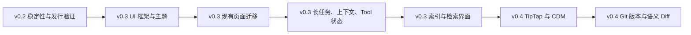

# CleoDoc 开发计划

> 本文件是实施状态、任务顺序和发布门的唯一来源。
>
> 产品范围见 [PRD](./PRD.md)，系统边界见 [技术架构](./TECHNICAL_ARCHITECTURE.md)，桌面结构和组件技术方案见 [桌面 UI 结构设计](./DESKTOP_UI_STRUCTURE_DESIGN.md)。

## 1. 版本策略

- **v0.1：CLI 核心 MVP，已完成。** 已通过 LLM 创作、资料管理、本地 RAG、持久化恢复和跨平台 CLI 发行闭环验收。
- **v0.2：Electron 桌面产品收尾。** 以现有 Electron + React 界面为基线，完成稳定性、安全性、真实安装包和跨平台发行验证；不再用当前手写 UI 体系新增复杂页面或交互。
- **v0.3：桌面 UI 基础与能力迁移。** 接入 Tailwind CSS、shadcn/ui 和 Radix UI，迁移现有 v0.2 页面，并完成原 v0.2 尚未实现的长任务、上下文、Tool 状态、索引与检索界面。
- **v0.4：创作工作室。** 接入 TipTap 与 CDM 编辑适配，并引入 Git 版本控制、版本历史、恢复与语义 Diff。

v0.2 至 v0.4 都复用同一套 Core/Application Service。Renderer 不复制项目、数据库、RAG、Provider 或模型调用逻辑。

## 2. 已完成基线

| 能力 | 当前状态 | 后续安排 |
| --- | --- | --- |
| CLI、项目与安全文件读写 | 完成 | Desktop 与 CLI 继续复用同一 Application Service。 |
| SQLite、资料解析、Chunk、FTS、Embedding、RAG | 完成 | v0.3 补索引状态、检索和恢复界面。 |
| OpenAI-compatible Provider 与安全密钥保存 | 完成 | v0.3 迁移设置界面；新 Provider 另行规划。 |
| Conversation、Session、Reasoning 与流式输出 | 基础桌面界面完成 | v0.3 补压缩、Session、重试与上下文状态界面。 |
| Tool Runtime 与 `ask` 授权 | 基础桌面交互完成 | v0.3 补 Tool 执行状态展示。 |
| Markdown/TXT 作品与资料阅读 | 完成 | v0.4 与编辑器一起重新规划写入与编辑。 |
| 资料导入、重命名、删除与自动索引 | 完成 | v0.3 补任务状态、重建、检索和失败恢复界面。 |
| 当前 Electron + React 桌面外壳 | 完成开发构建 | v0.2 完成真实安装包和跨平台验证；v0.3 迁移至统一 UI 框架。 |

## 3. v0.2：Electron 桌面产品收尾

### 3.1 版本目标与边界

v0.2 的目标是发布一个可稳定使用的桌面闭环：

```text
创建或打开项目
→ 查看 Markdown/TXT 作品
→ 导入并查看 Markdown/TXT 资料
→ 配置 OpenAI-compatible Provider
→ 与主笔对话并使用现有 Tool 授权
→ 重启应用并恢复项目与 Conversation
```

v0.2 不再新增需要复杂交互或新视觉组件的界面，包括长任务详情、取消与重试界面、Session 与压缩界面、Tool 执行状态、索引状态、手动检索和检索结果浏览。这些内容统一迁移至 v0.3，在 UI 框架稳定后开发。

正文编辑、TipTap、CDM 正式迁移、Draft、文本统计、Git、版本历史和语义 Diff 不属于 v0.2。

### 3.2 Electron 兼容性、隔离与安装包

**状态：进行中。** 已完成 Electron + React 工程、开发版启动、桌面构建、Renderer/Preload/Main 分层、sandbox、context isolation、Typed IPC、单活动项目生命周期和项目级资源释放。

需要完成：

- 验证现有项目、`node:sqlite`、sqlite-vec、`node-llama-cpp`、Embedding Worker、Provider 和软件配置在真实安装版中运行。
- 生成 Windows、macOS 和 Linux 可运行制品，并验证应用资源、默认配置、本地模型和用户项目的路径边界。
- 验证项目切换、应用退出、失败路径不会损坏正文、资料、消息、索引或安全凭据。
- 保持 CLI 可独立构建、测试和发行。

检查点：

- 安装版不要求最终用户另外安装 Node.js。
- 原生依赖、GGUF 模型和 Worker 不会因打包丢失或从错误路径加载。
- 所有 Desktop 操作仅能访问当前项目；切换项目后 Conversation Runtime、审批和后台工作不串入新项目。
- 用户错误不泄露密钥、任意绝对路径或底层堆栈。

### 3.3 现有界面稳定性与发布验证

**状态：进行中。** 已完成项目创建、打开、最近项目、独立项目首页、作品/资料阅读、资料管理、Provider 配置、Conversation、流式 Reasoning、Tool 授权和底部状态栏布局。

需要完成：

- 修复现有桌面功能的缺陷、可访问性问题和项目切换/重启恢复问题。
- 在不改变现有信息架构的前提下完成发布前必要的界面一致性修复。
- 使用真实 Provider、真实本地索引和已有 v0.1 项目完成桌面端端到端冒烟。

检查点：

- 现有 v0.1 项目可原样打开，不静默迁移或改写作品与资料。
- `.md`、`.txt` 作品与资料正确显示中文、英文、Emoji 和原始换行，不执行 Markdown 中的危险内容。
- 资料导入、重命名、删除、自动切片和 Embedding 保持现有业务语义。
- Conversation、草稿、Reasoning 与 Tool 审批在重启、切换项目和失败时保持既有隔离与恢复规则。

### 3.4 v0.2 发布门

必须使用真实桌面发行物完成：

1. 创建或打开现有项目，并查看 Markdown/TXT 作品。
2. 导入、查看、重命名和删除中英文 Markdown/TXT 资料。
3. 配置 OpenAI-compatible Provider，与真实模型对话并恢复 Conversation。
4. 让模型调用既有 RAG/文档 Tool，并完成一次需要授权的写入 Tool 决策。
5. 在 Windows、macOS 和 Linux 制品完成核心启动与项目打开验证。

验收要求：没有跨项目泄漏；未经授权的操作不会写入；失败、取消和退出不会损坏事实源；Desktop 不复制 v0.1 Core 逻辑；CLI 行为不回退。

## 4. v0.3：UI 框架接入与能力迁移

### 4.1 UI 框架基线

**状态：未开始。**

技术方案固定为 **Tailwind CSS + shadcn/ui + Radix UI**：

- Tailwind CSS 提供构建期样式生成、响应式布局与 token 消费。
- shadcn/ui 将实际组件源码纳入仓库，作为 CleoDoc 可维护的基础组件层；按需添加，不批量引入页面模板。
- Radix UI 提供菜单、弹窗、Popover、Tabs、ScrollArea、Select、Tooltip 等无障碍交互原语；不另行维护与 shadcn 重复的通用组件体系。
- 使用语义 CSS token 建立 Light、Dark 和 System 三种主题选择；所有页面使用语义 token，不直接绑定具体颜色。
- “毛玻璃感”使用不透明渐变 surface、边框和阴影实现；不以真实透明或 `backdrop-filter` 作为产品基础视觉，避免性能和跨平台渲染差异。

需要实现：

- 建立主题、颜色、字体、圆角、间距、层级和动效 token。
- 建立最小基础组件集：Button、Input、Textarea、Select、Tabs、Dialog、AlertDialog、DropdownMenu、Popover、Tooltip、ScrollArea、Progress、Badge、Toast。
- 确定 React/Electron 下的主题初始化与持久化方式，避免启动时闪烁错误主题。
- 为组件增加键盘导航、焦点管理、屏幕阅读器语义和高对比度验证。

检查点：

- Dark、Light 与跟随系统主题均可切换且重启后恢复。
- 组件仅从 Renderer 使用，不向 Main 或 Core 引入 DOM、Tailwind 或 UI 依赖。
- 弹窗、菜单、焦点陷阱和快捷键不破坏 Electron 窗口菜单与 TipTap 未来的编辑器焦点。
- 产物不包含未使用的整套视觉组件库或页面模板。

### 4.2 现有 v0.2 页面迁移

**状态：未开始。**

需要迁移：窗口标题栏、导航区、项目首页、项目菜单、作品/资料左栏、共享文档阅读区、聊天区、设置页、授权控件和状态栏。

迁移原则：

- 先迁移基础组件和主题，再迁移页面；不在同一页面长期混用旧手写通用控件与新组件体系。
- 保留既有 Application Service、Typed IPC、项目隔离和业务行为；迁移不引入平行状态模型。
- 不依据组件库的模板自动增加导航、按钮、空状态、数据卡或功能入口；新增可见元素仍需用户授权。
- 迁移完成后删除被替代的通用 CSS 与重复组件，避免双重主题和样式优先级冲突。

检查点：现有 v0.2 端到端闭环、项目切换、草稿保持、资料操作和 Tool 授权行为不回退。

### 4.3 长任务、上下文与 Tool 状态界面

**状态：未开始。** 该阶段承接原 v0.2 的长任务界面化。

需要实现：

- 为聊天生成、上下文压缩、Chunk/FTS 重建和 Embedding 建立统一的项目内任务状态、进度、取消与完成/失败事件。
- 状态栏显示当前简短任务状态；详情、错误和重试使用统一的组件交互，不建设独立任务中心。
- 显示上下文预算、自动/手动压缩、压缩中状态、取消、失败重试和 Conversation 下的 Session。
- 显示 Tool 的简洁执行中、成功、失败、取消和拒绝状态；不展示原始 Tool JSON。

检查点：

- 项目切换或退出时，任务、审批和 Conversation Runtime 不跨项目遗留。
- 取消、压缩失败或 Tool 拒绝不删除已保存消息、旧 Session、资料或原文。
- Tool 授权仍仅限当前 Project、Conversation 和相同 Tool 版本；退出后持续允许失效。

### 4.4 索引、Embedding 与检索界面

**状态：未开始。**

需要实现：

- 展示总体和单份资料的索引状态、Embedding 状态及必要错误信息。
- 触发现有 Chunk/FTS 重建和 Embedding 生成，显示进度、取消与重试。
- 提供当前项目范围内的普通、语义和混合检索界面，展示资料、命中范围、相关度和必要来源信息。
- 展示 Embedding 模型信息并提供现有测试能力。

检查点：

- 精确名称、资料原文和近义描述均可召回对应资料，且严格限定当前项目和 material 范围。
- 删除资料后 Chunk、FTS 和向量均不可再检索。
- 普通 UI 检索不持久化为模型证据审计；失败、取消和重建不修改原资料。

### 4.5 v0.3 发布门

1. Light、Dark 和 System 主题在安装版中正确恢复。
2. 所有既有 v0.2 页面已迁移至统一组件和 token 体系，业务行为不回退。
3. 可从 UI 观察、取消和重试聊天、压缩、索引与 Embedding 的相应任务。
4. 可完成资料导入、索引、普通/语义/混合检索闭环。
5. 可查看 Conversation 的 Session、上下文状态和简洁 Tool 执行状态。

## 5. v0.4：编辑器与 Git 版本控制

### 5.1 TipTap、CDM 与安全写入

**状态：未开始。**

需要重新评审并实现：正式 CDM v1、现有 Markdown 迁移策略、TipTap/ProseMirror 编辑器、CDM 双向适配、Draft、自动保存、文本统计、用户确认后的安全写入，以及作品创建和删除入口。

TipTap 是编辑器内核；shadcn/ui 和 Radix UI 只负责编辑器周边的工具栏、下拉菜单、浮层、标签页、确认框和状态反馈，不替代编辑器选区、命令或文档状态。

### 5.2 Git 版本、历史与语义 Diff

**状态：未开始。**

需要重新评审并实现：隐藏 Git 版本引擎、命名版本、安全恢复、版本历史、项目指令与 Revision 历史界面、CDM 语义 Diff 计算和对比/恢复界面。

Git Application Service 可独立于 UI 开发；版本列表、恢复确认和 Diff 浏览必须复用 v0.3 的 Dialog、AlertDialog、Tabs、ScrollArea、Toast 和主题 token，不再建立新的组件体系。

### 5.3 v0.4 发布门

1. 作品可以在 TipTap 中编辑并安全写回事实源，失败不损坏原文。
2. CDM、编辑器与 Markdown 过渡策略可验证、可恢复且不静默丢失内容。
3. 用户可创建、查看、比较和安全恢复版本。
4. 语义 Diff 可解释地展示 CDM 级变化，不以文本 Diff 冒充语义结果。

## 6. 版本依赖与顺序



- v0.2 发布后不再扩展旧手写 UI，除缺陷修复和发布阻塞问题外不新增复杂界面。
- v0.3 基础组件和主题稳定前，不开始新的复杂页面；业务层和 Typed IPC 可先行，但不得以临时页面替代正式交互。
- v0.4 的 TipTap 和 Git 领域设计可在 v0.3 期间研究，但正式产品开发必须在 v0.3 UI 基线稳定后重新确认范围。

## 7. 后续版本候选范围

以下能力不因本文件列出而自动获得版本范围，实施前必须重新规划：新 Provider 接入、跨厂商模型调用记录、统一问题诊断、知识图、事实抽取、阶段 Agent、文件夹批量导入、DOCX/PDF/EPUB、个人资料库、云同步、多人协作、OCR、插件和 ANN。
