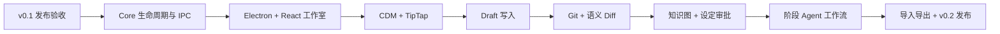

# CleoDoc 开发计划

> 本文件是实施状态、任务顺序和发布门的唯一来源。
>
> 产品范围见 [PRD](./PRD.md)，系统边界见[技术架构](./TECHNICAL_ARCHITECTURE.md)。

## 1. 版本策略

- **v0.1：CLI 核心 MVP。** 用命令行验证 LLM 创作、资料管理、本地 RAG 和持久化恢复的完整闭环。
- **v0.2：Electron 桌面产品。** 在同一套 Core 上增加 React、TipTap、CDM 正文、版本与 Diff、知识图和可恢复工作流。

v0.1 作为后续开发的基线，不再保留其内部步骤的实施日记。除修复发布阻塞问题外，新产品能力进入 v0.2。

## 2. v0.1 基线状态

| 能力 | 状态 | 当前边界 |
| --- | --- | --- |
| CLI、项目与安全文件读写 | 完成 | 模块化命令；正文限定在 `manuscript/`；原子写入 |
| SQLite | 完成 | Schema v10、WAL、FTS5、写入队列、v8→v9→v10 升级 |
| LLM Provider | 完成 | OpenAI-compatible、Ollama、流式输出、独立超时、Reasoning 与 Debug 日志 |
| Conversation / Session | 完成 | 历史恢复、自动与手动压缩、失败重试、同 Conversation 历史回查 |
| 模型调用审计 | 完成 | Message 保存 Content/Reasoning；ModelCall 保存请求选项和 Token 用量 |
| 项目指令 | 完成 | SQLite Revision 为唯一事实源；读取、追加、整体替换和恢复 |
| Tool Runtime | 完成 | 无状态 Tool、项目级 Catalog、Conversation 级 Runtime、临时审批 |
| 资料管理 | 完成 | TXT/Markdown 文件或粘贴导入、编码检测、唯一 title、重命名和删除 |
| 资料解析与切片 | 完成 | 临时 CDM、语言检测、GGUF Tokenizer 驱动的确定性 Chunk |
| 本地检索 | 完成 | trigram FTS5、GGUF Embedding、sqlite-vec 精确余弦、Exact/FTS/Vector 混合 RAG |
| RAG Tool | 完成 | `list_materials`、`search_knowledge`、`read_material_context` v2；以唯一 title 选择资料 |
| CLI 打包 | 完成 | Windows、macOS、Linux 原生平台分别构建发行包 |
| 最终发布验收 | 待完成 | 人工执行完整垂直闭环并确认发行制品 |

### 2.1 v0.1 发布门

发布前必须在至少一个真实项目完成：

1. 创建项目并导入中英文 TXT/Markdown 资料。
2. 重建 Chunk、FTS 和 Embedding，验证状态和失败恢复。
3. 与真实 LLM 对话，让模型主动调用本地 RAG Tool。
4. 经用户审批保存生成文档。
5. 触发 Session 压缩，退出并重启 CLI，恢复 Conversation 后继续创作。
6. 删除一份资料，确认其 Chunk、FTS 和向量均不可再检索。
7. 从发行包而非源码运行同一核心流程。

验收要求：没有跨项目检索泄漏；失败不会损坏原始资料、正文或已保存消息；Tool Result Message 可以还原实际发给模型的证据；Windows、macOS、Linux 制品均能启动。

### 2.2 v0.1 明确不做

- Electron、React 和 TipTap。
- CDM 正文迁移与节点级编辑。
- Draft 自动写入和文本统计。
- Git 版本管理与文档语义 Diff。
- 关系图、自动事实抽取和设定审批。
- 持久化阶段 Agent、自动长篇生成和多 Agent。
- DOCX、PDF、EPUB、OCR、云同步和多人协作。
- ANN 向量索引。

## 3. v0.2 实施顺序

### 3.1 冻结 v0.1 Core 边界

- 完成 v0.1 发布验收，记录已知限制。
- 将 CLI 对 Core 的直接组合整理为可供 Desktop 调用的 Application Service。
- 明确 Project 打开、关闭、数据库连接、Conversation Runtime 和 Worker 的生命周期。
- 为 GUI 所需操作定义稳定的领域输入输出，不让 Renderer 访问 Repository。

验收：CLI 行为不回退；Desktop 不需要复制项目、数据库、RAG 或 Agent 逻辑。

### 3.2 Electron 安全壳与 Typed IPC

- 建立 Electron Main、Preload、Renderer 和 Core Utility Process。
- 启用 sandbox、context isolation、严格 CSP，关闭 Node integration。
- Preload 只暴露经过 Schema 校验的白名单 Typed IPC。
- 使用操作系统凭据存储 Provider 密钥。
- 决定应用采用单项目进程还是多项目切换；该决定会影响 Runtime、审批和资源释放。

### 3.3 React 作品工作室

- 实现作品、正文和主笔对话三栏基础布局。
- 提供资料中心：单文件导入、文件夹批量导入、冲突清单、重命名、删除、索引状态和失败恢复。
- 提供项目指令页面，复用 SQLite Revision 服务。
- 展示流式 Content/Reasoning、Tool 审批、任务状态和简洁证据标记；不直接展示普通 Tool 原始 JSON。

### 3.4 CDM 正文与 TipTap 编辑器

- 确认 CDM v1 根元素、元数据、标签白名单和 Revision 方案。
- 确定当前 Markdown 正文到 CDM 的迁移方式。
- 将 CDM Node/Mark 映射到 TipTap Node/Mark，并保留稳定 Node ID。
- 实现节点级读取、插入、替换、删除和移动；不使用视觉行号。
- 支持批注、自动保存、外部修改检测和崩溃恢复。

### 3.5 Draft 写入与文本统计

- 实现 `write_draft`：主笔决定产出正文时直接调用 Tool，不在聊天 Content 中复制文稿。
- Tool Result 返回本次写入和当前文档的字符数、字数和标点数，不回传正文。
- 完整拼接流式 Tool 参数后再校验和写入；使用 Revision 和幂等键避免重复追加。
- 模型停止调用 Tool 即结束写作回合，不增加 `finish_draft`。
- Draft 通过 ChangeSet 和用户审批进入正式正文。

实施前必须先解决[文档处理设计](./文档处理设计.md)中关于 Draft 文档引用、Revision、写入模式和统计范围的开放问题。

### 3.6 Git 版本与语义 Diff

- 使用 isomorphic-git 作为隐藏版本引擎。
- 用户只看到自动修改记录、命名版本、比较和恢复。
- 恢复生成新的历史记录，不改写既有历史。
- Diff 基于 CDM Node ID、结构和中文句子/字符差异，支持行内与左右对比。
- Agent ChangeSet 与用户版本比较共用同一 Diff 能力。

### 3.7 设定、关系图与知识审批

- 建立人物、地点、组织、物品、事件、关系、状态和叙事对象。
- 抽取候选事实并让用户批量审批；冲突逐项处理。
- 增加一致性检查、人物知识状态和修改影响分析。
- Graph Retriever 作为现有混合 RAG 的新召回通道，不替换 FTS 与向量检索。

### 3.8 可恢复作品 Agent 工作流

- 持久化 AgentJob、ChangeSet、Checkpoint 和审批决定。
- 实现委托书、故事方案、作品圣经与总纲、样章、分卷、全稿修订和完稿阶段。
- 支持暂停、取消、重试、断网恢复和补丁冲突处理。
- 保持一个对外主笔；内部能力不表现为多个聊天人格。

### 3.9 导入导出与桌面发布

- 增加 DOCX、带文本层 PDF 的解析；OCR 继续延后。
- 导出 Markdown、TXT、DOCX 和 EPUB，并保持章节结构一致。
- 完成项目备份、数据库健康检查和可视化索引重建。
- 生成 Windows/macOS 安装包；Linux 保持构建和核心流程验证。

## 4. 依赖与验收门

- v0.1 发布验收未通过前，不把 Electron UI 作为正式产品入口。
- CDM v1 和 Revision 未确定前，不实现长期节点级写入或语义 Diff。
- Draft 自动写入必须建立在可恢复 Revision 和用户审批上。
- 阶段 Agent 必须复用已经验证的 Tool、RAG、ModelCall 和故障恢复机制。

## 5. 后续版本延后项

- 跨 Conversation 历史检索的完整产品语义。
- 同一多语言资料使用多套 Embedding 的选择与融合。
- 资料更新后的 Chunk ID 继承和引用迁移。
- 云同步、账号系统和多人实时协作。
- Git 远程仓库和用户可见分支。
- OCR、插件系统和独立图数据库。
- 超大资料库 ANN 后端。
- 应用级全项目加密和永久清除历史。
