# CleoDoc 开发计划

> 状态：实施中；v0.1 步骤 1–5.7 已完成，本地文档 Tool Loop 已提前交付
> 日期：2026-08-02
> 产品需求：[PRD.md](./PRD.md)  
> 技术架构：[TECHNICAL_ARCHITECTURE.md](./TECHNICAL_ARCHITECTURE.md)

## 1. 版本策略

CleoDoc 分为两个连续版本交付：

| 版本 | 目标 | 交互形态 |
|---|---|---|
| v0.1 | 验证 LLM 文档创作、资料管理和本地 RAG 三个核心能力 | CLI |
| v0.2 | 在已验证 Core 上实现完整桌面产品、版本管理和创作工作流 | Electron + React |

v0.1 的核心闭环是：

```text
用户与 LLM 沟通
→ LLM 查询本地资料或正文
→ LLM 生成文档内容
→ 用户将结果保存到项目
→ 后续对话继续使用已保存内容
```

在 v0.1 CLI 通过验收前，不开始 Electron Renderer、React 工作室或 TipTap 编辑器开发。

### 当前实施进度

| 步骤 | 状态 | 已交付 |
| --- | --- | --- |
| 1. 工程与 CLI 骨架 | 已完成 | npm workspaces、TypeScript、CLI、CI、Lint、Format、Vitest |
| 2. 项目文件与 SQLite | 已完成 | 项目清单、安全文件写入、SQLite WAL、迁移、写入队列和健康检查 |
| 3. LLM Provider | 已完成 | OpenAI-compatible、Ollama、流式输出、取消、错误分类、`--debug` UTF-8 文件日志、原始请求/响应、Context/协议诊断和 Fake Provider 测试 |
| 4. 生成内容保存 | 已完成 | 对话记录、显式保存、覆盖确认、文档命令和 CLI 端到端测试 |
| 5. 资料管理 | 已完成 | 粘贴/TXT/Markdown 导入、文件与元数据事实源、SQLite 投影、哈希去重、资料 CRUD |
| 5.5 会话上下文管理 | 已完成 | Session 压缩、数据库项目指令注入、历史回查 Tool、分层压缩和可编辑草稿提交门 |
| 5.6 Reasoning 流式体验与调用审计 | 已完成 | Reasoning 实时展示与持久化、DeepSeek Tool Loop 回传、逐次 ModelCall 审计、不可变 Message 和 External Content 历史 FTS |
| 5.7 数据库原生项目指令 | 已完成 | migration v7–v8 追加式版本、乐观并发、恢复、受控 Tool、CLI 查看及 Session 旧字段清理 |
| 9a. LLM 本地文档 Tool | 已完成 | 项目文档列出/分段读取/确认写入、Tool 消息持久化、8 轮上限、路径隔离和 CLI 审批 |
| 6–8、9b–10 | 未开始 | FTS5、Embedding、混合 RAG、ContextManifest、RAG Tool 和 CLI 发布 |

## 2. 开发原则

- Core 使用纯 Node.js 和 TypeScript，不依赖 Electron、React、DOM 或浏览器存储。
- CLI 和未来 Electron 共用相同的 Application Service，不为 GUI 重写核心逻辑。
- Markdown、JSON 和原始资料是项目事实源；SQLite 是知识、检索和运行状态中心。
- v0.1 只实现验证闭环必需的格式、Provider 和检索能力。
- 每个阶段必须满足验收门，不能用未完成的 UI 掩盖核心能力问题。
- 开发与 CI 使用不高于 Electron 内置 Node 的最低兼容基线。

## 3. 代码结构

```text
apps/
├─ cli/                 # v0.1 交互入口
└─ desktop/             # v0.2 Electron 应用

packages/
├─ contracts/           # 公共类型、Zod Schema 和错误码
├─ application/         # 面向 CLI/GUI 的用例服务
├─ project/             # 项目格式、路径和文件读写
├─ database/            # node:sqlite、迁移和 Repository
├─ model-providers/     # OpenAI-compatible、Ollama 等
├─ knowledge/           # 文档、资料和 Chunk
├─ rag/                 # 检索、融合和 ContextManifest
├─ agent/               # LLM Tool Loop；v0.2 扩展为持久化 AgentJob
├─ versioning/          # v0.2 Git 版本管理
├─ diff/                # v0.2 文档语义 Diff
└─ testing/             # Fixture、RAG 基准和测试工具
```

## 4. v0.1 CLI MVP

### 步骤 1：工程与 CLI 骨架

工作内容：

- 建立 npm workspaces 和 TypeScript 工程。
- 配置 lint、format、Vitest 和跨平台 CI。
- 建立 `apps/cli` 与公共 contracts。
- 实现 CLI 参数解析、错误输出和退出码。
- 建立项目创建、打开和状态检查。

首批命令：

```text
cleo init <directory>
cleo open <directory>
cleo status
cleo config
```

验收：

- 能在任意本地目录创建和重新打开项目。
- 项目可以复制到另一个路径继续使用。
- CLI 错误具有稳定错误码和可理解提示。
- Windows、macOS 和 Linux CI 均通过类型检查和单元测试。

### 步骤 2：项目文件与 SQLite

工作内容：

- 定义 `cleo.project.json`。
- 建立 `manuscript/`、`materials/` 和 `.cleo/`。
- 使用 `node:sqlite` 创建每项目独立数据库。
- 实现迁移、唯一写入队列、WAL、备份和 `quick_check`。
- 建立 `ProjectService` 和 `DocumentService`。

项目结构：

```text
MyNovel.cleo/
├─ cleo.project.json
├─ manuscript/
├─ materials/
└─ .cleo/
   ├─ project.sqlite
   ├─ blobs/
   └─ models/
```

验收：

- Markdown 文档可以创建、读取、更新和删除。
- 所有路径限制在项目目录内。
- SQLite 异常不影响已保存的 Markdown。
- 可重建表删除后能够从文件恢复。

### 步骤 3：LLM Provider

工作内容：

- 定义 `ModelProvider`、能力声明和统一错误模型。
- 实现 OpenAI-compatible Provider。
- 实现 Ollama Provider。
- 支持流式输出、取消、结构化 Tool Call 和 Token 用量。
- API Key 从环境变量或当前进程输入读取，不明文持久化。

命令：

```text
cleo provider list
cleo provider test <provider>
cleo chat
```

验收：

- 可以选择并验证 Provider。
- 可以进行多轮流式对话。
- 用户可以取消生成。
- 鉴权、限流、超时和上下文超限具有独立错误类型。
- Provider 故障不会触发静默切换。

### 步骤 4：生成内容保存

工作内容：

- 保存当前对话和最后一次模型响应。
- 支持创建新文档和确认后覆盖已有文档。
- 保存后返回文档 ID、项目相对路径和内容哈希。
- 允许显式读取项目文档加入下一次对话。

命令：

```text
cleo document list
cleo document show <document-id>
cleo document create <path>
cleo document save-last <path>
```

交互命令：

```text
/resume <index-number>
/history
/new
/save manuscript/chapter-001.md
/read manuscript/chapter-001.md
/documents
```

进入聊天时展示最近 5 条记录；`/history` 在交互终端中使用上下键选择、Enter 恢复、`q` 返回聊天。

验收门 A：

- 用户能够与 LLM 多轮沟通。
- 任意一次完整响应可以保存为 Markdown。
- 保存内容可以重新读取并进入后续对话。
- LLM 和 CLI 均不能写出项目目录。

### 步骤 5：资料管理

状态：已完成。资料正文保存于 `materials/<id>.txt|md`，元数据保存于 `sources/metadata/<id>.json`，SQLite `sources` 表作为可重建投影。当前限制为 UTF-8 文本、TXT 和 Markdown，单份资料不超过 10 MiB。

工作内容：

- 建立 `MaterialService`。
- 支持粘贴文本、TXT 和 Markdown。
- 保存标题、来源、标签、路径、时间和内容哈希。
- 支持添加、查看、列表、重命名和删除。
- 使用内容哈希检测重复导入。

命令：

```text
cleo material add <file>
cleo material add --stdin
cleo material list
cleo material show <material-id>
cleo material rename <material-id> <title>
cleo material remove <material-id>
```

验收门 B：

- 用户可以完成资料 CRUD。
- 重复导入不会生成重复资料。
- 删除资料后不再进入当前检索。
- 原始文件、资料元数据和 SQLite 投影保持一致。

### 步骤 5.5：会话上下文管理

详细设计：[SESSION_COMPACTION_DESIGN.md](./SESSION_COMPACTION_DESIGN.md)

实施状态：已完成当前范围。数据库 migration v4 会为旧 Conversation 创建 legacy Session；migration v5 将累计摘要收敛为单一 Markdown `summary` 并确定性转换旧 v6 摘要；migration v7 已用数据库 Revision 替代运行时 AGENTS 文件快照。CLI 已提供自动/手动压缩、上下文预算查看、Session 审计和失败重试。历史回查结果进入 Tool Loop；统一 `ContextManifest` 审计将在步骤 6–9b 随 RAG 基础设施接入。

工作内容：

- 在用户可见 Conversation 内建立有边界的内部 Session。
- 在完整 Agent 回合结束后，根据 Token 预算触发独立 LLM 压缩调用。
- 新 Session 按 Core System Prompt、数据库最新项目指令、累计摘要、当前消息的顺序组装上下文。
- 压缩期间允许用户编辑草稿，但 Enter 和发送按钮不能提交；草稿不清空、不排队、不自动发送。
- 建立压缩前历史消息的搜索和精确读取 Tool。
- 保存摘要引用、模型参数、用量和可恢复 CompactionJob；项目指令独立按 Revision 保存。

验收：

- 达到阈值后不再向主笔发送已关闭 Session 的全部原文。
- 正常压缩只使用一次独立 LLM 调用，并输出通过最低完整性校验的 Markdown 累计摘要。
- 压缩期间用户草稿保持可编辑，完成后必须再次主动提交。
- 新 Session 的 AGENTS 和摘要顺序稳定且可审计。
- Agent 能按需找回压缩前的具体消息，且不能跨 Conversation 或项目查询。
- 压缩失败、取消或进程退出不会丢失消息和草稿。

### 步骤 5.6：Reasoning 流式体验与模型调用审计

数据库设计：[DATABASE_DESIGN.md](./DATABASE_DESIGN.md#15-已确认的下一版设计reasoning-与模型调用审计)

实施状态：已完成。migration v6 一次性完成 Message 整数主键、Reasoning/ModelCall 字段、不可变约束、业务映射表、压缩编排配置改名和 External Content 历史 FTS；Provider、Agent 与 CLI 已完成 Reasoning 流式解析、展示、持久化和 Tool Loop 回传。

工作内容：

- 扩展 Provider 流事件，增加独立的 `reasoning-delta`，不得把 Reasoning 拼入最终 `content`。
- OpenAI-compatible Provider 在流式响应中持续解析 `delta.reasoning_content`；Provider 未返回时保持为空。
- CLI 收到第一个 Reasoning 片段后立即显示明确的“思考中”区域；进入 `content` 阶段后切换为“回答”，避免用户把模型思考时间误认为网络延迟。
- 将 Provider 暴露的完整 Reasoning 保存到 Assistant Message 的 `reasoning_content`；最终回答继续保存到 `content`。
- Assistant 发起 Tool Call 时，同时保存该轮 `reasoning_content`、`content` 和 `tool_calls_json`。
- DeepSeek Tool Loop 在追加 Tool Result 并发起下一次模型请求时，带回上一轮 Assistant 消息的完整 `reasoning_content`。该行为由 Provider Adapter 处理，不由通用 Agent 逻辑硬编码 Provider 特例。
- 非 Tool Loop 的普通历史上下文不默认重发 Reasoning；是否需要发送由 Provider 能力与协议决定。
- Reasoning 不加入会话压缩输入、`session_summaries` 或 `conversation_message_fts`，也不通过 `/save` 写入作品文档。
- 上下文预算在 Provider 确实需要重发 Reasoning 的 Tool Loop 请求中计入相应 Token，避免本地预算低估。
- 建立逐次 `model_calls` 审计，并分别通过 Generation 与 CompactionJob 映射表记录 Tool Loop、分段、归并和修复调用；模型输出内容仍由业务表保存。
- 为 Message 增加稳定整数 `message_rowid`，UUID `id` 继续作为业务标识；数据库拒绝历史 Message UPDATE。
- 将 `conversation_message_fts` 改为 External Content FTS，只索引 `messages.content`，不重复保存正文和 Conversation/Session/角色元数据。

CLI 交互示意：

```text
思考中：
模型正在分析人物动机……

回答：
根据已有设定，下一章可以从……
```

这里展示的是 Provider 实际返回并允许暴露的 Reasoning。未启用 Thinking 或 Provider 不提供 Reasoning 时，CLI 直接显示“回答”，不显示空的思考区域。

验收：

- Reasoning 的首个流式片段到达后立即可见，不等待最终 `content` 才统一输出。
- Reasoning 与最终回答在终端中有稳定、清晰的视觉边界，流式输出不会交叉或重复。
- 普通回答、纯 Tool Call、Reasoning 后 Tool Call、Tool Result 后继续回答四类流式响应均可正确解析。
- DeepSeek Tool Loop 的后续请求包含协议要求的完整 `reasoning_content`，并通过集成测试验证请求体。
- 每次真实 LLM API 请求均产生独立 ModelCall；一个 Generation 或 CompactionJob 可以按顺序关联多次调用。
- 重启 CLI 后仍可读取 Assistant Message 的 Reasoning；未返回 Reasoning 的历史消息保持兼容。
- Reasoning 不会进入历史全文检索、会话摘要或保存的作品文档。
- Provider 超时、流中断或解析失败时，已经接收的 Reasoning 可用于本地诊断，但不会被误当作最终生成内容保存。

### 步骤 5.7：数据库原生项目指令

数据库设计：[DATABASE_DESIGN.md](./DATABASE_DESIGN.md#16-已实现设计数据库原生项目指令)

实施状态：已完成。migration v7–v8、Repository、ContextBuilder、受控 Tool及 CLI 查看/历史/恢复均已落地。作品项目中的 `AGENTS.md` 或 `agents.md` 不会被扫描、导入或合并；CleoDoc 代码仓库自身的编码 Agent 指令文件不受影响。Session 的四个旧文件快照字段已经删除。

工作内容：

- 新增追加式 `project_instruction_revisions` 表；每个 Revision 保存修改后的完整指令、内容哈希和创建时间。
- 当前项目指令由最大 Revision 确定，不增加项目指令主表、当前版本指针或 `project_id`。
- 所有修改使用 `expected_revision` 做乐观并发检查；尾部追加、精确文本替换和全量替换最终都创建完整的新 Revision。
- 恢复旧版本时，将旧内容复制为新 Revision，不删除或改写历史。
- 提供 `read_project_instructions`、`append_project_instructions`、`replace_project_instruction_text` 和 `set_project_instructions` Tool。
- LLM 发起的写操作展示 Diff 并要求用户明确批准；拒绝、冲突或进程中断不得改变当前 Revision。
- 从 `conversation_sessions` 移除项目指令路径、快照、哈希和加载时间字段，不增加 Session 到项目指令 Revision 的替代关联。
- 任何需要项目指令的主笔或 Agent 请求在上下文组装前读取数据库最新 Revision，并按 System Prompt、项目指令、累计摘要、当前消息的顺序注入。
- 当前阶段不追踪 ModelCall 使用的具体项目指令 Revision；未来需要时使用独立映射表扩展。

CLI 命令：

```text
/instructions
/instructions history
/instructions restore <revision>
```

验收：

- CLI 可以显示当前完整项目指令、Revision、哈希和更新时间。
- 查询、追加、精确文本替换和全量替换都生成完整且可恢复的新 Revision。
- 恢复旧版本会新增 Revision，历史记录保持不变。
- Tool 使用过期 Revision 写入时得到明确冲突，不会覆盖用户较新的修改。
- LLM 修改项目指令必须经过用户批准；读取无需批准。
- Tool Loop 中批准的指令修改从下一次需要项目指令的模型调用开始生效。
- 新 Session 和后续 Agent 调用不再读取项目目录下的 `AGENTS.md` 或 `agents.md`。
- 作品项目中的 `AGENTS.md` 或 `agents.md` 不会改变数据库指令，也不会进入模型上下文。
- migration v8 删除旧字段时不损坏 Conversation、Session、Message、Summary 或 CompactionJob。
- 未来 GUI 的项目指令页面与 CLI 使用同一个 Application Service 和 Revision 并发规则。

### 步骤 6：统一知识模型与 FTS5

工作内容：

- 将正文和资料统一映射为 `KnowledgeDocument`。
- 实现章节、段落和句子感知的增量切块。
- 建立内容哈希和 `sourceRevision`。
- 使用 FTS5 trigram 建立中文全文索引。
- 为标题、人名、别名和短专名建立精确字段索引。
- 实现索引状态、失败重试和完整重建。

命令：

```text
cleo index status
cleo index rebuild
cleo search <query>
cleo search <query> --scope manuscript
cleo search <query> --scope material
```

验收：

- 正文和资料可以统一或分范围检索。
- 修改单个文档只重建相关 Chunk。
- 两字人物名可以通过精确索引命中。
- 搜索结果包含文件、结构路径、revision 和原文片段。

### 步骤 7：本地 Embedding 与向量检索

工作内容：

- 使用 Transformers.js 在 Worker 中执行本地 ONNX Embedding。
- 实现模型下载、缓存、哈希校验和进度。
- 记录模型 ID、revision、维度、量化和归一化方式。
- 以 Float32 BLOB 保存向量。
- 对元数据预过滤后的候选执行精确余弦检索。
- 实现索引代次和模型切换重建。

命令：

```text
cleo embedding model
cleo embedding download
cleo index embed
cleo search <query> --semantic
```

验收：

- 模型下载完成后可以离线向量化和搜索。
- Embedding 不阻塞 CLI 进度输出。
- 过期 `sourceRevision` 的结果不会写入。
- Embedding 失败时 FTS5 仍可使用。

### 步骤 8：混合 RAG

工作内容：

- 实现 Exact、FTS 和 Vector Retriever。
- 实现项目、资料类型和 revision 过滤。
- 使用 RRF 融合结果。
- 实现去重、来源平衡和上下文预算。
- 保存 `RetrievalRun` 与 `ContextManifest`。
- 提供可解释检索输出。

命令：

```text
cleo search <query> --hybrid
cleo search <query> --hybrid --explain
```

验收：

- 每个结果可以追溯命中方式、来源和 revision。
- 不发生跨项目召回。
- 单一资料不能占满全部上下文。
- 固定基准集的关键资料 Top-10 Recall 不低于 90%。

### 步骤 9：LLM 本地 RAG Tool

其中不依赖 RAG 索引的本地文档 Tool 子阶段已提前完成：`list_project_documents`、`read_project_document` 和 `write_project_document`。读取被限制在当前项目，所有写入需要用户逐次批准；Tool Call 与 Tool 结果随对话持久化。以下知识检索与 `ContextManifest` 工作仍等待步骤 5–8：

工作内容：

- 向模型暴露 `search_knowledge`、`read_document` 和 `list_materials`。
- 实现受限制的 Tool Loop。
- Tool 只能访问当前项目和允许的作用域。
- 将每次 Tool Call、检索结果和实际上下文写入 ContextManifest。
- 用户可以查看 LLM 使用的资料。

```ts
interface SearchKnowledgeInput {
  query: string;
  scope: Array<'manuscript' | 'material'>;
  limit?: number;
}
```

验收：

- LLM 可以自主调用本地检索。
- 同一次任务可以进行多轮检索。
- Tool 不能读取其他项目或任意本地文件。
- 所有发送给远程模型的资料片段可审计。
- 本地搜索在断网状态下仍可独立使用。

### 步骤 10：CLI 垂直闭环与发布

固定验收场景：

1. 创建小说项目。
2. 添加人物笔记和背景资料。
3. 保存一章已有正文。
4. 与 LLM 沟通下一章要求。
5. LLM 调用 RAG 查询人物资料和上一章正文。
6. LLM 生成新章节。
7. 用户查看本次引用证据。
8. 保存为 `manuscript/chapter-002.md`。
9. 重启 CLI。
10. 基于已保存章节继续创作。

v0.1 发布条件：

- LLM 对话、流式输出和取消稳定可用。
- 生成结果能够安全保存和重新读取。
- 资料 CRUD 完整可用。
- 正文和资料支持全文、语义和混合检索。
- LLM 能调用本地 RAG Tool。
- ContextManifest 可以还原所有发送给模型的资料。
- 项目重启后数据、索引和对话上下文保持一致。
- 没有可复现的跨项目检索泄漏或项目文件损坏。
- Windows、macOS 和 Linux 提供可运行 CLI 包。

## 5. v0.1 明确不做

- Electron、React 和 TipTap。
- Git 版本管理和语义 Diff。
- 关系图和自动事实抽取。
- 完整创作阶段审批。
- DOCX、PDF 导入和 EPUB、DOCX 导出。
- 多 Agent 和自动长篇生成。
- OCR、云同步和多人协作。
- ANN 向量索引。

接口需要为这些功能预留，但它们不得阻塞 CLI 核心验证。

## 6. v0.2 Electron 桌面产品

v0.2 只消费 v0.1 已验证的 Application Service。

### 步骤 1：Electron 安全壳与 Typed IPC

- 建立 Main、Preload、Renderer 和 Core Utility Process。
- Core 复用 v0.1 packages。
- 启用 sandbox、context isolation 和严格 CSP。
- 使用 Zod 校验 IPC。
- 使用 `safeStorage` 保存 Provider 凭据。

### 步骤 2：React 作品工作室

- 三栏布局。
- 项目树、资料中心、正文阅读和主笔对话。
- 提供独立的项目指令页面，从 SQLite 读取当前 Revision，并使用与 CLI 相同的冲突检查和恢复服务。
- 将 CLI 命令映射为可视化操作。
- 展示流式生成、Tool Call、证据和 ContextManifest。

### 步骤 3：TipTap 编辑器

- 正文编辑、批注和字符级撤销。
- 稳定块 ID 和 Markdown sidecar。
- 自动保存和外部文件修改检测。

### 步骤 4：Git 版本和语义 Diff

- isomorphic-git 隐藏式版本引擎。
- 语义化修改记录和命名版本。
- 非破坏性项目/文档恢复。
- 行内和左右文档语义 Diff。
- Agent ChangeSet 共用 Diff 预览。

### 步骤 5：设定和关系图

- 人物、地点、事件、关系和人物知识状态。
- 自动候选事实、批量审批和冲突处理。
- 一致性检查和修改影响分析。
- Graph Retriever 加入现有混合 RAG。

### 步骤 6：可恢复 Agent 工作流

- 持久化 AgentJob。
- 委托书、故事方案、总纲、样章、分卷和终稿阶段。
- ChangeSet、`baseRevision` 和审批。
- 暂停、取消、重试和崩溃恢复。

### 步骤 7：完整导入导出与发布

- DOCX、带文本层 PDF 导入。
- Markdown、TXT、DOCX 和 EPUB 导出。
- 项目备份、健康检查和索引重建。
- Windows、macOS 正式支持，Linux 构建和核心流程验证。

## 7. 依赖与验收门

```mermaid
flowchart LR
    A["CLI 工程"] --> B["LLM 对话与保存"]
    B --> C["资料 CRUD"]
    C --> D["FTS5"]
    D --> E["本地 Embedding"]
    E --> F["混合 RAG"]
    F --> G["LLM RAG Tool"]
    G --> H["v0.1 CLI 验收"]
    H --> I["Electron + React"]
    I --> J["编辑器·版本·Diff"]
    J --> K["知识图·Agent 工作流"]
    K --> L["v0.2 Desktop 验收"]
```



任何 Electron GUI 工作必须依赖已经通过的 v0.1 CLI 验收门。

## 8. 后续版本延后项

- 云同步和账号系统。
- 多人实时协作。
- Git 远程仓库和用户可见分支。
- OCR。
- 插件系统。
- 独立图数据库。
- 超大资料库 ANN 后端。
- 应用级全项目加密。
- 自动重写 Git 历史的永久清除。
