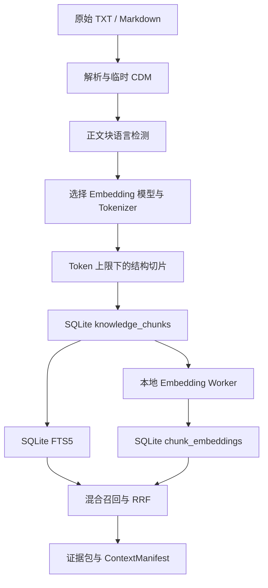
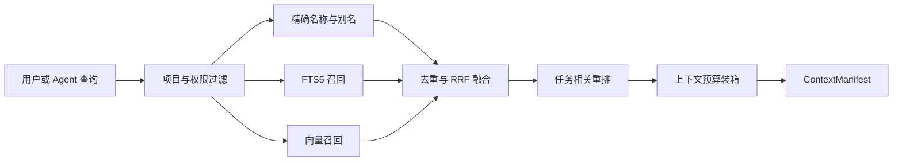

# CleoDoc 本地 RAG 与索引设计

状态：TXT/Markdown、Baseline Chunk、SQLite Chunk 与资料 FTS 已实现；Embedding 与混合 RAG 尚未实现

更新日期：2026-08-09

本文定义 CleoDoc 如何使用已经生成的纯文本 Chunk 建立本地全文、向量和混合检索，并把 LLM 使用的证据回溯到原始资料。重点回答三个问题：

1. SQLite、FTS5 和 Embedding 分别承担什么职责。
2. RAG Tool 向 LLM 暴露哪些 Chunk 信息。
3. 正式文档中的引用如何通过 Chunk 回到原始 TXT/Markdown。

TXT/Markdown 如何解析为临时 CDM、如何丢弃样式并生成纯文本 Chunk，见[资料解析与切片设计](./DOCUMENT_PARSING_AND_CHUNKING_DESIGN.md)。统一内部文档协议见 [CDM 设计](./CDM_DOCUMENT_FORMAT_DESIGN.md)；数据库表字段见[数据库设计](./DATABASE_DESIGN.md)；LLM 如何选择和调用 Tool，见 [Tool Call 技术设计](./TOOL_CALL_DESIGN.md)；实施顺序只在[开发计划](./DEVELOPMENT_PLAN.md)维护。

## 1. 设计目标

CleoDoc 的 RAG 面向单机桌面应用以及未来可能的移动端、嵌入式设备，不依赖常驻服务器或独立向量数据库服务。设计必须满足：

- 原始资料永远可以独立读取，索引损坏不会损坏资料。
- Chunk、全文索引和向量都可以从原始资料重建。
- 当前 TXT/Markdown Chunk 能通过 Source 与字节范围定位回原件。
- Source Hash 变化时，旧位置和引用不会继续伪装成有效定位。
- FTS5 失败时可以重建，Embedding 失败时全文检索仍然可用。
- 项目检索严格隔离，不返回未显式链接的其他项目内容。
- 存储结构不绑定某个尚未稳定的向量扩展。
- 在普通个人设备上控制安装包体积、内存、磁盘、CPU 和电量消耗。

## 2. 核心结论

当前设计确认以下决策：

1. **导入资料的原始文件是最高权威来源。** 临时 CDM 可以在 Chunk 入库后删除，RAG 和引用回溯不能依赖临时 CDM 或其 Node ID。
2. **Chunk 是纯文本数据库投影。** `knowledge_chunks.content` 不保存 CDM、Markdown、标题路径或格式信息。
3. **Chunk 直接回溯原件。** `source_id` 关联 Source，`start_offset` 与 `end_offset` 定位当前 TXT/Markdown 的连续原文字节范围。
4. **不为每个 Chunk 创建文件。** 正式 Chunk 正文和定位字段直接保存在 SQLite；当前 `.cleo/derived/chunks/<source-id>.chunks.json` 只是按 Source 汇总的临时检查产物，不是 RAG 存储层。
5. **FTS5 与 Chunk 使用 External Content 模式。** FTS 索引通过整数 `rowid` 引用 `knowledge_chunks`，不另存一份业务正文。
6. **Embedding 与 Chunk 分表。** 一个 Chunk 可以针对不同模型生成不同向量；但切片长度由当前模型的 Tokenizer 决定，模型、Tokenizer 或输入上限变化时可能需要重新切片。
7. **v0.1 使用 sqlite-vec 的稳定基础函数。** 向量以 Float32 Little-Endian BLOB 保存在普通 SQLite 表中，经元数据过滤后由 `vec_distance_cosine()` 执行精确余弦检索。
8. **v0.1 不创建 `vec0`，也不实现 ANN。** `sqlite-vec` 只能位于 `VectorIndex` SQLite Adapter 后面，不能渗透到领域类型和事实文件；SQLite vec1 继续保持观察。
9. **Embedding 使用 `node-llama-cpp` 加载 GGUF。** 同一个 GGUF 提供 Tokenizer 和向量推理，切片不再使用字符数作为硬上限。
10. **Source 的语言是列表。** 当前根据主要语言选择中文或英文 Embedding 模型，多语言资料分别生成多套 Embedding 的逻辑暂缓实现。

## 3. 总体数据流



数据职责如下：

| 数据 | 推荐位置 | 性质 | 是否可重建 |
|---|---|---|---|
| CleoDoc 原生 CDM 文档 | 项目文档目录（具体扩展名待定） | 可移植事实源 | 否 |
| 导入或现存 Markdown/TXT | `materials/` 等项目目录 | 原始事实源 | 否 |
| 导入资料的临时 CDM XML | `.cleo/derived/documents/<source-id>.cdm.xml`（开发期暂定） | 可选解析 Debug 产物 | 是 |
| 导入资料的临时切片预览 | `.cleo/derived/chunks/<source-id>.chunks.json`（开发期暂定） | 按 Source 汇总的可选 Debug 产物 | 是 |
| Chunk 正文和定位信息 | SQLite `knowledge_chunks` | 检索投影 | 是 |
| FTS5 倒排索引 | SQLite `knowledge_chunk_fts*` | 查询索引 | 是 |
| Embedding | SQLite `chunk_embeddings` | 模型派生物 | 是 |
| 向量虚拟表或 ANN 索引 | SQLite 扩展表 | 可选加速索引 | 是 |

`.cleo/derived` 的具体目录名可以在实现时调整，但其语义必须保持为“可删除、可重建的派生物”，不能成为原始资料的唯一副本。

## 4. 解析与 Chunk 输入边界

资料解析先生成临时 CDM 和规范化纯文本；资料导入在保存 Source 元数据前根据 CDM 正文块完成语言检测，根据主语言选择 Embedding 模型，并用该模型 Tokenizer 完成 Token 长度校验和切片。切片实现仍位于 Document Ingestion，但只依赖注入的 Tokenizer 接口，不直接依赖 `node-llama-cpp`。最终写入 RAG 的 Chunk 类型为：

```ts
interface KnowledgeChunk {
  chunkId: string;
  sourceId: string;
  ordinal: number;
  content: string;
  contentHash: string;
  startOffset: number;
  endOffset: number;
  chunkerVersion: string;
}
```

这里：

- `content` 只能是规范化纯文本，不含 CDM、XML、Markdown 或标题路径。
- `startOffset`、`endOffset` 是项目内规范化 UTF-8 TXT/Markdown 资料副本的连续字节范围。
- Source 文件 Hash 保存在现有 `sources` 表；`KnowledgeChunk.contentHash` 只校验当前 Chunk 的纯文本，两者语义不同。
- 临时 CDM 和 Node ID 不进入 RAG 公共类型，也不参与长期引用回溯。
- `chunk_rowid` 可以在数据库内部关联 FTS 和向量，但不能出现在 Tool Result 或 CDM 中。

Chunk 是 FTS、Embedding、混合召回和 LLM 证据包的候选单元。它不是事实源，也不创建独立文件；数据库损坏时从原始资料重新解析和切片。

### 4.1 资料语言

`KnowledgeSource` 使用语言列表而不是单值：

```ts
languages: Array<"zh" | "en">;
```

数组第一项是主要语言。资料元数据保存 `languages`，SQLite `sources.languages_json` 保存同一数组的 JSON 投影。`sources` 不保存 `embedding_model_id`；实际生成向量的模型只由 `chunk_embeddings.embedding_model_id` 记录。

语言检测只读取可能包含连续正文的 CDM `<p>` 和 `<blockquote>` 节点。标题、`<li>`、`<code>`、`<pre>` 和其他结构或样式节点不参与检测；当 `<blockquote>` 包含 `<p>` 时只检测内部段落，避免重复统计。

每个候选节点使用以下单位：

```text
检测单位数 = 汉字字符数 + 英文单词数
```

只有检测单位数大于软件配置 `rag.languageDetection.minBlockUnits` 的节点才参与判断，默认下限为 `50`。汉字字符数较多的节点记为中文，英文单词数较多的节点记为英文，相等时忽略。最终按有效内容量从高到低排列语言；没有节点满足条件时默认为 `["zh"]`。

当前只使用 `languages[0]` 选择模型：

```text
zh → BAAI/bge-small-zh-v1.5
en → BAAI/bge-small-en-v1.5
```

数据结构允许未来保存 `["zh", "en"]`，但同一 Source 分别使用多个模型切片、生成向量和融合检索不在本次实现范围。

### 4.2 Tokenizer 与 Token 切片

Embedding 模型使用 GGUF 格式并由 `node-llama-cpp` 加载。同一个 GGUF 同时提供 Tokenizer 和 Embedding 推理：只执行切片时可以使用 `vocabOnly: true`；生成向量时在 Worker 中完整加载一次模型，并在整个任务中复用。主线程按 `chunkBatchSize` 分批投递和接收 Chunk，但当前公开 API 仍在同一 Worker 内逐个推理；这里的任务批次不是 llama.cpp Token Batch 或多输入模型 Batch。不得为每个 Chunk 重复加载模型。

运行时优先使用发行的预编译绑定。Windows、Linux 和 Intel macOS 选择 CPU 绑定；Apple Silicon 因发行包只提供 ARM64 Metal 绑定而选择 `metal`，但模型加载仍设置 `gpuLayers: 0`。这只是选择可用的本地二进制，不表示当前 CPU Baseline 已启用 GPU 模型层推理。

切片器只依赖以下能力，不直接导入 `node-llama-cpp`：

```ts
interface EmbeddingTokenizer {
  readonly modelId: string;
  readonly modelRevision: string;
  readonly maxInputTokens: number;

  countDocumentTokens(content: string): number;
  countQueryTokens(query: string): number;
}
```

`countDocumentTokens()` 和 `countQueryTokens()` 负责模型实际输入格式及特殊 Token，切片器不写死 `[CLS]`、`[SEP]` 数量。原有 `maxChunkChars` 配置删除，任何最终 Chunk 必须满足：

```text
countDocumentTokens(chunk.content) <= tokenizer.maxInputTokens
```

原有 Baseline 结构规则保持不变：同一章节内的小块贪心向上合并；超长块先确定不超过 Token 上限的最远位置，再在其前方由 `splitSearchWindowRatio` 指定的区域内向前寻找句子、次级标点或空白边界。合并后的完整文本必须重新 Tokenize，不能把两个片段的 Token 数直接相加。

当前仍处于早期开发阶段，直接修改 `structural-baseline-v1` 的实现和测试，不保留旧字符切片逻辑，也不升级切片器版本。字符数只保留在开发期切片预览中供人工检查；通用 `token_count` 不写入 `knowledge_chunks`，因为它依赖具体模型。有效 `chunking_config_json` 必须包含 Tokenizer/模型 Revision、最大输入 Token 和切片参数，任一项变化都使当前 Chunk 索引过期。

## 5. Chunk 身份与引用边界

当前把 `chunk_id` 视为公开、稳定、不透明的标识：

- 应用重启、FTS 重建和 Embedding 重建不改变 `chunk_id`。
- 临时 CDM 删除不改变已经入库的 Chunk。
- 已使用的 `chunk_id` 不得静默复用到另一段内容。
- 资料更新和重新切片时如何继承 Chunk ID 暂缓设计。

需要严格区分：

- **索引重建**：从已有 Chunk 重建 FTS 或 Embedding，不影响身份。
- **Chunk 重建**：重新解析原始资料并切片，可能影响身份，当前不实现自动迁移。

Chunk 引用通过 `source + chunk_id` 找到数据库记录，再以该记录的 `start_offset`、`end_offset` 和 Source 的 `content_hash` 回到原始 TXT/Markdown。长期引用不能指向临时 CDM Node、FTS Row ID、Embedding 行或绝对文件路径。

## 6. SQLite 与 FTS5

### 6.1 Chunk 内容表

Source 和 Chunk 的完整字段说明以[数据库设计](./DATABASE_DESIGN.md)为准。RAG 依赖的最小 Chunk 关系为：

```sql
CREATE TABLE knowledge_chunks (
  chunk_rowid     INTEGER PRIMARY KEY,
  chunk_id        TEXT NOT NULL UNIQUE,
  source_id       TEXT NOT NULL REFERENCES sources(id) ON DELETE CASCADE,
  ordinal         INTEGER NOT NULL,
  content         TEXT NOT NULL,
  start_offset    INTEGER NOT NULL,
  end_offset      INTEGER NOT NULL,
  chunker_version TEXT NOT NULL,
  created_at      TEXT NOT NULL,
  UNIQUE (source_id, ordinal)
);
```

该表已经进入 Schema v9。Repository 写入前校验 Source Hash、资料字节长度、Chunk 顺序和原文范围，并在一个短事务中替换同一 Source 的完整 Chunk 集合。

### 6.2 External Content FTS

```sql
CREATE VIRTUAL TABLE knowledge_chunk_fts USING fts5(
  content,
  content = 'knowledge_chunks',
  content_rowid = 'chunk_rowid',
  tokenize = 'trigram'
);
```

这里的 External Content 指 FTS5 从同一个 SQLite 数据库中的 `knowledge_chunks` 读取正文，不是引用文件系统里的 Chunk 文件。FTS5 的 `*_data`、`*_idx`、`*_docsize` 和 `*_config` 仍会存在，它们是倒排索引的内部影子表，不是重复的业务表。

写入、更新和删除必须通过同一个 Repository 事务同时维护内容表与 FTS。FTS 校验失败时可以执行 `rebuild`，不能反向用 FTS 内容恢复事实源。

### 6.3 中文检索

- 普通中文片段优先使用 FTS5 trigram。
- 两字人名、短别名、编号和精确专名不能只依赖 trigram，应使用标题、人名、别名等精确字段索引补充。
- 查询必须先限制当前项目和允许的资料范围，再召回正文。
- Tool Result 返回公开的 `source`、`chunk_id`、资料标题和纯文本 `content`，不返回临时 CDM、标题路径、字节范围、SQLite Row ID、内部 FTS Rank 或实现表名。

## 7. Embedding 与向量存储

### 7.1 数据模型

Embedding 与 Chunk 分离，避免模型升级污染正文和 FTS：

```sql
CREATE TABLE embedding_models (
  embedding_model_id TEXT PRIMARY KEY,
  model_name         TEXT NOT NULL,
  revision           TEXT NOT NULL,
  created_at         TEXT NOT NULL,
  UNIQUE (model_name, revision)
);

CREATE TABLE chunk_embeddings (
  embedding_model_id TEXT NOT NULL,
  chunk_rowid        INTEGER NOT NULL,
  content_hash       TEXT NOT NULL,
  embedding          BLOB NOT NULL
    CHECK (length(embedding) > 0 AND length(embedding) % 4 = 0),
  created_at         TEXT NOT NULL,
  PRIMARY KEY (embedding_model_id, chunk_rowid),
  FOREIGN KEY (embedding_model_id)
    REFERENCES embedding_models(embedding_model_id) ON DELETE CASCADE,
  FOREIGN KEY (chunk_rowid)
    REFERENCES knowledge_chunks(chunk_rowid) ON DELETE CASCADE
);

CREATE INDEX chunk_embeddings_chunk_rowid
  ON chunk_embeddings(chunk_rowid);
```

`embedding_model_id` 标识包含具体 Revision 的模型；同名模型升级后创建新标识，不覆盖旧向量。模型表不保存 `model_hash`、维度、距离算法或推理运行参数。向量维度由 `length(embedding) / 4` 或 `vec_length(embedding)` 得到，同一模型下的维度一致性由 Repository 校验。

向量由 `node-llama-cpp` 在 Worker 中运行本地 GGUF 模型生成，以无头部的 IEEE 754 Float32 Little-Endian 连续 BLOB 保存，不使用 JSON 数组。v0.1 中文模型为 `BAAI/bge-small-zh-v1.5`，英文模型为 `BAAI/bge-small-en-v1.5`；具体 Revision 由 `embedding_models` 登记。`knowledge_chunks.content_hash` 记录当前 Chunk 纯文本 Hash，`chunk_embeddings.content_hash` 记录生成该向量时的 Hash；两者不一致时向量过期。原始空间约为 `Chunk 数量 × 维度 × 4 字节`，尚未包含 SQLite 页、索引和元数据开销。

写入时，Little-Endian 平台将 `Float32Array` 的有效内存范围映射为 `Uint8Array`，绑定到 `vec_f32(?)` 进行格式校验后保存。实现必须在边界确认本机字节序，非 Little-Endian 平台显式转换。Query Embedding 使用同一协议作为查询参数，不写入数据库。

### 7.2 v0.1 查询方式

v0.1 采用可解释、容易验证的精确搜索：

1. SQLite 按当前项目、资料类型、访问范围和 Source 状态过滤候选。
2. 只选择活动 `embedding_model_id` 且 `chunk_embeddings.content_hash = knowledge_chunks.content_hash` 的向量。
3. SQLite 使用 `vec_distance_cosine(embedding, vec_f32(?))` 计算精确余弦距离并返回 Top-K，距离越小越相似。
4. 与 FTS 结果融合后再读取需要展示和发送给模型的正文。

该方案没有 ANN 训练和索引参数；`sqlite-vec` 负责原生距离计算，但 `chunk_embeddings` 仍是普通业务表，不创建固定维度 `vec0`。它适合先验证一部作品约数万 Chunk 的真实延迟和召回。超过当前架构定义的项目级软上限时记录指标，而不是预先引入复杂索引。

### 7.3 可替换接口

```ts
interface VectorIndex {
  upsert(records: VectorRecord[]): Promise<void>;
  remove(chunkIds: string[]): Promise<void>;
  search(
    query: Float32Array,
    filter: VectorFilter,
    limit: number,
  ): Promise<VectorHit[]>;
  rebuild(model: EmbeddingModelInfo): Promise<void>;
}
```

`VectorIndex` 的公共类型只表达向量、过滤、距离和结果，不出现 `vec0`、`vec1`、`nprobe`、`nbucket`、`codesize` 等扩展专属参数。

## 8. sqlite-vec 与 SQLite vec1 的选择

截至 2026-08-07，两者都是 SQLite 扩展，不是独立向量数据库服务。

| 维度 | sqlite-vec | SQLite vec1 |
|---|---|---|
| 维护方 | Alex Garcia 社区项目 | SQLite 官方项目 |
| 当前定位 | pre-v1；提供 `vec0`、距离函数和多种语言绑定 | 0.7；提供精确 NN 与基于 IVFADC/OPQ 的 ANN |
| Node.js 集成 | 有 NPM 绑定和 Node.js 文档 | 官方文档以编译 C 扩展为主，需要自行完成 Node/Electron 集成与分发 |
| 平台目标 | 桌面、移动端、WASM 和嵌入式平台已有明确支持路径 | C 实现可移植，x86/ARM 有 SIMD；官方仍说明测试不足，WASM SIMD 等能力尚在路线图中 |
| 向量类型 | Float32、Int8、Bit | 当前以 Float32 为主 |
| ANN | 当前 `vec0` 是穷举式精确 KNN，不提供可作为基线的 ANN | IVFADC/OPQ，需要训练、参数选择和通常必需的重排 |
| CleoDoc 当前结论 | v0.1 使用基础向量校验和距离函数，不使用 `vec0` 或实验性 ANN | 保持观察，成熟后通过相同接口评测 |

最终选型：

- **现在：SQLite 普通表 + Float32 Little-Endian BLOB + sqlite-vec 精确余弦。** 这是 v0.1 正式设计。
- **sqlite-vec 的当前边界。** 只使用 `vec_f32()`、`vec_length()` 和 `vec_distance_cosine()`；不创建 `vec0`，不让固定维度虚拟表成为领域存储。必须锁定确切版本，因为官方仍标记为 pre-v1。
- **后续候选：SQLite vec1。** 官方维护是长期优势，但当前测试、打包和 ANN 训练复杂度不适合作为 CleoDoc 首版基础设施。
- 引入 `vec0`、vec1 或 ANN 前，必须用相同数据集比较 Top-K 召回、P50/P95 延迟、索引时间、内存、磁盘和各目标平台安装包增量。
- CLI 实现必须使用支持 `node:sqlite.loadExtension()` 的 Node.js 版本；Windows、macOS 和 Linux 发布前分别验证扩展加载与签名。扩展加载失败不得损坏 Chunk、FTS 或原始资料，并应返回明确的向量检索不可用错误。

官方参考：

- [SQLite FTS5](https://www.sqlite.org/fts5.html)
- [sqlite-vec](https://alexgarcia.xyz/sqlite-vec/)
- [sqlite-vec API Reference](https://alexgarcia.xyz/sqlite-vec/api-reference.html)
- [SQLite vec1 概览](https://sqlite.org/vec1/doc/trunk/doc/vec1.md)
- [SQLite vec1 User Manual](https://sqlite.org/vec1/doc/trunk/doc/vec1intro.md)

## 9. 混合检索



- 精确名称、FTS 和向量召回是并列能力，不用向量检索替代全文检索。
- 融合默认使用 RRF，避免直接比较 BM25 分数和余弦距离。
- 去重只合并重复展示，不删除不同来源的证据关系。
- 只有最终进入模型上下文的 Chunk 才记录为 ContextManifest 使用项。
- 检索失败不得阻止用户查看原始资料；只有显式选中的证据可以发送给远程模型。

### 9.1 RAG Tool Result

RAG Tool 向 LLM 返回纯文本证据和允许公开的身份：

```json
{
  "source": "src_triton_guide",
  "chunk_id": "chk_8r2v5x9m",
  "source_title": "Triton 编程指南",
  "content": "Triton 是一个用于编写高性能 GPU 内核的语言和编译器。"
}
```

默认不向 LLM 返回 Source Hash、原文字节范围、SQLite Row ID、FTS Rank、绝对路径、临时 CDM 或 Node ID。LLM 只需要复制 Tool 明确返回的 `source` 与 `chunk_id`，但模型仍可能填写不存在或不匹配的值，因此写入正式文档时必须重新验证。

### 9.2 Reference 与原文回溯

正式 CDM 支持三种引用：

- LLM Chunk 引用：同时存在 `source` 和 `chunk_id`。
- LLM 文献引用：只有 `source`。
- 用户文献引用：只有 `source`，用户不接触 Chunk 信息。

Chunk 引用的回溯链路为：

```text
<reference source + chunk_id>
→ knowledge_chunks
→ sources
→ 校验当前原始文件 SHA-256
→ [start_offset, end_offset)
→ 原始 TXT / Markdown
```

CleoDoc 自动检查 Source、Chunk、归属关系、项目范围和原始文件 Hash。不存在、归属错误或来源已经变化的引用保留为无效或过期状态，不能静默删除或改指其他 Chunk。

数据库关系正确不代表 Chunk 在语义上支持 LLM 写出的陈述。语义检查由用户主动发起；未来 GUI 的“引用修复”会让 LLM根据当前文字重新检索并提出修改建议，用户也可以直接修改文献、删除 `chunk_id` 将其降级为文献引用，或删除整个引用。完整标签语义见 [CDM 设计](./CDM_DOCUMENT_FORMAT_DESIGN.md)。

## 10. 生命周期与故障恢复

### 10.1 新增或修改资料

1. 安全保存或读取项目内原始资料。
2. 计算原始文件 SHA-256，并与 Source 当前 `content_hash` 比较。
3. 在数据库事务外解析临时 CDM，并检测符合条件的正文块语言。
4. 根据主要语言选择 GGUF 模型，加载其 Tokenizer，并按 Token 上限生成纯文本 Chunk。
5. 校验每个 Chunk 的 Token 上限和连续字节范围。
6. 以短事务切换 Source Hash、语言、Chunk 集合和 FTS。
7. 在 Worker 中使用同一模型生成缺失或过期的 Embedding。
8. 每批结果写回前重新校验 Source 与 Chunk 状态；只写入仍匹配的向量，过期结果丢弃，未完成部分由下次任务补齐。

检测到原始 Hash 变化后，新 Chunk 全部成功前不能覆盖 Source 的旧 `content_hash`。资料更新后的 Chunk ID 继承和已有引用迁移暂不实现。

### 10.2 删除资料

删除资料时，同一个受控流程必须删除当前来源的 Chunk、FTS 项、Embedding 和其他派生缓存，并列出依赖该来源的设定、章节或任务。不得只删除原始文件而留下仍可检索的孤立内容。

### 10.3 中断和损坏

- 解析、切片或 Embedding 在数据库写事务外运行。
- 应用退出或任务取消后，已完成向量保持单条原子有效，未完成 Chunk 仍表现为缺失或失效；下次任务只补齐这些 Chunk，不创建无法识别的半条向量。
- Tokenizer 或 Embedding 模型加载失败时保留原始资料，不静默退回旧字符切片。
- FTS 或向量表损坏时从已有纯文本 Chunk 重建。
- Chunk 表损坏时从原始资料重新解析和切片；开发期临时 CDM不是重建前提。
- 导入资料的临时 CDM 损坏或删除不影响现有检索和引用回溯。
- 原始资料损坏或缺失时停止重建并向用户报告，不用派生 Chunk 冒充原件。

## 11. 版本范围

当前已完成 `packages/rag` 的 `node-llama-cpp` CPU Baseline 适配层：可以从发行资源配置解析中英文 Q8_0 GGUF，按 Document/Query 两种输入计算包含特殊 Token 的实际长度，给 Query 添加模型指令，生成并归一化 `Float32Array`。资料导入已经按配置下限检测 CDM `<p>` 与 `<blockquote>` 正文块，将有序 `languages` 列表同时写入 Source 元数据和完整 Schema v9 的 `sources.languages_json`。切片器已经根据主语言选择 GGUF，以 `vocabOnly` 模式复用模型 Tokenizer，按实际 Token 上限拆分和合并，并把模型 ID、revision、上限和比例写入 Source 索引配置。Schema v9 已实现 `knowledge_chunks.content_hash`、`embedding_models`、`chunk_embeddings` 和增量 Chunk 同步；重复切片保留未变化 Row ID 与有效向量，局部变化通过 Hash 不一致使旧向量失效。Embedding Worker 已实现一次任务一次模型加载、Chunk 任务分批、逐项进度、取消和 Transferable 向量回传，且不访问 SQLite。安全写回编排已经按 Source 主语言选择模型，冻结 Source/Chunk Hash 与切片配置，并在每批短事务中重新校验后写入 Float32 Little-Endian BLOB；过期结果直接丢弃，再次运行只补齐缺失或失效向量。逐 Chunk 输入只传递 Chunk ID 和正文，模型 ID 与 Hash 留在主线程。`SqliteVectorIndex` 已通过锁定版本的 sqlite-vec 0.1.9 对普通向量表执行精确余弦检索，并在距离计算前落实项目、Source 状态、模型和 Hash 过滤。`cleo index embed/status` 已提供增量生成、进度、完整度与失败恢复，`cleo search --semantic` 已根据短 Query 的汉字/英文词占比路由中英文模型并返回距离和原文范围；安全 Debug 日志不保存 Query、资料正文或向量。步骤 7.9 的完整集成测试和性能基准仍待执行。

### v0.1

- 将 TXT、Markdown 解析为可删除的临时 CDM，固定丢弃纯展示样式。
- 检测符合长度下限的 `<p>` 与 `<blockquote>` 正文块语言，并以 `languages` 列表保存；当前按主要语言选择中文或英文 GGUF 模型。
- 使用 Embedding 模型自身的 Tokenizer 实现确定性 Baseline Chunk：超长块在 Token 上限前向前寻找自然边界，同一标题区域内的小块按 Token 上限贪心向前合并，并保留连续原文字节范围。
- 使用 `node-llama-cpp` 加载 GGUF，并以同一模型完成 Tokenize 与 Embedding。
- 实现 `knowledge_chunks.content_hash`、`embedding_models`、`chunk_embeddings`、Float32 Little-Endian BLOB，以及基于 sqlite-vec 的精确余弦检索。
- 实现 FTS 与向量的混合召回、RAG Tool 和 ContextManifest。
- 实现 `source + chunk_id` 引用校验及 TXT/Markdown 原文回溯。
- 使用 sqlite-vec 的稳定基础函数，不创建 `vec0`，不引入 vec1，不实现 ANN。

### 后续版本

- 实现 CleoDoc 自有 DOCX、带文本层 PDF 和网页快照适配器。
- 评估表格、脚注、图片说明和复杂阅读顺序。
- 在固定基准证明必要后试验 sqlite-vec 的 `vec0` 或届时稳定的 ANN 能力。
- vec1 达到可接受的稳定性和跨平台分发条件后再参与同一基准。
- 扫描 PDF OCR、模型驱动语义切块和复杂版面恢复继续保持在首版范围之外。

## 12. 验证标准

### 解析

- 固定 TXT/Markdown 样本的标题、段落、列表、引用、代码和表格边界输出可重复。
- 纯展示样式不会进入临时 CDM 或 Chunk 文本。
- 每个可检索文本都能通过 Source Hash 与字节范围定位回原始文件。
- 不支持或无法可靠解析的结构产生 warning 或 partial，不静默丢失。
- 同一原件和相同解析器版本生成相同的规范化 CDM。

### Chunk

- 不跨章节错误拼接，不在普通情况下截断句子或连续对话。
- 同一输入和同一配置生成相同 Chunk。
- 每个最终 Chunk 经当前 Embedding 模型的完整输入 Token 统计后都不超过模型上限。
- `content` 只包含纯文本，不保存 CDM、Markdown、Node ID 或标题路径。
- 每个 Chunk 对应项目内规范化 UTF-8 资料副本中的一个连续字节范围。
- Chunk 可以从原始资料重新解析和切片，不需要 Chunk 文件或持久化 CDM。

### 检索

- 精确名称、两字人物名、近义描述和正文片段都能命中相应证据。
- 关键设定测试集 Top-10 召回率不低于 90%。
- 10–15 万字正文加常规资料库保持交互级响应。
- 项目检索不返回未显式链接的其他项目资料。
- Embedding 不可用时 FTS5 仍可工作。
- 删除资料后无法再从 FTS 或向量结果中检索到该资料。
- RAG Tool 只向 LLM 返回公开的 Source、Chunk ID、资料标题和纯文本证据。
- Chunk 引用能够回到原件；Source Hash 变化时引用被标记为过期。

### 语言与模型

- 标题、列表、代码和不足长度下限的短块不会干扰资料语言判断。
- 中文、英文和中英分段资料分别得到稳定、顺序确定的 `languages`。
- 当前只按主要语言选择模型；多语言多模型索引没有被当前实现静默模拟。
- Tokenizer 或 GGUF 加载失败不会损坏原始资料，也不会生成旧字符规则的替代 Chunk。

### 向量后端评测

- 使用同一 Chunk、模型、查询和金标准比较所有后端。
- 同时记录 Recall@10、MRR、P50/P95 延迟、索引时间、峰值内存、磁盘空间和安装包增量。
- 桌面和未来移动端分别测量，不能用服务器成绩替代终端设备成绩。
- 新后端必须能够全量重建并随时回退到基础精确实现。
