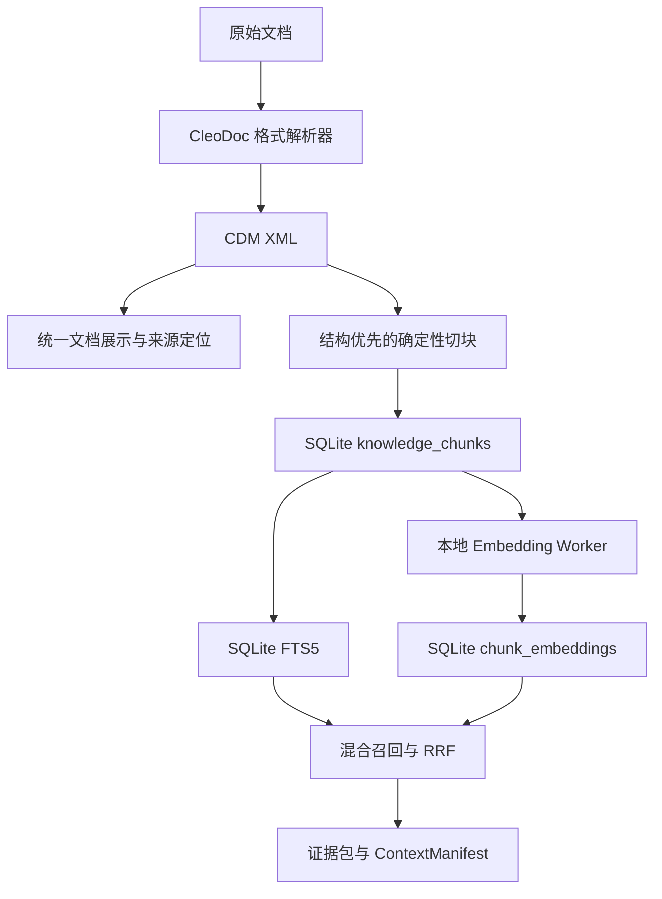
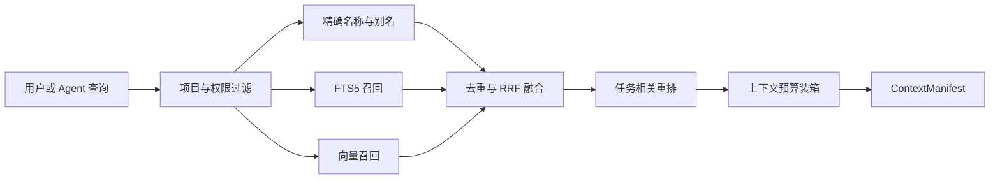

# CleoDoc 本地 RAG 文档摄取与索引设计

状态：已确认的技术设计，尚未实现

更新日期：2026-08-08

本文定义 CleoDoc 从原始资料到可检索知识的完整数据链路，重点回答三个问题：

1. TXT、Markdown、DOCX、PDF 等资料如何解析为 CleoDoc 自己的统一格式。
2. 统一格式如何稳定地切分为可检索、可引用、可增量更新的 Chunk。
3. SQLite、FTS5、Embedding、sqlite-vec 与 SQLite vec1 分别承担什么职责。

本文只描述知识摄取与检索基础设施。统一内部文档协议见 [CleoDoc Document Model（CDM）设计](./CDM_DOCUMENT_FORMAT_DESIGN.md)；LLM 如何选择和调用 Tool，见 [Tool Call 技术设计](./TOOL_CALL_DESIGN.md)；正文编辑、Draft 写入和字数统计，见[文档处理设计](./文档处理设计.md)；实施顺序只在[开发计划](./DEVELOPMENT_PLAN.md)维护。

## 1. 设计目标

CleoDoc 的 RAG 面向单机桌面应用以及未来可能的移动端、嵌入式设备，不依赖常驻服务器或独立向量数据库服务。设计必须满足：

- 原始资料永远可以独立读取，索引损坏不会损坏资料。
- 解析、切块、全文索引和向量都可以重建。
- 文本片段能够定位回原始文件、页码、段落或文本范围。
- 修改一个文档时，只更新该文档发生变化的 Chunk 和 Embedding。
- FTS5 失败时可以重建，Embedding 失败时全文检索仍然可用。
- 项目检索严格隔离，不返回未显式链接的其他项目内容。
- 存储结构不绑定某个尚未稳定的向量扩展。
- 在普通个人设备上控制安装包体积、内存、磁盘、CPU 和电量消耗。

## 2. 核心结论

当前设计确认以下决策：

1. **CleoDoc 自己拥有文档解析管线和内部文档格式。** 不采用 MinerU 等端到端解析系统作为运行时依赖，也不让第三方库的数据结构成为事实格式。可以使用 ZIP、XML、PDF 对象、字体、图片编解码等底层库，避免重复实现文件格式基础设施。
2. **导入资料的原始文件是最高权威来源。** 由解析器生成的 CDM XML 是带版本的内部派生文件，可以删除并从原始文档重建。AI 或用户在 CleoDoc 中创建的原生文档则以 CDM 为事实源。
3. **原始文档不统一转换成 Markdown 或 JSON AST。** 统一格式采用严格 XML 语法、复用 HTML 文档语义并允许 CleoDoc 扩展的 CDM。
4. **不为每个 Chunk 创建单独文件。** Chunk 是由 CDM 确定性生成的检索投影，正文保存在 SQLite 的 `knowledge_chunks.content` 中。
5. **FTS5 与 Chunk 使用 External Content 模式。** FTS 索引通过整数 `rowid` 引用 `knowledge_chunks`，不另存一份业务正文。
6. **Embedding 与 Chunk 分表。** 一个 Chunk 可以针对不同模型生成不同向量，模型升级不要求修改 Chunk。
7. **v0.1 不依赖向量扩展。** 向量先以 `Float32Array` BLOB 保存在 SQLite，经元数据过滤后在 Worker 中执行精确余弦检索。
8. **需要 SQLite 向量扩展时，优先试验 sqlite-vec；vec1 保持观察。** 两者都只能位于 `VectorIndex` 适配层后面，不能渗透到领域类型和事实文件。

## 3. 总体数据流



数据职责如下：

| 数据 | 推荐位置 | 性质 | 是否可重建 |
|---|---|---|---|
| CleoDoc 原生 CDM 文档 | 项目文档目录（具体扩展名待定） | 可移植事实源 | 否 |
| 导入或现存 Markdown/TXT | `materials/`、`manuscript/` 等项目目录 | 原始或过渡期事实源 | 否 |
| 导入的 PDF、DOCX、网页快照 | 内容寻址的原始资料存储 | 原始事实源 | 否 |
| 导入资料的 CDM XML | `.cleo/derived/documents/<source-id>/<source-hash>/document.cdm.xml`（暂定） | 解析派生物 | 是 |
| Chunk 正文和定位信息 | SQLite `knowledge_chunks` | 检索投影 | 是 |
| FTS5 倒排索引 | SQLite `knowledge_chunk_fts*` | 查询索引 | 是 |
| Embedding | SQLite `chunk_embeddings` | 模型派生物 | 是 |
| 向量虚拟表或 ANN 索引 | SQLite 扩展表 | 可选加速索引 | 是 |

`.cleo/derived` 的具体目录名可以在实现时调整，但其语义必须保持为“可删除、可重建的派生物”，不能成为原始资料的唯一副本。

## 4. 文档解析设计

### 4.1 CleoDoc 自研解析的边界

“自研文档解析”指 CleoDoc 控制以下能力：

- 格式识别与解析调度。
- 标题、段落、列表、表格、图片、脚注等结构恢复。
- PDF 阅读顺序和页眉页脚处理策略。
- 清洗、规范化、质量报告和失败降级。
- 统一 CDM Schema。
- 原文定位、Chunk 生成和增量更新语义。

它不等于从零实现 ZIP、XML、PDF 字体映射、图片解码或 Unicode。格式适配器可以调用低层解析库，但低层库的对象不得直接写入项目文件或数据库。这样既保留 CleoDoc 对文档语义的控制，也避免将大量精力投入与产品无关的二进制格式细节。

从 MinerU 等成熟项目中借鉴的是工程原则，而不是运行时依赖：分层管线、统一中间表示、阅读顺序恢复、来源坐标、质量报告、可视化调试样本和按类型评测。

### 4.2 解析器接口

```ts
interface DocumentParser {
  readonly format: SourceFormat;
  readonly parserVersion: string;

  supports(input: ParseProbe): boolean;
  parse(input: ParseInput): Promise<ParsedCdmArtifact>;
}
```

解析器必须输出通过相同 CDM Schema 校验的 XML 文档，不能把 DOCX、PDF、Markdown 各自的 AST 传给 Chunker。格式特有数据只能进入后续明确允许的来源定位或扩展结构。

### 4.3 CDM 输出

解析器输出的正文结构使用 CDM：严格 XML 语法、版本化 HTML 文本标签子集和受控的 CleoDoc 扩展。CDM 同时是 AI、用户、展示层和编辑器使用的内部文档协议，不再维护平行的 JSON 文档 AST。

CDM 的标签、属性、节点 ID、扩展方式和待确认事项见 [CDM 设计](./CDM_DOCUMENT_FORMAT_DESIGN.md)。解析器仍需提供来源格式、解析器版本、来源版本、解析状态和警告，但这些信息最终位于 CDM 文档、伴随清单还是数据库投影，需要随 CDM Schema 继续确定，当前 RAG 设计不重复定义一套结构。

基本规则保持不变：

- CDM 版本管理 CleoDoc 内部格式，不与某个解析库版本混用。
- 解析器版本变化时可以明确触发重新解析。
- 解析结果必须绑定原始来源版本，不能在来源变化后继续复用。
- 可定位的文档节点需要稳定 ID，以支持 Chunk 来源、编辑和 Diff。
- 表格既保留可检索文本，也保留行列结构。
- 解析警告是正式解析结果的一部分；无法可靠恢复的内容不得伪装为正常结果。

### 4.4 原文定位

```ts
type SourceLocator =
  | {
      kind: "page";
      pageNumber: number;
      boxes?: Array<{ x: number; y: number; width: number; height: number }>;
    }
  | {
      kind: "flow";
      paragraphIndex: number;
      runStart?: number;
      runEnd?: number;
    }
  | {
      kind: "text";
      startOffset: number;
      endOffset: number;
    };
```

- PDF 优先使用页码和坐标。
- DOCX 优先使用段落、表格和文本 Run 范围。
- TXT、Markdown 使用原始文件字符范围。该 Locator 只用于回到导入原件，不作为 CDM 编辑坐标。
- Chunk 必须保留其来源 CDM Node 和原件 Locator，不能只保存一段脱离来源的文本。

### 4.5 解析结果的写入顺序

1. 计算原始文件哈希并确认项目作用域。
2. 在数据库事务外完成解析和 Schema 校验。
3. 将通过校验的 CDM XML 写入临时文件并原子替换目标文件。
4. 以短事务更新来源、解析版本和索引状态。
5. 后台生成 Chunk、FTS 和 Embedding。

解析失败时保留原始文件和旧的可用索引代次，记录稳定错误和诊断信息。只有通过 XML 语法与 CDM Schema 校验的文档才能进入 Chunker。

### 4.6 展示策略

未来文档展示层以 CDM 为统一输入。对于导入资料，同时保留查看原始文件的能力，用于核对 PDF/DOCX 的原始排版、图片和解析准确性；CDM 展示不能使原件失去其权威地位。

## 5. Chunk 设计

### 5.1 Chunk 的职责

Chunk 同时是：

- FTS5 的最小检索单元。
- Embedding 的最小生成和复用单元。
- LLM 证据包的候选单元。
- 原文引用和增量索引的边界。

Chunk 不是新的事实源，也不是为了方便文件读取而产生的碎片文件。

### 5.2 首版切块算法

首版采用“**结构优先、长度约束、确定性输出**”的混合切块，不采用纯固定长度，也不采用需要额外模型的语义切块。

切块顺序：

1. 按卷、章节、标题、场景和表格等结构建立候选边界。
2. 保持完整段落和连续对话，尽量不在句子中间切断。
3. 超出目标上限的 Node 按子节点、段落、句子，最后才按字符强制拆分。
4. 同一结构路径下过短的相邻 Node 合并，不能跨章节盲目合并。
5. 只有边界确实需要上下文时才加入少量重叠；来源定位仍指向各自原文范围。
6. 对相同输入、解析器版本、Chunker 版本和配置生成相同结果。

现有基线参数为：正文每个 Chunk 目标 600–1200 个中文字符，资料每个 Chunk 目标 400–800 个中文字符。最终值必须通过中文小说、研究资料、表格和对话样本基准验证，不把参数写死在数据库 Schema 中。

语义切块、父子 Chunk、多粒度索引和模型生成的上下文标题均属于后续优化。只有固定测试集证明其召回收益大于额外延迟、模型依赖和不可重复性时才引入。

### 5.3 KnowledgeChunk

逻辑类型至少包含：

```ts
interface KnowledgeChunk {
  chunkId: string;
  sourceId: string;
  sourceRevision: string;
  ordinal: number;
  content: string;
  contentHash: string;
  structurePath: string[];
  nodeIds: string[];
  sourceLocators: SourceLocator[];
  chunkerVersion: string;
  tokenCount?: number;
}
```

数据库可以增加内部整数 `chunk_rowid INTEGER PRIMARY KEY` 供 FTS5 和向量表高效关联。该 Row ID 是数据库实现细节，不能作为 LLM Tool 的公共标识。

### 5.4 增量更新

- `sourceRevision` 标识 Chunk 来自哪一版文档。
- `contentHash` 标识用于检索和 Embedding 的规范化正文。
- `chunkerVersion` 或切块配置变化时明确重建，不静默混用不同算法的结果。
- 未变化的 Chunk 复用现有 FTS 条目和 Embedding。
- 内容相同但来源不同的 Chunk仍各自保留来源记录；检索阶段可以去重展示，但不能丢失证据归属。
- 异步 Embedding 写回前再次校验 `sourceRevision` 和 `contentHash`，过期结果直接丢弃。

### 5.5 为什么不创建 Chunk 文件

把每个 Chunk 存成独立文件会带来大量小文件、跨文件事务、删除残留和索引一致性问题。FTS5 也不能直接索引外部文件路径，最终仍需把内容送入 SQLite。

因此，CleoDoc 不为每个 Chunk 创建文件，Chunk 正文直接进入 SQLite 查询投影。SQLite 中的文本重复是有意的空间换查询效率；它可以从 CDM 重建，不会形成第二个权威来源。

## 6. SQLite 与 FTS5

### 6.1 Chunk 内容表

规划中的最小关系如下：

```sql
CREATE TABLE knowledge_chunks (
  chunk_rowid         INTEGER PRIMARY KEY,
  chunk_id            TEXT NOT NULL UNIQUE,
  source_id           TEXT NOT NULL,
  source_revision     TEXT NOT NULL,
  ordinal             INTEGER NOT NULL,
  content             TEXT NOT NULL,
  content_hash        TEXT NOT NULL,
  structure_path_json TEXT NOT NULL,
  node_ids_json       TEXT NOT NULL,
  source_locator_json TEXT NOT NULL,
  chunker_version     TEXT NOT NULL,
  token_count         INTEGER,
  created_at          TEXT NOT NULL,
  updated_at          TEXT NOT NULL
);
```

这是设计草案，不表示表已经进入当前数据库 Schema。真正实现时需要与项目、来源、访问范围和删除语义一并评审后提升 Schema 版本。

### 6.2 External Content FTS

```sql
CREATE VIRTUAL TABLE knowledge_chunk_fts USING fts5(
  content,
  content = 'knowledge_chunks',
  content_rowid = 'chunk_rowid',
  tokenize = 'trigram'
);
```

这里的 External Content 指 FTS5 从同一个 SQLite 数据库中的 `knowledge_chunks` 读取正文，不是引用文件系统里的 Chunk 文件。FTS5 的 `*_data`、`*_idx`、`*_docsize` 和 `*_config` 仍会存在，它们是倒排索引的内部影子表，不是重复的业务表。

写入、更新和删除必须通过同一个 Repository 事务同时维护内容表与 FTS。FTS 校验失败时可以执行 `rebuild`，不能反向用 FTS 内容恢复事实源。

### 6.3 中文检索

- 普通中文片段优先使用 FTS5 trigram。
- 两字人名、短别名、编号和精确专名不能只依赖 trigram，应使用标题、人名、别名等精确字段索引补充。
- 查询必须先限制当前项目和允许的资料范围，再召回正文。
- Tool Result 返回来源、结构路径、原文片段和公开的文档标识，不暴露 SQLite Row ID、内部 FTS Rank 或实现表名。

## 7. Embedding 与向量存储

### 7.1 数据模型

Embedding 与 Chunk 分离，避免模型升级污染正文和 FTS：

```sql
CREATE TABLE embedding_models (
  embedding_model_id   TEXT PRIMARY KEY,
  provider             TEXT NOT NULL,
  model_name           TEXT NOT NULL,
  revision             TEXT NOT NULL,
  dimensions           INTEGER NOT NULL,
  element_type         TEXT NOT NULL,
  distance_metric      TEXT NOT NULL,
  normalization        TEXT NOT NULL,
  model_content_hash   TEXT NOT NULL,
  created_at           TEXT NOT NULL
);

CREATE TABLE chunk_embeddings (
  chunk_rowid          INTEGER NOT NULL,
  embedding_model_id   TEXT NOT NULL,
  content_hash         TEXT NOT NULL,
  embedding            BLOB NOT NULL,
  created_at           TEXT NOT NULL,
  PRIMARY KEY (chunk_rowid, embedding_model_id)
);
```

`embedding_model_id` 标识包含具体 Revision 的一次模型配置；同名模型升级后创建新标识，不覆盖旧向量。向量由 `@huggingface/transformers` 在 Worker 中运行本地 ONNX 模型生成，以紧凑 `Float32Array` BLOB 保存，不使用 JSON 数组。原始空间约为 `Chunk 数量 × 维度 × 4 字节`，尚未包含 SQLite 页、索引和元数据开销。

### 7.2 v0.1 查询方式

v0.1 采用可解释、容易验证的精确搜索：

1. SQLite 按项目、资料类型、访问范围和当前 Revision 过滤候选。
2. 只读取候选 Chunk 对应模型的向量 BLOB。
3. Worker 计算精确余弦距离并返回 Top-K。
4. 与 FTS 结果融合后再读取需要展示和发送给模型的正文。

该方案没有 ANN 训练、索引参数和原生扩展打包问题，适合先验证一部作品约数万 Chunk 的真实延迟和召回。超过当前架构定义的项目级软上限时记录指标，而不是预先引入复杂索引。

### 7.3 可替换接口

```ts
interface VectorIndex {
  upsert(records: VectorRecord[]): Promise<void>;
  remove(chunkIds: string[]): Promise<void>;
  search(
    query: Float32Array,
    filter: VectorFilter,
    limit: number,
  ): Promise<VectorHit[]>;
  rebuild(model: EmbeddingModelInfo): Promise<void>;
}
```

`VectorIndex` 的公共类型只表达向量、过滤、距离和结果，不出现 `vec0`、`vec1`、`nprobe`、`nbucket`、`codesize` 等扩展专属参数。

## 8. sqlite-vec 与 SQLite vec1 的选择

截至 2026-08-07，两者都是 SQLite 扩展，不是独立向量数据库服务。

| 维度 | sqlite-vec | SQLite vec1 |
|---|---|---|
| 维护方 | Alex Garcia 社区项目 | SQLite 官方项目 |
| 当前定位 | pre-v1 alpha；提供 `vec0`、距离函数和多种语言绑定 | 0.7；提供精确 NN 与基于 IVFADC/OPQ 的 ANN |
| Node.js 集成 | 有 NPM 绑定和 Node.js 文档 | 官方文档以编译 C 扩展为主，需要自行完成 Node/Electron 集成与分发 |
| 平台目标 | 桌面、移动端、WASM 和嵌入式平台已有明确支持路径 | C 实现可移植，x86/ARM 有 SIMD；官方仍说明测试不足，WASM SIMD 等能力尚在路线图中 |
| 向量类型 | Float32、Int8、Bit | 当前以 Float32 为主 |
| ANN | 当前 `vec0` 是穷举式精确 KNN，不提供可作为基线的 ANN | IVFADC/OPQ，需要训练、参数选择和通常必需的重排 |
| CleoDoc 当前结论 | 若基准证明需要扩展，优先试验 | 保持观察，成熟后通过相同接口评测 |

最终选型：

- **现在：SQLite 普通表 + Float32 BLOB + Worker 精确余弦。** 这是 v0.1 正式设计。
- **第一候选扩展：sqlite-vec。** 原因是 Node.js、移动端和多平台分发路径更直接，但必须锁定确切版本，因为其官方仍标记为 pre-v1。
- **后续候选：SQLite vec1。** 官方维护是长期优势，但当前测试、打包和 ANN 训练复杂度不适合作为 CleoDoc 首版基础设施。
- 引入任一扩展前，必须用相同数据集比较 Top-K 召回、P50/P95 延迟、索引时间、内存、磁盘和各目标平台安装包增量。
- 某个平台无法加载扩展时必须自动使用基础精确实现；不能导致资料无法搜索。

官方参考：

- [SQLite FTS5](https://www.sqlite.org/fts5.html)
- [sqlite-vec](https://alexgarcia.xyz/sqlite-vec/)
- [sqlite-vec API Reference](https://alexgarcia.xyz/sqlite-vec/api-reference.html)
- [SQLite vec1 概览](https://sqlite.org/vec1/doc/trunk/doc/vec1.md)
- [SQLite vec1 User Manual](https://sqlite.org/vec1/doc/trunk/doc/vec1intro.md)

## 9. 混合检索



- 精确名称、FTS 和向量召回是并列能力，不用向量检索替代全文检索。
- 融合默认使用 RRF，避免直接比较 BM25 分数和余弦距离。
- 去重只合并重复展示，不删除不同来源的证据关系。
- 只有最终进入模型上下文的 Chunk 才记录为 ContextManifest 使用项。
- 检索失败不得阻止用户查看原始资料；只有显式选中的证据可以发送给远程模型。

## 10. 生命周期与故障恢复

### 10.1 新增或修改资料

1. 安全保存原始资料或事实文件。
2. 创建新的来源 Revision。
3. 解析并原子保存 CDM XML。
4. 生成新 Chunk，与旧 Chunk 比较。
5. 以短事务更新 Chunk 和 FTS。
6. 在 Worker 中生成缺失或过期的 Embedding。
7. 校验 Revision 后写回向量并切换可用索引代次。

### 10.2 删除资料

删除资料时，同一个受控流程必须删除当前来源的 Chunk、FTS 项、Embedding 和其他派生缓存，并列出依赖该来源的设定、章节或任务。不得只删除原始文件而留下仍可检索的孤立内容。

### 10.3 中断和损坏

- 解析或 Embedding 在数据库写事务外运行。
- 应用退出后，未完成任务恢复为 pending 或 failed，不写入半成品索引。
- FTS 或向量表损坏时从原始资料和 CDM 重建。
- 导入资料的 CDM 派生文件损坏时从原始资料重建。
- 原始资料损坏或缺失时停止重建并向用户报告，不用派生 Chunk 冒充原件。

## 11. 版本范围

### v0.1

- 先把现有 TXT、Markdown 资料映射到统一内部格式。
- 实现结构优先的确定性 Chunk。
- 实现 `knowledge_chunks`、FTS5、Embedding BLOB 和精确余弦检索。
- 实现 FTS 与向量的混合召回、RAG Tool 和 ContextManifest。
- 不要求 sqlite-vec 或 vec1，不实现 ANN。

### 后续版本

- 实现 CleoDoc 自有 DOCX、带文本层 PDF 和网页快照适配器。
- 评估表格、脚注、图片说明和复杂阅读顺序。
- 在固定基准证明必要后试验 sqlite-vec。
- vec1 达到可接受的稳定性和跨平台分发条件后再参与同一基准。
- 扫描 PDF OCR、模型驱动语义切块和复杂版面恢复继续保持在首版范围之外。

## 12. 验证标准

### 解析

- 固定样本文档的标题、段落、表格、页码和阅读顺序输出可重复。
- 每个可检索文本都能定位回原始文件范围。
- 不支持或无法可靠解析的结构产生 warning 或 partial，不静默丢失。
- 同一原件和相同解析器版本生成相同的规范化 CDM。

### Chunk

- 不跨章节错误拼接，不在普通情况下截断句子或连续对话。
- 同一输入和同一配置生成相同 Chunk。
- 修改单个章节只更新受影响 Chunk。
- Chunk 可以从 CDM 完整重建，不需要 Chunk 文件。

### 检索

- 精确名称、两字人物名、近义描述和正文片段都能命中相应证据。
- 关键设定测试集 Top-10 召回率不低于 90%。
- 10–15 万字正文加常规资料库保持交互级响应。
- 项目检索不返回未显式链接的其他项目资料。
- Embedding 不可用时 FTS5 仍可工作。
- 删除资料后无法再从 FTS 或向量结果中检索到该资料。

### 向量后端评测

- 使用同一 Chunk、模型、查询和金标准比较所有后端。
- 同时记录 Recall@10、MRR、P50/P95 延迟、索引时间、峰值内存、磁盘空间和安装包增量。
- 桌面和未来移动端分别测量，不能用服务器成绩替代终端设备成绩。
- 新后端必须能够全量重建并随时回退到基础精确实现。
