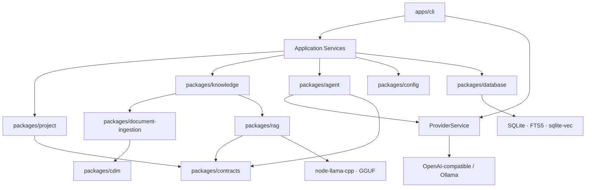
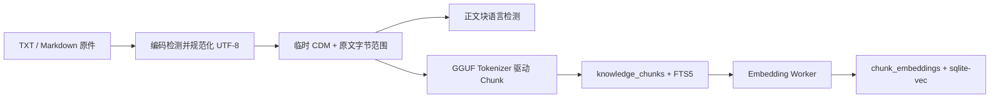
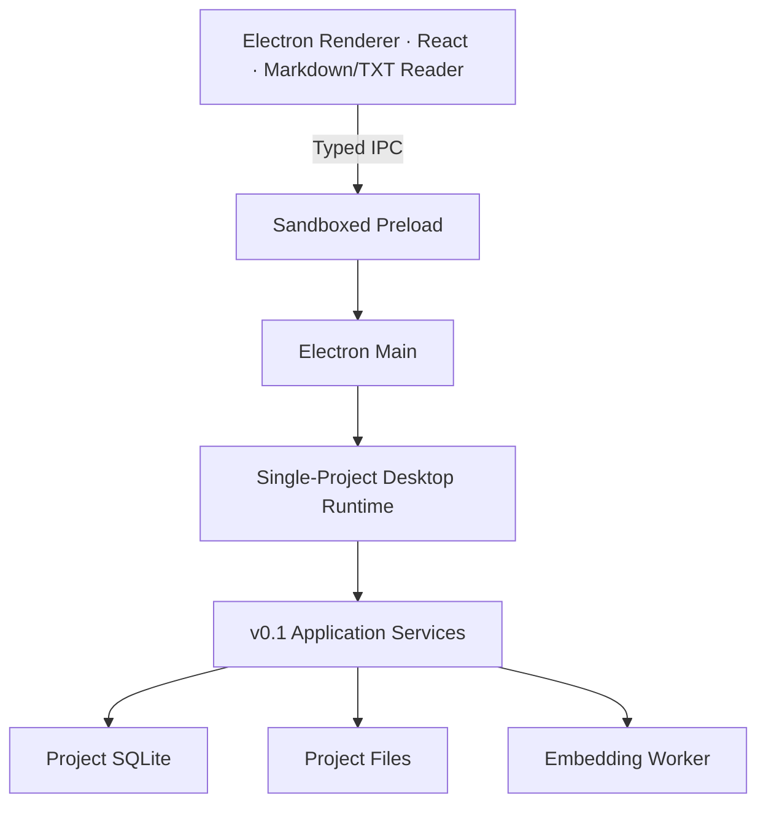

# CleoDoc 技术架构

> 基线：v0.1 CLI MVP
>
> 下一目标：v0.2 Electron Desktop
>
> 产品范围见 [PRD](./PRD.md)，实施顺序见[开发计划](./DEVELOPMENT_PLAN.md)，文档职责见[文档索引](./README.md)。

## 1. 架构目标

CleoDoc 使用 TypeScript 构建本地优先的模块化单体。v0.1 已用 CLI 验证领域 Core；v0.2 在同一套 Application Service 上增加 Electron + React，只把已有能力 UI 化，不重写项目、数据库、RAG 或 Agent 逻辑。

架构必须保证：

- 正文、资料和用户决定优先于聊天界面和索引缓存。
- 项目文件与数据库失败时可恢复，不因模型或 Embedding 失败而损坏事实源。
- 每个项目完全隔离；远程模型只接收当前任务允许的上下文。
- Provider、向量后端、编辑器和 UI 都位于可替换边界后面。
- v0.1 的 CLI 能独立发行；v0.2 Renderer 不获得本地基础设施权限。

## 2. 架构不变量

1. **Core 不依赖 UI。** `packages/*` 不依赖 Electron、React、TipTap、DOM 或 CLI。
2. **Application Service 是入口。** CLI 和未来 Desktop 调用同一服务，不跨层直接拼 Repository。
3. **文件与领域数据是事实源。** 当前作品是 Markdown/JSON，资料是保留名称和格式的 TXT/Markdown；CDM 是目标文档协议。SQLite 中的索引可以重建。
4. **SQLite 是项目级运行与检索中心。** 一个项目目录包含一个 `.cleo/project.sqlite`，保存对话、Session、ModelCall、项目指令、Chunk、FTS 和向量。
5. **远程调用最小披露。** Tool 不允许模型提供 Project ID；内部 Row ID、Source UUID、Hash、绝对路径和排序诊断不进入 LLM 可见 JSON。
6. **异步工作不占用写事务。** 模型调用、解析、Tokenize、Embedding 和 Diff 在事务外执行；提交时使用短事务并再次校验来源版本。
7. **Schema 校验位于边界。** CLI 参数、配置、事实文件、Tool 参数、Provider 数据和未来 IPC 都必须显式校验。
8. **模型不静默切换。** Provider、模型、请求选项和用量通过 ModelCall 审计。

## 3. v0.1 系统结构



### 3.1 Package 职责

| 模块 | 当前职责 |
| --- | --- |
| `apps/cli` | 参数解析、终端交互、命令组合和用户审批 |
| `packages/contracts` | 跨模块公共类型、Schema 和稳定错误码 |
| `packages/config` | 默认 YAML、用户覆盖、应用状态和进程内配置快照 |
| `packages/project` | 项目创建、路径边界、正文 CRUD 和原子文件写入 |
| `packages/database` | Schema v10、连接、事务、Repository、FTS 和 Vector Adapter |
| `packages/cdm` | 严格 XML、draft Schema、Node/Mark、Node ID、序列化和遍历 |
| `packages/document-ingestion` | TXT/Markdown 到临时 CDM、来源范围、语言检测和 ChunkDraft |
| `packages/knowledge` | 资料 CRUD、恢复、索引编排以及面向 Tool 的知识服务 |
| `packages/rag` | GGUF 模型定义、Tokenizer、Embedding Worker、混合召回和证据组装 |
| `packages/model-providers` | `ProviderService`、Provider 配置与密钥边界、实例缓存、OpenAI-compatible/Ollama 协议适配 |
| `packages/agent` | Context、Tool Catalog/Runtime、Tool Loop、Session 压缩和历史回查 |

`packages/cdm` 是叶子协议包；Document Ingestion 可以依赖 CDM，但不访问 Project 或 SQLite。RAG 从纯文本 Chunk 开始，不解析或持久化 CDM。CleoDoc 业务通过 Knowledge/Application Service 使用 RAG，不把 Repository 直接暴露给 Agent。

### 3.2 进程与生命周期

v0.1 CLI 在一个 Node.js 主进程中运行，Embedding 在 Worker Thread 中执行：

- 软件配置在命令启动时加载一次，形成进程内只读快照；当前修改配置后需要重启命令才生效。
- CLI 和 Desktop Main 只持有 `ProviderService`；具体 Provider 实例、API Key 读取和构造细节都留在 `packages/model-providers` 内。
- `ProviderService` 按当前生效配置复用一个 Provider 实例；配置修改后使缓存失效，下一次发送再构造新实例。
- 项目打开时建立项目服务、数据库连接和知识服务。
- `ProjectToolCatalog` 在应用/项目组合阶段创建一次，持有无执行状态的 Tool 实例与 Schema。
- `ProjectToolRuntime` 按 Conversation 创建并缓存，持有 `projectId + conversationId`、已加载 Tool 版本和“退出前允许”审批；不持有 Session ID。
- Session 压缩后复用同一 Conversation Runtime。
- 一次 Embedding 索引任务启动 Worker，按批次发送纯数据 Chunk，Worker 在任务内复用模型实例，不访问 SQLite。

## 4. 项目与数据所有权

### 4.1 v0.1 项目目录

```text
MyNovel.cleo/
├─ cleo.project.json
├─ manuscript/                 # 当前作品 Markdown/JSON
├─ materials/                  # 导入后保留格式与名称的资料副本
├─ sources/metadata/           # 可移植 Source 元数据
└─ .cleo/
   ├─ project.sqlite
   ├─ derived/documents/       # 可重建的临时 CDM，开发期保留
   ├─ derived/chunks/          # 可重建的 Chunk 检查文件
   ├─ logs/                    # 显式 Debug 日志
   ├─ blobs/
   └─ models/
```

用户导入的文件可以规范化为 UTF-8，但保持 TXT/Markdown 格式、去除首尾空白后的文件名和扩展名。资料 title 在单项目内唯一；重命名 title 不重命名物理文件。

### 4.2 数据分类

| 分类 | 内容 | 可重建 |
| --- | --- | --- |
| 作品事实源 | `manuscript/`、项目清单、当前项目指令 Revision | 否 |
| 资料事实源 | `materials/`、`sources/metadata/` | 否 |
| 对话与审计 | Conversation、Session、Message、Summary、ModelCall | 否 |
| 知识投影 | Chunk、FTS、Embedding、Source 索引状态 | 是 |
| 开发辅助 | 临时 CDM、Chunk JSON、Debug 日志 | 是或可删除 |

索引失败不能覆盖 Source 当前有效版本。删除资料时，先完成事实源和元数据的受控删除，再级联清理 Chunk、FTS 和向量；失败必须留下可诊断状态，不能让已删除内容继续被检索。

### 4.3 Project、Conversation 与 Session

```text
Project 1 ── N Conversation 1 ── N Session 1 ── N Message
```

- Project 是物理隔离和知识边界。
- Conversation 是用户可见的独立工作目标，共享 Project 事实源但不自动共享聊天记忆。
- Session 是 Conversation 内一次有限上下文；压缩后关闭旧 Session、创建继承累计摘要的新 Session。
- 当前历史 Tool 只检索同一 Conversation 的已关闭 Session。跨 Conversation 查询的产品语义仍待确定。

## 5. 关键运行流程

### 5.1 普通对话与 Tool Loop

1. ContextBuilder 组装 System Prompt、数据库当前项目指令、当前 Session 的累计摘要和当前消息。
2. Runtime 每轮从 Catalog 获取最新 `full` Tool 定义，并加入已通过 Catalog 加载的 Tool。
3. `ChatService` 通过统一 `send` 边界调用 `ProviderService`；内部 Provider 流式返回 Reasoning、Content 和 Tool Call，Reasoning 与 Content 分流显示和保存。
4. Tool 参数完整拼接后进行 Schema 校验、审批和执行；Runtime 注入可信的 Project/Conversation 范围。
5. Tool Result 使用统一 `{ tool, status, data | error }` 结构返回模型并写入 Message。
6. 模型继续调用 Tool，或返回有效 Assistant Content 结束回合；默认最多 8 轮。
7. 每次 Provider 请求独立记录 ModelCall；Generation 通过映射表关联多次调用。

当前 Tool 清单和 JSON 契约以 [Tool Call 设计](./TOOL_CALL_DESIGN.md)为准。

### 5.2 Session 压缩

压缩在完整 Agent 回合保存后触发，在下一次用户提交前完成。压缩期间允许编辑但禁止提交。独立 LLM 调用只接收 Message 的 Content 投影，不包含 Reasoning；Tool Result 通过各 Tool 的白名单压缩投影进入请求。

成功提交在一个事务中保存 Summary、关闭来源 Session、创建继承摘要的新 Session 并完成 CompactionJob。失败或进程中断时恢复旧 Session，不删除原始 Message。算法、预算和 Prompt 见[会话压缩设计](./SESSION_COMPACTION_DESIGN.md)。

### 5.3 资料导入与索引



解析、切片和 Embedding 均在数据库事务外执行。写回前校验 Source Hash、解析/切片配置和 Chunk Content Hash；过期结果不得覆盖新版本。临时 CDM 与 Chunk JSON 只用于开发检查，不是索引重建的唯一来源。

### 5.4 混合检索

v0.1 在 Project、`material`、可选唯一 title 和当前 Source Revision 范围内并行执行：

- Exact：精确片段与名称信号。
- FTS：SQLite trigram FTS5。
- Vector：当前语言 GGUF Query Embedding + sqlite-vec 精确余弦。

三路候选使用 RRF 融合，按 Chunk ID 合并通道，排除同一 Source 高度重合的范围，再应用来源占比、字符预算和结果数量。向量不可用时明确降级为 Exact + FTS。普通检索不持久化 Query、候选、排除项或结果；实际进入模型的证据存在版本化 Tool Result Message 中。

## 6. SQLite 架构

- 每个 Project 一个数据库，不建立跨项目共享连接或默认检索。
- 使用 Node.js `node:sqlite`、WAL、外键、`busy_timeout` 和单写入队列。
- Schema v10 是新项目基线；支持完整 v8→v9→v10 与 v9→v10 前向升级，拒绝 v7 及更早、无可信版本但已有业务表和高于 v10 的数据库。
- Conversation Message 与资料 Chunk 分别使用 External Content FTS；Content 只保存在对应普通表中。
- Message 不可修改；`message_rowid` 只供 SQLite/FTS 关联。
- Embedding 模型以 `(model_name, revision)` 唯一；Chunk 向量以模型行和 Chunk 行联合主键保存。
- sqlite-vec 只在 Vector Adapter 首次使用时短暂启用扩展加载，随后再次禁用。
- 普通检索不新增审计表；ModelCall 只保存请求与用量元数据，不复制模型输出。

完整字段和删除语义见[数据库设计](./DATABASE_DESIGN.md)。

## 7. Embedding 与配置

### 7.1 Embedding

- `node-llama-cpp` 加载中英文 BGE Small v1.5 Q8_0 GGUF。
- Document 和 Query 使用模型自身 Tokenizer；Query 由模型定义提供检索前缀。
- Chunk 最大长度由当前模型 `maxInputTokens` 决定，统计包含模型特殊 Token 和必要前缀。
- 模型输出使用 llama.cpp Embedding 接口得到已经 Pool 的向量；CleoDoc 在写入前做 L2 Normalize。
- 归一化 `Float32Array` 转为 Little-Endian BLOB；查询向量使用相同格式交给 sqlite-vec。
- `gpuAcceleration: true` 时让 llama.cpp 自动选择 GPU 后端和卸载层；关闭时强制 CPU。

### 7.2 软件配置

配置优先级为：发行默认 YAML < 用户配置 YAML < 环境变量/CLI 临时覆盖。默认文件位于 `resources/config/software-default.yaml`，用户文件位于操作系统配置目录。错误用户字段单项回退并产生警告，不覆盖用户文件。

Provider/模型能力目录维护 `contextWindowTokens`、`maxOutputTokens` 和端点。CLI 从 `CLEODOC_API_KEY` 读取 API Key；Desktop 通过 Main 进程和操作系统安全凭据能力加密持久化，Renderer 不接触密钥。Thinking、Temperature 和生成 `maxTokens` 不作为通用配置。详细规则见[软件配置设计](./SOFTWARE_CONFIGURATION_DESIGN.md)。

## 8. v0.2 目标架构



### 8.1 Desktop 边界

- Renderer 启用 sandbox、context isolation 和严格 CSP，关闭 Node integration。
- Renderer 不直接访问文件系统、SQLite、模型密钥或原始 `ipcRenderer`。
- Preload 暴露最小白名单 IPC；请求和响应均使用公共 Schema 校验。
- LLM 配置 IPC 只返回 Base URL、固定模型、密钥配置状态和用于等长掩码的字符长度；API Key 内容只在 Main 中加密、解密和消费。
- Main 负责窗口、应用生命周期和系统对话框；领域操作通过单项目 Desktop Runtime 调用现有 Application Service。
- Renderer 中的桌面聊天客户端把一次发送与其流式事件订阅绑定；`ChatPanel` 只管理当前 Conversation、草稿和界面状态，`ChatComposer` 只负责输入与提交交互。
- Main 中的 `DesktopChatService` 是桌面聊天用例入口：它从项目所属 Conversation 读取固定的 Provider/模型身份，调用 `ChatService`，并将模型事件投影为 Renderer 可见的 Reasoning/Content 流。IPC Handler 只负责请求校验、窗口绑定和响应契约。
- Conversation 首次打开时读取最近 20 条可见消息；发送时 `ChatService` 直接返回本轮落库的 User/Assistant 消息，Desktop 不再重新查询历史。Renderer 按 Conversation 保存已加载列表，用本轮真实消息替换临时消息，因此连续发送后列表可以超过 20 条，切换 Conversation 也不会丢失本次运行中已加载的消息。
- `DesktopProjectRuntime` 负责构造并校验 Renderer-safe 的 `DesktopProjectState`；Main IPC 直接传递该可信投影，不重复解析。Preload 仍对跨进程收到的状态执行 Schema 校验，Renderer 输入和 Main 新构造的其他公共响应也继续在各自边界校验。
- Desktop Runtime 在项目打开期间将 `ChatService` 绑定到同一个项目数据库连接，只向桌面聊天用例提供当前项目的 ID、取消信号、`ChatService` 和 Conversation 查询边界；Provider、模型和上下文预算不再作为 Runtime 调用参数。
- Renderer 只提交 Conversation ID 和文本，`ChatService` 通过共享 `ProviderService` 发送，由它读取安全凭据并复用当前 Provider 实例。
- 一个应用实例只保持一个活动 Project。切换项目前必须关闭旧 Project，并释放数据库、Conversation Runtime、Worker、审批和任务状态。
- Electron 兼容性阶段验证 `node:sqlite`、sqlite-vec、`node-llama-cpp` 和 Worker 的实际承载位置；无论最终位于 Main 还是 Utility Process，都不得改变 Renderer 的产品契约。

### 8.2 作品与资料阅读

- v0.2 继续以当前 Markdown/JSON 作品和 TXT/Markdown 资料作为事实源，不执行 CDM 迁移。
- Desktop 为 Markdown 提供安全只读渲染，为 TXT 提供保留换行的只读展示。
- 作品服务补充 `.txt` 列出与读取，但不增加 TXT 编辑、富文本编辑、自动保存、Draft 或版本语义。
- Markdown 渲染结果是不可信内容，不能执行脚本、获得 Node 权限或绕过外部链接策略。

### 8.3 v0.1 能力 UI 化

- 项目、资料、对话、Session、Reasoning、Tool、RAG、项目指令、Provider 和软件配置继续由已有 Application Service 拥有。
- UI 只保存界面状态和未发送输入，不创建第二套项目、消息、资料或索引事实源。
- 长任务通过同一桌面边界报告运行、完成、失败和取消状态；必要状态显示在所属页面，不建设独立监控中心。
- ModelCall 审计和 Debug 日志保留现有存储与 CLI 行为，v0.2 不增加调用记录或诊断页面。

### 8.4 v0.3 演进边界

CDM/TipTap、Draft、Git/语义 Diff、知识图、设定审批、阶段 Agent、新 Provider 和新格式导入导出统一顺延到 v0.3。v0.2 不为这些能力增加入口、占位模块、数据库表或平行领域模型。v0.3 开始前必须重新确认这些能力的范围和顺序。

## 9. 安全、故障与性能

### 9.1 安全

- API Key 不明文进入项目、软件 YAML、数据库、日志或 Git；Desktop 加密凭据文件位于用户配置目录，操作系统保护不可用时拒绝保存。
- 所有项目路径解析后必须位于允许根目录内，并拒绝符号链接逃逸。
- 远程调用前可以还原 Provider、模型、请求选项、Tool 版本和实际证据。
- Debug 默认关闭；显式开启后写项目本地文件，鉴权 Header 必须脱敏。
- Tool 写入需要审批；当前正式正文不允许模型静默覆盖。

### 9.2 故障恢复

- LLM 超时只失败当前请求，CLI 不退出，已保存消息保留。
- 压缩失败恢复旧 Session；原始消息永不由压缩删除。
- 索引或向量失败只更新索引状态，不修改原始资料。
- Source 删除通过外键级联清理 Chunk 和向量，FTS Trigger 同步清理索引。
- Worker 返回结果写回前校验 Source/Chunk Hash，陈旧结果丢弃。
- v0.2 项目关闭和切换必须有序取消或结束长任务，避免数据库、消息和索引处于不一致状态。

### 9.3 性能与测试

- SQLite 写事务保持短小；数据库繁忙使用有界等待，不在事务中调用模型。
- Embedding Worker 按批次传递 Chunk，并在任务内复用模型。
- v0.1 使用精确向量查询；只有真实资料规模证明不足时才评估 ANN。
- 自动测试使用 Fake Provider，覆盖 Schema、路径、项目隔离、增量 Hash、FTS/向量清理、Tool Loop 和 Session 恢复。
- 固定中英文语料报告 Vector 与 Hybrid Top-1/Top-5 Recall；真实模型性能记录见[Embedding 基准](./EMBEDDING_BENCHMARK_BASELINE.md)。

## 10. 当前未决架构问题

1. Electron 中 `node:sqlite`、sqlite-vec、`node-llama-cpp` 与现有 Worker 的最终进程承载和打包方式。
2. 跨 Conversation 历史查询的范围、权限和权威等级。
3. 多语言 Source 何时生成多套 Embedding，以及不同语言结果如何融合。
4. 资料更新后 Chunk ID 的继承和既有引用迁移。
5. Generation 与 Message 的模型正文是否长期同时保留。
6. 何种规模和指标能够证明需要从精确向量检索升级到 ANN。
7. v0.3 的 CDM v1、作品迁移、Draft、版本和阶段 Agent 最终边界。

这些问题保留在对应领域文档中；本文件只记录它们对系统边界的影响，不提前给出实现。
