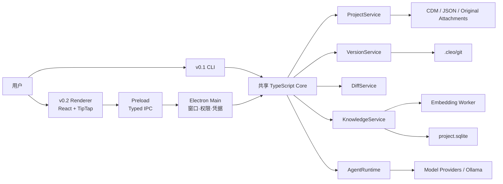
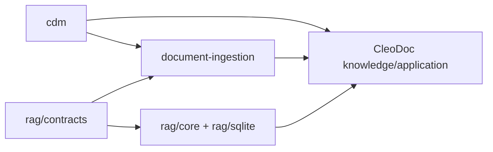
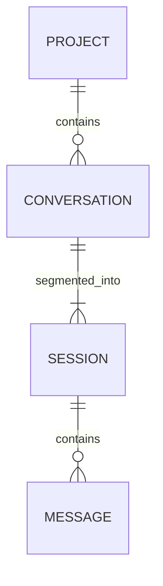
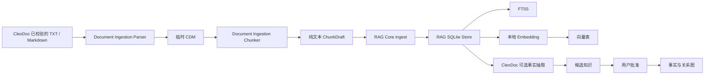
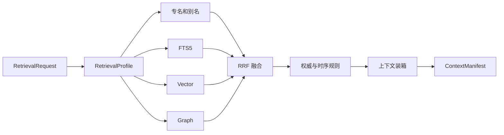

# CleoDoc 技术架构设计（v0.1 CLI / v0.2 Desktop）

> 状态：架构基线  
> 日期：2026-08-09
> 对应产品需求：[PRD.md](./PRD.md)  
> 开发计划：[DEVELOPMENT_PLAN.md](./DEVELOPMENT_PLAN.md)  
> 适用范围：CleoDoc v0.1 CLI 核心与 v0.2 Electron 桌面应用

## 1. 架构目标

CleoDoc 采用本地优先的模块化单体架构。v0.1 先通过 CLI 验证核心能力，v0.2 再增加 Electron/React 桌面交互，同时满足以下目标：

- v0.1 在 Windows、macOS 和 Linux 上提供一致的 CLI 核心体验。
- v0.2 在相同 Core 上提供跨平台桌面体验。
- 以普通文件保存可移植、可由 Git 版本管理的创作事实。
- 使用 SQLite 统一承载知识投影、全文索引、向量、关系图和 Agent 运行状态。
- 支持 8–15 万字中文小说以及常规项目资料库的增量索引和交互式检索。
- 所有 Agent 生成均可追溯输入证据、项目版本、模型和变更集。
- Agent 不得绕过用户审批直接覆盖已批准正文或设定。
- 数据库、索引或应用异常不能破坏正文与已批准设定。
- 不要求用户安装 Git、数据库、Python 或任何独立服务。

## 2. 关键架构原则

### 2.1 CLI 优先的模块化单体

v0.1 不拆分本地微服务，也不依赖 Electron。核心能力以纯 Node.js/TypeScript packages 实现，由 CLI 调用。v0.2 将相同 Core 放入 Electron Utility Process，通过清晰的模块边界保持可测试和可替换。

### 2.2 文件是创作事实源

需要进行版本管理、人工阅读或项目迁移的原生文档以 CDM 保存，结构化设定使用领域 JSON，导入资料保留原始附件。当前 CLI 已有的 Markdown/TXT 文档在 CDM 过渡方案实施前仍按现状保存，不能静默转换。SQLite 可以保存这些内容的规范化副本，但不是它们的唯一事实源。

### 2.3 SQLite 是知识与运行中心

SQLite 负责：

- 文档和设定的规范化投影。
- FTS5 全文索引、Embedding 和关系图。
- 候选事实、冲突、AgentJob、ChangeSet 和 ContextManifest。
- 可重建的 Diff、检索和展示缓存。

### 2.4 Git 对用户不可见

Git 被映射为“修改记录、命名版本、比较、撤销和恢复”。恢复历史版本必须创建新的修改记录，不允许破坏既有历史。

### 2.5 自研 RAG 薄层

RAG 核心不依赖 LangChain.js、LlamaIndex.TS、CDM 或 CleoDoc 业务对象。RAG 项目维护 Source、Chunk、索引、检索和证据定位协议；CleoDoc 在其上叠加项目权限、知识权威、关系图、ContextManifest、CDM Reference 和用户审批。

### 2.6 所有异步结果绑定版本

Embedding、事实抽取、Agent 生成和一致性检查都必须携带来源 Hash、输入 Hash、`sourceRevision` 或 `baseRevision` 中与任务相符的版本标识。过期任务的结果不得覆盖新内容。

## 3. 技术选型

| 层级 | 选型 | 用途 |
|---|---|---|
| CLI | TypeScript CLI、轻量参数解析 | v0.1 命令交互、脚本化验收和核心能力验证 |
| 桌面运行时 | Electron，初始基线 43.x | v0.2 跨平台窗口、文件、凭据和 Utility Process |
| UI | React、TypeScript | v0.2 作品工作室、知识中心、版本历史 |
| 编辑器 | TipTap / ProseMirror | v0.2 正文、批注、稳定 CDM Node ID 和编辑历史 |
| UI 状态 | Zustand | v0.2 窗口、面板、选择和临时交互状态 |
| 工作流投影 | XState | v0.2 Renderer 中展示阶段和任务状态，不作为持久化事实源 |
| 数据校验 | Zod | IPC、文件格式、模型结构化输出校验 |
| 配置 | YAML + Zod | 发行默认配置、用户逐项覆盖、应用状态分离和服务参数注入 |
| 开发构建 | TypeScript；v0.2 使用 electron-vite | CLI/Core 构建；Main、Preload、Renderer 和 Utility Process 构建 |
| 安装包 | Node.js 可执行入口；v0.2 使用 electron-builder | v0.1 CLI 分发；v0.2 Windows、macOS、Linux 桌面打包与签名配置 |
| 数据库 | Node.js 内置 `node:sqlite` | CLI 与桌面共用的项目数据库和个人资料库 |
| 全文检索 | SQLite FTS5 trigram | 中文原文和资料检索 |
| 本地 Embedding | `@huggingface/transformers` | 在 Worker 中运行 ONNX Embedding 模型 |
| Git 引擎 | isomorphic-git | 无系统 Git 依赖的版本管理 |
| 文档模型 | 严格 XML + HTML 文档语义子集的 CDM | 独立基础协议；AI、用户和解析器直接使用，RAG Core 不直接依赖 |
| 文档解析 | 独立 Document Ingestion 模块 + CDM Schema | TXT/Markdown、临时 CDM、来源定位和纯文本 ChunkDraft |
| 格式底层 | unified / remark、ZIP/XML/PDF 等低层解码能力 | 读取格式基础结构，不让第三方对象成为 CleoDoc 数据模型 |
| 测试 | Vitest；v0.2 增加 React Testing Library、Playwright | v0.1 单元与 CLI 端到端；v0.2 组件与 Electron 端到端测试 |

不采用：

- 独立图数据库。
- 独立向量数据库服务。
- 将 sqlite-vec 的 `vec0`、固定维度表或实验性 ANN 作为不可替换的领域存储格式。
- LangChain.js 或 LlamaIndex.TS 的内部 Document/Storage 模型。
- Renderer 直接访问 Node.js、文件系统、Git 或 SQLite。

## 4. 系统上下文与进程模型



### 4.1 CLI（v0.1）

负责：

- 将用户命令转换为 Core application service 调用。
- 提供项目、对话、资料、索引、检索和 Agent Tool 的可脚本化入口。
- 展示流式模型输出、引用证据、错误和任务状态。
- 不承载 SQLite、RAG 或 Provider 的业务实现。

### 4.2 Renderer（v0.2）

负责：

- 三栏作品工作室。
- TipTap 文档编辑、批注和字符级撤销。
- 知识、证据、版本和 Diff 展示。
- Agent 流式输出与任务状态展示。

约束：

- 启用 sandbox 和 context isolation。
- 不启用 Node integration。
- 不持有模型密钥。
- 不执行 SQL、Git 或任意文件路径操作。

### 4.3 Preload（v0.2）

Preload 仅通过 `contextBridge` 暴露白名单 API：

- 请求和响应均使用 Zod 校验。
- IPC channel 使用常量定义，不允许动态 channel。
- 错误转换成稳定的应用错误码，不暴露底层堆栈或路径。

### 4.4 Electron Main（v0.2）

负责：

- BrowserWindow 和应用生命周期。
- 文件选择、系统菜单、协议和单实例锁。
- 使用 `safeStorage` 保存模型凭据。
- 创建、监控和重启 Core Utility Process。
- 将 Renderer IPC 路由到 Core，不包含业务逻辑。

### 4.5 Core / Utility Process

负责所有持久化和后台业务：

- 项目文件读写和文件监听。
- SQLite 连接、Schema 基线和写入队列。
- Git 版本、Diff 和恢复。
- 文档解析、索引和混合检索。
- Agent 工作流、模型请求和 ChangeSet。
- 数据备份、恢复日志和一致性检查。

### 4.6 Embedding Worker

由 Core 创建 Worker Thread，负责：

- 下载后从本地模型目录加载 ONNX 模型。
- 批量生成 Document 和 Query Embedding。
- 生成 Document 和 Query Embedding；精确余弦距离由 SQLite Adapter 中的 sqlite-vec 执行。
- 返回纯数据，不直接写 SQLite。

Worker 崩溃不得影响 Core；Core 将当前索引任务标记为可重试。

### 4.7 软件配置组合层

`packages/config` 负责解析随软件发行的 `resources/config/software-default.yaml`、操作系统用户目录的 `config.yaml`，以及独立的 `state.yaml`。有效的用户字段按叶子覆盖发行默认值；错误字段单独回退并产生警告。

配置读取只发生在应用组合层。CLI（未来为 Electron Main/Core 启动层）把数据库等待、资料大小、Provider 超时、模型能力、上下文预算、压缩和切片参数注入底层服务。Database、Project、Material、Provider、Agent 和未来 Chunker 不直接访问 YAML 或操作系统配置目录。

模型的 `contextWindowTokens` 和 `maxOutputTokens` 由 Provider + Model 能力目录维护。API Key 统一从 `CLEODOC_API_KEY` 读取，不写入 YAML。Thinking、Temperature、生成 `maxTokens` 和当前字符 Token Estimator 暂不配置。完整约束见[软件配置设计](./SOFTWARE_CONFIGURATION_DESIGN.md)。

## 5. 代码组织

建议采用 npm workspaces：

```text
apps/
├─ cli/
└─ desktop/
   ├─ src/main/
   ├─ src/preload/
   ├─ src/renderer/
   └─ src/utility/

packages/
├─ config/          # 软件 YAML、用户覆盖、应用状态和配置路径
├─ contracts/       # 公共类型、Zod Schema、错误码和 IPC contract
├─ cdm/             # CDM Schema、XML 解析/序列化、校验、Node ID 和遍历
├─ document-ingestion/ # TXT/Markdown、临时 CDM、结构切片和 ChunkDraft
├─ project/         # 项目格式、文件读写和迁移
├─ versioning/      # Git、版本时间线、恢复
├─ diff/            # 文档语义 Diff
├─ database/        # SQLite 连接、当前 Schema 基线、Repository
├─ knowledge/       # CleoDoc 的资料编排、实体、事实、事件和关系
├─ rag/             # Contracts、Chunk/Source Store、FTS、Embedding、检索和融合
├─ agent/           # durable workflow 和 ChangeSet
├─ model-providers/ # OpenAI-compatible、Anthropic、Gemini、Ollama
└─ testing/         # fixtures、benchmark 和 test helpers
```

面向未来拆分 RAG 的关键依赖方向固定为：



具体规则：

- `cdm` 是叶子协议包，不依赖 Project、Database、RAG、Agent、Electron 或 TipTap。
- `rag/contracts` 只定义 Source、ChunkDraft、SearchHit 和公共错误，不依赖 CDM 或 CleoDoc 业务类型。
- `document-ingestion` 依赖 CDM 和 RAG Contracts，输出纯文本 `ChunkDraft`；不访问 SQLite。
- `rag/core` 和 `rag/sqlite` 依赖 RAG Contracts，不解析 CDM，也不读取 CleoDoc 的 Conversation、Message、Tool 或 UI 类型。
- CleoDoc 的 `knowledge` / Application Service 负责组合 Project 文件、Document Ingestion 和 RAG Service。
- 底层包不得反向依赖 Electron UI；包之间只能通过公开 exports 导入，不能跨包引用内部源文件。

当前不为了未来拆分而立即创建多个 Git 仓库。先在 npm workspace 中稳定这些包边界，等公共 API 和数据语义经过 MVP 验证后，再物理移动代码。

## 6. 项目文件与数据所有权

### 6.1 项目目录

```text
MyNovel.cleo/
├─ cleo.project.json
├─ manuscript/
│  ├─ book.cdm.xml
│  ├─ volume-01/
│  │  ├─ chapter-001.cdm.xml
│  │  └─ chapter-002.cdm.xml
│  └─ volume-02/
│     └─ chapter-010.cdm.xml
├─ canon/
│  ├─ characters/
│  ├─ locations/
│  ├─ rules/
│  ├─ events/
│  └─ plot-threads/
├─ materials/
├─ reviews/
├─ sources/
│  ├─ metadata/
│  └─ linked/
└─ .cleo/
   ├─ git/
   ├─ project.sqlite
   ├─ blobs/
   ├─ proposals/
   ├─ models/
   └─ recovery-journal.json
```

### 6.2 数据分类

| 分类 | 数据 | 持久化 | Git |
|---|---|---|---|
| 创作事实 | 正文、大纲、委托书、研究笔记 | CDM；书籍默认每章一个文件，`book.cdm.xml` 保存结构；当前 Markdown 文档待制定过渡方案 | 是 |
| 权威设定 | 人物、规则、事件、伏笔 | JSON | 是 |
| 原始附件 | PDF、DOCX、网页快照 | `.cleo/blobs/<sha256>` | 否，Git 只记录元数据 |
| 解析派生物 | 导入资料的 CDM | `.cleo/derived/documents/` | 否，可重建 |
| 知识投影 | Chunk、实体、事实、关系 | SQLite | 否，可重建 |
| 检索索引 | FTS、Embedding | SQLite | 否，可重建 |
| 运行状态 | AgentJob、ChangeSet、索引任务 | SQLite | 否，不可随意删除 |
| 审计记录 | 批准记录、精简 ContextManifest | JSON + SQLite | 精简版本进入 Git |
| 缓存 | Diff、检索结果 | SQLite | 否，可回收 |

个人资料库存放于应用数据目录下的 `personal-library.sqlite`。项目必须将用户明确链接的个人资料复制为带哈希的快照后再参与项目检索。

### 6.3 Project、Conversation 与 Session 归属模型

Project 是物理存储、数据隔离和生命周期的最外层边界。一个 Project 对应一个项目目录和一个 `.cleo/project.sqlite`，目录内包含项目配置、作品正文、资料和未来的 Git 数据。Conversation 与 Session 都不能脱离 Project 独立存在。



关系约束：

- 一个 Project 可以拥有多个 Conversation，一个 Conversation 只属于一个 Project。
- 一个 Conversation 可以拥有多个 Session，一个 Session 只属于一个 Conversation。
- Conversation 创建时产生第一个 Session；上下文压缩成功后关闭当前 Session，并在同一 Conversation 中创建下一个 Session。
- 每个 Conversation 最多有一个 `active` 或 `compacting` Session。
- `messages.sequence` 在整个 Conversation 内单调递增，不因创建新 Session 重新计数。

语义边界：

- Project 保存跨 Conversation 共享的长期资产，包括当前项目指令、正文、资料、批准设定和其他项目级知识。
- Conversation 保存具有独立工作目标的用户可见对话和工作记忆。
- Session 只是 Conversation 的上下文窗口分段，不是新的用户任务或新的对话入口。
- 新 Session 通过累计摘要保持原 Conversation 的语义连续性。
- 新 Conversation 不继承其他 Conversation 的消息或 Session 摘要，但可以读取同一 Project 的项目级资产。
- 用户继续同一任务时应恢复原 Conversation；只有在主动切换任务、隔离实验方案或重置工作记忆时才创建新 Conversation。

当前 `conversation_message_fts` 的查询范围保持为指定 Conversation 的已关闭 Session，不能跨 Conversation 或 Project。架构保留未来在同一 Project 内按需查询其他 Conversation 历史的能力，但具体 Tool、触发条件、检索范围、权限、Schema 和权威规则均待后续评审，当前不提前实现跨 Conversation 查询。

## 7. SQLite 架构

当前 Schema v9 基线已落地的表、字段、索引、两类 External Content FTS、ModelCall 审计和已识别问题，详见 [DATABASE_DESIGN.md](./DATABASE_DESIGN.md)。本节同时包含尚未实现的长期 Schema 规划，两者不得混为当前功能。

### 7.1 数据库拓扑

- 每个作品一个 `project.sqlite`。
- 全局个人资料一个 `personal-library.sqlite`。
- 不把所有作品放入同一数据库。
- 不对个人资料库进行长期实时 `ATTACH`；链接后使用项目快照。
- 数据库仅允许 Core Utility Process 访问。

### 7.2 连接与事务

项目数据库启动配置：

```sql
PRAGMA journal_mode = WAL;
PRAGMA foreign_keys = ON;
PRAGMA busy_timeout = 5000;
PRAGMA synchronous = FULL;
```

规则：

- `ProjectDatabase` 是唯一写入者，通过 FIFO `DatabaseWriteQueue` 串行提交。
- 查询使用短生命周期只读连接或短事务。
- 模型调用、文件解析、Embedding 和 Diff 计算不得位于写事务内。
- 批量索引以 50–200 个 Chunk 为一个事务，根据基准测试调整。
- Core 空闲时执行被动 checkpoint；关闭项目前执行完整 checkpoint。
- 项目必须位于本机文件系统；检测到网络路径时阻止以 WAL 模式直接打开。

### 7.3 Schema 分区

```text
内容镜像
├─ documents
├─ document_nodes
├─ sources
└─ chunks

检索
├─ chunk_fts
├─ chunk_embeddings
├─ embedding_models
├─ retrieval_runs
└─ context_manifest_items

知识图
├─ entities
├─ entity_aliases
├─ facts
├─ fact_evidence
├─ relations
├─ events
├─ event_participants
├─ character_states
└─ narrative_threads

Agent
├─ agent_jobs
├─ agent_job_steps
├─ change_sets
├─ change_set_items
├─ context_manifests
└─ knowledge_candidates

版本投影
├─ project_revisions
├─ named_versions
├─ document_index_states
└─ diff_cache

基础设施
├─ schema_migrations
├─ index_jobs
└─ app_metadata
```

### 7.4 Schema 演进、备份和重建

- 当前早期开发阶段以 v8 为当前基线：新库直接创建完整结构，完整 v8 数据库原样打开。v7 及更旧、不带版本但已有业务对象或更高版本的数据库均拒绝且不自动改写。
- 正式发布后的内容表和运行表执行带备份的前向迁移；索引表允许丢弃后重建。
- 项目打开时执行轻量 `quick_check`，异常时进入只读恢复模式。
- 备份必须使用 Backup API 或 `VACUUM INTO`，不能只复制打开中的主数据库文件。
- `rebuild-index` 从原生创作 CDM、领域 JSON 和导入原始资料重建 Chunk、FTS、Embedding 和关系投影；导入资料的临时 CDM 不是重建前提。

### 7.5 v0.1 资料事实源与投影

步骤 5 将资料正文保存为 `materials/<material-id>.txt|md`，并将对应的 `KnowledgeSource` 元数据保存为 `sources/metadata/<material-id>.json`。元数据包含项目 ID、标题、来源标签、原文件名、标签、格式、相对路径、内容哈希、字节数和时间。

SQLite `sources` 表只作为管理和后续索引使用的投影。`MaterialService` 打开时读取并校验元数据、项目归属、路径、UTF-8 内容、字节数和哈希，然后同步 SQLite。添加、重命名和删除采用原子文件写入并在数据库失败时回滚当前操作；进程在文件与数据库更新之间中断时，下次打开以文件事实源校准投影。

### 7.6 RAG 表所有权与数据库注入

原始资料文件及 `sources/metadata/*.json` 仍是 CleoDoc Project/MaterialService 管理的项目事实源；SQLite `sources` 只是它面向索引的投影。该投影以及 `knowledge_chunks`、`knowledge_chunk_fts`、Embedding 模型与向量表由 RAG 子系统拥有。当前这些表可以继续位于项目的同一个 `project.sqlite`，但模块边界不能依赖“同库”这一部署细节：

- CleoDoc 业务代码只通过 `RagService` 使用 Chunk、FTS、Embedding 和引用解析，不直接执行 RAG 表 SQL。
- RAG Repository 只访问自己拥有的表，不查询 Conversation、Session、Message、Generation、项目指令或其他 CleoDoc 运行表。
- SQLite 连接和写入队列可以由 CleoDoc 注入，RAG 模块拥有自己的建表 SQL、Repository 和可重建索引逻辑。
- CDM `<reference>` 只保存公开 `source`、`chunk_id`，不保存或外泄 `chunk_rowid`。
- Project 路径解析、原始资料安全读写和用户审批仍由 CleoDoc 负责；RAG 只接收经过项目边界校验的 Source 描述和内容流。

未来抽取独立项目时，可以把这些表移动到独立 `rag.sqlite`，也可以继续让 RAG 使用宿主注入的 SQLite。两种部署都必须保持相同的 `RagService` API，CleoDoc 不应因为物理数据库变化而修改业务流程。

## 8. 自研 RAG 架构

> 实现状态：上游 TXT/Markdown Document Ingestion、Baseline 结构切片、资料 Chunk 入库和资料 FTS 已实现；切片结果仍按 Source 写入 `.cleo/derived/chunks` 供人工检查。正文 FTS、本地 Embedding、混合检索和 `ContextManifest` 尚未实现。`conversation_message_fts` 继续只服务于同一 Conversation 的已关闭 Session 历史回查，不是作品知识 RAG。

### 8.1 独立项目目标与模块边界

长期目标是把本地 RAG 抽取为可独立使用的项目，CleoDoc 作为宿主依赖它。独立 RAG 项目可以同时提供 Source 管理、摄取、SQLite 存储、FTS、Embedding 和检索，但内部必须继续区分：

- **RAG Contracts**：不依赖 CDM 的 Source、ChunkDraft、SearchHit、引用解析和错误协议。
- **Document Ingestion**：TXT/Markdown 解析、临时 CDM、纯样式丢弃、结构切片和原文字节范围。它属于未来 RAG 项目的摄取生态，但不是 RAG Core。
- **RAG Core**：接收纯文本 ChunkDraft，分配并持久化公开 Chunk ID，维护索引并执行检索；不解析 CDM。
- **RAG SQLite Adapter**：拥有 RAG 表、FTS、Embedding BLOB 和 Repository，可以接受宿主注入的数据库连接。
- **CleoDoc Integration**：连接项目文件、Document Ingestion、RAG Service、CDM `<reference>`、Tool、用户审批和未来 GUI。

Document Ingestion 随未来 RAG 项目一起抽取，但保持独立包或独立内部模块，使已经拥有结构化内容的调用方可以绕过解析器，直接提交 ChunkDraft。

CDM 不归属于 RAG Core，也不能放在 CleoDoc Application Service 内部。它是一个可独立版本化的基础协议包：

- 包含 CDM 标签、属性、Schema 版本、XML 解析/序列化、校验、Node ID、遍历和可见文本基础能力。
- 不包含文件系统、项目路径、TXT/Markdown 解析、Chunk、SQLite、Embedding、Tool、TipTap 或 Electron。
- `<reference>` 的 XML 结构属于 CDM；Source/Chunk 是否存在、引用是否有效以及“引用修复”属于 CleoDoc 与 RAG 的集成逻辑。
- 当前先作为 `packages/cdm` 维护；只有当 RAG 公共 API 稳定并需要独立发布时，再决定是否拆成第三个 Git 仓库或单独发布包。

### 8.2 RAG Core 公共边界

RAG Core 不接收 CDM XML，只接收已经去除格式的 Source 与 ChunkDraft：

```ts
interface SourceDescriptor {
  sourceId: string;
  title: string;
  format: "text" | "markdown";
  contentHash: string;
  size: number;
}

interface ChunkDraft {
  ordinal: number;
  content: string;
  startOffset: number;
  endOffset: number;
  chunkerVersion: string;
}

interface RagService {
  ingest(
    source: SourceDescriptor,
    chunks: readonly ChunkDraft[]
  ): Promise<IngestResult>;

  search(request: SearchRequest): Promise<SearchHit[]>;

  resolveReference(
    sourceId: string,
    chunkId: string
  ): Promise<ResolvedChunkReference>;

  deleteSource(sourceId: string): Promise<void>;
}
```

Document Ingestion 输出 `ChunkDraft`，最终公开 `chunk_id` 由 RAG Core 分配并持久化。这样资料更新、重新切片、Chunk 失效和 ID 迁移的长期规则由 RAG 项目统一负责，不泄漏到解析器或 CleoDoc UI。

`RagService` 不接受 Project、Conversation、Session、CDM Node、ToolContext 或 Electron 对象。CleoDoc 在调用前完成项目隔离、路径校验和授权，再传入普通数据。

### 8.3 检索接口

```ts
interface Retriever {
  retrieve(request: RetrievalRequest): Promise<RetrievalHit[]>;
}

interface VectorIndex {
  upsert(records: VectorRecord[]): Promise<void>;
  remove(chunkIds: string[]): Promise<void>;
  search(query: Float32Array, filter: VectorFilter, limit: number): Promise<VectorHit[]>;
  rebuild(model: EmbeddingModelInfo): Promise<void>;
}

interface ContextAssembler {
  assemble(
    request: RetrievalRequest,
    candidates: RetrievalHit[],
    budget: ContextBudget
  ): Promise<ContextManifest>;
}
```

### 8.4 摄取流水线

统一内部文档协议见 [CDM 设计](./CDM_DOCUMENT_FORMAT_DESIGN.md)；TXT/Markdown 解析、临时 CDM、纯文本切片和原文定位见[资料解析与切片设计](./DOCUMENT_PARSING_AND_CHUNKING_DESIGN.md)；FTS5、Embedding 和向量后端见[本地 RAG 设计](./LOCAL_RAG_INGESTION_DESIGN.md)。



临时 CDM 的生命周期在 Document Ingestion 内结束。RAG Core 从 `ChunkDraft` 开始工作，不导入 CDM 包，也不把 CDM 标签、Node ID 或 Markdown 写入 Chunk。实体与事实抽取属于 CleoDoc 的知识能力，可以消费 RAG Chunk，但不能反向成为 RAG Core 的必要依赖。

v0.1 导入资料使用基于块级段落结构的确定性 Baseline Chunker。它只执行两种操作：超过软件配置上限的大块在上限前的自然边界递归拆分；同一标题区域内的小块按原文顺序贪心合并到上一个 Chunk。首版取消最短长度和尾块重平衡，默认最大长度为 `800` 个规范化纯文本 Unicode 字符，默认从上限的 `75%` 位置开始向上限方向选择自然边界。TXT 不猜测标题，所有 `<p>` 在整个文档范围内使用普通合并规则。完整算法以[资料解析与切片设计](./DOCUMENT_PARSING_AND_CHUNKING_DESIGN.md)为准。

导入资料 Chunk 保存公开 `chunk_id`、`source_id`、顺序、纯文本 `content`、项目内 UTF-8 资料副本的字节范围和 Chunker 版本；Source 表保存该规范化副本的 SHA-256。Chunk 不保存临时 CDM、Node ID、Markdown 或标题路径。有效切片配置必须参与索引是否过期的判断，具体持久化字段随下一次 Chunk Schema 评审确定。正文是否采用不同切片参数留待正文检索进入实现范围后通过固定测试集确定，不与当前资料 Baseline 混为同一配置。

### 8.5 Embedding

```ts
interface EmbeddingProvider {
  readonly modelId: string;
  readonly dimensions: number;
  embedDocuments(texts: string[]): Promise<Float32Array[]>;
  embedQuery(text: string): Promise<Float32Array>;
}
```

- 默认实现使用 Transformers.js 的 `feature-extraction` pipeline，在 Worker 中进行 mean pooling 和 normalize。
- 模型首次使用时由用户确认下载，模型文件进入应用模型缓存。
- `modelId`、模型名称和 revision 写入 `embedding_models`；维度由向量 BLOB 长度获得，量化、归一化和推理运行参数不复制进模型表。
- 不同模型生成的向量不得混合查询。
- 更换模型时创建新的索引代次，旧 FTS 检索保持可用，完成后原子切换。

### 8.6 向量查询

v0.1 使用普通 SQLite 表保存 IEEE 754 Float32 Little-Endian BLOB，并由 SQLite Adapter 加载固定版本的 sqlite-vec，对过滤后的候选执行精确余弦检索：

- 先由 SQLite 根据项目、类型、权威、人物和时间过滤。
- 只使用活动模型且 Chunk Hash 与生成向量时一致的记录。
- 通过 `vec_f32()` 校验向量，通过 `vec_distance_cosine()` 计算并排序；Query 向量只作为 BLOB 参数传入。
- 项目级软上限为 5 万个 Chunk。
- 超过阈值时提示用户优化资料库，并记录 ANN 后端迁移指标。
- 当前不创建固定维度的 `vec0` 虚拟表，也不实现 ANN。`VectorIndex` 隔离存储实现；若真实基准证明需要索引加速，再评估 sqlite-vec 的稳定索引能力或 SQLite vec1，两者都不能成为不可替换的领域存储格式。

### 8.7 混合召回



预置 `RetrievalProfile`：

- `draft-scene`
- `canon-question`
- `consistency-check`
- `research`
- `revision-impact`

每路默认召回 20–50 个候选，使用 Reciprocal Rank Fusion：

```text
score = Σ weight(source) / (60 + rank)
```

融合后应用硬规则：

- 用户锁定和已批准设定不得被低权威内容覆盖。
- 当前场景相关人物、时间和邻近章节加权。
- 相同来源和高度重合 Chunk 去重。
- 冲突证据同时保留并显式标记。
- 单个来源不得耗尽整个上下文预算。

### 8.8 ContextManifest

所有模型调用必须保存：

```ts
interface ContextManifest {
  id: string;
  agentJobId: string;
  projectRevision: string;
  profile: RetrievalProfile;
  originalQuery: string;
  rewrittenQueries: string[];
  embeddingModelId: string;
  items: ContextManifestItem[];
  excludedItems: ExcludedContextItem[];
  tokenEstimate: number;
  createdAt: string;
}
```

Manifest 记录纳入和排除依据，使 Agent 生成结果能够审计和复现。

### 8.9 物理拆分路线

模块拆分分三步推进：

1. **Monorepo 边界**：在当前仓库建立 `cdm`、`document-ingestion`、`rag` 的公开 exports 和依赖约束，CleoDoc 通过 `RagService` 使用 RAG，不直接访问内部 Repository。
2. **独立运行验证**：为 RAG 提供不依赖 CleoDoc Project、Conversation、Tool 或 Electron 的集成测试入口，使用内存 Source/Chunk 样本和独立 SQLite 临时库验证摄取、检索、删除与重建。
3. **移动仓库**：公共 API 稳定后，将 `document-ingestion` 和 `rag` 移入独立 RAG 仓库；CDM 继续作为版本化依赖，是否单独拆仓库由发布和复用需求决定。

终态中，CleoDoc 只依赖 RAG 的公共包或客户端接口。RAG 的物理数据库从 `project.sqlite` 移到 `rag.sqlite`、独立进程甚至其他宿主时，不要求修改 CleoDoc 的创作、Reference、Tool 或 GUI 领域逻辑。

## 9. v0.2 知识图与权威模型

知识优先级固定为：

```text
用户锁定决定
> 已批准设定
> 已批准规划
> 用户直接修改
> 已接受正文事实
> 可信资料
> AI 候选事实
> AI 推断
```

关系不是简单的静态三元组，必须支持故事时间和人物认知：

```ts
interface Relation {
  id: string;
  projectId: string;
  subjectId: string;
  predicate: string;
  objectId: string;
  validFromEventId?: string;
  validToEventId?: string;
  knowledgeOwnerId?: string;
  authority: CanonAuthority;
  status: 'candidate' | 'approved' | 'rejected' | 'superseded';
  evidenceIds: string[];
}
```

- 关系查询使用带 `project_id` 的组合索引。
- 默认限制为 1–3 跳并执行循环检测。
- “世界真实状态”和“角色知道的状态”分别查询。
- 不直接覆盖旧状态；通过有效事件范围表达变化。
- 高频的当前人物状态可以物化，但可从事件和关系重建。

## 10. v0.2 Git 版本架构

### 10.1 仓库与语义映射

`VersionService` 使用 isomorphic-git，Git 目录位于 `.cleo/git`，工作树为项目根目录。

| 用户概念 | Git 实现 |
|---|---|
| 修改记录 | 语义化 commit |
| 命名版本 | 内部 UUID annotated tag |
| 修改历史 | commit log 投影 |
| 恢复版本 | 应用旧 tree 后创建新 commit |
| 撤销上次修改 | 应用反向变化后创建新 commit |

自动保存不等于 commit。以下事件创建修改记录：

- 用户完成一段连续编辑并切换文档或关闭项目。
- 接受 Agent ChangeSet。
- 批量确认知识候选。
- 批准创作阶段。
- 执行恢复前保存当前未记录内容。

### 10.2 恢复事务

```text
获取项目写锁
→ flush Renderer 编辑内容
→ 提交当前未记录修改
→ 暂停文件监听
→ 写 recovery journal
→ 应用目标 Git tree
→ 创建恢复 commit
→ 计算 changedPaths
→ 标记对应索引 stale
→ 清除 recovery journal
→ 恢复文件监听
→ 发布 ProjectRevisionChanged
```

任何阶段异常退出时，项目下次打开根据 recovery journal 完成或回滚操作。

## 11. v0.2 文档语义 Diff

Git 只提供文件树和 Blob，`DiffService` 负责文档语义对比：

1. 项目级：新增、删除、修改和重命名。
2. 章节级：新增、删除、移动和重命名。
3. 节点级：稳定 CDM Node ID 或相似度匹配。
4. 行内级：中文句子、词语和 Unicode 字符变化。

```ts
interface DocumentDiff {
  from: VersionRef;
  to: VersionRef;
  files: FileDiff[];
  summary: DiffSummary;
  algorithmVersion: string;
}
```

- 默认显示行内模式，可切换左右同步模式。
- Diff 缓存键为 `fromRevision + toRevision + algorithmVersion`。
- Agent ChangeSet 与历史版本比较使用同一 Diff 引擎。
- v0.2 支持整体和按文档恢复；不支持按句子恢复或接受。

## 12. Agent 运行时

Project、Conversation 与 Session 的归属和语义边界见 [6.3](#63-projectconversation-与-session-归属模型)。Tool 的领域边界、Schema、结果、副作用和运行规则统一遵循 [Tool Call 技术设计](./TOOL_CALL_DESIGN.md)。自动上下文压缩和同 Conversation 内的历史回查见 [SESSION_COMPACTION_DESIGN.md](./SESSION_COMPACTION_DESIGN.md)。项目指令现在以 SQLite 追加式 Revision 为事实源，Session 不保存文件路径或文件快照，详见[数据库设计](./DATABASE_DESIGN.md#611-project_instruction_revisions)。

v0.1 的 Schema v9 保留 v8 已确定的会话结构，并新增资料 Chunk 与 FTS。会话部分包含 `conversations`、`conversation_sessions`、单一 Markdown 正文的 `session_summaries`、`compaction_jobs`、不可变 `messages`、逐次 `model_calls`、External Content `conversation_message_fts` 与数据库项目指令 Revision。一个 Project 可以保存多个 Conversation；`ChatService` 只组装当前 Conversation 的 active Session，并按该 Session 的 `inherited_summary_id` 精确读取一份累计摘要，不自动注入其他 Conversation、旧 Session 或按时间猜测的摘要。普通主笔调用将 Provider 暴露的 Reasoning 与最终 Content 分流显示和保存；Assistant Tool Call 的 Reasoning 按 Provider 协议在下一轮回传，普通历史 Reasoning 不默认重发，也不进入压缩、FTS 或作品文档。`CompactionService` 使用同一 Provider/模型发起无 Tool 的独立调用。`session-compaction-v7` 的普通、分段和归并请求只发送明确投影的 Message `role/content`；Tool Result 通过具体 Tool 的 `getCompactionMessage()` 投影为名称、版本、状态、更新时间、数量和读取范围等必要元数据，文档 Hash、正文、历史片段、项目指令内容、Message ID 与未知 Tool 原文不会进入压缩请求。超大 Session 使用 `session-compaction-v8-turn-segmentation` 编排：优先按完整用户回合分段，以压缩请求安全输入上限 `M` 的 80% 作为 Segment 装箱目标，并在发送前校验最终 Payload 不超过 `M`；单条超长正文只在 Unicode 安全语义边界降级切分，Tool Call 与对应 Tool Result 保持原子性。压缩调用显式关闭 Thinking，不启用 JSON Mode，也不设置 Provider 输出 Token 上限；流式 `text-delta` 完整拼接为 Markdown `summary` 后，在最低校验前写入显式 Debug 文件。每次普通、Tool Loop、分段和归并 Provider 请求都有独立 ModelCall，并通过业务映射表关联 Generation 或 CompactionJob。摘要成功后，服务从 CompactionJob 冻结快照取得来源 Session、消息边界、Prompt、Provider 和模型，在一个事务中保存摘要、关闭旧 Session、创建继承该摘要的新 Session 并完成 Job；进程中断后未完成任务会被标记失败，旧 Session 恢复为 active。

模型上下文窗口的全局默认值为 1,000,000 Token；默认预留 384,000 Token 模型输出、32,768 Token 下一次用户输入和 5% 安全余量，软压缩比例/硬阻塞比例为 75%/90%。由此得到 566,000 Token 安全输入容量，当前 Payload 触发点分别约为 391,732 Token 和 476,632 Token；压缩请求安全输入上限 `M` 约为 565,424 Token，最终累计摘要长度建议目标为 8,000 Token。CLI 的 `--context-window-tokens` 和环境变量 `CLEODOC_MODEL_CONTEXT_TOKENS` 可以显式覆盖；较小窗口按比例缩放固定预留上限。预算值只用于本地触发与分段检查，不会作为 Provider 输出长度参数发送。

### 12.1 v0.1 前台 Tool Loop

v0.1 在 CLI 前台执行单任务 Tool Loop。应用/项目初始化时创建一个 `ProjectToolCatalog`，一次性持有所有无执行状态的业务 Tool 并缓存 Schema；Catalog 自身以 `project_tool_catalog` 组合 Tool 暴露 `list/get` 操作。`ProjectToolRuntime` 按 Conversation 创建和缓存，同一 Conversation 的多次发送及 Session 压缩复用同一个 Runtime；Runtime 只持有不可变的 `projectId + conversationId`、当前 Conversation 的退出前临时审批和已加载 `name + version`，不持有 `sessionId`。业务 Tool 通过 `ToolExecutionContext` 获得可信执行范围，构造函数只保存稳定 Service/Repository。动态加载状态可从当前 Conversation 的成功 Catalog `get` 结果恢复且不跨 Conversation，版本变化后必须重新加载。每次普通模型请求都从当前 Catalog 重新组装顶层 `tools`；`full` Tool 直接发送，`catalog` Tool 只通过 Catalog `list/get` 发现和加载，不向 System Context 注入独立 Tool 摘要。因此 Catalog 入口不需要独立公告或数据库版本追踪。详细实现见 [Tool Call 技术设计](./TOOL_CALL_DESIGN.md#14-实现状态与重构边界)。

模型可以通过 `list_project_documents`、`read_project_document` 列出和分段读取当前项目正文，也可以通过 `write_project_document` 请求保存总结、大纲或正文。当前读取仍使用字符偏移，写入只支持创建和全文替换；目标协议改为直接读取 CDM，并通过 Node ID 插入、替换内容、删除和移动节点，视觉行号不再属于文档协议，详见[文档处理设计](./文档处理设计.md)。该能力尚未实现。项目指令提供读取、尾部追加和整体替换，不提供精确片段替换；LLM 不处理项目指令的内部 Revision。历史回查先用 `search_conversation_history` 在当前 Conversation 的已关闭 Session 中搜索关键字，再用 `read_conversation_message` 按 Message ID 分段精读。Core 校验参数和项目作用域；写入显示目标和内容预览，用户可以拒绝、仅允许本次或允许到进程退出。覆盖仍要求模型显式声明覆盖意图。循环最多执行 8 轮，并沿用模型请求的超时和取消信号。后续接入 RAG 后，检索结果及实际上下文还要写入 `ContextManifest`。

Tool Call、Tool 结果和最终回答全部写入同一对话历史，以便下一轮模型请求和应用重启后准确恢复。非交互式调用没有审批处理器，因此模型发起的写入默认被拒绝；脚本化保存继续使用显式的 `--save`。

流式 Provider 将超时拆为三个阶段：连接/首响应超时、连续无原始流数据的空闲超时、单轮生成总时限。连接成功后必须停止连接计时；任意 SSE/NDJSON 数据块（包括 keep-alive）都会重置空闲计时。默认值分别为 60 秒、120 秒和 20 分钟，CLI 参数或环境变量可以覆盖。客户端超时原因与上游 HTTP 408/504 必须分别记录，不能统一误报为连接失败。

CLI 的 `--debug` 只开启本次进程的 LLM 协议诊断：Provider 在解析前逐次发出实际 HTTP 请求 body、脱敏后的请求 Header、响应状态/响应 Header 和原始 SSE/NDJSON 数据块，Agent 再为日志标注主笔、普通压缩、分段压缩、归并压缩及调用轮次。每次响应结束后记录 API 返回的输入 Token，缺少 usage 时记录本地保守估算，并记录输出 Token、结束原因、完整拼接摘要和最低完整性校验错误。CLI 将这些信息按 UTF-8 写入 `<项目根目录>/.cleo/logs/` 下本次进程独立的日志文件，终端只显示文件路径；日志不得写入 SQLite，并由现有 `.cleo/` 忽略规则排除在 Git 之外。API Key、Authorization、Cookie 等鉴权 Header 必须脱敏。由于请求 body 包含发送给模型的作品内容，CLI 文档必须明确提示用户仅在排障时开启并在分享前检查日志。

CLI 退出时不保证恢复正在执行的模型调用，但已经保存的文档、资料和对话记录必须保持一致。RAG 落地后，`ContextManifest` 也必须遵守相同的一致性要求。

### 12.2 Draft 写入与文本统计（设计，未实现）

未来主笔产出正文时使用专用 `write_draft` Tool，而不是先把文稿作为普通 Assistant Content 输出再复制到编辑器。一个 Assistant 轮次只能选择沟通或文稿模式：沟通模式输出 Content；文稿模式保持 Content 为空并直接调用 Tool。Tool Result 使用标准 `tool` 角色返回 Draft Revision 和本次写入的紧凑统计，Renderer 只将其投影为状态卡片，不定义 Provider 不兼容的 `agent` 角色。

`write_draft` 以 Project 内文档 ID、操作类型、`baseRevision`、格式版本和内容为输入。Provider 的流式 Tool 参数必须完整拼接并通过 Schema 校验后才允许写入；本地执行需要安全写入、乐观并发和幂等键，避免重试造成重复追加。该 Tool 只修改可恢复的工作 Draft，正式正文仍通过 ChangeSet 和审批应用。现有 v0.1 `write_project_document` 继续承担通用的、逐次用户批准的文件写入，不能直接替换成自动 Draft 写入语义。

文本统计由 Core 的确定性服务完成，不依赖模型估算。字符数按原始 `content` 的 Unicode Code Point 计数；字数和标点符号数先按声明的格式解析出可见文本，再分别统计汉字/英文单词与 Unicode Punctuation。结果携带算法版本；普通聊天不调用统计器。首版返回本次写入统计，整章或整篇总统计作为可扩展字段，不是首版阻塞项。

Tool Loop 不包含 `finish_draft`。写入成功后模型可以再次调用 Tool 继续创作；不再调用 Tool 并输出简洁交付说明，即表示本轮完成。详细输入输出、消息投影、统计规则、协议违规处理和测试矩阵见[文档处理设计中的 Draft 写入与文本统计](./文档处理设计.md#18-draft-写入与文本统计)。

### 12.3 v0.2 可持久化工作流

Agent 采用可持久化的确定性状态机，不实现多个 Agent 自由对话。

```ts
interface AgentJob {
  id: string;
  projectId: string;
  stage: WorkflowStage;
  objective: string;
  retrievalProfile: RetrievalProfile;
  knowledgeScopes: KnowledgeScope[];
  baseRevision: string;
  modelConfig: ModelSelection;
  status: AgentJobStatus;
  contextManifestId?: string;
  changeSetId?: string;
  createdAt: string;
  updatedAt: string;
}
```

执行顺序：

```text
创建 AgentJob
→ 创建可恢复步骤
→ 执行 RAG
→ 保存 ContextManifest
→ 调用指定模型
→ 校验结构化输出
→ 执行一致性检查
→ 创建 ChangeSet
→ 用户审批
→ 校验 baseRevision
→ 应用变更
→ 创建 Git revision
→ 增量更新知识索引
```

Agent 不能直接覆盖事实源。所有正文和设定变更都必须通过带 `baseRevision` 的 ChangeSet。

## 13. 模型适配器

```ts
interface ModelProvider {
  readonly id: string;
  listModels(): Promise<ModelCapability[]>;
  stream(request: ModelRequest, signal: AbortSignal): AsyncIterable<ModelEvent>;
  estimate(request: ModelRequest): Promise<UsageEstimate>;
  validateConfiguration(): Promise<ProviderHealth>;
}
```

分版本适配：

- v0.1：OpenAI-compatible、Ollama。
- v0.2：Anthropic、Gemini，并继续兼容 v0.1 Provider。

适配层只统一：

- 消息和系统指令。
- 流式文本与结构化输出。
- 工具调用。
- Token 和费用统计。
- 取消、限流、认证和错误分类。

不得静默切换供应商。供应商特有能力通过 capability 声明，不强行抹平。

## 14. v0.2 IPC 契约

IPC 采用请求/响应和事件两种模式：

```ts
interface CleoDesktopApi {
  project: {
    create(input: CreateProjectInput): Promise<ProjectSummary>;
    open(input: OpenProjectInput): Promise<ProjectSnapshot>;
    saveDocument(input: SaveDocumentInput): Promise<ProjectRevisionState>;
  };
  knowledge: {
    search(input: RetrievalRequest): Promise<RetrievalResult>;
    approveCandidates(input: CandidateDecision[]): Promise<KnowledgeUpdateResult>;
  };
  version: {
    list(input: ListVersionsInput): Promise<ProjectRevision[]>;
    name(input: CreateNamedVersionInput): Promise<NamedVersion>;
    compare(input: CompareVersionsInput): Promise<DocumentDiff>;
    restore(input: RestoreVersionInput): Promise<ProjectRevision>;
  };
  agent: {
    start(input: StartAgentJobInput): Promise<AgentJob>;
    approve(input: ApproveChangeSetInput): Promise<ProjectRevision>;
    cancel(input: CancelAgentJobInput): Promise<void>;
  };
}
```

长任务通过带序列号的事件流通知 Renderer。Renderer 重连后通过任务 ID 获取快照并从最后序列号继续，不能只依赖内存事件。

## 15. 一致性、并发与故障恢复

### 15.1 项目写锁

每个打开项目只有一个 `ProjectCoordinator`，统一协调：

- 文件写入。
- Git 操作。
- SQLite 写入队列。
- 索引状态。
- Agent ChangeSet 应用。

同一项目禁止并发恢复、Git 提交和 ChangeSet 应用。

### 15.2 索引版本

```ts
interface DocumentIndexState {
  documentId: string;
  sourceRevision: string;
  lexicalRevision?: string;
  embeddingRevision?: string;
  graphRevision?: string;
  status: 'current' | 'partial' | 'stale' | 'failed';
}
```

- FTS 优先完成，使修改后尽快可检索。
- Embedding 和事实抽取异步执行。
- 写入前再次校验 `sourceRevision`。
- 过期结果丢弃并记录，不覆盖新索引。

### 15.3 故障策略

- Utility Process 崩溃：Main 重启 Core，Core 从持久化任务恢复。
- Embedding Worker 崩溃：重启 Worker，索引任务回到 pending。
- 模型超时：保留 Manifest 和已接收流，不创建正式 ChangeSet。
- SQLite 损坏：进入只读恢复模式，备份原文件后重建可重建表。
- Git 恢复中断：根据 recovery journal 完成或回滚。
- 磁盘空间不足：停止写入，保留当前事实源，不继续索引。

## 16. 安全与隐私

- v0.1 CLI 从环境变量或当前进程的交互输入读取模型密钥，默认不持久化。
- v0.2 Renderer 使用 sandbox、context isolation 和严格 CSP。
- v0.2 关闭 Node integration，不向 Renderer 暴露原始 `ipcRenderer`。
- v0.2 模型密钥使用 Electron `safeStorage`，不进入项目、日志或 Git。
- 所有 SQL 使用参数绑定；FTS 查询单独解析和转义。
- 只加载应用签名并随包分发的 SQLite 扩展。
- 导入文档只作为数据解析，不执行宏、脚本或嵌入对象。
- 远程模型只接收 ContextManifest 选中的片段。
- 用户可在发送前后查看实际上下文。
- 日志默认不记录正文、资料原文、Prompt 或模型响应。
- 项目依赖操作系统磁盘加密；v0.1 和 v0.2 均不承诺应用级全项目加密。

删除语义区分：

- “从当前项目移除”停止检索，但历史版本仍可恢复。
- “永久清除”需要重写 Git 历史和清理 Blob，v0.2 不自动执行。

## 17. 性能预算

参考项目：15 万字正文、1 万个资料 Chunk、384 维 Float32 Embedding。

| 操作 | 目标 |
|---|---|
| 打开已索引项目 | P95 小于 3 秒 |
| 章节切换 | P95 小于 150 毫秒 |
| FTS 检索 | P95 小于 150 毫秒 |
| 混合检索，不含模型调用 | P95 小于 800 毫秒 |
| 保存章节到 FTS 可见 | P95 小于 1 秒 |
| 单章 Embedding 更新 | 参考设备小于 10 秒 |
| 版本列表首屏 | P95 小于 300 毫秒 |
| 两个普通章节语义 Diff | P95 小于 500 毫秒 |

参考设备和测试语料必须固定记录；性能目标不包含模型下载和远程 LLM 延迟。

## 18. 测试策略

### 18.1 单元测试

- 项目路径和文件格式迁移。
- 中文切块、稳定 CDM Node ID 和外部编辑匹配。
- 权威排序、RRF、上下文预算和去重。
- 关系图遍历、时间有效性和循环限制。
- Git 修改、命名版本、恢复和反向修改。
- 文档 Diff 的新增、删除、移动和修改识别。
- Provider 错误分类和结构化输出校验。

### 18.2 集成测试

- 文件修改到 FTS、Embedding 和关系投影的完整链路。
- AgentJob 到 ContextManifest、ChangeSet、Git revision 的完整链路。
- Git 恢复后只重建 changed paths。
- 项目与个人资料库显式链接及跨项目隔离。
- Core 或 Worker 异常退出后的恢复。
- SQLite 迁移、备份、损坏检测和重建。

### 18.3 RAG 评估

建立带标准答案的中文测试集：

- 精确人名、别名和地名。
- 同义表达和隐含动机。
- 人物知识状态。
- 时间冲突和物品流转。
- 伏笔、揭示和回收。
- 相互矛盾的资料。

关键设定 Top-10 Recall 目标不低于 90%，同时检查：

- 无跨项目泄漏。
- 高权威事实不被低权威候选覆盖。
- Manifest 能追溯所有送入模型的内容。

### 18.4 端到端测试

v0.1 先覆盖 CLI 核心闭环：创建项目、资料 CRUD、索引与检索、LLM Tool 调用、结果保存、重启后继续创作，以及断网、模型超时、数据库忙和磁盘空间不足。

v0.2 在此基础上增加：

- 创建项目并从一句灵感生成委托书。
- 导入 Markdown、DOCX 和带文本层 PDF。
- 直接编辑正文、自动提交和命名版本。
- 比较两个版本并恢复单章。
- Agent 提交修改，用户预览 Diff 后接受。
- 断网、模型超时、数据库忙和磁盘空间不足。

## 19. 当前实现状态

实施顺序、任务依赖和验收门只在 [DEVELOPMENT_PLAN.md](./DEVELOPMENT_PLAN.md) 维护，本架构文档不再保存重复的交付计划。

截至 2026-08-08：

- 已实现：v0.1 CLI/项目/SQLite 基础、模型 Provider、多轮对话与文档保存、资料管理、Session 压缩和历史回查、Reasoning/ModelCall 审计、数据库原生项目指令、受控本地文档 Tool。
- 已实现：项目级 `ProjectToolCatalog` 组合 Tool、Conversation 级 `ProjectToolRuntime`、`ToolExecutionContext` 注入和 Conversation 隔离的临时审批。
- 已实现：独立 `packages/cdm` 最小 Core，包括严格 XML 解析、非正式 `draft-1` Schema、Node/Mark 与 Node ID 校验、基础序列化和树遍历；正式 CDM v1 Schema 仍待解析样本验证。
- 已实现：独立 `packages/document-ingestion`，将项目内 UTF-8 TXT、CommonMark 和 GFM 表格解析为临时 CDM、警告及 Node 原文字节范围；解析器不访问项目文件或 SQLite。`MaterialService` 在导入边界按 BOM、严格 UTF-8、GB18030 顺序检测，兼容 GB2312/GBK，统一写为 UTF-8 后调用解析器并将临时 CDM 写入 `.cleo/derived/documents/`。
- 尚未实现：正文 FTS、本地 Embedding、混合 RAG、`ContextManifest`、RAG Tool、CLI 发布验收。
- 尚未开始：v0.2 Electron/React/Tiptap、Draft 写入与文本统计、Git 版本、语义 Diff、知识图和可恢复阶段 Agent 工作流；Draft 写入协议已经完成设计。

## 20. 已确认与延后决策

### 20.1 已确认

- v0.1 使用 TypeScript Core + CLI 验证三个核心能力。
- v0.2 使用 Electron + React + TypeScript 构建桌面产品。
- electron-vite 构建，electron-builder 打包。
- TipTap / ProseMirror 编辑器。
- CDM、领域 JSON 和原始附件作为目标事实源，SQLite 作为知识与运行中心；当前 Markdown/TXT 等待明确过渡方案。
- 每项目独立 SQLite，个人资料库独立 SQLite。
- Git 对用户隐藏，使用 isomorphic-git。
- 自研 TypeScript RAG，并按未来独立项目建立模块边界。
- CDM 是无上层业务依赖的基础协议包；Document Ingestion 依赖 CDM 并输出纯文本 ChunkDraft，RAG Core 不直接依赖 CDM。
- Document Ingestion 属于未来 RAG 项目的摄取能力，但与 RAG Core 保持独立；CleoDoc 只通过 `RagService` 使用 RAG。
- RAG 子系统拥有 Source、Chunk、FTS 和 Embedding 表；当前可以复用 `project.sqlite`，未来允许迁移到独立数据库而不改变 CleoDoc 领域逻辑。
- Transformers.js 本地 Embedding。
- FTS5、向量、精确字段和关系图四路混合召回。
- v0.1 使用精确向量检索，保留 VectorIndex 替换接口。
- Agent 使用可持久化状态机和 ChangeSet 审批。
- 一个 Project 可以包含多个 Conversation，一个 Conversation 可以因上下文压缩包含多个 Session。
- 新 Session 延续当前 Conversation；新 Conversation 不继承其他 Conversation 的消息或摘要，但共享同一 Project 的长期资产。
- 主笔创作文稿时直接调用 `write_draft`，正文不复制到 Assistant Content；本地统计通过 Tool Result 反馈，且不引入 `finish_draft`。

### 20.2 延后

- 默认中文 Embedding 模型的最终型号，在固定评估集上选定。
- 超过 5 万 Chunk 后的 ANN 后端。
- OCR。
- 云同步和远程协作。
- Git 远程仓库和用户可见分支。
- 应用级全项目加密。
- 按句子接受或恢复 Diff。
- 自动重写 Git 历史的永久清除。
- 同一 Project 内跨 Conversation 历史查询的 Tool、触发条件、检索范围、权限、Schema 和权威规则。
- 数字及汉字/英文以外文字的字数规则、整篇统计展示范围和 CDM 可见文本提取规则。

## 21. 外部参考

- [Electron Process Model](https://www.electronjs.org/docs/latest/tutorial/process-model)
- [electron-vite](https://electron-vite.org/guide/)
- [electron-builder](https://www.electron.build/docs/)
- [Node.js SQLite](https://nodejs.org/download/release/latest-v24.x/docs/api/sqlite.html)
- [SQLite FTS5](https://www.sqlite.org/fts5.html)
- [SQLite WAL](https://www.sqlite.org/wal.html)
- [SQLite Backup API](https://www.sqlite.org/backup.html)
- [Transformers.js](https://huggingface.co/docs/transformers.js/en/index)
- [isomorphic-git](https://isomorphic-git.org/)
