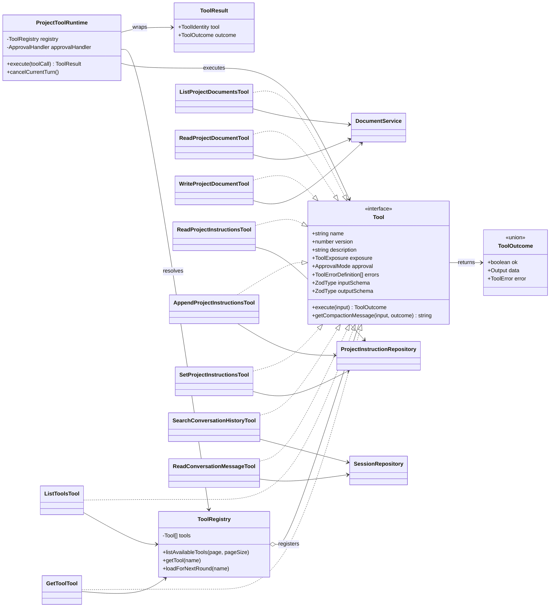

# CleoDoc Tool Call 技术设计

状态：v0.1 Core 已实现
适用范围：CleoDoc Core、CLI 和未来桌面端
最后更新：2026-08-03

## 1. Tool Call 设计原则

Tool 是非确定性的 LLM 与确定性的 CleoDoc Core 之间的操作契约，也是面向 Agent 的用户界面。Tool 的质量直接决定 Agent 能否正确理解环境、采取行动、利用反馈并从错误中恢复。后续所有 Tool 设计必须遵守以下原则。

### 1.1 面向领域任务，不映射底层 API

Tool 应表达主笔能够理解的创作动作，例如 `search_knowledge`、`read_document`、`write_draft` 和 `propose_canon_change`，不得把 SQLite 表操作、文件系统细节或 Repository CRUD 直接暴露给模型。始终连续发生且没有独立决策价值的底层操作应由一个 Tool 在内部完成。

### 1.2 少量、清晰、互不混淆

每个 Tool 只有一个明确目的，名称、适用时机和禁止使用的场景必须清楚。不要同时暴露大量重叠 Tool；根据当前任务、作品阶段和权限动态装载最小工具集。复杂能力优先拆成模型容易正确选择的领域动作，而不是构造包含大量互斥字段的万能 Tool。

### 1.3 只让模型决定必要参数

模型只填写完成当前动作必须由它判断的参数。`projectId`、`conversationId`、`sessionId`、权限、当前用户和 Tool Call ID 等可信运行信息由 Runtime 掌握，不出现在模型可填写的 Schema 中。项目级 Repository 和 Service 在创建 Tool Runtime 时已经绑定到当前项目，Tool 不接收也不能切换 `projectId`。参数使用无歧义名称、明确类型、枚举和边界，使无效状态尽量无法表达。

### 1.4 输入与输出都使用单一事实源 Schema

每个 Tool 同时拥有输入和输出 Schema，并在执行边界进行严格校验。TypeScript 类型、Zod Schema 和发送给不同 Provider 的 JSON Schema 必须从同一事实源生成或保持可验证的一致性，不能长期手写多份平行定义。Provider 的严格模式只是额外保障，本地校验始终是最终边界。

### 1.5 返回高信号、低 Token、可行动的结果

Tool Result 使用稳定的结构化状态，返回 Agent 继续决策所需的数据，而不是数据库行、日志、堆栈或整份无关内容。大结果必须支持过滤、范围读取、分页和明确截断；空结果也要明确表示成功但没有内容。正文已经存在于 Tool 参数或文档事实源时，结果只返回 ID、Revision、统计和下一步所需元数据，不再次复制正文。

### 1.6 错误也是可恢复的 Tool Result

可预期错误应返回稳定错误码、可读说明和可行的恢复动作。不得只返回异常堆栈或模糊的“执行失败”。参数无效、Revision 冲突、权限不足、用户拒绝、超时和 Provider/运行时故障必须可以区分；失败不得留下未声明的部分副作用。

### 1.7 审批规则必须直接明确

每个 Tool 直接声明固定的 `approval`，不通过复杂的副作用分类推导是否审批。用户对某次请求可以拒绝、仅允许本次或允许到 CleoDoc 退出；临时授权由 Runtime 管理，不改变 Tool 自身的固定规则。并发、幂等、Revision、超时和取消先使用 Runtime 的统一规则，确有差异时再单独设计。

### 1.8 Tool Loop 必须有确定的停止条件

Tool Call 表示 Agent 继续行动，Tool Result 表示环境观察；模型不再调用 Tool 并返回有效 Assistant Content 时，本轮结束。Runtime 必须限制最大轮数、总时限、并发、费用或 Token 预算，并支持取消、审批暂停和恢复。不得依赖额外的“完成 Tool”表达模型已经停止行动。

### 1.9 模型上下文与系统审计分离

模型可见结果只保留当前决策所需信息；完整输入输出哈希、持续时间、审批记录、幂等键和内部错误等审计数据独立保存，不必全部回传模型。聊天 UI 可以把标准 Tool Call/Result 投影为进度卡片，但不创建 Provider 不支持的自定义消息角色，也不把机器状态伪装成用户发言。

### 1.10 通过真实任务评测 Tool，而不是凭直觉定稿

Tool 名称、描述、粒度、参数和结果格式都需要使用真实模型与真实创作任务评测。至少记录 Tool 选择正确率、参数校验失败率、任务完成率、冗余调用次数、错误恢复率、Token 消耗、延迟和副作用事故。设计变更必须通过保留测试集验证，避免只针对单个案例或单一 Provider 调优。

## 2. 对 CleoDoc 的直接约束

- Core 继续使用自研薄 Tool Runtime，不让 LangChain、LangGraph、MCP SDK 或某个 Provider 的对象成为领域模型。
- Provider Adapter 只负责把统一 Tool 契约翻译成各供应商协议，并完整拼接流式 Tool 参数；不得在 Adapter 中实现项目业务规则。
- Tool Runtime 根据 Project、AgentJob、作品阶段、用户授权和 Provider 能力选择本轮可见 Tool。
- 项目作用域和身份信息由 Runtime 注入，模型不能指定或切换 Project。
- 普通沟通不调用写作 Tool；主笔创作文稿时直接调用 `write_draft`，统计结果作为标准 Tool Result 返回，模型停止调用即表示本轮写作完成。
- `write_draft` 修改可恢复的工作 Draft，不等同于覆盖正式正文；正式内容仍通过 ChangeSet、审批和版本系统应用。
- 检索 Tool 返回证据和必要上下文，完整检索轨迹与发送模型的证据由 `ContextManifest` 审计。
- 压缩和历史检索只投影允许进入上下文的 Tool 元数据，不默认复制历史 Tool 参数中的文稿或大段资料。

## 3. 公共 Tool 契约

### 3.1 Schema 是 Input 和 Output 的唯一事实源

Tool 的 Input 和成功 Output 都使用 Zod Schema 定义，再通过 `z.infer` 生成 TypeScript 类型。不得同时手写 Zod Schema 和同结构的 TypeScript `interface`，避免两者长期漂移。

```ts
const readProjectDocumentInputSchema = z
  .object({
    document: z.string().trim().min(1),
    offset: z.number().int().nonnegative().default(0),
    maxCharacters: z.number().int().min(1).max(50_000).default(20_000),
  })
  .strict();

type ReadProjectDocumentInput = z.infer<typeof readProjectDocumentInputSchema>;
```

Input 和 Output 是需要通过 JSON 传输的纯数据，不实现为 Class。只有包含行为和依赖的具体 Tool 实现为 Class。

### 3.2 无参数 Tool

Tool Calling 协议的参数根节点使用 JSON Object。没有参数的 Tool 使用公共空对象 Schema，不要求模型传递没有语义的空字符串。

```ts
const emptyInputSchema = z.object({}).strict();
type EmptyInput = z.infer<typeof emptyInputSchema>;
```

文档中将这种输入统一写作“无参数（`{}`）”，不再使用 `Record<string, never>` 展示。

### 3.3 Tool 名称与版本

`name` 是 Tool 的稳定唯一名称。每个 Tool 另外声明正整数 `version`：

```ts
interface ToolIdentity {
  name: string;
  version: number;
}
```

以下 LLM 可见契约发生不兼容变化时增加版本号：

- Input Schema 或 Output Schema 改变。
- Tool Result 的字段语义改变。
- 重要错误码或恢复方式改变。
- Tool 的业务行为发生不兼容变化。

只修改内部实现、性能或不影响语义的描述文字，不必增加版本。版本使用简单递增整数，不引入语义版本规则。

`full` 定义、`summary` 描述、`list_tools`、`get_tool` 和每次 Tool Result 都包含 `name + version`。这样模型和 Debug 日志可以判断历史调用是否使用了旧契约。

### 3.4 Tool Outcome 与最终 Tool Result

具体 Tool 只返回业务执行结果 `ToolOutcome`。最终发给模型的 `ToolResult` 由 Runtime 自动加入实际执行 Tool 的名称和版本，避免每个 Tool 重复填写或报告错误身份。

```ts
const toolErrorSchema = z
  .object({
    code: z.string(),
    message: z.string(),
    recovery: z.string().optional(),
  })
  .strict();

type ToolError = z.infer<typeof toolErrorSchema>;

type ToolOutcome<Output> =
  | {
      ok: true;
      data: Output;
    }
  | {
      ok: false;
      error: ToolError;
    };

type ToolResult<Output> = ToolOutcome<Output> & {
  tool: ToolIdentity;
};
```

成功结果：

```json
{
  "ok": true,
  "tool": {
    "name": "read_project_document",
    "version": 1
  },
  "data": {
    "document": {}
  }
}
```

失败结果：

```json
{
  "ok": false,
  "tool": {
    "name": "read_project_document",
    "version": 1
  },
  "error": {
    "code": "DOCUMENT_NOT_FOUND",
    "message": "找不到指定文档。",
    "recovery": "先调用 list_project_documents 获取当前文档路径。"
  }
}
```

### 3.5 Tool Interface

```ts
type ToolExposure = "full" | "summary" | "hidden";
type ApprovalMode = "auto" | "ask" | "deny";
type ApprovalChoice = "reject" | "allow_once" | "allow_until_exit";

interface ToolErrorDefinition {
  code: string;
  description: string;
  recovery?: string;
}

interface Tool<Input, Output> {
  /** 稳定唯一名称。 */
  readonly name: string;

  /** LLM 可见契约版本。 */
  readonly version: number;

  /** 功能、适用时机和重要限制。 */
  readonly description: string;

  /** Tool 定义如何向 LLM 披露。 */
  readonly exposure: ToolExposure;

  /** Tool 固定审批规则。 */
  readonly approval: ApprovalMode;

  /** 可预期错误及恢复方式。 */
  readonly errors: readonly ToolErrorDefinition[];

  /** Input 和成功 Output 的唯一 Schema 事实源。 */
  readonly inputSchema: z.ZodType<Input>;
  readonly outputSchema: z.ZodType<Output>;

  /** Input 已由 Runtime 校验。 */
  execute(input: Input): Promise<ToolOutcome<Output>>;

  /** 返回压缩模型需要的信息；null 表示不进入压缩上下文。 */
  getCompactionMessage(input: Input, outcome: ToolOutcome<Output>): string | null;
}
```

`outputSchema` 只校验成功 Outcome 中的 `data`。失败结构由公共 `ToolOutcome` 校验。Provider 是否支持接收 Output Schema，由 Provider Adapter 决定；CleoDoc 本地始终校验。

当前不定义 `ToolContext`。项目级 Service 和 Repository 在创建 Tool Runtime 时已绑定到当前项目，Tool 不接收也不能切换 `projectId`。现有本地 Tool 是短时、原子操作，也不在 `execute()` 中接收取消信号。

### 3.6 对外字段原则

- `contentHash` 可继续用于增量索引、缓存失效、数据校验和内部版本比较，但不进入 Tool 定义、Tool Result 或压缩投影。
- 文档使用可理解且唯一的项目相对路径作为引用，不向模型返回文档数据库 ID。
- `message_rowid`、Session 内部 Sequence、FTS Rank 等数据库实现字段不向模型返回。
- 只有后续 Tool 必须使用的稳定引用才可以返回。目前唯一保留的是不可变历史消息的 `messageId`。
- LLM 需要判断资源是否更新时返回 `updatedAt`。底层仍可使用 Hash 和 Revision 保证可靠性，不把一致性责任交给模型。

## 4. Tool 清单与披露等级

当前代码已经删除 `replace_project_instruction_text`，把 `read_conversation_history` 重构为 `read_conversation_message`，并实现两个元 Tool，共有 10 个 Tool：

| 类名 | Tool name | Exposure | Approval | 状态 |
|---|---|---|---|---|
| `ListProjectDocumentsTool` | `list_project_documents` | `full` | `auto` | 已实现 |
| `ReadProjectDocumentTool` | `read_project_document` | `full` | `auto` | 已实现 |
| `WriteProjectDocumentTool` | `write_project_document` | `full` | `ask` | 已实现 |
| `ReadProjectInstructionsTool` | `read_project_instructions` | `summary` | `auto` | 已实现 |
| `AppendProjectInstructionsTool` | `append_project_instructions` | `hidden` | `ask` | 已实现 |
| `SetProjectInstructionsTool` | `set_project_instructions` | `hidden` | `ask` | 已实现 |
| `SearchConversationHistoryTool` | `search_conversation_history` | `summary` | `auto` | 已实现 |
| `ReadConversationMessageTool` | `read_conversation_message` | `summary` | `auto` | 已实现 |
| `ListToolsTool` | `list_tools` | `full` | `auto` | 已实现 |
| `GetToolTool` | `get_tool` | `full` | `auto` | 已实现 |

`write_draft`、RAG 检索和资料管理 CLI 命令尚未成为已实现的 LLM Tool，不计入本清单。

三个披露等级含义：

- `full`：发送名称、版本、描述、Input Schema，以及 Provider 支持的 Output Schema；模型可以立即调用。
- `summary`：只发送名称、版本和描述，尚不可调用；模型需要时先调用 `get_tool`。
- `hidden`：初始不发送具体信息，只告知模型还有更多 Tool；通过 `list_tools` 发现，再通过 `get_tool` 加载。

Runtime 必须先根据当前项目、AgentJob、作品阶段、授权和 Provider 能力过滤 Tool。未授权 Tool 不得通过元 Tool 泄露或加载。

## 5. 文档 Tool

### 5.1 list_project_documents

用途描述：

> 列出当前项目 manuscript 目录中的 Markdown 文档。需要了解现有正文、文件路径或选择后续读取目标时使用。本 Tool 不读取正文内容。

Input：无参数（`{}`）。

Output Schema 字段：

| 路径 | 类型 | 说明 |
|---|---|---|
| `documents` | Array | 文档列表 |
| `documents[].path` | string | manuscript 下的项目相对路径 |
| `documents[].size` | nonnegative integer | UTF-8 文件字节数 |
| `documents[].updatedAt` | datetime string | 文件最后更新时间 |

压缩投影只保留 Tool 名称、版本、状态和 `documentCount`，不复制完整路径列表。

### 5.2 read_project_document

用途描述：

> 通过 manuscript 下的相对路径分段读取当前项目的一份 Markdown 文档。只在确实需要引用正文内容时使用，不得尝试访问项目外文件。

Input Schema 字段：

| 字段 | 类型 | 默认值/限制 |
|---|---|---|
| `document` | string | 必填；项目相对路径 |
| `offset` | nonnegative integer | 默认 0 |
| `maxCharacters` | integer | 默认 20,000；最大 50,000 |

Output Schema 字段：

| 路径 | 类型 | 说明 |
|---|---|---|
| `document.path` | string | 实际读取路径 |
| `document.updatedAt` | datetime string | 当前文件更新时间 |
| `document.offset` | nonnegative integer | 本段起点 |
| `document.content` | string | 本段正文 |
| `document.truncated` | boolean | 是否仍有未返回内容 |
| `document.nextOffset` | integer 或 null | 下一段起点 |
| `document.totalCharacters` | nonnegative integer | 当前完整文档字符数 |

压缩投影只保留路径、更新时间和读取范围，不保留 `content`：

```json
{
  "tool": {
    "name": "read_project_document",
    "version": 1
  },
  "status": "completed",
  "path": "manuscript/chapter-01.md",
  "updatedAt": "2026-08-03T10:00:00Z",
  "offset": 0,
  "nextOffset": 20000,
  "totalCharacters": 35000,
  "truncated": true
}
```

### 5.3 write_project_document

用途描述：

> 根据用户明确的保存要求，在当前项目 manuscript 目录中创建 Markdown 文档。目标已存在时，只有用户明确要求覆盖，模型才可以设置 overwrite=true。所有写入都需要用户批准。

Input Schema 字段：

| 字段 | 类型 | 默认值/限制 |
|---|---|---|
| `path` | string | 必填；manuscript 下的 .md 相对路径 |
| `content` | string | 必填；最多 500,000 字符 |
| `overwrite` | boolean | 默认 false |

Output Schema 字段：

| 路径 | 类型 | 说明 |
|---|---|---|
| `document.path` | string | 保存路径 |
| `document.size` | nonnegative integer | UTF-8 文件字节数 |
| `document.updatedAt` | datetime string | 保存完成时间 |
| `document.created` | boolean | true 为新建，false 为覆盖 |

压缩投影不复制 `content`，只保留名称、版本、状态、`document_created/document_updated`、路径和更新时间。

## 6. 项目指令 Tool

项目指令数据库仍保留内部 Revision 和历史记录，用于恢复、审批和并发保护，但 Revision 不再暴露给 LLM。Tool 总是针对执行时的最新项目指令操作。

如果用户审批期间项目指令发生变化，Runtime 必须重新读取最新内容、重新生成审批预览并再次请求批准，不允许让 LLM 处理 Revision 冲突。

### 6.1 read_project_instructions

用途描述：

> 读取当前项目的完整项目指令。仅在需要检查或准备修改项目指令时使用；普通对话已经由系统上下文提供当前项目指令。

Input：无参数（`{}`）。

Output Schema：

| 字段 | 类型 | 说明 |
|---|---|---|
| `content` | string | 当前完整项目指令；未设置时为空字符串 |
| `updatedAt` | datetime string 或 null | 最近更新时间；未设置时为 null |

压缩投影只保留名称、版本、状态和更新时间，不复制指令内容。

### 6.2 append_project_instructions

用途描述：

> 在执行时的最新项目指令末尾追加文本。仅在用户要求保留已有指令并增加新规则时使用，执行前需要用户批准。

Input Schema：

| 字段 | 类型 | 限制 |
|---|---|---|
| `text` | string | 必填；1～65,536 字符 |

Output Schema：

| 字段 | 类型 | 说明 |
|---|---|---|
| `updatedAt` | datetime string | 修改完成时间 |
| `totalCharacters` | nonnegative integer | 更新后项目指令字符数 |

不返回更新后的完整项目指令。下一轮模型请求会重新注入最新项目指令；重复放入 Tool Result 只会增加 Context。压缩投影只保留名称、版本、状态、`project_instructions_appended`、更新时间和更新后字符数。

### 6.3 set_project_instructions

用途描述：

> 使用给出的完整内容替换执行时的最新项目指令。空字符串表示清空。仅在用户明确要求整体替换或清空时使用，执行前需要用户批准。

Input Schema：

| 字段 | 类型 | 限制 |
|---|---|---|
| `content` | string | 必填；最多 65,536 字符；允许为空 |

Output Schema 与追加 Tool 相同，只返回 `updatedAt` 和 `totalCharacters`，不重复输入中的完整内容。压缩投影中的操作为 `project_instructions_set`。

### 6.4 删除精确片段替换 Tool

`replace_project_instruction_text` 从目标设计中删除。项目指令只支持读取、尾部追加和整体替换，避免唯一文本匹配、模糊替换及额外恢复分支。

## 7. Conversation 历史 Tool

历史查询不要求 LLM 预先知道 Session ID。Runtime 固定搜索范围为当前 Project、当前 Conversation、已关闭 Session 中的 `user` 和 `assistant` 消息，不检索 Reasoning，也不跨 Conversation。

流程固定为：

```text
按关键字搜索历史
→ 返回 messageId + excerpt
→ LLM 判断摘要是否足够
→ 必要时按 messageId 分段读取完整消息
```

### 7.1 search_conversation_history

用途描述：

> 仅在累计摘要缺少完成当前任务所需的精确细节时，按关键字搜索当前 Conversation 中已关闭的历史消息。返回简短命中摘要，不用于批量加载全部历史。

Input Schema：

| 字段 | 类型 | 默认值/限制 |
|---|---|---|
| `query` | string | 必填；1～1,000 字符 |
| `limit` | integer | 默认 5；1～10 |

Output Schema：

| 路径 | 类型 | 说明 |
|---|---|---|
| `results` | Array | 按检索相关度排序的命中 |
| `results[].messageId` | string | 供 `read_conversation_message` 使用的稳定消息引用 |
| `results[].role` | `user` 或 `assistant` | 消息角色 |
| `results[].createdAt` | datetime string | 消息时间 |
| `results[].excerpt` | string | 包含命中位置的简短摘要 |

不返回 `sessionId`、Session Sequence、`message_rowid` 或 FTS Rank。压缩投影不保留 Query、Message ID 或 Excerpt，只保留名称、版本、状态和命中数量。

### 7.2 read_conversation_message

用途描述：

> 根据 search_conversation_history 返回的 messageId，分段读取一条不可变历史消息的完整内容。不得用于读取其他 Conversation、当前活动 Session 或 Reasoning。

Input Schema：

| 字段 | 类型 | 默认值/限制 |
|---|---|---|
| `messageId` | string | 必填；来自历史搜索结果 |
| `offset` | nonnegative integer | 默认 0 |
| `maxCharacters` | integer | 默认 10,000；最大 20,000 |

Output Schema：

| 路径 | 类型 | 说明 |
|---|---|---|
| `message.messageId` | string | 被读取消息引用 |
| `message.role` | `user` 或 `assistant` | 消息角色 |
| `message.createdAt` | datetime string | 消息时间 |
| `message.content` | string | 当前读取片段 |
| `message.offset` | nonnegative integer | 当前片段起点 |
| `message.truncated` | boolean | 是否仍有未返回内容 |
| `message.nextOffset` | integer 或 null | 下一片段起点 |
| `message.totalCharacters` | nonnegative integer | 完整消息字符数 |

逻辑目标是读取完整消息，但必须保留分段机制，防止一条超长模型回复一次占满 Context。压缩投影不保留 Message ID 和正文，只记录名称、版本、状态、读取字符数及是否仍有后续。

原 `read_conversation_history` 按 Session 分页读取的设计废弃。

## 8. 元 Tool 与 Tool Registry

### 8.1 Tool Registry

Tool Registry 保存当前 Runtime 注册的 Tool，并负责：

- 按当前项目、任务、阶段和授权过滤可用 Tool。
- 生成 `full` 与 `summary` Provider 定义。
- 为 `list_tools` 提供稳定排序和分页。
- 为 `get_tool` 返回公共定义，并将目标 Tool 的当前版本加入后续模型请求。
- 阻止元 Tool 发现或加载未授权 Tool。

通过 `get_tool` 成功加载的 Tool 在当前 Conversation 中持续有效。每次用户输入创建新 Runtime 时，CleoDoc 从该 Conversation 已保存的成功 `get_tool` 结果恢复 `name + version` 加载状态；Session 压缩和应用重启不会让模型已经取得的 Tool 突然变为不可调用。加载状态不跨 Conversation。Tool 升级后旧版本记录不会自动加载新版本，模型必须根据 `list_tools` 返回的新版本再次调用 `get_tool`。

### 8.2 list_tools

用途描述：

> 分页列出当前 Agent 回合中已授权的全部 Tool。只返回名称、版本和功能描述；需要查看某个 Tool 的完整定义时，再使用 get_tool。

`list_tools` 不因 Tool 的 `exposure` 或当前是否已经加载而过滤结果。这样模型即使复用了旧上下文、没有再次收到 `full` Tool 定义，也能重新发现当前运行时中的完整 Tool 清单。`get_tool` 仍负责返回 Input/Output Schema、审批方式和错误定义，并让 `summary` 或 `hidden` Tool 从下一轮开始可调用。

Input Schema：

| 字段 | 类型 | 默认值/限制 |
|---|---|---|
| `page` | positive integer | 默认 1 |
| `pageSize` | positive integer | 默认 10；最大 20 |

Output Schema：

| 字段 | 类型 | 说明 |
|---|---|---|
| `tools` | Array | 当前页 Tool 摘要 |
| `tools[].name` | string | Tool 名称 |
| `tools[].version` | positive integer | 当前契约版本 |
| `tools[].description` | string | 功能和适用时机 |
| `page` | positive integer | 当前页 |
| `pageSize` | positive integer | 实际页大小 |
| `totalPages` | nonnegative integer | 总页数；没有结果时为 0 |

结果按 `name` 稳定排序。超出总页数时返回空 `tools`，不自动修改页码。调用本 Tool 不会自动加载列出的 Tool。`getCompactionMessage()` 返回 `null`。

### 8.3 get_tool

用途描述：

> 根据名称查询当前 Conversation 允许使用的 Tool 完整定义，并将该版本加入后续模型请求的可调用 Tool 列表。

Input Schema：

| 字段 | 类型 | 说明 |
|---|---|---|
| `name` | string | 要查询和加载的 Tool 名称 |

Output Schema：

| 路径 | 类型 | 说明 |
|---|---|---|
| `tool.name` | string | Tool 名称 |
| `tool.version` | positive integer | 当前契约版本 |
| `tool.description` | string | 完整描述 |
| `tool.approval` | `auto/ask/deny` | 固定审批规则 |
| `tool.inputSchema` | JSON Schema Object | Provider 可用输入定义 |
| `tool.outputSchema` | JSON Schema Object | 成功 Data 输出定义 |
| `tool.errors` | Array | 稳定错误码、含义和恢复方式 |
| `callableNextRound` | literal true | 已加入下一次模型请求 |

可以重复查询已完整加载的 Tool，结果保持幂等。查询不存在或未授权的名称统一返回 `TOOL_NOT_FOUND`，避免泄露权限信息。`getCompactionMessage()` 返回 `null`。

## 9. 审批与退出前临时授权

`approval` 是 Tool 固定规则：

- `auto`：直接执行。
- `ask`：没有有效临时授权时询问用户。
- `deny`：不执行。

用户审批选择不放入 Tool Interface：

```ts
interface ApprovalRequest {
  toolName: string;
  toolVersion: number;
  /** 已通过 inputSchema 校验，供 CLI/GUI 生成审批预览。 */
  input: unknown;
}

type ApprovalHandler = (request: ApprovalRequest) => Promise<ApprovalChoice>;
```

`allow_until_exit` 由 Runtime 在内存中保存，只免除后续相同 Tool 的重复审批，不把 `approval` 改成 `auto`，也不写入项目数据库。CleoDoc 退出后自动清空。

是否允许一个桌面进程同时打开多个 Project 尚未决定，因此当前 `ApprovalRequest` 不包含 `projectId`。若未来采用单进程多项目，再确定临时授权是否按 `projectId + toolName + toolVersion` 隔离。

## 10. 压缩投影

`getCompactionMessage()` 只根据当次 Input 和 Outcome 生成高信号、低 Token 的投影，不重新执行 Tool，不包含 Reasoning。

所有非空投影必须包含：

```json
{
  "tool": {
    "name": "tool_name",
    "version": 1
  },
  "status": "completed"
}
```

失败投影只增加稳定错误码，不复制动态错误消息或内部堆栈：

```json
{
  "tool": {
    "name": "tool_name",
    "version": 1
  },
  "status": "failed",
  "errorCode": "STABLE_ERROR_CODE"
}
```

各 Tool 投影规则：

| Tool | 允许进入压缩的信息 |
|---|---|
| `list_project_documents` | 文档数量 |
| `read_project_document` | 路径、更新时间、读取范围、是否截断 |
| `write_project_document` | 创建/更新、路径、更新时间 |
| `read_project_instructions` | 更新时间 |
| `append_project_instructions` | 操作、更新时间、更新后字符数 |
| `set_project_instructions` | 操作、更新时间、更新后字符数 |
| `search_conversation_history` | 命中数量 |
| `read_conversation_message` | 读取字符数、是否截断 |
| `list_tools` | `null` |
| `get_tool` | `null` |

正文、项目指令全文、历史消息、搜索 Query、Excerpt、Message ID、Tool 参数中的大文本、Reasoning 和 `contentHash` 均不得进入压缩投影。

## 11. 错误与恢复

可预期错误必须由 Tool 返回稳定错误码和恢复建议；意外异常由 Runtime 转换为 `TOOL_EXECUTION_FAILED`。不得向模型返回堆栈。

| 错误码 | 适用范围 | 恢复方式 |
|---|---|---|
| `INVALID_TOOL_INPUT` | 所有 Tool | 根据 Input Schema 修正参数后重试 |
| `TOOL_NOT_FOUND` | Runtime、`get_tool` | 调用 `list_tools` 查看当前可用 Tool |
| `DOCUMENT_NOT_FOUND` | 文档读取 | 调用 `list_project_documents` 重新选择路径 |
| `DOCUMENT_ALREADY_EXISTS` | 文档写入 | 用户明确要求覆盖后设置 `overwrite=true` |
| `PATH_OUTSIDE_PROJECT` | 文档 Tool | 使用 manuscript 下的项目相对路径 |
| `USER_APPROVAL_REQUIRED` | `ask` Tool | 等待 Runtime 发起审批 |
| `USER_REJECTED` | `ask` Tool | 停止修改，不得绕过审批 |
| `HISTORY_MESSAGE_NOT_FOUND` | 历史读取 | 重新搜索历史并使用当前 Message ID |
| `HISTORY_UNAVAILABLE` | 历史 Tool | 使用累计摘要继续，或结束查询 |
| `TOOL_EXECUTION_FAILED` | 意外内部故障 | 不自动重试有副作用 Tool，向用户报告 |

项目指令数据库 Revision 冲突由 Runtime 和 Repository 内部处理，不作为要求 LLM 恢复的 Tool 错误。

## 12. Runtime 执行、取消与结果包装

执行顺序：

```text
完整拼接流式 Tool 参数
→ 解析 JSON
→ 根据 Registry 查找 Tool name + version
→ 校验 inputSchema
→ 检查当前 Agent 回合是否取消
→ 检查 approval 与退出前临时授权
→ 必要时等待用户选择
→ 再次检查是否取消
→ execute() 返回 ToolOutcome
→ 成功 Data 校验 outputSchema
→ Runtime 加入 tool.name + tool.version
→ 返回最终 ToolResult
→ 生成独立的压缩投影与审计记录
```

Tool Call ID、审批状态、退出前授权、Provider 格式转换、调用记录、版本化结果信封和取消均由 Runtime 管理。

取消信号代表终止当前 Agent 回合，触发来源包括 CLI 的 `Ctrl+C`、未来 GUI 的“停止生成”、请求超时和应用退出。取消后：

- 停止支持协作取消的 LLM 流或长时间任务。
- 不启动新的 Tool，也不发起下一轮模型调用。
- 结束正在等待的审批。
- 保留此前已成功完成的结果。

Runtime 不强行中断已开始提交的 SQLite 事务、原子文件替换或其他一致性边界内的短时写入。这些操作必须完成或回滚后再结束回合。

未来新增 RAG 大规模索引、Embedding、长文档解析或网络检索等长时间 Tool 时，先让底层 Service 支持协作取消，再依据真实需求决定是否扩展公共 Tool Interface。

## 13. UML 类图



类图中的项目隔离通过构造 Runtime 时绑定的 Service 和 Repository 实现，不依赖 `ToolContext.projectId`。两个元 Tool 只能访问已经过 Runtime 过滤的 Registry。

## 14. 实现状态

v0.1 Core 已完成本文件定义的公共 Tool 契约、10 个 Tool Class、Tool Registry、动态披露、元 Tool、版本化结果信封、退出前临时授权、两阶段历史查询和 Tool 自有压缩投影。

当前实现边界：

- Tool 动态加载状态按 `name + version` 在当前 Conversation 中恢复，不跨 Conversation；Tool 版本变化后必须重新调用 `get_tool`。
- `allow_until_exit` 授权保存在 `ChatService` 内存中，关闭当前 CleoDoc 进程后清空。
- OpenAI-compatible 和 Ollama 的 Function Tool 协议没有独立版本字段，因此完整定义把版本加入描述；Tool Result、元 Tool 和 ModelCall 请求记录仍使用独立整数版本。
- SQLite 中的文档 Hash 和项目指令 Revision 继续作为内部一致性与恢复数据，但不进入 LLM 可见 Tool Result。
- `write_draft`、RAG 检索和资料管理 Tool 不在本轮实现范围，新增时必须实现相同接口。

## 15. 设计依据

这些原则综合了生产框架和代表性研究中的共同结论：

- [OpenAI Function Calling](https://developers.openai.com/api/docs/guides/function-calling)：严格 Schema、较小初始工具集、参数去歧义和并行调用。
- [OpenAI Agents SDK Tools](https://openai.github.io/openai-agents-js/guides/tools/)：输入/输出 Schema、Guardrail、超时、动态启用和审批。
- [Anthropic：Writing effective tools for agents](https://www.anthropic.com/engineering/writing-tools-for-agents)：领域化 Tool、命名空间、高信号结果、Token 效率和评测驱动优化。
- [Anthropic：Building effective agents](https://www.anthropic.com/engineering/building-effective-agents)：简单可组合的 Agent Loop 和专门设计的 ACI。
- [Google ADK Function Tools](https://adk.dev/tools-custom/function-tools/)：运行时上下文注入、结构化结果和明确状态。
- [LangGraph ToolNode](https://langchain-ai.github.io/langgraph/agents/tools/)：Tool Loop、状态注入、并行执行、错误处理和持久化中断。
- [Model Context Protocol Tools](https://modelcontextprotocol.io/specification/2025-11-25/server/tools)：输入/输出 Schema、Tool annotations、结构化结果和安全要求。
- [ReAct](https://arxiv.org/abs/2210.03629)：推理、行动和环境观察交替进行。
- [Toolformer](https://arxiv.org/abs/2302.04761)：Tool 选择、调用时机、参数生成和结果利用。
- [Gorilla](https://arxiv.org/abs/2305.15334) 与 [ToolLLM](https://arxiv.org/abs/2307.16789)：API 幻觉、参数准确性和大规模工具检索。
- [SWE-agent](https://arxiv.org/abs/2405.15793)：专用 Agent-Computer Interface 对任务表现的直接影响。
