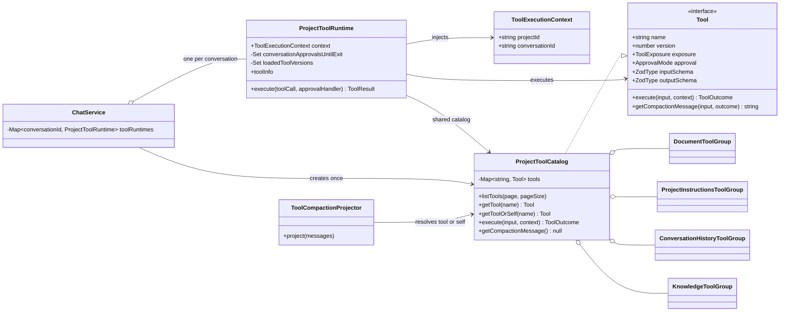

# CleoDoc Tool Call 技术设计

状态：v0.1 Tool 契约、ProjectToolCatalog 与 Conversation 级 Runtime 已实现
适用范围：CleoDoc Core、CLI 和未来桌面端
最后更新：2026-08-10

## 1. Tool Call 设计原则

Tool 是非确定性的 LLM 与确定性的 CleoDoc Core 之间的操作契约，也是面向 Agent 的用户界面。Tool 的质量直接决定 Agent 能否正确理解环境、采取行动、利用反馈并从错误中恢复。后续所有 Tool 设计必须遵守以下原则。

### 1.1 面向领域任务，不映射底层 API

Tool 应表达主笔能够理解的创作动作，例如 `search_knowledge`、`read_project_document`、`write_draft` 和 `propose_canon_change`，不得把 SQLite 表操作、文件系统细节或 Repository CRUD 直接暴露给模型。始终连续发生且没有独立决策价值的底层操作应由一个 Tool 在内部完成。

### 1.2 少量、清晰、互不混淆

每个 Tool 只有一个明确目的，名称、适用时机和禁止使用的场景必须清楚。不要同时暴露大量重叠 Tool；根据当前任务、作品阶段和权限动态装载最小工具集。复杂能力优先拆成模型容易正确选择的领域动作，而不是构造包含大量互斥字段的万能 Tool。

### 1.3 只让模型决定必要参数

模型只填写完成当前动作必须由它判断的参数。`projectId`、`conversationId`、`sessionId`、权限、当前用户和 Tool Call ID 等可信运行信息不出现在模型可填写的 Schema 中。稳定的 Repository 和 Service 在创建 `ProjectToolCatalog` 时绑定；当前 `projectId` 和 `conversationId` 由 Conversation 级 Runtime 通过 `ToolExecutionContext` 注入，Tool 不能由模型切换执行范围。参数使用无歧义名称、明确类型、枚举和边界，使无效状态尽量无法表达。

### 1.4 输入与输出都使用单一事实源 Schema

每个 Tool 同时拥有输入和输出 Schema，并在执行边界进行严格校验。TypeScript 类型、Zod Schema 和发送给不同 Provider 的 JSON Schema 必须从同一事实源生成或保持可验证的一致性，不能长期手写多份平行定义。Provider 的严格模式只是额外保障，本地校验始终是最终边界。

### 1.5 返回高信号、低 Token、可行动的结果

Tool Result 使用稳定的结构化状态，返回 Agent 继续决策所需的数据，而不是数据库行、日志、堆栈或整份无关内容。大结果必须支持过滤、范围读取、分页和明确截断；空结果也要明确表示成功但没有内容。正文已经存在于 Tool 参数或文档事实源时，结果只返回后续决策必需的稳定业务引用、更新时间、统计和状态，不返回数据库内部标识，也不再次复制正文。

### 1.6 错误也是可恢复的 Tool Result

可预期错误应返回稳定错误码、可读说明和可行的恢复动作。不得只返回异常堆栈或模糊的“执行失败”。参数无效、Revision 冲突、权限不足、用户拒绝、超时和 Provider/运行时故障必须可以区分；失败不得留下未声明的部分副作用。

### 1.7 审批规则必须直接明确

每个 Tool 直接声明固定的 `approval`，不通过复杂的副作用分类推导是否审批。用户对某次请求可以拒绝、仅允许本次或允许当前 Conversation 在 CleoDoc 退出前持续执行；临时授权由 Conversation 级 Runtime 管理，不改变 Tool 自身的固定规则。并发、幂等、Revision、超时和取消先使用 Runtime 的统一规则，确有差异时再单独设计。

### 1.8 Tool Loop 必须有确定的停止条件

Tool Call 表示 Agent 继续行动，Tool Result 表示环境观察；模型不再调用 Tool 并返回有效 Assistant Content 时，本轮结束。Runtime 必须限制最大轮数、总时限、并发、费用或 Token 预算，并支持取消、审批暂停和恢复。不得依赖额外的“完成 Tool”表达模型已经停止行动。

### 1.9 模型上下文与系统审计分离

模型可见结果只保留当前决策所需信息；完整输入输出哈希、持续时间、审批记录、幂等键和内部错误等审计数据独立保存，不必全部回传模型。聊天 UI 可以把标准 Tool Call/Result 投影为进度卡片，但不创建 Provider 不支持的自定义消息角色，也不把机器状态伪装成用户发言。

### 1.10 通过真实任务评测 Tool，而不是凭直觉定稿

Tool 名称、描述、粒度、参数和结果格式都需要使用真实模型与真实创作任务评测。至少记录 Tool 选择正确率、参数校验失败率、任务完成率、冗余调用次数、错误恢复率、Token 消耗、延迟和副作用事故。设计变更必须通过保留测试集验证，避免只针对单个案例或单一 Provider 调优。

### 1.11 LLM 可见 JSON 必须简单直接

发送给 LLM 的 JSON 应优先保证小参数模型也能正确理解。字段应尽量少、命名直观、层次尽量浅；不得因为 CleoDoc 内部已经拥有某项数据，就默认把它加入 Tool Result。多个结果可以使用数组，但应避免没有独立业务语义的单对象包装层、重复回显输入、固定不变的状态字段和重复数据。内部诊断、审计与 Debug 数据必须和 LLM 可见结果分离。

## 2. 对 CleoDoc 的直接约束

- Core 继续使用自研薄 Tool Runtime，不让 LangChain、LangGraph、MCP SDK 或某个 Provider 的对象成为领域模型。
- Provider Adapter 只负责把统一 Tool 契约翻译成各供应商协议，并完整拼接流式 Tool 参数；不得在 Adapter 中实现项目业务规则。
- Tool Runtime 根据 Project、AgentJob、作品阶段、用户授权和 Provider 能力选择本轮可见 Tool。
- 项目作用域和身份信息由 Runtime 注入，模型不能指定或切换 Project。
- 普通沟通不调用写作 Tool；主笔创作文稿时直接调用 `write_draft`，统计结果作为标准 Tool Result 返回，模型停止调用即表示本轮写作完成。
- `write_draft` 修改可恢复的工作 Draft，不等同于覆盖正式正文；正式内容仍通过 ChangeSet、审批和版本系统应用。
- 检索 Tool 返回必要证据；普通检索的候选轨迹不持久化，实际发送给模型的证据如何随 ModelCall 还原由 RAG Tool 阶段单独设计。
- 压缩和历史检索只投影允许进入上下文的 Tool 元数据，不默认复制历史 Tool 参数中的文稿或大段资料。

## 3. 公共 Tool 契约

### 3.1 Schema 是 Input 和 Output 的唯一事实源

Tool 的 Input 和成功 Output 都使用 Zod Schema 定义，再通过 `z.infer` 生成 TypeScript 类型。不得同时手写 Zod Schema 和同结构的 TypeScript `interface`，避免两者长期漂移。

```ts
const readProjectDocumentInputSchema = z
  .object({
    document: z.string().trim().min(1),
    offset: z.number().int().nonnegative().default(0),
    maxCharacters: z.number().int().min(1).max(50_000).default(20_000),
  })
  .strict();

type ReadProjectDocumentInput = z.infer<typeof readProjectDocumentInputSchema>;
```

Input 和 Output 是需要通过 JSON 传输的纯数据，不实现为 Class。只有包含行为和依赖的具体 Tool 实现为 Class。

### 3.2 无参数 Tool

Tool Calling 协议的参数根节点使用 JSON Object。没有参数的 Tool 使用公共空对象 Schema，不要求模型传递没有语义的空字符串。

```ts
const emptyInputSchema = z.object({}).strict();
type EmptyInput = z.infer<typeof emptyInputSchema>;
```

文档中将这种输入统一写作“无参数（`{}`）”，不再使用 `Record<string, never>` 展示。

### 3.3 Tool 名称与版本

`name` 是 Tool 的稳定唯一名称。每个 Tool 另外声明正整数 `version`：

```ts
interface ToolIdentity {
  name: string;
  version: number;
}
```

以下 LLM 可见契约发生不兼容变化时增加版本号：

- Input Schema 或 Output Schema 改变。
- Tool Result 的字段语义改变。
- 重要错误码或恢复方式改变。
- Tool 的业务行为发生不兼容变化。

只修改内部实现、性能或不影响语义的描述文字，不必增加版本。版本使用简单递增整数，不引入语义版本规则。

`full` 定义、`project_tool_catalog` 的查询结果和每次 Tool Result 都包含 `name + version`。这样模型和 Debug 日志可以判断历史调用是否使用了旧契约。

### 3.4 Tool Outcome 与最终 Tool Result

具体 Tool 只返回业务执行结果 `ToolOutcome`。最终发给模型的 `ToolResult` 由 Runtime 自动加入实际执行 Tool 的名称和版本，避免每个 Tool 重复填写或报告错误身份。

```ts
const toolErrorSchema = z
  .object({
    code: z.string(),
    message: z.string(),
    recovery: z.string().optional(),
  })
  .strict();

type ToolError = z.infer<typeof toolErrorSchema>;

type ToolOutcome<Output> =
  | {
      ok: true;
      data: Output;
    }
  | {
      ok: false;
      error: ToolError;
    };

type ToolResult<Output> = ToolOutcome<Output> & {
  tool: ToolIdentity;
};
```

成功结果：

```json
{
  "ok": true,
  "tool": {
    "name": "read_project_document",
    "version": 1
  },
  "data": {
    "document": {}
  }
}
```

失败结果：

```json
{
  "ok": false,
  "tool": {
    "name": "read_project_document",
    "version": 1
  },
  "error": {
    "code": "DOCUMENT_NOT_FOUND",
    "message": "找不到指定文档。",
    "recovery": "先调用 list_project_documents 获取当前文档路径。"
  }
}
```

### 3.5 Tool Interface

```ts
type ToolExposure = "full" | "catalog";
type ApprovalMode = "auto" | "ask" | "deny";
type ApprovalChoice = "reject" | "allow_once" | "allow_until_exit";

interface ToolErrorDefinition {
  code: string;
  description: string;
  recovery?: string;
}

interface ToolExecutionContext {
  /** 当前项目，由 Runtime 注入，LLM 不可填写。 */
  readonly projectId: string;

  /** 当前 Conversation，由 Runtime 注入，LLM 不可填写。 */
  readonly conversationId: string;
}

interface Tool<Input, Output> {
  /** 稳定唯一名称。 */
  readonly name: string;

  /** LLM 可见契约版本。 */
  readonly version: number;

  /** 功能、适用时机和重要限制。 */
  readonly description: string;

  /** Tool 定义如何向 LLM 披露。 */
  readonly exposure: ToolExposure;

  /** Tool 固定审批规则。 */
  readonly approval: ApprovalMode;

  /** 可预期错误及恢复方式。 */
  readonly errors: readonly ToolErrorDefinition[];

  /** Input 和成功 Output 的唯一 Schema 事实源。 */
  readonly inputSchema: z.ZodType<Input>;
  readonly outputSchema: z.ZodType<Output>;

  /** Input 已由 Runtime 校验；可信环境状态由 Runtime 注入。 */
  execute(input: Input, context: ToolExecutionContext): Promise<ToolOutcome<Output>>;

  /** 返回压缩模型需要的信息；null 表示不进入压缩上下文。 */
  getCompactionMessage(input: Input, outcome: ToolOutcome<Output>): string | null;
}
```

`outputSchema` 只校验成功 Outcome 中的 `data`。失败结构由公共 `ToolOutcome` 校验。Provider 是否支持接收 Output Schema，由 Provider Adapter 决定；CleoDoc 本地始终校验。

Tool 可以长期持有稳定的基础设施依赖，例如 `DocumentService`、`ProjectInstructionRepository`、`SessionRepository` 和数据库连接；不能在实例字段中持有 `projectId`、`conversationId`、`sessionId`、当前 Tool Call、审批状态或动态加载状态。所有执行范围通过 `ToolExecutionContext` 注入，模型 Input Schema 不包含这些字段。

`ToolExecutionContext` 当前只包含 `projectId` 和 `conversationId`。`ProjectToolRuntime` 采用 Conversation 级生命周期，Session 压缩不会改变 Tool 的权限或历史查询边界，因此不持有也不注入 `sessionId`。取消信号继续由 `ChatService`、Provider 和当次 Agent 回合管理，不进入公共 Tool Interface。

### 3.6 对外字段原则

- `contentHash` 可继续用于增量索引、缓存失效、数据校验和内部版本比较，但不进入模型上下文、Tool 定义、Tool Result 或压缩投影。
- 文档使用可理解且唯一的项目相对路径作为引用，不向模型返回文档数据库 ID。
- `message_rowid`、Session 内部 Sequence、FTS Rank 等数据库实现字段不向模型返回。
- 只有后续 Tool 或正式文档引用必须使用的稳定公开引用才可以返回。当前已实现的是不可变历史消息的 `messageId` 和稳定 `chunkId`；目标 RAG Tool 使用唯一资料 title 选择 Source，内部 `sources.id` 不向模型暴露。SQLite Row ID 始终不得暴露。
- LLM 需要判断资源是否更新时返回 `updatedAt`。底层仍可使用 Hash 和 Revision 保证可靠性，不把一致性责任交给模型。

## 4. Tool 清单与披露等级

目标设计包含 11 个业务 Tool，以及作为组合 Tool 暴露的 `ProjectToolCatalog`：

| 类名 | Tool name | Exposure | Approval | 状态 |
|---|---|---|---|---|
| `ListProjectDocumentsTool` | `list_project_documents` | `full` | `auto` | 已实现 |
| `ReadProjectDocumentTool` | `read_project_document` | `full` | `auto` | 已实现 |
| `WriteProjectDocumentTool` | `write_project_document` | `full` | `ask` | 已实现 |
| `ReadProjectInstructionsTool` | `read_project_instructions` | `catalog` | `auto` | 已实现 |
| `AppendProjectInstructionsTool` | `append_project_instructions` | `catalog` | `ask` | 已实现 |
| `SetProjectInstructionsTool` | `set_project_instructions` | `catalog` | `ask` | 已实现 |
| `SearchConversationHistoryTool` | `search_conversation_history` | `catalog` | `auto` | 已实现 |
| `ReadConversationMessageTool` | `read_conversation_message` | `catalog` | `auto` | 已实现 |
| `SearchKnowledgeTool` | `search_knowledge` | `full` | `auto` | v2 已实现；title 契约待修改 |
| `ListMaterialsTool` | `list_materials` | `full` | `auto` | v2 已实现；title 契约待修改 |
| `ReadMaterialContextTool` | `read_material_context` | `catalog` | `auto` | v2 已实现；title 契约待修改 |
| `ProjectToolCatalog` | `project_tool_catalog` | `full` | `auto` | 已实现 |

`write_draft` 尚未成为已实现的 LLM Tool，不计入本清单。三个 RAG Tool 已接入 `ProjectToolCatalog`、Conversation 级 Runtime 和 Tool Loop。

两个披露等级含义：

- `full`：发送名称、版本、描述、Input Schema，以及 Provider 支持的 Output Schema；模型可以立即调用。
- `catalog`：不进入请求顶层 `tools`，也不通过 System Context 发送名称或描述；模型通过始终可用的 `project_tool_catalog` 执行 `list` 发现，再通过 `get` 加载完整定义。

Runtime 必须先根据当前项目、AgentJob、作品阶段、授权和 Provider 能力过滤 Tool。未授权 Tool 不得通过元 Tool 泄露或加载。

以下各 Tool 的“输入示例”是模型提交的参数对象；“成功输出示例”是 CleoDoc 实际返回给模型的完整 `ToolResult`，因此包含公共的 `ok + tool + data` 信封。示例只用于说明稳定的公开 JSON 结构，不替代运行时 Schema 校验。

## 5. 文档 Tool

### 5.1 list_project_documents

用途描述：

> 列出当前项目 manuscript 目录中的 Markdown 文档。需要了解现有正文、文件路径或选择后续读取目标时使用。本 Tool 不读取正文内容。

Input：无参数（`{}`）。

输入示例：

```json
{}
```

Output Schema 字段：

| 路径 | 类型 | 说明 |
|---|---|---|
| `documents` | Array | 文档列表 |
| `documents[].path` | string | manuscript 下的项目相对路径 |
| `documents[].size` | nonnegative integer | UTF-8 文件字节数 |
| `documents[].updatedAt` | datetime string | 文件最后更新时间 |

成功输出示例：

```json
{
  "ok": true,
  "tool": { "name": "list_project_documents", "version": 1 },
  "data": {
    "documents": [
      {
        "path": "manuscript/chapter-01.md",
        "size": 12840,
        "updatedAt": "2026-08-10T10:00:00.000Z"
      }
    ]
  }
}
```

压缩投影只保留 Tool 名称、版本、状态和 `documentCount`，不复制完整路径列表。

### 5.2 read_project_document

用途描述：

> 通过 manuscript 下的相对路径分段读取当前项目的一份 Markdown 文档。只在确实需要引用正文内容时使用，不得尝试访问项目外文件。

Input Schema 字段：

| 字段 | 类型 | 默认值/限制 |
|---|---|---|
| `document` | string | 必填；项目相对路径 |
| `offset` | nonnegative integer | 默认 0 |
| `maxCharacters` | integer | 默认 20,000；最大 50,000 |

输入示例：

```json
{
  "document": "manuscript/chapter-01.md",
  "offset": 0,
  "maxCharacters": 15
}
```

Output Schema 字段：

| 路径 | 类型 | 说明 |
|---|---|---|
| `path` | string | 实际读取路径 |
| `updatedAt` | datetime string | 当前文件更新时间 |
| `offset` | nonnegative integer | 本段起点 |
| `content` | string | 本段正文 |
| `truncated` | boolean | 是否仍有未返回内容 |
| `nextOffset` | integer 或 null | 下一段起点 |
| `totalCharacters` | nonnegative integer | 当前完整文档字符数 |

成功输出示例：

```json
{
  "ok": true,
  "tool": { "name": "read_project_document", "version": 2 },
  "data": {
    "path": "manuscript/chapter-01.md",
    "updatedAt": "2026-08-10T10:00:00.000Z",
    "offset": 0,
    "content": "# 第一章\n\n雨从凌晨开始下。",
    "truncated": true,
    "nextOffset": 15,
    "totalCharacters": 35000
  }
}
```

当前协议为 v2。v1 历史 Result 中的 `document` 包装层只作为历史消息保留，不参与 v2 Output Schema 校验。

压缩投影只保留路径、更新时间和读取范围，不保留 `content`：

```json
{
  "tool": {
    "name": "read_project_document",
    "version": 2
  },
  "status": "completed",
  "path": "manuscript/chapter-01.md",
  "updatedAt": "2026-08-03T10:00:00Z",
  "offset": 0,
  "nextOffset": 20000,
  "totalCharacters": 35000,
  "truncated": true
}
```

### 5.3 write_project_document

用途描述：

> 根据用户明确的保存要求，在当前项目 manuscript 目录中创建 Markdown 文档。目标已存在时，只有用户明确要求覆盖，模型才可以设置 overwrite=true。所有写入都需要用户批准。

Input Schema 字段：

| 字段 | 类型 | 默认值/限制 |
|---|---|---|
| `path` | string | 必填；manuscript 下的 .md 相对路径 |
| `content` | string | 必填；最多 500,000 字符 |
| `overwrite` | boolean | 默认 false |

输入示例：

```json
{
  "path": "manuscript/chapter-02.md",
  "content": "# 第二章\n\n林默回到了旧车站。",
  "overwrite": false
}
```

Output Schema 字段：

| 路径 | 类型 | 说明 |
|---|---|---|
| `path` | string | 保存路径 |
| `size` | nonnegative integer | UTF-8 文件字节数 |
| `updatedAt` | datetime string | 保存完成时间 |
| `created` | boolean | true 为新建，false 为覆盖 |

成功输出示例：

```json
{
  "ok": true,
  "tool": { "name": "write_project_document", "version": 2 },
  "data": {
    "path": "manuscript/chapter-02.md",
    "size": 46,
    "updatedAt": "2026-08-10T10:05:00.000Z",
    "created": true
  }
}
```

当前协议为 v2，成功 Data 直接返回以上字段。

压缩投影不复制 `content`，只保留名称、版本、状态、`document_created/document_updated`、路径和更新时间。

## 6. 项目指令 Tool

项目指令数据库仍保留内部 Revision 和历史记录，用于恢复、审批和并发保护，但 Revision 不再暴露给 LLM。Tool 总是针对执行时的最新项目指令操作。

如果用户审批期间项目指令发生变化，Runtime 必须重新读取最新内容、重新生成审批预览并再次请求批准，不允许让 LLM 处理 Revision 冲突。

### 6.1 read_project_instructions

用途描述：

> 读取当前项目的完整项目指令。仅在需要检查或准备修改项目指令时使用；普通对话已经由系统上下文提供当前项目指令。

Input：无参数（`{}`）。

输入示例：

```json
{}
```

Output Schema：

| 字段 | 类型 | 说明 |
|---|---|---|
| `content` | string | 当前完整项目指令；未设置时为空字符串 |
| `updatedAt` | datetime string 或 null | 最近更新时间；未设置时为 null |

成功输出示例：

```json
{
  "ok": true,
  "tool": { "name": "read_project_instructions", "version": 1 },
  "data": {
    "content": "保持第三人称限知视角。",
    "updatedAt": "2026-08-10T09:00:00.000Z"
  }
}
```

压缩投影只保留名称、版本、状态和更新时间，不复制指令内容。

### 6.2 append_project_instructions

用途描述：

> 在执行时的最新项目指令末尾追加文本。仅在用户要求保留已有指令并增加新规则时使用，执行前需要用户批准。

Input Schema：

| 字段 | 类型 | 限制 |
|---|---|---|
| `text` | string | 必填；1～65,536 字符 |

输入示例：

```json
{
  "text": "\n涉及案件事实时必须先检索项目资料。"
}
```

Output Schema：

| 字段 | 类型 | 说明 |
|---|---|---|
| `updatedAt` | datetime string | 修改完成时间 |
| `totalCharacters` | nonnegative integer | 更新后项目指令字符数 |

成功输出示例：

```json
{
  "ok": true,
  "tool": { "name": "append_project_instructions", "version": 1 },
  "data": {
    "updatedAt": "2026-08-10T10:10:00.000Z",
    "totalCharacters": 38
  }
}
```

不返回更新后的完整项目指令。下一轮模型请求会重新注入最新项目指令；重复放入 Tool Result 只会增加 Context。压缩投影只保留名称、版本、状态、`project_instructions_appended`、更新时间和更新后字符数。

### 6.3 set_project_instructions

用途描述：

> 使用给出的完整内容替换执行时的最新项目指令。空字符串表示清空。仅在用户明确要求整体替换或清空时使用，执行前需要用户批准。

Input Schema：

| 字段 | 类型 | 限制 |
|---|---|---|
| `content` | string | 必填；最多 65,536 字符；允许为空 |

输入示例：

```json
{
  "content": "保持第三人称限知视角。\n涉及案件事实时必须先检索项目资料。"
}
```

Output Schema 与追加 Tool 相同，只返回 `updatedAt` 和 `totalCharacters`，不重复输入中的完整内容。压缩投影中的操作为 `project_instructions_set`。

成功输出示例：

```json
{
  "ok": true,
  "tool": { "name": "set_project_instructions", "version": 1 },
  "data": {
    "updatedAt": "2026-08-10T10:12:00.000Z",
    "totalCharacters": 31
  }
}
```

### 6.4 删除精确片段替换 Tool

`replace_project_instruction_text` 从目标设计中删除。项目指令只支持读取、尾部追加和整体替换，避免唯一文本匹配、模糊替换及额外恢复分支。

## 7. Conversation 历史 Tool

历史查询不要求 LLM 预先知道 Session ID。Runtime 固定搜索范围为当前 Project、当前 Conversation、已关闭 Session 中的 `user` 和 `assistant` 消息，不检索 Reasoning，也不跨 Conversation。

流程固定为：

```text
按关键字搜索历史
→ 返回 messageId + excerpt
→ LLM 判断摘要是否足够
→ 必要时按 messageId 分段读取完整消息
```

### 7.1 search_conversation_history

用途描述：

> 仅在累计摘要缺少完成当前任务所需的精确细节时，按关键字搜索当前 Conversation 中已关闭的历史消息。返回简短命中摘要，不用于批量加载全部历史。

Input Schema：

| 字段 | 类型 | 默认值/限制 |
|---|---|---|
| `query` | string | 必填；1～1,000 字符 |
| `limit` | integer | 默认 5；1～10 |

输入示例：

```json
{
  "query": "主角退休前的职务",
  "limit": 5
}
```

Output Schema：

| 路径 | 类型 | 说明 |
|---|---|---|
| `results` | Array | 按检索相关度排序的命中 |
| `results[].messageId` | string | 供 `read_conversation_message` 使用的稳定消息引用 |
| `results[].role` | `user` 或 `assistant` | 消息角色 |
| `results[].createdAt` | datetime string | 消息时间 |
| `results[].excerpt` | string | 包含命中位置的简短摘要 |

成功输出示例：

```json
{
  "ok": true,
  "tool": { "name": "search_conversation_history", "version": 1 },
  "data": {
    "results": [
      {
        "messageId": "msg_01J5Y6T8P3A7C9N2K4M6R8V0X1",
        "role": "user",
        "createdAt": "2026-08-09T14:20:00.000Z",
        "excerpt": "主角退休前是市刑侦支队的刑警。"
      }
    ]
  }
}
```

不返回 `sessionId`、Session Sequence、`message_rowid` 或 FTS Rank。压缩投影不保留 Query、Message ID 或 Excerpt，只保留名称、版本、状态和命中数量。

### 7.2 read_conversation_message

用途描述：

> 根据 search_conversation_history 返回的 messageId，分段读取一条不可变历史消息的完整内容。不得用于读取其他 Conversation、当前活动 Session 或 Reasoning。

Input Schema：

| 字段 | 类型 | 默认值/限制 |
|---|---|---|
| `messageId` | string | 必填；来自历史搜索结果 |
| `offset` | nonnegative integer | 默认 0 |
| `maxCharacters` | integer | 默认 10,000；最大 20,000 |

输入示例：

```json
{
  "messageId": "msg_01J5Y6T8P3A7C9N2K4M6R8V0X1",
  "offset": 0,
  "maxCharacters": 10000
}
```

Output Schema：

| 路径 | 类型 | 说明 |
|---|---|---|
| `messageId` | string | 被读取消息引用 |
| `role` | `user` 或 `assistant` | 消息角色 |
| `createdAt` | datetime string | 消息时间 |
| `content` | string | 当前读取片段 |
| `offset` | nonnegative integer | 当前片段起点 |
| `truncated` | boolean | 是否仍有未返回内容 |
| `nextOffset` | integer 或 null | 下一片段起点 |
| `totalCharacters` | nonnegative integer | 完整消息字符数 |

成功输出示例：

```json
{
  "ok": true,
  "tool": { "name": "read_conversation_message", "version": 2 },
  "data": {
    "messageId": "msg_01J5Y6T8P3A7C9N2K4M6R8V0X1",
    "role": "user",
    "createdAt": "2026-08-09T14:20:00.000Z",
    "content": "主角退休前是市刑侦支队的刑警。",
    "offset": 0,
    "truncated": false,
    "nextOffset": null,
    "totalCharacters": 15
  }
}
```

当前协议为 v2。v1 历史 Result 中的 `message` 包装层只作为历史消息保留。

逻辑目标是读取完整消息，但必须保留分段机制，防止一条超长模型回复一次占满 Context。压缩投影不保留 Message ID 和正文，只记录名称、版本、状态、读取字符数及是否仍有后续。

原 `read_conversation_history` 按 Session 分页读取的设计废弃。

## 8. 本地 RAG Tool

### 8.1 设计目标与公共约束

本地 RAG Tool 将已经实现的资料 Exact、FTS、Vector 混合检索接入 LLM Tool Loop。当前只检索导入资料；正文尚未进入同一索引，因此修改后的 `search_knowledge` v2 仍不接受无效的 `scope` 参数。正文索引实现后再评审是否扩展该 Tool 并提升版本。

三个 RAG Tool 当前代码均保持 v2，并已直接完成 title 契约改造，没有创建 v3，也没有保留旧字段兼容分支：`list_materials` 只返回项目内唯一的 `title`；`search_knowledge` 使用可选 `title` 限定资料；`read_material_context` 使用同一搜索结果中的 `title + chunkId`。三个 Tool 均不向模型返回或接收 `sourceId`、`source` 等 Source 身份字段，`sources.id` 仅在应用内部关联数据库和索引。

LLM 可见 JSON 优先保证小参数模型也能稳定理解：字段尽量少、命名直接、层次浅，不因为 CleoDoc 内部已经拥有某项诊断数据就默认返回。内部 `HybridRetrievalResult`、CLI Explain 和安全 Debug 可以保留完整运行诊断，但不得直接作为 Tool Result。

三个 RAG Tool 都是当前项目内的只读操作，固定 `approval = "auto"`。Project 范围由 `ToolExecutionContext.projectId` 注入；模型不能提供或切换 Project ID。其他项目中的 Source 或 Chunk 对模型统一表现为“当前项目中不存在”，不能泄露其实际存在状态。

以下内部信息不向 LLM 返回：

- SQLite Row ID、Source Hash、Revision、项目路径和临时 CDM 信息。
- Embedding 模型名称和版本、Exact/FTS/Vector 候选数量及耗时。
- FTS Rank、Vector Distance、RRF Score、字符预算、排除项和排除原因。
- 原始资料字节范围和索引错误堆栈。

Embedding 或 sqlite-vec 不可用时，CleoDoc 在内部降级为 Exact + FTS；只要文本检索成功就返回正常结果，不要求 LLM 理解降级机制。

### 8.2 search_knowledge

用途描述：

> 在当前项目已经建立索引的资料中执行混合检索。query 必须使用目标资料的语言：搜索英文资料时使用英文 query，搜索中文资料时使用中文 query。目标包含多种语言时，分别使用相应语言调用本 Tool。若不清楚资料语言，先调用 list_materials。

Input 字段：

| 字段 | 类型 | 默认值/限制 |
|---|---|---|
| `query` | string | 必填；1～500 字符；必须使用目标资料的语言 |
| `limit` | integer | 默认 5；1～10 |
| `title` | string | 可选；必须原样复制 `list_materials` 返回的唯一资料名称 |

不提供 `language` 参数。CleoDoc 根据 query 的实际语言选择 Embedding 模型，避免模型声明英文却提交中文 query。

输入示例：

```json
{
  "query": "What is Triton used for?",
  "limit": 5,
  "title": "Triton Programming Guide"
}
```

Output 字段：

| 路径 | 类型 | 说明 |
|---|---|---|
| `queryLanguage` | `zh` 或 `en` | 检索 Query 的主语言 |
| `sourceLanguages` | Array | 当前检索范围内资料的语言集合 |
| `languageWarning` | string 或 null | Query 与资料语言明确不匹配时的提示 |
| `results` | Array | 已按最终相关性排序的证据 |
| `results[].chunkId` | string | Chunk 公开引用 |
| `results[].title` | string | 资料显示名称 |
| `results[].content` | string | Chunk 纯文本内容 |

`title` 是项目内唯一、用户可修改的资料名称，`chunkId` 是稳定、不透明的 Chunk 引用。模型只按 title 选择资料；CleoDoc 在内部把 title 解析为 `sources.id`。结果数组顺序已经表示最终相关性，LLM 不需要内部排名字段。title 改名后，历史 Tool Result 保持不变；模型使用旧名称失败时重新调用 `list_materials`。

成功输出示例：

```json
{
  "ok": true,
  "tool": { "name": "search_knowledge", "version": 2 },
  "data": {
    "queryLanguage": "en",
    "sourceLanguages": ["en"],
    "languageWarning": null,
    "results": [
      {
        "chunkId": "chk_8r2v5x9m",
        "title": "Triton Programming Guide",
        "content": "Triton is a language and compiler for writing efficient GPU kernels."
      }
    ]
  }
}
```

### 8.3 检索语言判断

`queryLanguage` 复用当前 Query 主语言检测逻辑，只返回 `zh` 或 `en`，并据此选择 Embedding 模型。`sourceLanguages` 来自当前项目、`material` 类型、`ready` 状态且满足可选 `title` 限制的资料语言并集；指定 title 时就是该资料的语言列表。

只在资料语言集合非空、且不包含 Query 主语言时生成非阻断警告。

示例：

```json
{
  "ok": true,
  "tool": { "name": "search_knowledge", "version": 2 },
  "data": {
    "queryLanguage": "zh",
    "sourceLanguages": ["en"],
    "languageWarning": "资料是英文的，请使用英文 query 重新搜索。",
    "results": []
  }
}
```

警告不阻止检索，因为专有名称仍可能通过 Exact 或 FTS 命中。搜索范围同时存在中文和英文资料时不发出警告，因为 CleoDoc 无法判断模型真正想查哪份资料；模型应先调用 `list_materials`，再按目标资料语言分别检索。CleoDoc 不在内部静默翻译 query。

Source 语言目前是资料级信息，不精确到每个 Chunk。Chunk 级语言与多模型 Embedding 待出现真实需求后再设计。

### 8.4 list_materials

用途描述：

> 列出当前项目导入资料的唯一 title、格式、语言和索引状态。需要确认有哪些资料、资料属于什么格式、使用什么语言或者选择 `search_knowledge.title` 时调用。本 Tool 不读取资料正文。

Input 字段：

| 字段 | 类型 | 默认值/限制 |
|---|---|---|
| `page` | positive integer | 默认 1 |
| `pageSize` | positive integer | 默认 10；最大 20 |

输入示例：

```json
{
  "page": 1,
  "pageSize": 10
}
```

Output 字段：

| 路径 | 类型 | 说明 |
|---|---|---|
| `materials` | Array | 当前页资料摘要 |
| `materials[].title` | string | 资料显示名称 |
| `materials[].format` | `text` 或 `markdown` | 当前支持的原始资料格式 |
| `materials[].languages` | Array | 资料包含的语言 |
| `materials[].indexStatus` | `pending/ready/stale/failed` | 当前索引状态 |
| `page` | positive integer | 当前页 |
| `totalPages` | nonnegative integer | 总页数 |

成功输出示例：

```json
{
  "ok": true,
  "tool": { "name": "list_materials", "version": 2 },
  "data": {
    "materials": [
      {
        "title": "Triton Programming Guide",
        "format": "markdown",
        "languages": ["en"],
        "indexStatus": "ready"
      }
    ],
    "page": 1,
    "totalPages": 1
  }
}
```

`title` 同时是面向用户的显示名称和 RAG Tool 的资料选择键。它在当前项目内唯一，但允许用户重命名；内部 Source UUID 不进入 Tool Result。当前资料还没有 Tag 功能，因此不返回 `tags`；`updatedAt` 对模型的检索决策没有直接帮助，也不返回。保留 `format`，以支持“查询 PDF 中的信息”一类按资料格式表达的用户要求。v0.1 只允许 `text` 和 `markdown`；真正支持 PDF、DOCX 等格式时扩展枚举并提升 Tool 版本，不能提前让模型误以为已经支持。

### 8.5 read_material_context

用途描述：

> 根据 `search_knowledge` 返回的 `title` 和 `chunkId`，读取目标 Chunk 以及有限的相邻 Chunk。两者必须来自同一搜索结果。只在搜索结果缺少必要前后文时调用。返回结果始终包含指定的目标 Chunk。

Input 字段：

| 字段 | 类型 | 默认值/限制 |
|---|---|---|
| `title` | string | 必填；来自 `search_knowledge` 的同一结果项 |
| `chunkId` | string | 必填；来自 `search_knowledge` 的同一结果项 |
| `before` | integer | 默认 1；0～3 |
| `after` | integer | 默认 1；0～3 |

输入示例：

```json
{
  "title": "Triton Programming Guide",
  "chunkId": "chk_8r2v5x9m",
  "before": 1,
  "after": 1
}
```

即使 `before` 和 `after` 都为 0，也必须返回 `chunkId` 指定的目标 Chunk。

Output 字段：

| 路径 | 类型 | 说明 |
|---|---|---|
| `title` | string | 资料显示名称 |
| `targetChunkId` | string | 请求的目标 Chunk |
| `chunks` | Array | 按原文顺序排列的目标及相邻 Chunk |
| `chunks[].chunkId` | string | Chunk 公开引用 |
| `chunks[].content` | string | Chunk 纯文本内容 |

成功输出示例：

```json
{
  "ok": true,
  "tool": { "name": "read_material_context", "version": 2 },
  "data": {
    "title": "Triton Programming Guide",
    "targetChunkId": "chk_8r2v5x9m",
    "chunks": [
      {
        "chunkId": "chk_7q1u4w8k",
        "content": "GPU kernels are usually written with low-level programming models."
      },
      {
        "chunkId": "chk_8r2v5x9m",
        "content": "Triton is a language and compiler for writing efficient GPU kernels."
      },
      {
        "chunkId": "chk_9s3w6y0n",
        "content": "Its programming model operates on blocks of values."
      }
    ]
  }
}
```

`chunks` 固定按照原文顺序返回：前置 Chunk、目标 Chunk、后置 Chunk；不得按照检索相关性重新排序。Service 必须把 title 解析为当前项目内的 Source，校验其处于 `ready` 状态、目标 Chunk 存在并属于该 Source、相邻读取没有超过限制。

### 8.6 多语言调用流程

```text
用户用中文提出问题
→ LLM 调用 list_materials
→ 发现目标资料 languages = ["en"]
→ LLM 将问题改写为英文 query
→ 调用 search_knowledge
→ 必要时调用 read_material_context
→ 使用证据以中文回答用户
```

需要同时检索中文和英文资料时，模型分别调用两次 `search_knowledge`。v2 每次调用只接受一个 query，不增加多 Query 嵌套结构。

### 8.7 持久化、压缩与代码边界

不创建 RetrievalRun、RetrievalContext 或候选审计表。实际发送给模型的证据已经包含在版本化 Tool Result Message 中，不再复制保存普通 Query、候选、排除项和排序诊断。

Session 压缩不得包含资料正文或 Chunk Content。允许的压缩投影为：

| Tool | 允许进入压缩的信息 |
|---|---|
| `search_knowledge` | Query 语言、结果数量、来源数量、语言警告 |
| `list_materials` | 当前页资料数量、页码、总页数 |
| `read_material_context` | 返回 Chunk 数量 |

建议在 `packages/agent/src/tool/knowledge-tools.ts` 实现三个无执行状态的 Tool 和 `createKnowledgeTools()`。Tool 只持有稳定的 Application Service，不持有 Project ID、Conversation ID 或 Session ID，也不直接访问 SQLite Repository。资料/RAG Application Service 负责资料列表、混合检索和相邻 Chunk 读取，并已实现 title 到内部 Source ID 的项目内解析；Tool 契约切换后只调用该 title 路径。

### 8.8 验收标准

- LLM 可以主动检索当前项目资料，并在同一任务中执行多轮及多语言检索。
- 中文对话搜索英文资料时，模型使用英文 query；明显不匹配时得到简单的非阻断提示。
- `read_material_context` 始终包含目标 Chunk，相邻 Chunk 保持原文顺序。
- 所有返回的 `title + chunkId` 都能在当前项目内解析并回溯到资料原件。
- Tool 不泄露 Hash、Row ID、绝对路径和内部检索算法信息。
- Embedding 不可用时仍可通过 Exact + FTS 返回结果。
- Session 压缩不包含证据正文，普通检索不产生额外数据库审计记录。

## 9. ProjectToolCatalog 组合 Tool

### 9.1 定位与生命周期

`ProjectToolCatalog` 是项目中全部业务 Tool 的唯一目录，同时自身实现公共 `Tool` 接口，以 `project_tool_catalog` 暴露给模型。它在应用启动并完成当前项目的 Service/Repository 初始化后创建一次，之后注入该项目的所有 `ProjectToolRuntime`；不能在每次消息发送时重复实例化全部 Tool 或重复生成 JSON Schema。

Catalog 自身的 `version` 表示 **Tool 查询入口协议版本**，不是目录内业务 Tool 的集合版本。只有以下变化才提升 Catalog 版本：

- Catalog Tool 的名称发生变化。
- `list/get` 的调用方式或 Input Schema 发生不兼容变化。
- 模型发现和加载 Tool 所必需的入口说明发生不兼容变化。

普通业务 Tool 的新增、删除或版本升级不提升 Catalog 版本；这些变化由 `list` 返回的 Tool 列表和各业务 Tool 自身的 `version` 表达。Catalog 版本必须单调递增。

Catalog 负责：

- 持有所有已经实例化且不保存执行状态的业务 Tool。
- 校验 Tool 名称唯一，按名称查找 Tool。
- 缓存 Input/Output JSON Schema、Provider Definition、公开定义和稳定排序摘要。
- 通过 `list` 操作分页返回当前项目全部已授权 Tool 的名称、版本和描述。
- 通过 `get` 操作返回指定 Tool 的完整公开定义。
- 作为组合 Tool 为自身提供名称、版本、Schema、结果包装与压缩策略。

Catalog 内部的 Tool Map 不保存 Catalog 自身，因此不存在 `Catalog → Catalog` 的对象引用。列出全部 Tool 或按名称查询 Catalog 自身时，由 Catalog 显式把自己的公开定义与业务 Tool 合并。Catalog 按文档、项目指令、Conversation 历史和 RAG 等功能域一次性收集 Tool；Runtime 不逐个创建 Tool。构造阶段只完成名称校验、Schema 转换和定义缓存，不执行模型调用、文档解析或其他重任务。

### 9.2 Catalog Input

原来的 `list_tools` 和 `get_tool` 合并为同一个组合 Tool 的两种操作。Input 使用 `action` 区分操作，并保持顶层为 JSON Object，以兼容 Provider Function Tool。`page` 和 `pageSize` 的默认值由 Catalog 执行时补全；`get` 操作必须提供 `name`。

`list` 操作字段：

| 字段 | 类型 | 默认值/限制 |
|---|---|---|
| `action` | literal `list` | 必填 |
| `page` | positive integer | 默认 1 |
| `pageSize` | positive integer | 默认 10；最大 20 |

`get` 操作字段：

| 字段 | 类型 | 说明 |
|---|---|---|
| `action` | literal `get` | 必填 |
| `name` | non-empty string | 要查询和加载的 Tool 名称 |

`projectId`、`conversationId`、`sessionId`、披露等级和授权范围均不属于模型 Input。

### 9.3 list 操作

输入示例：

```json
{
  "action": "list",
  "page": 1,
  "pageSize": 2
}
```

返回字段：

| 字段 | 类型 | 说明 |
|---|---|---|
| `action` | literal `list` | 结果类型 |
| `tools` | Array | 当前页 Tool 摘要，包含 Catalog 自身 |
| `tools[].name` | string | Tool 名称 |
| `tools[].version` | positive integer | 当前契约版本 |
| `tools[].description` | string | 功能和适用时机 |
| `page` | positive integer | 当前页 |
| `totalPages` | nonnegative integer | 总页数；没有结果时为 0 |

`list` 始终返回全部已授权 Tool，不因 `exposure` 或当前是否加载而过滤。结果按 `name` 稳定排序；超出总页数时返回空 `tools`，不自动修改页码。调用 `list` 不改变 Runtime 的动态加载状态。

Catalog v2 不在 Output 中重复返回模型刚刚提交的 `pageSize`。

成功输出示例：

```json
{
  "ok": true,
  "tool": { "name": "project_tool_catalog", "version": 2 },
  "data": {
    "action": "list",
    "tools": [
      {
        "name": "append_project_instructions",
        "version": 1,
        "description": "在执行时的最新项目指令末尾追加文本。仅在用户要求保留已有指令并增加新规则时使用，执行前需要用户批准。"
      },
      {
        "name": "list_materials",
        "version": 2,
        "description": "列出当前项目导入资料。title 是供 search_knowledge 使用的项目内唯一资料名称；不读取资料正文。"
      }
    ],
    "page": 1,
    "totalPages": 6
  }
}
```

### 9.4 get 操作

输入示例：

```json
{
  "action": "get",
  "name": "read_project_instructions"
}
```

返回字段：

| 路径 | 类型 | 说明 |
|---|---|---|
| `action` | literal `get` | 结果类型 |
| `tool.name` | string | Tool 名称 |
| `tool.version` | positive integer | 当前契约版本 |
| `tool.description` | string | 完整描述 |
| `tool.approval` | `auto/ask/deny` | 固定审批规则 |
| `tool.inputSchema` | JSON Schema Object | Provider 可用输入定义 |
| `tool.outputSchema` | JSON Schema Object | 成功 Data 输出定义 |
| `tool.errors` | Array | 稳定错误码、含义和恢复方式 |

Catalog 只查找和返回 Tool 定义，不保存当前 Conversation 已加载哪些 Tool。`get` 成功后，`ProjectToolRuntime` 把返回的 `name + version` 加入自己的 `loadedToolVersions`；重复查询保持幂等。查询不存在或未授权的名称统一返回 `TOOL_NOT_FOUND`。

Catalog v2 不再返回恒为 `true` 的 `callableNextRound`；入口 Tool 的描述已经说明，`get` 成功后该版本从下一轮起可调用。

成功输出示例：

下面的 `inputSchema` 和 `outputSchema` 只展示模型理解 Tool 所需的主体结构，省略 JSON Schema 生成器附加的 `$schema`、日期正则等元数据。

```json
{
  "ok": true,
  "tool": { "name": "project_tool_catalog", "version": 2 },
  "data": {
    "action": "get",
    "tool": {
      "name": "read_project_instructions",
      "version": 1,
      "description": "读取当前项目的完整项目指令。仅在需要检查或准备修改项目指令时使用；普通对话已经由系统上下文提供当前项目指令。",
      "approval": "auto",
      "inputSchema": {
        "type": "object",
        "properties": {},
        "additionalProperties": false
      },
      "outputSchema": {
        "type": "object",
        "properties": {
          "content": { "type": "string" },
          "updatedAt": {
            "anyOf": [
              { "type": "string", "format": "date-time" },
              { "type": "null" }
            ]
          }
        },
        "required": ["content", "updatedAt"],
        "additionalProperties": false
      },
      "errors": []
    }
  }
}
```

`loadedToolVersions` 的更新发生在 Runtime 收到成功 Outcome 之后，不允许 Catalog 修改 Conversation 状态。

### 9.5 ChatService 调用链

开始或恢复 Conversation 时：

```text
ChatService
→ ProjectToolRuntime.toolInfo
→ ProjectToolCatalog.listTools()
```

模型调用 Catalog 时：

```text
LLM 调用 project_tool_catalog
→ ProjectToolRuntime 校验 Input 与审批规则
→ ProjectToolCatalog.execute({ action: "list" | "get" }, context)
→ Runtime 在 get 成功后更新 loadedToolVersions
→ Runtime 包装版本化 ToolResult
```

模型调用业务 Tool 时：

```text
LLM 调用业务 Tool
→ ProjectToolRuntime
→ ProjectToolCatalog.getTool(name)
→ Tool.execute(input, ToolExecutionContext)
```

## 10. 审批与退出前临时授权

`approval` 是 Tool 固定规则：

- `auto`：直接执行。
- `ask`：没有有效临时授权时询问用户。
- `deny`：不执行。

用户审批选择不放入 Tool Interface：

```ts
interface ApprovalRequest {
  toolName: string;
  toolVersion: number;
  /** 已通过 inputSchema 校验，供 CLI/GUI 生成审批预览。 */
  input: unknown;
}

type ApprovalHandler = (request: ApprovalRequest) => Promise<ApprovalChoice>;
```

`allow_until_exit` 由 Conversation 级 Runtime 的 `conversationApprovalsUntilExit` 在内存中保存，只免除当前 Conversation 后续相同版本 Tool 的重复审批，不把 `approval` 改成 `auto`，也不写入项目数据库。同一应用进程中的其他 Conversation 不继承该授权；CleoDoc 退出后所有临时授权自动清空。

`ApprovalRequest` 不需要 `projectId` 或 `conversationId`。审批处理器由当前 Runtime 调用，作用域已经由 Runtime 隔离；CLI/GUI 只需要展示 Tool 身份和已校验 Input。

## 11. 压缩投影

`getCompactionMessage()` 只根据当次 Input 和 Outcome 生成高信号、低 Token 的投影，不重新执行 Tool，不包含 Reasoning。

所有非空投影必须包含：

```json
{
  "tool": {
    "name": "tool_name",
    "version": 1
  },
  "status": "completed"
}
```

失败投影只增加稳定错误码，不复制动态错误消息或内部堆栈：

```json
{
  "tool": {
    "name": "tool_name",
    "version": 1
  },
  "status": "failed",
  "errorCode": "STABLE_ERROR_CODE"
}
```

各 Tool 投影规则：

| Tool | 允许进入压缩的信息 |
|---|---|
| `list_project_documents` | 文档数量 |
| `read_project_document` | 路径、更新时间、读取范围、是否截断 |
| `write_project_document` | 创建/更新、路径、更新时间 |
| `read_project_instructions` | 更新时间 |
| `append_project_instructions` | 操作、更新时间、更新后字符数 |
| `set_project_instructions` | 操作、更新时间、更新后字符数 |
| `search_conversation_history` | 命中数量 |
| `read_conversation_message` | 读取字符数、是否截断 |
| `search_knowledge` | Query 语言、结果数量、来源数量、语言警告 |
| `list_materials` | 当前页资料数量、页码、总页数 |
| `read_material_context` | 返回 Chunk 数量 |
| `project_tool_catalog` 的 `list/get` | `null` |

正文、项目指令全文、历史消息、搜索 Query、RAG 证据正文、Chunk ID、Excerpt、Message ID、Tool 参数中的大文本、Reasoning 和 `contentHash` 均不得进入压缩投影。

`ProjectToolCatalog.getCompactionMessage()` 对 `list` 和 `get` 都固定返回 `null`。压缩投影器通过 `catalog.getToolOrSelf(toolName)` 统一解析 Catalog 自身和业务 Tool：Catalog 调用直接忽略；当前版本业务 Tool 委托其 `getCompactionMessage()`；未知、已删除或历史结果版本与当前 Tool 版本不同的调用降级为只含 Tool 身份和成功/失败状态的通用事件。这样既不需要保留旧版 Output 解析代码，也不会拿新 Schema 误读历史协议。

## 12. 错误与恢复

可预期错误必须由 Tool 返回稳定错误码和恢复建议；意外异常由 Runtime 转换为 `TOOL_EXECUTION_FAILED`。不得向模型返回堆栈。

| 错误码 | 适用范围 | 恢复方式 |
|---|---|---|
| `INVALID_TOOL_INPUT` | 所有 Tool | 根据 Input Schema 修正参数后重试 |
| `TOOL_NOT_FOUND` | Runtime、Catalog `get` | 调用 Catalog `list` 查看当前可用 Tool |
| `DOCUMENT_NOT_FOUND` | 文档读取 | 调用 `list_project_documents` 重新选择路径 |
| `DOCUMENT_ALREADY_EXISTS` | 文档写入 | 用户明确要求覆盖后设置 `overwrite=true` |
| `PATH_OUTSIDE_PROJECT` | 文档 Tool | 使用 manuscript 下的项目相对路径 |
| `USER_APPROVAL_REQUIRED` | `ask` Tool | 等待 Runtime 发起审批 |
| `USER_REJECTED` | `ask` Tool | 停止修改，不得绕过审批 |
| `HISTORY_MESSAGE_NOT_FOUND` | 历史读取 | 重新搜索历史并使用当前 Message ID |
| `HISTORY_UNAVAILABLE` | 历史 Tool | 使用累计摘要继续，或结束查询 |
| `MATERIAL_NOT_FOUND` | RAG 搜索/上下文读取 | 调用 `list_materials` 重新选择资料 |
| `MATERIAL_NOT_INDEXED` | RAG 搜索/上下文读取 | 等待索引完成或要求用户重建索引 |
| `KNOWLEDGE_CHUNK_NOT_FOUND` | RAG 上下文读取 | 重新调用 `search_knowledge` |
| `CHUNK_SOURCE_MISMATCH` | RAG 上下文读取 | 使用同一搜索结果中的 `title + chunkId` |
| `TOOL_EXECUTION_FAILED` | 意外内部故障 | 不自动重试有副作用 Tool，向用户报告 |

项目指令数据库 Revision 冲突由 Runtime 和 Repository 内部处理，不作为要求 LLM 恢复的 Tool 错误。

## 13. ProjectToolRuntime

### 13.1 定位与生命周期

`ProjectToolRuntime` 是一个 Conversation 的 Tool 执行环境，不是单次 `send()` 的临时对象，也不是跨 Conversation 的应用全局对象。`ChatService` 为每个已打开的 Conversation 缓存一个 Runtime：

```ts
class ChatService {
  private readonly toolRuntimes = new Map<string, ProjectToolRuntime>();
}
```

生命周期规则：

```text
创建或首次恢复 Conversation
→ 创建 ProjectToolRuntime

同一 Conversation 内多次 send()
→ 复用同一个 Runtime

上下文压缩并创建新 Session
→ 继续复用原 Runtime

切换到另一个 Conversation
→ 使用另一个 Runtime

应用退出
→ 销毁所有 Runtime
```

Runtime 不持有 `sessionId`。Session 是消息组装、上下文预算、摘要继承和压缩的边界，由 `ChatService`、`ContextBuilder`、`SessionRepository` 与 `CompactionService` 管理；当前所有 Tool 的业务范围只需要 Project 或 Conversation。未来只有在出现真实的 Session 级 Tool 后，才为那次调用单独设计可信 Session 参数。

### 13.2 Runtime 状态

每个 Runtime 持有：

```ts
class ProjectToolRuntime {
  readonly context: ToolExecutionContext;

  private readonly conversationApprovalsUntilExit = new Set<string>();
  private readonly loadedToolVersions = new Set<string>();

  constructor(
    context: ToolExecutionContext,
    private readonly catalog: ProjectToolCatalog,
  ) {}
}
```

- `context`：不可变的 `projectId + conversationId`，每次业务 Tool 调用时注入。
- `conversationApprovalsUntilExit`：当前 Conversation 已获得的“应用退出前持续允许”，键为 `tool.name + tool.version`。
- `loadedToolVersions`：当前 Conversation 通过 Catalog `get` 成功加载的 `name + version`。
- `catalog`：项目级共享 Catalog，不由 Runtime 创建或销毁。

Runtime 不持有数据库连接之外的 Tool 实例，不逐个注册业务 Tool，也不重复生成 JSON Schema。审批处理器属于当前 CLI/GUI 交互，由 `ChatService` 在执行调用时提供；Runtime 只保存用户已经批准的结果，不能保留上一次 `send()` 的回调。

### 13.3 Conversation 隔离与恢复

`conversationApprovalsUntilExit` 只存在于当前进程内，不能从 Conversation A 继承到 Conversation B，也不能在应用重启后恢复。用户回到同一 Conversation 且应用尚未退出时，继续复用原 Runtime，因此授权仍有效。

`loadedToolVersions` 是模型已经获得的协议能力，必须按 Conversation 恢复。应用重启后创建 Runtime 时，从该 Conversation 已保存的成功 Catalog `get` 结果恢复精确的 `name + version`；旧版本记录不能加载新版本 Tool。Session 压缩不销毁 Runtime，也不改变这两组 Conversation 级状态。

### 13.4 Tool 信息与模型请求

`ProjectToolRuntime.toolInfo` 是 `ChatService` 获取当前模型 Tool 定义的唯一入口：

```text
ProjectToolRuntime.toolInfo
→ ProjectToolCatalog.listTools()
→ 合并 full Tool 与 loadedToolVersions 对应的完整定义
```

`ChatService` 不直接遍历业务 Tool，也不缓存另一份 Catalog。Catalog 负责静态定义，Runtime 负责当前 Conversation 的按需加载状态。

每次真实模型请求都通过 `ProjectToolRuntime.toolInfo` 从当前 Catalog 重新取得公开定义，并写入请求顶层 `tools` 字段。`project_tool_catalog` 的 `exposure = "full"`，所以应用重启或 Tool 版本更新后，模型会随下一次正常请求直接收到当前入口定义；这里不需要额外的对话消息、System 公告或数据库版本状态。

### 13.5 执行顺序

```text
完整拼接流式 Tool 参数
→ 解析 JSON
→ 通过 ProjectToolCatalog.getToolOrSelf(name) 查找 Tool
→ 检查 full 或 loadedToolVersions 可调用性
→ 校验 inputSchema
→ 检查 approval 与 conversationApprovalsUntilExit
→ 必要时通过当前交互的 ApprovalHandler 等待用户选择
→ execute(input, ToolExecutionContext) 返回 ToolOutcome
→ Catalog get 成功时更新 loadedToolVersions
→ 成功 Data 校验 outputSchema
→ Runtime 加入 tool.name + tool.version
→ 返回最终 ToolResult
→ 单独生成压缩投影与审计记录
```

Tool Call ID、审批状态、Conversation 内退出前授权、Catalog 动态加载和版本化结果信封由 Runtime 管理。Provider 格式转换、ModelCall 记录和当前 Agent 回合取消仍由 `ChatService`/Provider 调用层管理。

取消信号代表终止当前 Agent 回合，但不进入 `ToolExecutionContext`。取消后不再启动新的 Tool 或模型调用；已经进入 SQLite 事务、原子文件替换或其他短时一致性边界的操作必须完成或回滚。未来出现长时间 Tool 时，先让底层 Service 支持协作取消，再按真实需求扩展接口。

## 14. UML 类图



## 15. 实现状态与重构边界

本文件定义的 v0.1 Tool Runtime 已完成：

- `ProjectToolCatalog` 在 `ChatService` 打开项目时创建一次，持有全部无执行状态的业务 Tool，并以 `project_tool_catalog` 暴露 `list/get`。
- `ProjectToolRuntime` 按 Conversation 创建和缓存；多次 `send()` 与 Session 压缩复用同一实例，应用退出时销毁。
- `ToolExecutionContext` 注入 `projectId + conversationId`；历史 Tool 不再从构造函数捕获 Conversation。
- 退出前持续审批和动态加载状态按 Conversation 隔离；应用重启后从成功 Catalog `get` 的 Tool Result 恢复精确 `name + version`。
- 压缩投影通过 Catalog 统一解析组合 Tool 与业务 Tool；Catalog 调用固定返回 `null`。

当前实现继续保持以下边界：

- `loadedToolVersions` 按精确 `name + version` 恢复，版本变化后必须重新通过 Catalog `get` 加载。
- OpenAI-compatible 和 Ollama 的 Function Tool 协议没有独立版本字段，完整定义继续把版本加入描述；Tool Result 与 ModelCall 记录保留独立整数版本。
- SQLite 中的文档 Hash 和项目指令 Revision 不进入 LLM 可见 Tool Result。
- `write_draft` 仍未进入实现范围。三个 RAG Tool 已通过 `KnowledgeToolService` 接入 `ProjectToolCatalog` 和 Tool Loop；Service 由 CLI Chat 生命周期创建一次并注入 `ChatService`，Tool 本身不持有 Project 或 Conversation 状态。
- RAG Tool 结果继续作为普通 Tool Result Message 持久化；普通检索 Query、候选、排除项和排序诊断不写数据库。压缩时只保留语言、数量、页码等必要状态，不保留 Query、证据正文、Source 或 Chunk ID。

## 16. 设计依据

这些原则综合了生产框架和代表性研究中的共同结论：

- [OpenAI Function Calling](https://developers.openai.com/api/docs/guides/function-calling)：严格 Schema、较小初始工具集、参数去歧义和并行调用。
- [OpenAI Agents SDK Tools](https://openai.github.io/openai-agents-js/guides/tools/)：输入/输出 Schema、Guardrail、超时、动态启用和审批。
- [Anthropic：Writing effective tools for agents](https://www.anthropic.com/engineering/writing-tools-for-agents)：领域化 Tool、命名空间、高信号结果、Token 效率和评测驱动优化。
- [Anthropic：Building effective agents](https://www.anthropic.com/engineering/building-effective-agents)：简单可组合的 Agent Loop 和专门设计的 ACI。
- [Google ADK Function Tools](https://adk.dev/tools-custom/function-tools/)：运行时上下文注入、结构化结果和明确状态。
- [LangGraph ToolNode](https://langchain-ai.github.io/langgraph/agents/tools/)：Tool Loop、状态注入、并行执行、错误处理和持久化中断。
- [Model Context Protocol Tools](https://modelcontextprotocol.io/specification/2025-11-25/server/tools)：输入/输出 Schema、Tool annotations、结构化结果和安全要求。
- [ReAct](https://arxiv.org/abs/2210.03629)：推理、行动和环境观察交替进行。
- [Toolformer](https://arxiv.org/abs/2302.04761)：Tool 选择、调用时机、参数生成和结果利用。
- [Gorilla](https://arxiv.org/abs/2305.15334) 与 [ToolLLM](https://arxiv.org/abs/2307.16789)：API 幻觉、参数准确性和大规模工具检索。
- [SWE-agent](https://arxiv.org/abs/2405.15793)：专用 Agent-Computer Interface 对任务表现的直接影响。
